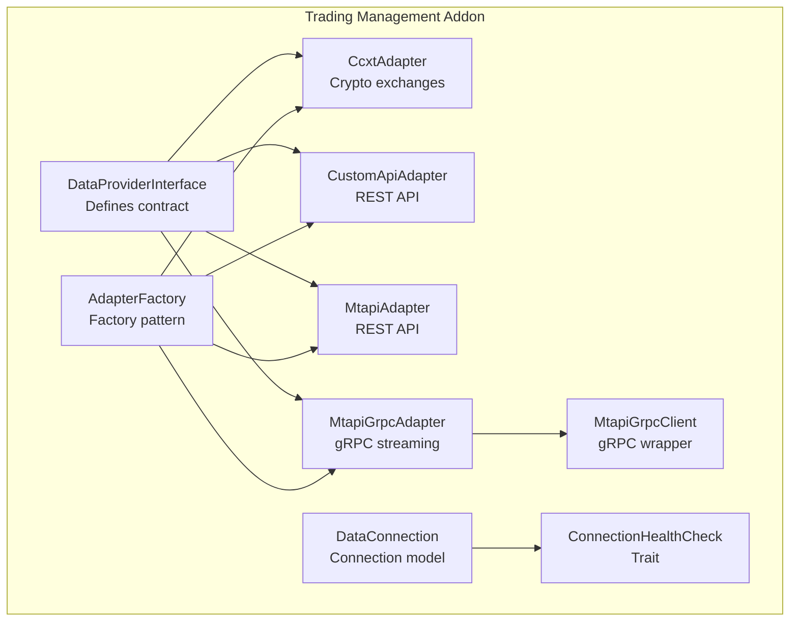
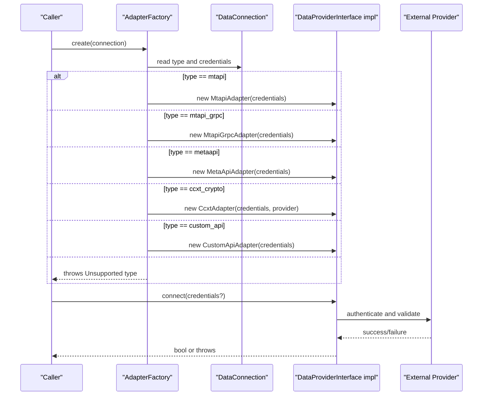
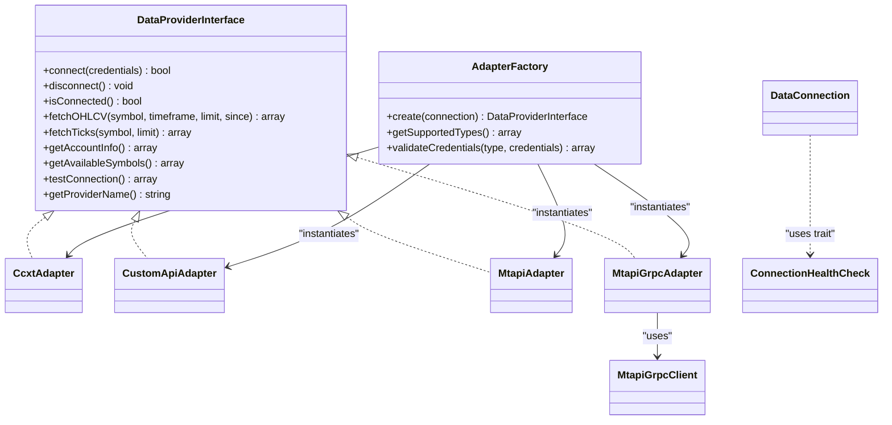
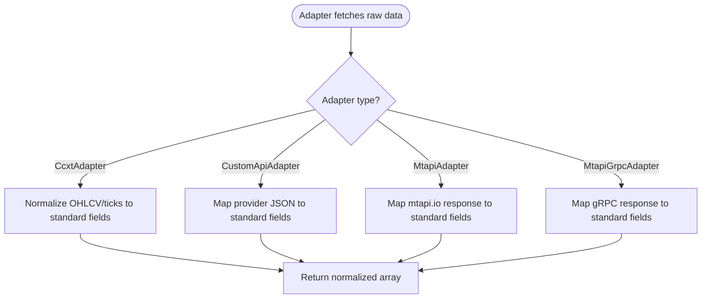

# Adapter Architecture

<cite>
**Referenced Files in This Document**
- [DataProviderInterface.php](file://main/addons/trading-management-addon/Shared/Contracts/DataProviderInterface.php)
- [AdapterFactory.php](file://main/addons/trading-management-addon/Modules/DataProvider/Services/AdapterFactory.php)
- [CcxtAdapter.php](file://main/addons/trading-management-addon/Modules/DataProvider/Adapters/CcxtAdapter.php)
- [CustomApiAdapter.php](file://main/addons/trading-management-addon/Modules/DataProvider/Adapters/CustomApiAdapter.php)
- [MtapiAdapter.php](file://main/addons/trading-management-addon/Modules/DataProvider/Adapters/MtapiAdapter.php)
- [MtapiGrpcAdapter.php](file://main/addons/trading-management-addon/Modules/DataProvider/Adapters/MtapiGrpcAdapter.php)
- [MtapiGrpcClient.php](file://main/addons/trading-management-addon/Modules/DataProvider/Services/MtapiGrpcClient.php)
- [DataConnection.php](file://main/addons/trading-management-addon/Modules/DataProvider/Models/DataConnection.php)
- [ConnectionHealthCheck.php](file://main/addons/trading-management-addon/Shared/Traits/ConnectionHealthCheck.php)
</cite>

## Table of Contents
1. [Introduction](#introduction)
2. [Project Structure](#project-structure)
3. [Core Components](#core-components)
4. [Architecture Overview](#architecture-overview)
5. [Detailed Component Analysis](#detailed-component-analysis)
6. [Dependency Analysis](#dependency-analysis)
7. [Performance Considerations](#performance-considerations)
8. [Troubleshooting Guide](#troubleshooting-guide)
9. [Conclusion](#conclusion)
10. [Appendices](#appendices)

## Introduction
This document explains the adapter architecture used to integrate diverse market data sources for trading analytics and signal ingestion. It covers four adapter types:
- CcxtAdapter for cryptocurrency exchanges via CCXT
- CustomApiAdapter for proprietary REST APIs
- MtapiAdapter for mtapi.io REST API (Forex)
- MtapiGrpcAdapter for mtapi.io gRPC streaming (Forex)

It also documents the AdapterFactory service that instantiates the appropriate adapter based on connection configuration, and how adapters implement the DataProviderInterface consistently. We explain authentication, rate limiting, error recovery, and market data normalization across different exchange formats. Finally, we compare REST versus gRPC implementations and provide selection guidance.

## Project Structure
The adapter architecture resides under the Trading Management addon. The key elements are:
- A shared interface defining the contract for all adapters
- An adapter factory that selects the correct adapter based on connection type
- Individual adapters implementing the interface
- A gRPC client wrapper for high-performance MT5 streaming
- A connection model and health-check trait for lifecycle management

**Diagram sources**
- [DataProviderInterface.php](file://main/addons/trading-management-addon/Shared/Contracts/DataProviderInterface.php#L1-L89)
- [AdapterFactory.php](file://main/addons/trading-management-addon/Modules/DataProvider/Services/AdapterFactory.php#L1-L112)
- [CcxtAdapter.php](file://main/addons/trading-management-addon/Modules/DataProvider/Adapters/CcxtAdapter.php#L1-L289)
- [CustomApiAdapter.php](file://main/addons/trading-management-addon/Modules/DataProvider/Adapters/CustomApiAdapter.php#L1-L239)
- [MtapiAdapter.php](file://main/addons/trading-management-addon/Modules/DataProvider/Adapters/MtapiAdapter.php#L1-L309)
- [MtapiGrpcAdapter.php](file://main/addons/trading-management-addon/Modules/DataProvider/Adapters/MtapiGrpcAdapter.php#L1-L254)
- [MtapiGrpcClient.php](file://main/addons/trading-management-addon/Modules/DataProvider/Services/MtapiGrpcClient.php#L1-L473)
- [DataConnection.php](file://main/addons/trading-management-addon/Modules/DataProvider/Models/DataConnection.php#L1-L184)
- [ConnectionHealthCheck.php](file://main/addons/trading-management-addon/Shared/Traits/ConnectionHealthCheck.php#L1-L179)

**Section sources**
- [DataProviderInterface.php](file://main/addons/trading-management-addon/Shared/Contracts/DataProviderInterface.php#L1-L89)
- [AdapterFactory.php](file://main/addons/trading-management-addon/Modules/DataProvider/Services/AdapterFactory.php#L1-L112)
- [CcxtAdapter.php](file://main/addons/trading-management-addon/Modules/DataProvider/Adapters/CcxtAdapter.php#L1-L289)
- [CustomApiAdapter.php](file://main/addons/trading-management-addon/Modules/DataProvider/Adapters/CustomApiAdapter.php#L1-L239)
- [MtapiAdapter.php](file://main/addons/trading-management-addon/Modules/DataProvider/Adapters/MtapiAdapter.php#L1-L309)
- [MtapiGrpcAdapter.php](file://main/addons/trading-management-addon/Modules/DataProvider/Adapters/MtapiGrpcAdapter.php#L1-L254)
- [MtapiGrpcClient.php](file://main/addons/trading-management-addon/Modules/DataProvider/Services/MtapiGrpcClient.php#L1-L473)
- [DataConnection.php](file://main/addons/trading-management-addon/Modules/DataProvider/Models/DataConnection.php#L1-L184)
- [ConnectionHealthCheck.php](file://main/addons/trading-management-addon/Shared/Traits/ConnectionHealthCheck.php#L1-L179)

## Core Components
- DataProviderInterface defines the contract that all adapters must implement: connect, disconnect, isConnected, fetchOHLCV, fetchTicks, getAccountInfo, getAvailableSymbols, testConnection, getProviderName.
- AdapterFactory creates the correct adapter instance based on the connection type and validates credentials and supported types.
- CcxtAdapter integrates with 100+ crypto exchanges via CCXT, normalizing OHLCV and tick data and exposing account info and symbols.
- CustomApiAdapter connects to a proprietary REST API, authenticating via headers and returning normalized OHLCV/ticks/account info.
- MtapiAdapter integrates with mtapi.io REST API for MT4/MT5 accounts, converting timeframes and normalizing OHLCV data.
- MtapiGrpcAdapter integrates with mtapi.io gRPC for MT5 accounts, delegating to MtapiGrpcClient for streaming-like operations and normalizing OHLCV data.
- DataConnection encapsulates connection metadata, ownership, and health logging.
- ConnectionHealthCheck provides standardized health checks and status updates.

**Section sources**
- [DataProviderInterface.php](file://main/addons/trading-management-addon/Shared/Contracts/DataProviderInterface.php#L1-L89)
- [AdapterFactory.php](file://main/addons/trading-management-addon/Modules/DataProvider/Services/AdapterFactory.php#L1-L112)
- [CcxtAdapter.php](file://main/addons/trading-management-addon/Modules/DataProvider/Adapters/CcxtAdapter.php#L1-L289)
- [CustomApiAdapter.php](file://main/addons/trading-management-addon/Modules/DataProvider/Adapters/CustomApiAdapter.php#L1-L239)
- [MtapiAdapter.php](file://main/addons/trading-management-addon/Modules/DataProvider/Adapters/MtapiAdapter.php#L1-L309)
- [MtapiGrpcAdapter.php](file://main/addons/trading-management-addon/Modules/DataProvider/Adapters/MtapiGrpcAdapter.php#L1-L254)
- [MtapiGrpcClient.php](file://main/addons/trading-management-addon/Modules/DataProvider/Services/MtapiGrpcClient.php#L1-L473)
- [DataConnection.php](file://main/addons/trading-management-addon/Modules/DataProvider/Models/DataConnection.php#L1-L184)
- [ConnectionHealthCheck.php](file://main/addons/trading-management-addon/Shared/Traits/ConnectionHealthCheck.php#L1-L179)

## Architecture Overview
The adapter architecture follows a factory pattern to decouple consumers from specific data providers. The factory inspects the connection type and constructs the appropriate adapter. Each adapter implements the DataProviderInterface uniformly, enabling consistent data access across heterogeneous sources.

**Diagram sources**
- [AdapterFactory.php](file://main/addons/trading-management-addon/Modules/DataProvider/Services/AdapterFactory.php#L1-L112)
- [DataConnection.php](file://main/addons/trading-management-addon/Modules/DataProvider/Models/DataConnection.php#L1-L184)
- [MtapiAdapter.php](file://main/addons/trading-management-addon/Modules/DataProvider/Adapters/MtapiAdapter.php#L1-L309)
- [MtapiGrpcAdapter.php](file://main/addons/trading-management-addon/Modules/DataProvider/Adapters/MtapiGrpcAdapter.php#L1-L254)
- [CcxtAdapter.php](file://main/addons/trading-management-addon/Modules/DataProvider/Adapters/CcxtAdapter.php#L1-L289)
- [CustomApiAdapter.php](file://main/addons/trading-management-addon/Modules/DataProvider/Adapters/CustomApiAdapter.php#L1-L239)

## Detailed Component Analysis

### AdapterFactory
- Purpose: Instantiate the correct adapter based on DataConnection->type and validate credentials and supported types.
- Supported types include mtapi, mtapi_grpc, metaapi, ccxt_crypto, and custom_api.
- Provides validation of required credentials per type and returns human-readable descriptions and exchange lists.

Key behaviors:
- Factory method returns a DataProviderInterface implementation.
- Static helpers describe supported types and validate credentials.

**Section sources**
- [AdapterFactory.php](file://main/addons/trading-management-addon/Modules/DataProvider/Services/AdapterFactory.php#L1-L112)
- [DataConnection.php](file://main/addons/trading-management-addon/Modules/DataProvider/Models/DataConnection.php#L1-L184)

### CcxtAdapter (Cryptocurrency Exchanges)
- Implements DataProviderInterface for CCXT-based crypto exchanges.
- Authentication: apiKey and secret; optional passphrase for exchanges requiring it.
- Timeframe conversion: standard formats mapped to CCXT equivalents.
- Data normalization: OHLCV and ticks transformed to a unified structure.
- Additional capabilities: account info, available symbols, connect/disconnect, test.

Implementation highlights:
- Lazy initialization of CCXT instance per exchange.
- Error handling wraps exceptions with contextual messages.
- Normalization ensures consistent field order and types.

**Section sources**
- [CcxtAdapter.php](file://main/addons/trading-management-addon/Modules/DataProvider/Adapters/CcxtAdapter.php#L1-L289)
- [DataProviderInterface.php](file://main/addons/trading-management-addon/Shared/Contracts/DataProviderInterface.php#L1-L89)

### CustomApiAdapter (Proprietary REST API)
- Implements DataProviderInterface for custom REST endpoints.
- Authentication: Authorization Bearer and custom header for secrets.
- Endpoints: ping, candles, price, ticks, account, symbols.
- Normalization: transforms provider-specific responses into standard arrays.

Implementation highlights:
- Uses HTTP client with headers and JSON responses.
- Throws exceptions on failures with meaningful messages.
- Provides provider name and connectivity testing.

**Section sources**
- [CustomApiAdapter.php](file://main/addons/trading-management-addon/Modules/DataProvider/Adapters/CustomApiAdapter.php#L1-L239)
- [DataProviderInterface.php](file://main/addons/trading-management-addon/Shared/Contracts/DataProviderInterface.php#L1-L89)

### MtapiAdapter (mtapi.io REST API)
- Implements DataProviderInterface for MT4/MT5 via mtapi.io REST.
- Authentication: Bearer token via API key.
- Timeframe conversion: standard formats mapped to mtapi.io codes.
- Data normalization: OHLCV normalized to unified structure; tick support returns empty (not provided by REST).
- Account info and symbols fetched with fallbacks.

Implementation highlights:
- Guzzle client configured with timeouts and base URL.
- Strict validation of required credentials.
- Latency measurement included in test results.

**Section sources**
- [MtapiAdapter.php](file://main/addons/trading-management-addon/Modules/DataProvider/Adapters/MtapiAdapter.php#L1-L309)
- [DataProviderInterface.php](file://main/addons/trading-management-addon/Shared/Contracts/DataProviderInterface.php#L1-L89)

### MtapiGrpcAdapter (High-Performance gRPC Streaming)
- Implements DataProviderInterface for MT5 via mtapi.io gRPC.
- Authentication: user/password/host/port; connection managed by MtapiGrpcClient.
- Delegates to MtapiGrpcClient for connect/disconnect, account info, symbols, and price history.
- Normalization: OHLCV normalized to unified structure; tick support returns empty (requires WebSocket subscriptions).

Implementation highlights:
- gRPC client initialization with SSL credentials and proto-generated classes.
- Robust error logging and warnings for connection issues.
- Connectivity state maintained and validated before operations.

**Section sources**
- [MtapiGrpcAdapter.php](file://main/addons/trading-management-addon/Modules/DataProvider/Adapters/MtapiGrpcAdapter.php#L1-L254)
- [MtapiGrpcClient.php](file://main/addons/trading-management-addon/Modules/DataProvider/Services/MtapiGrpcClient.php#L1-L473)
- [DataProviderInterface.php](file://main/addons/trading-management-addon/Shared/Contracts/DataProviderInterface.php#L1-L89)

### DataConnection and Health Monitoring
- DataConnection stores connection metadata, ownership, and settings.
- ConnectionHealthCheck trait provides standardized health checks, status transitions, and timestamps.

**Section sources**
- [DataConnection.php](file://main/addons/trading-management-addon/Modules/DataProvider/Models/DataConnection.php#L1-L184)
- [ConnectionHealthCheck.php](file://main/addons/trading-management-addon/Shared/Traits/ConnectionHealthCheck.php#L1-L179)

## Dependency Analysis
The adapters depend on a shared interface and are selected by the factory. MtapiGrpcAdapter depends on MtapiGrpcClient for gRPC operations. DataConnection integrates with ConnectionHealthCheck for lifecycle management.

**Diagram sources**
- [DataProviderInterface.php](file://main/addons/trading-management-addon/Shared/Contracts/DataProviderInterface.php#L1-L89)
- [AdapterFactory.php](file://main/addons/trading-management-addon/Modules/DataProvider/Services/AdapterFactory.php#L1-L112)
- [CcxtAdapter.php](file://main/addons/trading-management-addon/Modules/DataProvider/Adapters/CcxtAdapter.php#L1-L289)
- [CustomApiAdapter.php](file://main/addons/trading-management-addon/Modules/DataProvider/Adapters/CustomApiAdapter.php#L1-L239)
- [MtapiAdapter.php](file://main/addons/trading-management-addon/Modules/DataProvider/Adapters/MtapiAdapter.php#L1-L309)
- [MtapiGrpcAdapter.php](file://main/addons/trading-management-addon/Modules/DataProvider/Adapters/MtapiGrpcAdapter.php#L1-L254)
- [MtapiGrpcClient.php](file://main/addons/trading-management-addon/Modules/DataProvider/Services/MtapiGrpcClient.php#L1-L473)
- [DataConnection.php](file://main/addons/trading-management-addon/Modules/DataProvider/Models/DataConnection.php#L1-L184)
- [ConnectionHealthCheck.php](file://main/addons/trading-management-addon/Shared/Traits/ConnectionHealthCheck.php#L1-L179)

**Section sources**
- [DataProviderInterface.php](file://main/addons/trading-management-addon/Shared/Contracts/DataProviderInterface.php#L1-L89)
- [AdapterFactory.php](file://main/addons/trading-management-addon/Modules/DataProvider/Services/AdapterFactory.php#L1-L112)
- [CcxtAdapter.php](file://main/addons/trading-management-addon/Modules/DataProvider/Adapters/CcxtAdapter.php#L1-L289)
- [CustomApiAdapter.php](file://main/addons/trading-management-addon/Modules/DataProvider/Adapters/CustomApiAdapter.php#L1-L239)
- [MtapiAdapter.php](file://main/addons/trading-management-addon/Modules/DataProvider/Adapters/MtapiAdapter.php#L1-L309)
- [MtapiGrpcAdapter.php](file://main/addons/trading-management-addon/Modules/DataProvider/Adapters/MtapiGrpcAdapter.php#L1-L254)
- [MtapiGrpcClient.php](file://main/addons/trading-management-addon/Modules/DataProvider/Services/MtapiGrpcClient.php#L1-L473)
- [DataConnection.php](file://main/addons/trading-management-addon/Modules/DataProvider/Models/DataConnection.php#L1-L184)
- [ConnectionHealthCheck.php](file://main/addons/trading-management-addon/Shared/Traits/ConnectionHealthCheck.php#L1-L179)

## Performance Considerations
- REST vs gRPC:
  - REST (MtapiAdapter): Simpler setup, widely compatible, but lower throughput and higher latency. Suitable for moderate-frequency polling and basic OHLCV needs.
  - gRPC (MtapiGrpcAdapter): Lower latency and higher throughput for MT5 market data. Requires gRPC extension and proto-generated classes. Best for real-time or near-real-time streaming scenarios.
- Timeframe mapping:
  - Both REST and gRPC adapters convert standard timeframes to provider-specific codes/time units. Ensure correct mapping to avoid unexpected limits or misaligned bars.
- Connection lifecycle:
  - REST adapters keep minimal state; gRPC maintains persistent connections via MtapiGrpcClient. Proper connect/disconnect reduces overhead and avoids resource leaks.
- Data normalization:
  - All adapters normalize OHLCV to a standard structure. This simplifies downstream analytics and reduces per-provider branching logic.
- Error handling and retries:
  - Implement retry with exponential backoff for transient failures. Use health checks to detect stale or failing connections and rotate to backups when applicable.

[No sources needed since this section provides general guidance]

## Troubleshooting Guide
Common issues and remedies:
- Unsupported provider type:
  - Ensure DataConnection->type matches one of the supported types. The factory throws an exception for unknown types.
- Missing credentials:
  - AdapterFactory::validateCredentials returns missing fields. Supply required keys per type (e.g., api_key and account_id for mtapi, user/password/host/port for mtapi_grpc).
- gRPC extension not installed:
  - MtapiGrpcClient checks for the gRPC PHP extension and proto-generated classes. Install the extension and generate proto classes before using gRPC adapters.
- Connection failures:
  - REST adapters surface HTTP errors and exceptions. Review logs and adjust timeouts or base URLs.
  - gRPC adapters log detailed errors during connect/getPriceHistory. Verify host/port and credentials.
- Rate limiting and throttling:
  - Implement retry with backoff and consider rotating to backup connections when primary is rate limited. Track success/error counts and health status.
- Market data gaps:
  - REST endpoints may not provide ticks; gRPC does not expose direct tick endpoints. Use OHLCV aggregation or subscribe to WebSocket streams if available.

**Section sources**
- [AdapterFactory.php](file://main/addons/trading-management-addon/Modules/DataProvider/Services/AdapterFactory.php#L1-L112)
- [MtapiAdapter.php](file://main/addons/trading-management-addon/Modules/DataProvider/Adapters/MtapiAdapter.php#L1-L309)
- [MtapiGrpcAdapter.php](file://main/addons/trading-management-addon/Modules/DataProvider/Adapters/MtapiGrpcAdapter.php#L1-L254)
- [MtapiGrpcClient.php](file://main/addons/trading-management-addon/Modules/DataProvider/Services/MtapiGrpcClient.php#L1-L473)
- [ConnectionHealthCheck.php](file://main/addons/trading-management-addon/Shared/Traits/ConnectionHealthCheck.php#L1-L179)

## Conclusion
The adapter architecture cleanly separates concerns between connection configuration, provider-specific implementations, and a unified interface. The factory pattern enables easy extensibility and consistent behavior across REST and gRPC providers. By leveraging standardized normalization and robust error handling, the system supports reliable market data ingestion for analytics and signals. Choose REST for simplicity and broad compatibility, and gRPC for high-performance MT5 streaming.

[No sources needed since this section summarizes without analyzing specific files]

## Appendices

### Adapter Implementation Details and Examples
- Implementing DataProviderInterface:
  - All adapters implement connect, disconnect, isConnected, fetchOHLCV, fetchTicks, getAccountInfo, getAvailableSymbols, testConnection, getProviderName.
  - Example paths:
    - [CcxtAdapter::fetchOHLCV](file://main/addons/trading-management-addon/Modules/DataProvider/Adapters/CcxtAdapter.php#L54-L83)
    - [CustomApiAdapter::fetchCandles](file://main/addons/trading-management-addon/Modules/DataProvider/Adapters/CustomApiAdapter.php#L53-L79)
    - [MtapiAdapter::fetchOHLCV](file://main/addons/trading-management-addon/Modules/DataProvider/Adapters/MtapiAdapter.php#L110-L149)
    - [MtapiGrpcAdapter::fetchOHLCV](file://main/addons/trading-management-addon/Modules/DataProvider/Adapters/MtapiGrpcAdapter.php#L96-L122)
- Authentication:
  - CcxtAdapter: apiKey/secret/passphrase
  - CustomApiAdapter: Authorization Bearer and custom secret header
  - MtapiAdapter: Bearer token via API key
  - MtapiGrpcAdapter: user/password/host/port
- Rate limiting and error recovery:
  - Use ConnectionHealthCheck to track status and last checked times.
  - Implement retry/backoff strategies and rotation to backup connections when rate limited.

**Section sources**
- [CcxtAdapter.php](file://main/addons/trading-management-addon/Modules/DataProvider/Adapters/CcxtAdapter.php#L1-L289)
- [CustomApiAdapter.php](file://main/addons/trading-management-addon/Modules/DataProvider/Adapters/CustomApiAdapter.php#L1-L239)
- [MtapiAdapter.php](file://main/addons/trading-management-addon/Modules/DataProvider/Adapters/MtapiAdapter.php#L1-L309)
- [MtapiGrpcAdapter.php](file://main/addons/trading-management-addon/Modules/DataProvider/Adapters/MtapiGrpcAdapter.php#L1-L254)
- [ConnectionHealthCheck.php](file://main/addons/trading-management-addon/Shared/Traits/ConnectionHealthCheck.php#L1-L179)

### Market Data Normalization Flow

**Diagram sources**
- [CcxtAdapter.php](file://main/addons/trading-management-addon/Modules/DataProvider/Adapters/CcxtAdapter.php#L130-L209)
- [CustomApiAdapter.php](file://main/addons/trading-management-addon/Modules/DataProvider/Adapters/CustomApiAdapter.php#L150-L201)
- [MtapiAdapter.php](file://main/addons/trading-management-addon/Modules/DataProvider/Adapters/MtapiAdapter.php#L284-L307)
- [MtapiGrpcAdapter.php](file://main/addons/trading-management-addon/Modules/DataProvider/Adapters/MtapiGrpcAdapter.php#L223-L252)

### Selection Guidance
- Choose CcxtAdapter when integrating multiple crypto exchanges and you need a unified OHLCV/ticks interface.
- Choose CustomApiAdapter when building integrations with proprietary REST endpoints and you control both client and server.
- Choose MtapiAdapter for MT4/MT5 REST access with straightforward configuration and OHLCV retrieval.
- Choose MtapiGrpcAdapter for MT5 streaming with lower latency and higher throughput, requiring gRPC setup and proto classes.

[No sources needed since this section provides general guidance]