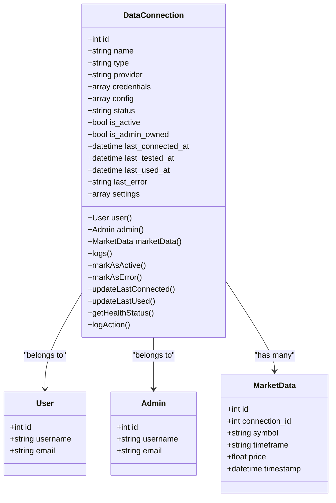
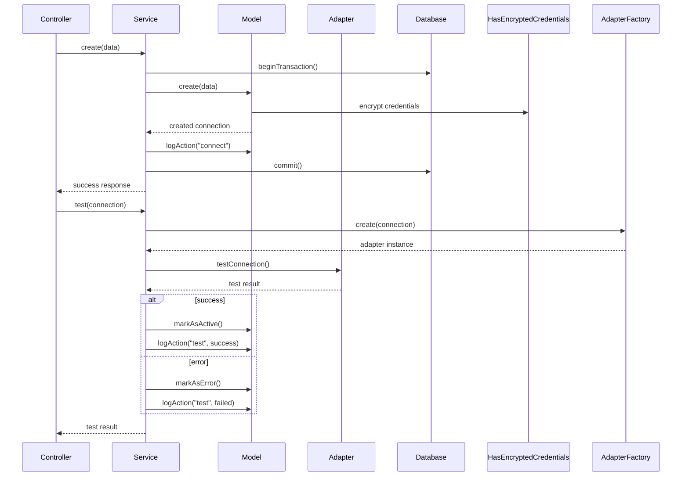
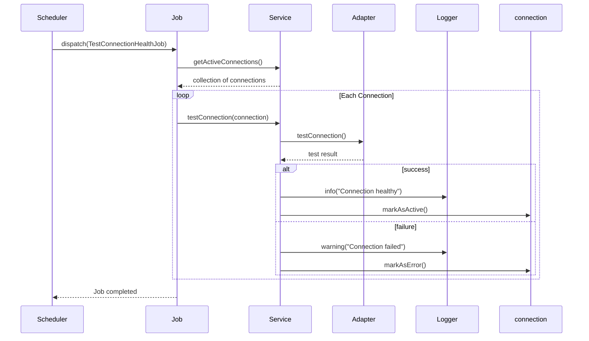

# Connection Management

<cite>
**Referenced Files in This Document**   
- [DataConnection.php](file://main/addons/trading-management-addon/Modules/DataProvider/Models/DataConnection.php)
- [DataConnectionService.php](file://main/addons/trading-management-addon/Modules/DataProvider/Services/DataConnectionService.php)
- [DataConnectionController.php](file://main/addons/trading-management-addon/Modules/DataProvider/Controllers/Backend/DataConnectionController.php)
- [HasEncryptedCredentials.php](file://main/addons/trading-management-addon/Shared/Traits/HasEncryptedCredentials.php)
- [ConnectionHealthCheck.php](file://main/addons/trading-management-addon/Shared/Traits/ConnectionHealthCheck.php)
- [MtapiAdapter.php](file://main/addons/trading-management-addon/Modules/DataProvider/Adapters/MtapiAdapter.php)
- [CcxtAdapter.php](file://main/addons/trading-management-addon/Modules/DataProvider/Adapters/CcxtAdapter.php)
- [AdapterFactory.php](file://main/addons/trading-management-addon/Modules/DataProvider/Services/AdapterFactory.php)
- [TestConnectionHealthJob.php](file://main/addons/trading-management-addon/Modules/ExchangeConnection/Jobs/TestConnectionHealthJob.php)
</cite>

## Table of Contents
1. [Introduction](#introduction)
2. [DataConnection Model](#dataconnection-model)
3. [DataConnectionService](#dataconnectionservice)
4. [DataConnectionController](#dataconnectioncontroller)
5. [Connection Configuration Examples](#connection-configuration-examples)
6. [Testing and Health Monitoring](#testing-and-health-monitoring)
7. [Security Considerations](#security-considerations)
8. [Troubleshooting Guide](#troubleshooting-guide)
9. [Conclusion](#conclusion)

## Introduction
The connection management system in the trading platform enables administrators and users to configure, manage, and monitor data connections to various market data providers. This documentation details the architecture and functionality of the DataConnection model, the DataConnectionService that handles CRUD operations and validation, and the DataConnectionController that exposes admin interface endpoints. The system supports multiple data providers including mtapi.io for MT4/MT5 connections and CCXT for cryptocurrency exchanges, with secure credential storage using Laravel's encryption features.

**Section sources**
- [DataConnection.php](file://main/addons/trading-management-addon/Modules/DataProvider/Models/DataConnection.php)
- [DataConnectionService.php](file://main/addons/trading-management-addon/Modules/DataProvider/Services/DataConnectionService.php)
- [DataConnectionController.php](file://main/addons/trading-management-addon/Modules/DataProvider/Controllers/Backend/DataConnectionController.php)

## DataConnection Model
The DataConnection model represents a connection to a data provider for fetching market data. It stores configuration details including API keys, endpoints, and connection parameters. The model is designed to support various data providers such as mtapi.io, CCXT (for cryptocurrency exchanges), and custom APIs.

Key properties of the DataConnection model include:
- **id**: Unique identifier for the connection
- **name**: User-defined name for the connection
- **type**: Connection type (mtapi, ccxt_crypto, custom_api)
- **provider**: Specific provider (e.g., binance, mt4_account_123)
- **credentials**: Encrypted storage of sensitive credentials
- **config**: Additional configuration parameters
- **status**: Current status (active, inactive, error, testing)
- **is_active**: Boolean flag indicating if the connection is active
- **is_admin_owned**: Boolean flag indicating ownership (admin or user)
- **last_connected_at**: Timestamp of last successful connection
- **last_tested_at**: Timestamp of last health test
- **last_used_at**: Timestamp of last usage
- **last_error**: Error message from last failed operation
- **settings**: Data preferences such as symbols and timeframes

The model utilizes several traits to enhance its functionality:
- **HasEncryptedCredentials**: Handles encryption and decryption of sensitive credentials
- **ConnectionHealthCheck**: Provides methods for monitoring connection health and status
- **Searchable**: Enables searching across connection properties

The DataConnection model establishes relationships with users and admins through foreign key relationships, allowing for proper ownership and access control. It also maintains a relationship with market data records, enabling tracking of data fetched through each connection.



**Diagram sources**
- [DataConnection.php](file://main/addons/trading-management-addon/Modules/DataProvider/Models/DataConnection.php#L37-L184)

**Section sources**
- [DataConnection.php](file://main/addons/trading-management-addon/Modules/DataProvider/Models/DataConnection.php#L1-L184)

## DataConnectionService
The DataConnectionService handles all CRUD operations for data connections, including validation and secure credential storage. It serves as the business logic layer between the controller and the DataConnection model, ensuring proper data handling and transaction management.

Key methods provided by the DataConnectionService include:

**Create Method**: Creates a new data connection with proper ownership determination. The service handles database transactions to ensure data consistency. When creating a connection, it:
- Determines ownership (admin or user)
- Stores the connection with encrypted credentials
- Logs the creation action
- Returns appropriate success or error responses

**Update Method**: Updates existing connection details while maintaining data integrity through database transactions. The service:
- Validates input data
- Updates the connection record
- Logs the update action
- Returns fresh connection data upon success

**Delete Method**: Removes a data connection from the system. The service:
- Handles database transactions
- Records the deletion
- Returns appropriate confirmation messages

**Test Method**: Tests the connection health by delegating to the appropriate adapter. The service:
- Creates the appropriate adapter based on connection type
- Executes the connection test
- Updates the connection status based on test results
- Logs the test outcome with latency information
- Returns detailed test results

**Activate/Deactivate Methods**: Controls the active state of connections. The activate method first tests the connection before enabling it, ensuring only working connections are activated.

The service utilizes an AdapterFactory to create the appropriate adapter instance based on the connection type, enabling polymorphic behavior across different data providers. This design allows for easy extension to support additional data providers in the future.



**Diagram sources**
- [DataConnectionService.php](file://main/addons/trading-management-addon/Modules/DataProvider/Services/DataConnectionService.php#L1-L296)
- [DataConnection.php](file://main/addons/trading-management-addon/Modules/DataProvider/Models/DataConnection.php#L37-L184)
- [AdapterFactory.php](file://main/addons/trading-management-addon/Modules/DataProvider/Services/AdapterFactory.php#L1-L35)

**Section sources**
- [DataConnectionService.php](file://main/addons/trading-management-addon/Modules/DataProvider/Services/DataConnectionService.php#L1-L296)

## DataConnectionController
The DataConnectionController exposes admin interface endpoints for managing data connections. It handles HTTP requests from the admin panel and delegates business logic to the DataConnectionService.

Key endpoints provided by the controller include:

**Index**: Displays a paginated list of all data connections with filtering and sorting capabilities. The view includes connection details such as name, type, provider, owner, status, and last connection timestamp.

**Create**: Shows the form for creating a new data connection. The controller provides supported connection types to the view for dynamic form rendering.

**Store**: Handles the creation of a new connection. The controller:
- Validates incoming request data
- Delegates to DataConnectionService for creation
- Redirects back with appropriate success or error messages

**Edit/Update**: Manages the modification of existing connections. The controller ensures proper validation and handles the update process through the service layer.

**Destroy**: Handles connection deletion requests and redirects with appropriate feedback.

**Test**: AJAX endpoint for testing connection health. The controller:
- Validates the connection ID
- Retrieves the connection record
- Delegates to DataConnectionService for testing
- Returns JSON response with test results

**Fetch Sample**: AJAX endpoint for retrieving sample market data from a connection. This allows administrators to verify that the connection can successfully retrieve data.

**Activate/Deactivate**: Controls the active state of connections, providing immediate feedback on the operation result.

The controller implements proper authorization checks to ensure users can only access connections they own or have permission to manage. It also handles both web form submissions and AJAX requests, providing a seamless admin experience.

```mermaid
flowchart TD
A[HTTP Request] --> B{Route}
B --> |GET /connections| C[Display List]
B --> |GET /connections/create| D[Show Create Form]
B --> |POST /connections| E[Create Connection]
B --> |GET /connections/{id}/edit| F[Show Edit Form]
B --> |PUT /connections/{id}| G[Update Connection]
B --> |DELETE /connections/{id}| H[Delete Connection]
B --> |POST /connections/test| I[Test Connection]
B --> |POST /connections/fetch-sample| J[Fetch Sample Data]
C --> K[DataConnection::with('admin', 'user')]
K --> L[Paginate Results]
L --> M[Render View]
E --> N[Validate Input]
N --> O[DataConnectionService->create()]
O --> P{Success?}
P --> |Yes| Q[Redirect with Success]
P --> |No| R[Redirect with Error]
I --> S[Validate Connection ID]
S --> T[DataConnectionService->test()]
T --> U[Return JSON Response]
```

**Diagram sources**
- [DataConnectionController.php](file://main/addons/trading-management-addon/Modules/DataProvider/Controllers/Backend/DataConnectionController.php#L1-L248)

**Section sources**
- [DataConnectionController.php](file://main/addons/trading-management-addon/Modules/DataProvider/Controllers/Backend/DataConnectionController.php#L1-L248)

## Connection Configuration Examples
The system supports various data providers with specific configuration requirements. Below are examples of connection configurations for different data providers:

### mtapi.io Configuration
For connecting to MT4/MT5 accounts through mtapi.io, the following credentials are required:
- **api_key**: Your mtapi.io API key
- **account_id**: Your MT4/MT5 account ID
- **base_url**: Optional custom base URL (defaults to https://api.mtapi.io)
- **timeout**: Connection timeout in seconds (defaults to 30)

Example configuration:
```json
{
  "type": "mtapi",
  "provider": "mt4_account_123",
  "credentials": {
    "api_key": "your-mtapi-api-key",
    "account_id": "1234567",
    "timeout": 30
  },
  "settings": {
    "symbols": ["EURUSD", "GBPUSD", "USDJPY"],
    "timeframes": ["M1", "M5", "H1", "H4"]
  }
}
```

### CCXT Crypto Configuration
For connecting to cryptocurrency exchanges through CCXT, the required credentials vary by exchange but typically include:
- **api_key**: Exchange API key
- **api_secret**: Exchange API secret
- **api_passphrase**: Passphrase (required by some exchanges like OKX, KuCoin)

Example configuration for Binance:
```json
{
  "type": "ccxt_crypto",
  "provider": "binance",
  "credentials": {
    "api_key": "your-binance-api-key",
    "api_secret": "your-binance-api-secret"
  },
  "settings": {
    "symbols": ["BTC/USDT", "ETH/USDT", "BNB/USDT"],
    "timeframes": ["1m", "5m", "15m", "1h", "4h"]
  }
}
```

### Custom API Configuration
For custom API connections, the configuration is flexible and can include any required parameters:
```json
{
  "type": "custom_api",
  "provider": "custom-market-data",
  "credentials": {
    "api_key": "your-custom-api-key",
    "endpoint": "https://api.custom-data-provider.com/v1"
  },
  "config": {
    "authentication_method": "bearer",
    "rate_limit": 100
  },
  "settings": {
    "symbols": ["AAPL", "GOOGL", "MSFT"],
    "timeframes": ["1m", "5m", "15m", "30m", "1h"]
  }
}
```

All credentials are securely encrypted using Laravel's encryption features before storage in the database, ensuring sensitive information is protected.

**Section sources**
- [DataConnection.php](file://main/addons/trading-management-addon/Modules/DataProvider/Models/DataConnection.php#L1-L184)
- [MtapiAdapter.php](file://main/addons/trading-management-addon/Modules/DataProvider/Adapters/MtapiAdapter.php#L1-L43)
- [CcxtAdapter.php](file://main/addons/trading-management-addon/Modules/DataProvider/Adapters/CcxtAdapter.php#L1-L200)

## Testing and Health Monitoring
The connection health monitoring system provides comprehensive testing and monitoring capabilities to ensure data connections remain operational and performant.

### TestConnectionHealthJob
The TestConnectionHealthJob is a scheduled job that periodically tests connection health. It implements the ShouldQueue interface for background processing and can test either a specific connection or all active connections.

Key features of the job:
- Runs on a configurable schedule (typically every 15-30 minutes)
- Tests connections in the background to avoid impacting system performance
- Logs warnings for failed connections and errors for exceptions
- Can be triggered manually for specific connections or run globally

The job workflow:
1. Retrieve active connections or specified connection
2. For each connection, delegate testing to the ExchangeConnectionService
3. Log results (success, warning, or error)
4. Update connection status accordingly

### Connection Health Status
The system provides a comprehensive health status system through the ConnectionHealthCheck trait. Connections can have the following status states:
- **Healthy**: Active and recently tested connections
- **Error**: Connections that have failed their last test
- **Stale**: Connections not tested recently (beyond configured threshold)
- **Inactive**: Disabled connections

The getHealthStatus() method returns detailed information about the connection's current state, including status, message, and last checked time.

### Monitoring Metrics
The system logs various performance metrics for each connection:
- **Latency**: Time taken for connection tests
- **Error frequency**: Number of consecutive failures
- **Last successful connection**: Timestamp of last successful data retrieval
- **Usage patterns**: Frequency of data requests

These metrics are used to identify potential issues before they impact trading operations and to optimize connection configurations.



**Diagram sources**
- [TestConnectionHealthJob.php](file://main/addons/trading-management-addon/Modules/ExchangeConnection/Jobs/TestConnectionHealthJob.php#L1-L88)
- [ConnectionHealthCheck.php](file://main/addons/trading-management-addon/Shared/Traits/ConnectionHealthCheck.php#L1-L179)

**Section sources**
- [TestConnectionHealthJob.php](file://main/addons/trading-management-addon/Modules/ExchangeConnection/Jobs/TestConnectionHealthJob.php#L1-L88)
- [ConnectionHealthCheck.php](file://main/addons/trading-management-addon/Shared/Traits/ConnectionHealthCheck.php#L1-L179)

## Security Considerations
The connection management system implements multiple security measures to protect sensitive credentials and ensure data integrity.

### Credential Encryption
The HasEncryptedCredentials trait provides robust encryption for sensitive connection credentials:
- Uses Laravel's built-in encryption services with the application's APP_KEY
- Automatically encrypts credentials before database storage
- Decrypts credentials when accessed through the model
- Handles JSON encoding/decoding of credential arrays
- Includes error handling for decryption failures

The encryption process:
1. Credentials array is JSON encoded
2. JSON string is encrypted using OpenSSL
3. Encrypted data is stored in the database
4. On retrieval, data is decrypted and JSON decoded

The system includes safeguards against common issues:
- Suppresses repeated error logs for decryption failures (capped at once per hour)
- Provides helpful error messages when APP_KEY changes require credential re-entry
- Validates JSON encoding/decoding to prevent data corruption

### Access Control
The system implements strict access control:
- Admin-owned connections are only accessible to administrators
- User-owned connections are only accessible to the owning user
- Proper authorization checks in controllers prevent unauthorized access
- Database relationships enforce referential integrity

### Input Validation
Comprehensive validation is applied at multiple levels:
- Controller-level validation for web requests
- Service-level validation for business logic
- Model-level validation for data integrity
- Adapter-specific validation for provider requirements

### Security Best Practices
Additional security measures include:
- Using environment variables for sensitive configuration
- Regular rotation of API keys and credentials
- Monitoring for unusual connection patterns
- Logging security-relevant events
- Implementing rate limiting for connection tests

**Section sources**
- [HasEncryptedCredentials.php](file://main/addons/trading-management-addon/Shared/Traits/HasEncryptedCredentials.php#L1-L136)
- [DataConnection.php](file://main/addons/trading-management-addon/Modules/DataProvider/Models/DataConnection.php#L8-L184)
- [DataConnectionController.php](file://main/addons/trading-management-addon/Modules/DataProvider/Controllers/Backend/DataConnectionController.php#L1-L248)

## Troubleshooting Guide
This section provides guidance for resolving common connection issues.

### Authentication Failures
Common causes and solutions:
- **Invalid API keys**: Verify credentials in the connection configuration
- **Expired credentials**: Regenerate API keys with the provider
- **Permission issues**: Ensure API keys have required permissions (read-only for data connections)
- **IP restrictions**: Check if the provider restricts API access to specific IP addresses

Diagnostic steps:
1. Verify credentials are correctly entered
2. Test credentials directly with the provider's API
3. Check provider documentation for required permissions
4. Review connection logs for specific error messages

### Rate Limiting
When encountering rate limiting issues:
- **Reduce request frequency**: Adjust polling intervals in application settings
- **Implement exponential backoff**: Configure retry logic with increasing delays
- **Optimize data requests**: Fetch only necessary symbols and timeframes
- **Upgrade API plan**: Consider higher-tier plans with increased limits

Configuration options:
- Adjust timeout settings in global configuration
- Configure rate limiting parameters in connection config
- Implement caching to reduce API calls

### Network Timeouts
For network timeout issues:
- **Increase timeout values**: Adjust connection timeout in configuration (default: 30 seconds)
- **Check network connectivity**: Verify server can reach the provider's endpoints
- **Use alternative endpoints**: Configure backup URLs if available
- **Monitor network performance**: Check for packet loss or high latency

Recommended timeout settings:
- mtapi.io: 30-60 seconds
- Cryptocurrency exchanges: 15-30 seconds
- Custom APIs: 10-30 seconds based on provider performance

### Connection Status Issues
Interpreting connection status:
- **Active**: Working properly, recently tested
- **Error**: Failed last test, check last_error for details
- **Stale**: Not tested recently, may still be working
- **Inactive**: Manually disabled

Common resolution steps:
1. Test the connection manually
2. Review detailed error messages
3. Verify network connectivity
4. Check provider status (outages, maintenance)
5. Restart connection services if necessary

### General Troubleshooting Workflow
1. Check connection status and last error message
2. Review connection logs for detailed information
3. Test connection manually through the admin interface
4. Verify credentials and configuration
5. Check provider status and network connectivity
6. Consult provider documentation for specific requirements
7. Contact support with relevant logs and error messages

**Section sources**
- [DataConnection.php](file://main/addons/trading-management-addon/Modules/DataProvider/Models/DataConnection.php#L1-L184)
- [DataConnectionService.php](file://main/addons/trading-management-addon/Modules/DataProvider/Services/DataConnectionService.php#L1-L296)
- [ConnectionHealthCheck.php](file://main/addons/trading-management-addon/Shared/Traits/ConnectionHealthCheck.php#L1-L179)

## Conclusion
The connection management system provides a robust framework for configuring, managing, and monitoring market data connections. The DataConnection model serves as the foundation, storing configuration details and connection parameters securely. The DataConnectionService handles all business logic with proper transaction management and validation, while the DataConnectionController exposes a comprehensive admin interface for connection management.

Security is prioritized through Laravel's encryption features, ensuring sensitive credentials are protected at rest. The system supports multiple data providers through a flexible adapter pattern, allowing for easy extension to new providers. Comprehensive health monitoring and testing capabilities ensure connections remain operational, with detailed logging and metrics for troubleshooting.

The system's modular design, separation of concerns, and adherence to Laravel best practices make it maintainable and extensible. By following the provided troubleshooting guidance and security best practices, administrators can ensure reliable data connectivity for trading operations.

**Section sources**
- [DataConnection.php](file://main/addons/trading-management-addon/Modules/DataProvider/Models/DataConnection.php#L1-L184)
- [DataConnectionService.php](file://main/addons/trading-management-addon/Modules/DataProvider/Services/DataConnectionService.php#L1-L296)
- [DataConnectionController.php](file://main/addons/trading-management-addon/Modules/DataProvider/Controllers/Backend/DataConnectionController.php#L1-L248)