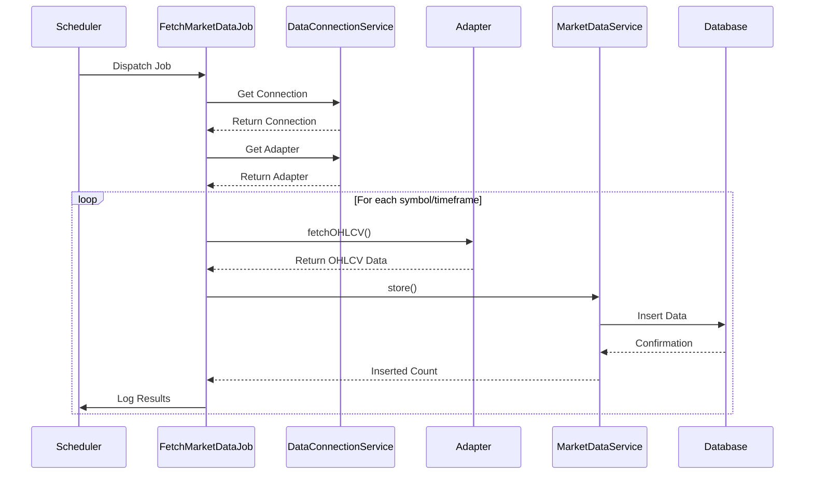
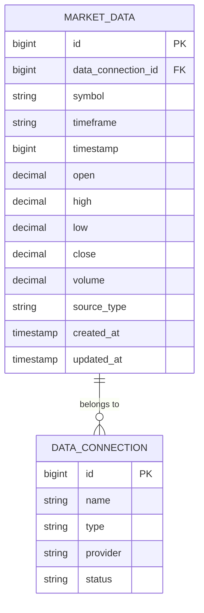
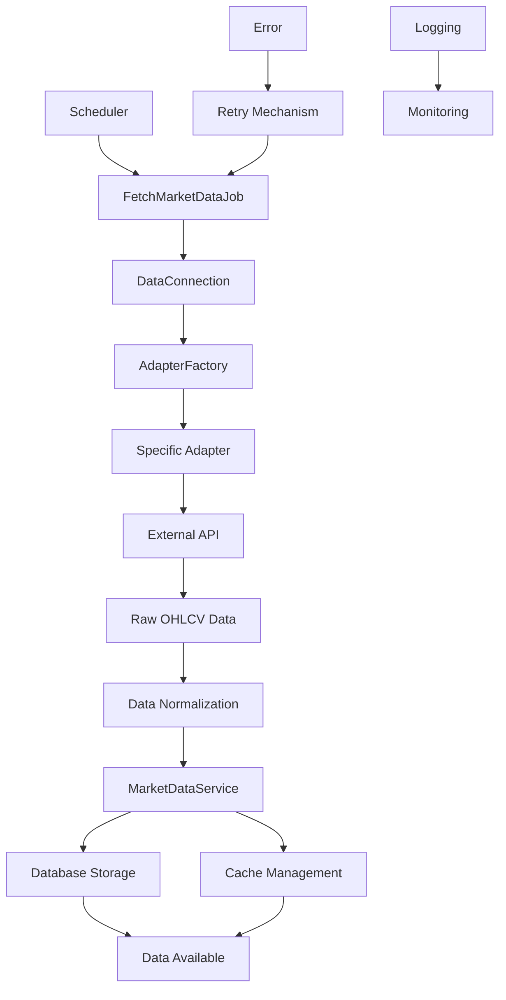
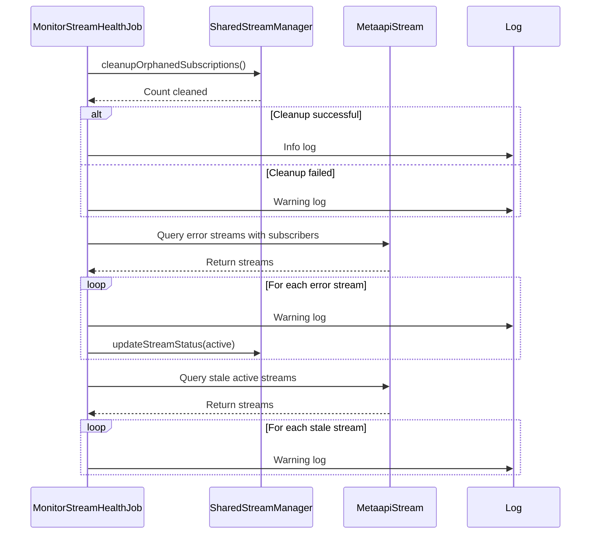
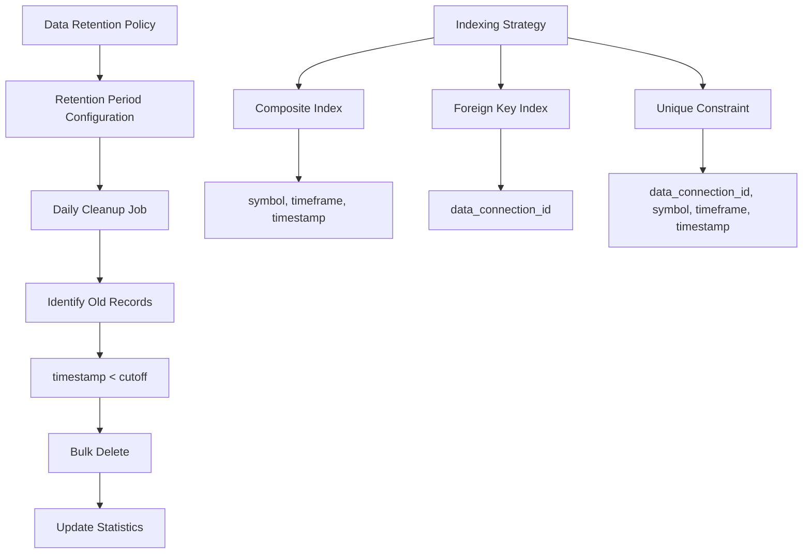

# Data Ingestion

<cite>
**Referenced Files in This Document**   
- [FetchMarketDataJob.php](file://main/addons/trading-management-addon/Modules/MarketData/Jobs/FetchMarketDataJob.php)
- [MarketData.php](file://main/addons/trading-management-addon/Modules/MarketData/Models/MarketData.php)
- [MarketDataService.php](file://main/addons/trading-management-addon/Modules/MarketData/Services/MarketDataService.php)
- [MonitorStreamHealthJob.php](file://main/addons/trading-management-addon/Modules/DataProvider/Jobs/MonitorStreamHealthJob.php)
- [DataConnection.php](file://main/addons/trading-management-addon/Modules/DataProvider/Models/DataConnection.php)
- [AdapterFactory.php](file://main/addons/trading-management-addon/Modules/DataProvider/Services/AdapterFactory.php)
- [MtapiAdapter.php](file://main/addons/trading-management-addon/Modules/DataProvider/Adapters/MtapiAdapter.php)
- [CcxtAdapter.php](file://main/addons/trading-management-addon/Modules/DataProvider/Adapters/CcxtAdapter.php)
- [MarketDataDTO.php](file://main/addons/trading-management-addon/Shared/DTOs/MarketDataDTO.php)
- [create_market_data_table.php](file://main/addons/trading-management-addon/database/migrations_backup/2025_12_04_100001_create_market_data_table.php)
</cite>

## Table of Contents
1. [Introduction](#introduction)
2. [FetchMarketDataJob](#fetchmarketdatajob)
3. [MarketData Model](#marketdata-model)
4. [Data Pipeline](#data-pipeline)
5. [MonitorStreamHealthJob](#monitorstreamhealthjob)
6. [Data Retention and Indexing](#data-retention-and-indexing)
7. [High-Frequency Data Handling](#high-frequency-data-handling)
8. [Ingestion Optimization](#ingestion-optimization)

## Introduction
The data ingestion system in the trading platform is designed to periodically retrieve market data from configured connections using appropriate adapters. This system handles OHLCV (Open, High, Low, Close, Volume) data and technical indicators, ensuring reliable data flow from ingestion to storage. The architecture includes robust error handling, retry mechanisms, and data normalization processes. This document details the core components of the data ingestion system, including the FetchMarketDataJob, MarketData model, data pipeline, MonitorStreamHealthJob, data retention policies, indexing strategies, and optimization guidance for high-frequency data updates.

## FetchMarketDataJob
The FetchMarketDataJob is responsible for retrieving market data from configured data connections. This job is dispatched by the scheduler or manually triggered, and it processes data for specified symbols and timeframes.

The job implements Laravel's ShouldQueue interface, enabling asynchronous processing with configurable retry attempts (3 tries) and exponential backoff strategy ([30, 60, 120] seconds). With a timeout of 120 seconds, the job ensures that long-running operations are properly managed.

When executed, the job first validates the existence and active status of the data connection. It then retrieves the appropriate adapter through the DataConnectionService and fetches symbols and timeframes either from the job parameters or from the connection's settings. For each symbol/timeframe combination, the job retrieves OHLCV data through the adapter and stores it using the MarketDataService. The job also dispatches DataReceived events to notify other system components of new data availability.

Error handling is comprehensive, with individual symbol/timeframe failures not stopping the entire job execution. The job logs detailed information about successful data retrieval and errors, updating the connection's timestamps and logging actions accordingly.

**Diagram sources**
- [FetchMarketDataJob.php](file://main/addons/trading-management-addon/Modules/MarketData/Jobs/FetchMarketDataJob.php)
- [DataConnectionService.php](file://main/addons/trading-management-addon/Modules/DataProvider/Services/DataConnectionService.php)
- [MarketDataService.php](file://main/addons/trading-management-addon/Modules/MarketData/Services/MarketDataService.php)

**Section sources**
- [FetchMarketDataJob.php](file://main/addons/trading-management-addon/Modules/MarketData/Jobs/FetchMarketDataJob.php)

## MarketData Model
The MarketData model represents the database structure for storing OHLCV (Open, High, Low, Close, Volume) data from various market data providers. This model serves as the central repository for all market data, supporting both Forex and cryptocurrency markets.

The model defines essential properties including data_connection_id (foreign key to the source connection), symbol (trading pair), timeframe (M1, M5, H1, D1, etc.), timestamp (candle open time), and the OHLCV values. The source_type field identifies the provider (mtapi, ccxt, etc.), enabling differentiation between data sources.

Key features of the MarketData model include:
- Database indexing on symbol, timeframe, and timestamp for optimized query performance
- Unique constraint on data_connection_id, symbol, timeframe, and timestamp to prevent duplicate entries
- Timestamp fields (created_at, updated_at) for tracking record modifications
- Decimal precision of 20,8 for price values to ensure accuracy across different asset classes

The model provides several query scopes for efficient data retrieval:
- scopeBySymbol() and scopeByTimeframe() for filtering by trading pair and timeframe
- scopeBetweenDates() for retrieving data within a specific time range
- scopeRecent() and scopeLatest() for accessing the most recent market data
- scopeOldData() for identifying records eligible for cleanup based on retention policies

**Diagram sources**
- [MarketData.php](file://main/addons/trading-management-addon/Modules/MarketData/Models/MarketData.php)
- [DataConnection.php](file://main/addons/trading-management-addon/Modules/DataProvider/Models/DataConnection.php)
- [create_market_data_table.php](file://main/addons/trading-management-addon/database/migrations_backup/2025_12_04_100001_create_market_data_table.php)

**Section sources**
- [MarketData.php](file://main/addons/trading-management-addon/Modules/MarketData/Models/MarketData.php)
- [create_market_data_table.php](file://main/addons/trading-management-addon/database/migrations_backup/2025_12_04_100001_create_market_data_table.php)

## Data Pipeline
The data pipeline from ingestion to storage involves multiple components working together to ensure reliable and efficient market data processing. The pipeline begins with the FetchMarketDataJob, which orchestrates the data retrieval process.

When the job executes, it first retrieves the DataConnection model to validate the connection's status and configuration. The AdapterFactory then creates the appropriate adapter instance based on the connection type (mtapi, ccxt_crypto, custom_api, etc.). This factory pattern allows the system to support multiple data providers with a consistent interface.

The adapter connects to the external data source using the connection's credentials and retrieves OHLCV data. Different adapters handle provider-specific API requirements:
- MtapiAdapter uses the mtapi.io REST API with Bearer token authentication
- CcxtAdapter leverages the CCXT library for cryptocurrency exchanges
- Custom adapters can be implemented for proprietary data sources

After retrieval, the data undergoes normalization to ensure consistency across providers. The MarketDataService handles storage operations, using bulk insert operations with duplicate handling to efficiently persist data. The service also manages caching, clearing relevant cache entries when new data is stored to ensure freshness.

Error handling is implemented at multiple levels:
- Adapter-level exceptions for connection and API issues
- Job-level retry mechanisms with exponential backoff
- Comprehensive logging for troubleshooting
- Connection status updates to reflect success or failure

**Diagram sources**
- [FetchMarketDataJob.php](file://main/addons/trading-management-addon/Modules/MarketData/Jobs/FetchMarketDataJob.php)
- [AdapterFactory.php](file://main/addons/trading-management-addon/Modules/DataProvider/Services/AdapterFactory.php)
- [MtapiAdapter.php](file://main/addons/trading-management-addon/Modules/DataProvider/Adapters/MtapiAdapter.php)
- [CcxtAdapter.php](file://main/addons/trading-management-addon/Modules/DataProvider/Adapters/CcxtAdapter.php)
- [MarketDataService.php](file://main/addons/trading-management-addon/Modules/MarketData/Services/MarketDataService.php)

**Section sources**
- [FetchMarketDataJob.php](file://main/addons/trading-management-addon/Modules/MarketData/Jobs/FetchMarketDataJob.php)
- [AdapterFactory.php](file://main/addons/trading-management-addon/Modules/DataProvider/Services/AdapterFactory.php)
- [MarketDataService.php](file://main/addons/trading-management-addon/Modules/MarketData/Services/MarketDataService.php)

## MonitorStreamHealthJob
The MonitorStreamHealthJob is responsible for monitoring the health of data streams and ensuring connection stability. This job runs periodically to identify and address issues with active data connections.

The job performs three key monitoring functions:
1. Cleanup of orphaned subscriptions that may occur due to unexpected application shutdowns or errors
2. Detection of streams in error state that still have subscribers, which are automatically restarted
3. Identification of stale streams that haven't updated within a threshold period (5 minutes)

When the job detects a stream in error state with active subscribers, it logs a warning and marks the stream as active to trigger a restart. This ensures that data flow resumes promptly without manual intervention. For stale streams, the job logs warnings to alert administrators of potential connectivity issues.

The job implements robust error handling, with specific handling for cases where the streams table may not exist (during initial migrations). This prevents the monitoring job from failing during system setup or database migrations.

Performance metrics are tracked through logging, capturing information about connection status, update frequency, and error conditions. This data can be used for capacity planning and identifying systemic issues with specific data providers.

**Diagram sources**
- [MonitorStreamHealthJob.php](file://main/addons/trading-management-addon/Modules/DataProvider/Jobs/MonitorStreamHealthJob.php)
- [SharedStreamManager.php](file://main/addons/trading-management-addon/Modules/DataProvider/Services/SharedStreamManager.php)
- [MetaapiStream.php](file://main/addons/trading-management-addon/Modules/DataProvider/Models/MetaapiStream.php)

**Section sources**
- [MonitorStreamHealthJob.php](file://main/addons/trading-management-addon/Modules/DataProvider/Jobs/MonitorStreamHealthJob.php)

## Data Retention and Indexing
The system implements data retention policies to manage storage requirements while maintaining access to historical market data. The MarketDataService provides a cleanup method that removes records older than a specified retention period.

By default, the retention period is configurable through application settings, allowing administrators to balance storage costs with analytical requirements. The cleanup process identifies old data using the timestamp field and performs bulk deletion operations for efficiency.

Indexing strategies are designed to optimize query performance for common access patterns:
- Composite index on symbol, timeframe, and timestamp for time-series queries
- Index on data_connection_id for connection-specific data retrieval
- Index on timestamp for date-range based operations
- Unique constraint on data_connection_id, symbol, timeframe, and timestamp to prevent duplicates

The MarketData model includes methods to analyze data availability and coverage, such as getAvailableDateRange() and checkDateRangeAvailability(). These methods help users understand the completeness of available data for specific symbol/timeframe combinations.

Storage size monitoring is implemented through the getTableSizeMB() method, which queries database metadata to provide real-time information about the market_data table size. This information is valuable for capacity planning and performance optimization.

**Diagram sources**
- [MarketDataService.php](file://main/addons/trading-management-addon/Modules/MarketData/Services/MarketDataService.php)
- [MarketData.php](file://main/addons/trading-management-addon/Modules/MarketData/Models/MarketData.php)
- [create_market_data_table.php](file://main/addons/trading-management-addon/database/migrations_backup/2025_12_04_100001_create_market_data_table.php)

**Section sources**
- [MarketDataService.php](file://main/addons/trading-management-addon/Modules/MarketData/Services/MarketDataService.php)
- [MarketData.php](file://main/addons/trading-management-addon/Modules/MarketData/Models/MarketData.php)

## High-Frequency Data Handling
The system is designed to handle high-frequency data updates through several optimization strategies. The FetchMarketDataJob is queued and processed asynchronously, preventing blocking of the main application thread during data retrieval.

Caching is implemented at multiple levels to reduce database load and improve response times:
- Redis or similar cache storage for frequently accessed data
- Tiered caching strategy with different TTLs for realtime (60 seconds), backtesting (24 hours), and permanent data
- Cache invalidation on data insertion to ensure freshness

The MarketDataService implements a getCached() method that automatically determines the appropriate cache strategy based on the requested data mode. For high-frequency access patterns, this significantly reduces database queries and improves overall system performance.

Connection pooling and adapter reuse minimize the overhead of establishing connections to external APIs. The system maintains connection state and reuses authenticated sessions when possible, reducing authentication overhead and API rate limit consumption.

Rate limiting is implemented to prevent overwhelming external data providers, with configurable limits based on provider requirements. This ensures reliable data ingestion while maintaining good relationships with data providers.

## Ingestion Optimization
Optimizing ingestion intervals requires balancing market volatility, data requirements, and resource constraints. The system provides guidance for configuring optimal ingestion frequencies based on these factors.

For highly volatile markets such as cryptocurrencies, more frequent ingestion (every 1-5 minutes) may be appropriate to capture rapid price movements. For less volatile Forex pairs, longer intervals (15-60 minutes) may suffice for most trading strategies.

Resource constraints should be considered when configuring ingestion schedules:
- Database I/O capacity
- Network bandwidth
- External API rate limits
- Processing power for data normalization

The system supports dynamic adjustment of ingestion intervals based on market conditions. During periods of high volatility, the system can automatically increase the frequency of data retrieval to ensure timely access to market information.

Monitoring tools provide insights into ingestion performance, including:
- Data latency (time between market event and system availability)
- Ingestion success rate
- Error rates by provider and symbol
- Resource utilization metrics

These metrics can be used to fine-tune ingestion configurations and identify bottlenecks in the data pipeline. The system also supports load balancing across multiple data connections for the same market, improving reliability and data quality through redundancy.