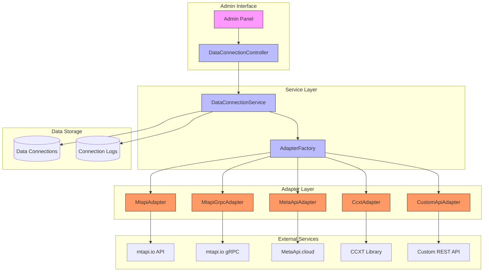
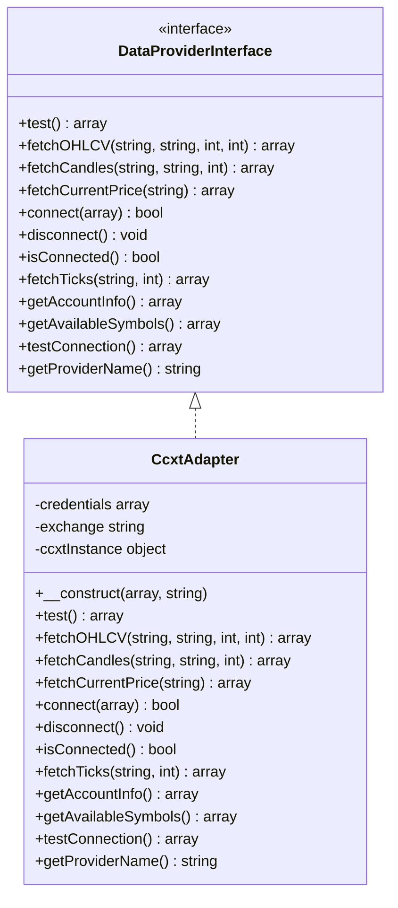
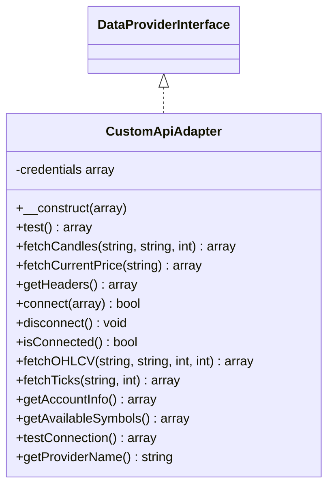
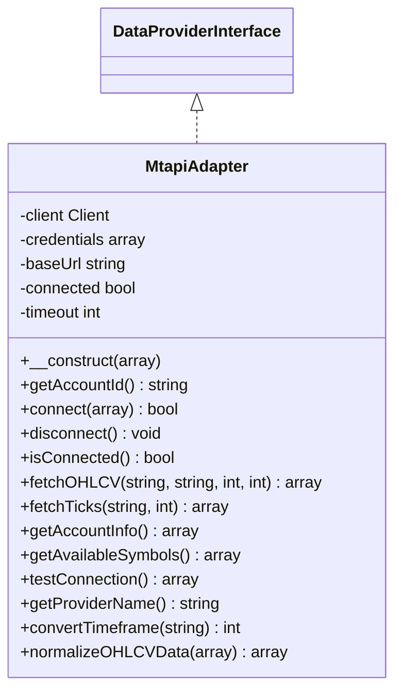
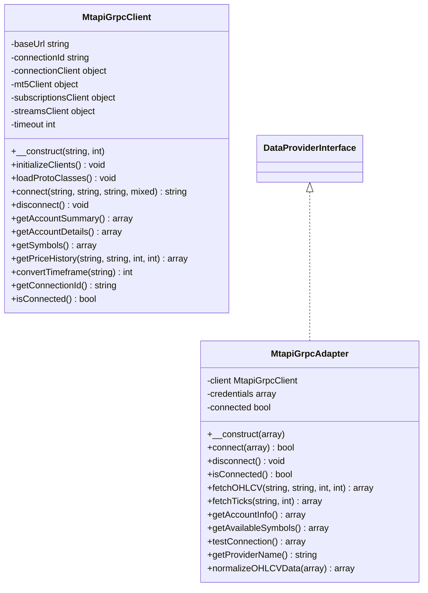
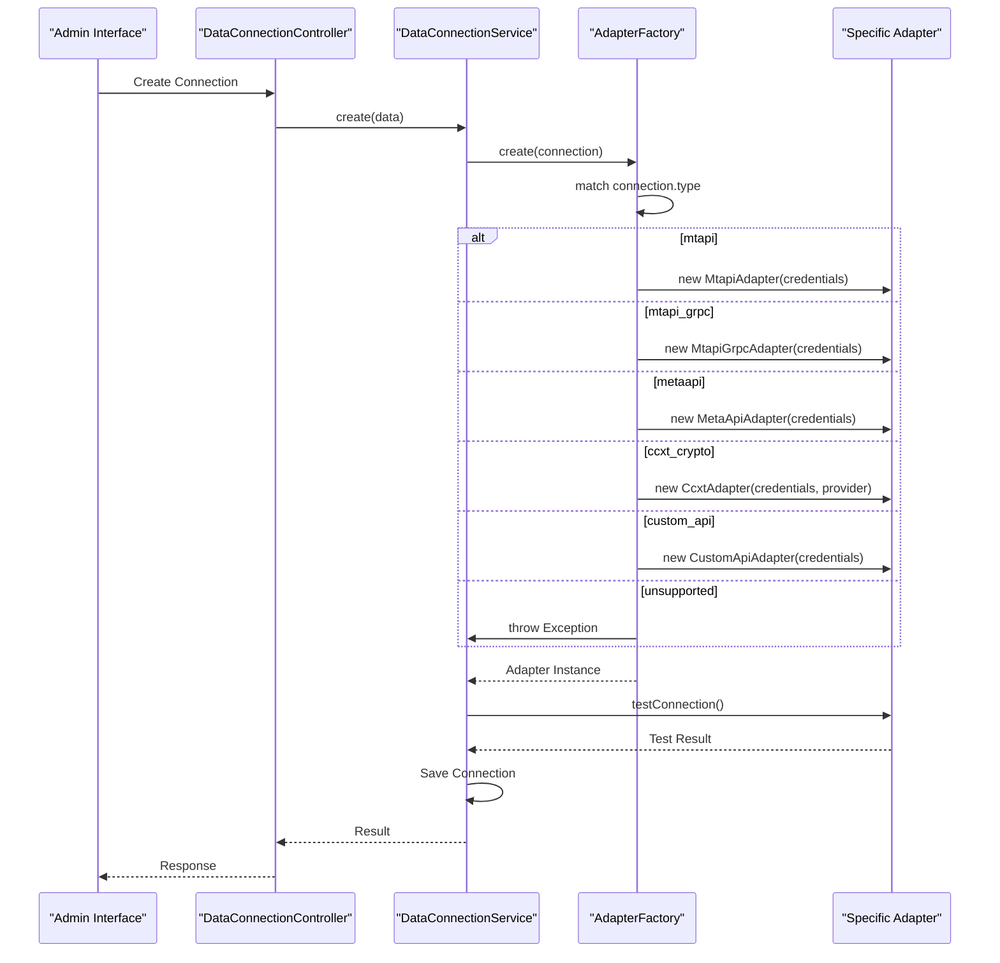
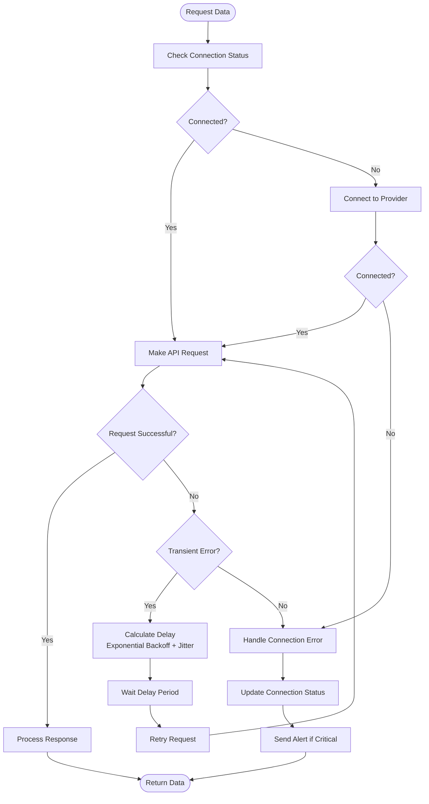

# Data Provider Module

<cite>
**Referenced Files in This Document**   
- [DataConnection.php](file://main/addons/trading-management-addon/Modules/DataProvider/Models/DataConnection.php)
- [CcxtAdapter.php](file://main/addons/trading-management-addon/Modules/DataProvider/Adapters/CcxtAdapter.php)
- [CustomApiAdapter.php](file://main/addons/trading-management-addon/Modules/DataProvider/Adapters/CustomApiAdapter.php)
- [MtapiAdapter.php](file://main/addons/trading-management-addon/Modules/DataProvider/Adapters/MtapiAdapter.php)
- [MtapiGrpcAdapter.php](file://main/addons/trading-management-addon/Modules/DataProvider/Adapters/MtapiGrpcAdapter.php)
- [MetaApiAdapter.php](file://main/addons/trading-management-addon/Modules/DataProvider/Adapters/MetaApiAdapter.php)
- [AdapterFactory.php](file://main/addons/trading-management-addon/Modules/DataProvider/Services/AdapterFactory.php)
- [DataConnectionService.php](file://main/addons/trading-management-addon/Modules/DataProvider/Services/DataConnectionService.php)
- [DataConnectionController.php](file://main/addons/trading-management-addon/Modules/DataProvider/Controllers/Backend/DataConnectionController.php)
</cite>

## Table of Contents
1. [Introduction](#introduction)
2. [Architecture Overview](#architecture-overview)
3. [Core Components](#core-components)
4. [Adapter System Implementation](#adapter-system-implementation)
5. [Configuration Options](#configuration-options)
6. [Data Connection Management](#data-connection-management)
7. [Error Handling and Retry Mechanisms](#error-handling-and-retry-mechanisms)
8. [Troubleshooting Guide](#troubleshooting-guide)
9. [Performance Optimization](#performance-optimization)

## Introduction

The Data Provider module is responsible for establishing and managing market data connections to various trading platforms and data sources. This module enables the system to retrieve market data from multiple providers including MT4/MT5 brokers through mtapi.io, MetaApi.cloud, CCXT for cryptocurrency exchanges, and custom REST APIs. The architecture is designed to be extensible, allowing for easy integration of new data providers through a standardized adapter interface.

The module plays a critical role in the trading system by providing reliable market data feeds that power trading signals, analytics, and decision-making processes. It handles authentication, connection management, data retrieval, and error recovery for all market data connections.

**Section sources**
- [DataConnection.php](file://main/addons/trading-management-addon/Modules/DataProvider/Models/DataConnection.php#L1-L184)

## Architecture Overview

The Data Provider module follows a modular architecture with a clear separation of concerns between connection management, data retrieval, and service orchestration. The core components work together to provide a robust market data ingestion system.

**Diagram sources**
- [DataConnectionController.php](file://main/addons/trading-management-addon/Modules/DataProvider/Controllers/Backend/DataConnectionController.php#L1-L47)
- [DataConnectionService.php](file://main/addons/trading-management-addon/Modules/DataProvider/Services/DataConnectionService.php#L1-L32)
- [AdapterFactory.php](file://main/addons/trading-management-addon/Modules/DataProvider/Services/AdapterFactory.php#L1-L35)

## Core Components

The Data Provider module consists of several core components that work together to manage market data connections. The foundation is the DataConnection model which stores connection configuration and state. The adapter system implements the actual data retrieval logic for different providers, while the AdapterFactory service dynamically selects the appropriate adapter based on the connection type.

The module follows the Strategy pattern, where each adapter implements a common interface (DataProviderInterface) that defines the methods for connecting, retrieving data, and testing connections. This allows the system to treat all data providers uniformly regardless of their underlying implementation.

**Section sources**
- [DataConnection.php](file://main/addons/trading-management-addon/Modules/DataProvider/Models/DataConnection.php#L1-L184)
- [AdapterFactory.php](file://main/addons/trading-management-addon/Modules/DataProvider/Services/AdapterFactory.php#L1-L35)

## Adapter System Implementation

The adapter system is the core of the Data Provider module, implementing connectivity to various market data sources through specialized adapter classes. Each adapter implements the DataProviderInterface contract, ensuring a consistent API for data retrieval operations.

### CcxtAdapter

The CcxtAdapter provides connectivity to cryptocurrency exchanges through the CCXT library. It supports over 100 exchanges and handles the translation between the system's standard data format and exchange-specific APIs.

**Diagram sources**
- [CcxtAdapter.php](file://main/addons/trading-management-addon/Modules/DataProvider/Adapters/CcxtAdapter.php#L1-L289)

### CustomApiAdapter

The CustomApiAdapter enables connectivity to custom market data APIs through a flexible REST interface. It allows users to integrate with proprietary data sources by configuring API endpoints, authentication, and data formats.

**Diagram sources**
- [CustomApiAdapter.php](file://main/addons/trading-management-addon/Modules/DataProvider/Adapters/CustomApiAdapter.php#L1-L239)

### MtapiAdapter

The MtapiAdapter provides connectivity to MT4/MT5 accounts through the mtapi.io HTTP API. It supports market data retrieval and account information queries for MetaTrader platforms.

**Diagram sources**
- [MtapiAdapter.php](file://main/addons/trading-management-addon/Modules/DataProvider/Adapters/MtapiAdapter.php#L1-L309)

### MtapiGrpcAdapter

The MtapiGrpcAdapter provides high-performance connectivity to MT5 accounts through the mtapi.io gRPC interface. This adapter offers lower latency and more efficient data transfer compared to the HTTP-based MtapiAdapter.

**Diagram sources**
- [MtapiGrpcAdapter.php](file://main/addons/trading-management-addon/Modules/DataProvider/Adapters/MtapiGrpcAdapter.php#L1-L254)
- [MtapiGrpcClient.php](file://main/addons/trading-management-addon/Modules/DataProvider/Services/MtapiGrpcClient.php#L1-L473)

## Configuration Options

The Data Provider module offers comprehensive configuration options for data connections, allowing users to customize authentication, polling intervals, and stream health monitoring parameters.

### Connection Configuration

Each data connection is configured with the following parameters:

**Table of Data Connection Configuration Options**
| Field | Type | Description | Required |
|-------|------|-------------|----------|
| name | string | User-friendly name for the connection | Yes |
| type | string | Connection type (mtapi, mtapi_grpc, metaapi, ccxt_crypto, custom_api) | Yes |
| provider | string | Provider identifier (exchange name for CCXT, account ID for others) | Yes |
| credentials | array | Encrypted credentials for authentication | Yes |
| config | array | Provider-specific configuration options | No |
| settings | array | User preferences (symbols, timeframes, etc.) | No |
| status | string | Current status (active, inactive, error, testing) | No |
| is_active | boolean | Whether the connection is enabled | No |

### API Credentials

API credentials are securely stored and encrypted in the database. The required credentials vary by connection type:

- **mtapi**: api_key, account_id
- **mtapi_grpc**: user, password, host, port
- **metaapi**: api_token, account_id
- **ccxt_crypto**: api_key, api_secret, api_passphrase (if required)
- **custom_api**: api_key, api_secret, api_url

### Polling Intervals and Rate Limiting

The system implements intelligent polling intervals and rate limiting to prevent API abuse and ensure reliable data retrieval:

- Default polling interval: 30 seconds for market data
- Configurable interval per connection (minimum 10 seconds)
- Automatic rate limit detection and backoff
- Exponential retry with jitter for failed requests

### Stream Health Monitoring

The module includes comprehensive health monitoring for all data connections:

- Automatic connection testing on creation and activation
- Periodic health checks (configurable interval)
- Latency measurement and reporting
- Error rate tracking and alerting
- Automatic reconnection attempts with exponential backoff

**Section sources**
- [DataConnection.php](file://main/addons/trading-management-addon/Modules/DataProvider/Models/DataConnection.php#L1-L184)
- [CcxtAdapter.php](file://main/addons/trading-management-addon/Modules/DataProvider/Adapters/CcxtAdapter.php#L1-L289)
- [CustomApiAdapter.php](file://main/addons/trading-management-addon/Modules/DataProvider/Adapters/CustomApiAdapter.php#L1-L239)

## Data Connection Management

The Data Provider module provides a comprehensive interface for managing data connections through the admin panel. The system follows a service-oriented architecture with clear separation between controllers, services, and adapters.

### AdapterFactory Service

The AdapterFactory service is responsible for dynamically selecting and instantiating the appropriate adapter based on the connection type. This implementation follows the Factory pattern, providing a clean interface for adapter creation.

**Diagram sources**
- [AdapterFactory.php](file://main/addons/trading-management-addon/Modules/DataProvider/Services/AdapterFactory.php#L1-L35)
- [DataConnectionService.php](file://main/addons/trading-management-addon/Modules/DataProvider/Services/DataConnectionService.php#L1-L32)

### Connection Lifecycle

The typical lifecycle of a data connection involves the following steps:

1. **Creation**: User creates a new connection through the admin interface
2. **Configuration**: User enters connection details and credentials
3. **Testing**: System automatically tests the connection
4. **Activation**: Connection is activated and begins data retrieval
5. **Monitoring**: System continuously monitors connection health
6. **Maintenance**: User can update, deactivate, or delete connections

### Admin Interface Workflow

The admin interface provides a user-friendly workflow for setting up and testing data connections:

1. Navigate to "Data Connections" in the admin panel
2. Click "Create Connection"
3. Select connection type from available options
4. Enter connection details and credentials
5. Click "Test Connection" to verify configuration
6. Save the connection if testing is successful
7. Activate the connection for regular data retrieval

**Section sources**
- [DataConnectionController.php](file://main/addons/trading-management-addon/Modules/DataProvider/Controllers/Backend/DataConnectionController.php#L1-L47)
- [DataConnectionService.php](file://main/addons/trading-management-addon/Modules/DataProvider/Services/DataConnectionService.php#L1-L32)

## Error Handling and Retry Mechanisms

The Data Provider module implements robust error handling and retry mechanisms to ensure reliable data retrieval even in the face of network issues or API failures.

### Error Handling Strategy

The system follows a comprehensive error handling strategy that includes:

- **Graceful degradation**: When a connection fails, the system continues to operate with available data sources
- **Detailed logging**: All errors are logged with context for troubleshooting
- **User notifications**: Critical errors trigger notifications to administrators
- **Automatic recovery**: The system attempts to automatically recover from transient errors

### Retry Mechanisms

The module implements exponential backoff with jitter for retrying failed requests:

**Diagram sources**
- [MtapiAdapter.php](file://main/addons/trading-management-addon/Modules/DataProvider/Adapters/MtapiAdapter.php#L1-L309)
- [MetaApiAdapter.php](file://main/addons/trading-management-addon/Modules/DataProvider/Adapters/MetaApiAdapter.php#L1-L800)

### Connection Health Monitoring

The DataConnection model includes several fields for tracking connection health and performance:

- `last_connected_at`: Timestamp of last successful connection
- `last_tested_at`: Timestamp of last connection test
- `last_used_at`: Timestamp of last data retrieval
- `last_error`: Details of the last error encountered
- `status`: Current status (active, inactive, error, testing)

The system automatically updates these fields during connection operations and uses them to determine the health of each connection.

**Section sources**
- [DataConnection.php](file://main/addons/trading-management-addon/Modules/DataProvider/Models/DataConnection.php#L1-L184)
- [MtapiAdapter.php](file://main/addons/trading-management-addon/Modules/DataProvider/Adapters/MtapiAdapter.php#L1-L309)

## Troubleshooting Guide

This section provides guidance for troubleshooting common connection issues with the Data Provider module.

### Common Connection Issues

**Authentication Failures**
- Verify API credentials are correct
- Check if API keys have expired or been revoked
- Ensure the account has sufficient permissions
- For MetaApi, verify the API token has historical data access permissions

**Network Connectivity Issues**
- Check if the API endpoint is reachable
- Verify firewall rules allow outbound connections
- Test connectivity from the server using curl or similar tools
- Check for DNS resolution issues

**Rate Limiting**
- Monitor API usage against rate limits
- Implement appropriate polling intervals
- Use exponential backoff for retry attempts
- Consider upgrading API plan for higher limits

**Data Format Issues**
- Verify the data provider returns expected format
- Check for API version compatibility
- Validate symbol names and timeframes are supported
- Test with known working symbols and timeframes

### Diagnostic Tools

The system provides several tools for diagnosing connection issues:

- **Connection Testing**: Test button in admin interface verifies configuration
- **Detailed Logs**: Error messages with context for troubleshooting
- **Latency Measurement**: Performance metrics for connection speed
- **Health Dashboard**: Overview of all connections and their status

### Recovery Procedures

When a connection fails, follow these steps:

1. Check the error message in the connection details
2. Verify credentials are correct and haven't expired
3. Test connectivity to the API endpoint
4. Check provider status (many providers have status pages)
5. Review recent changes to configuration or network
6. Restart the connection service if necessary
7. Contact provider support if issue persists

**Section sources**
- [DataConnection.php](file://main/addons/trading-management-addon/Modules/DataProvider/Models/DataConnection.php#L1-L184)
- [MtapiAdapter.php](file://main/addons/trading-management-addon/Modules/DataProvider/Adapters/MtapiAdapter.php#L1-L309)
- [MetaApiAdapter.php](file://main/addons/trading-management-addon/Modules/DataProvider/Adapters/MetaApiAdapter.php#L1-L800)

## Performance Optimization

This section provides guidance on optimizing data retrieval performance for the Data Provider module.

### Connection Pooling

For high-frequency data retrieval, consider implementing connection pooling:

- Maintain persistent connections to reduce connection overhead
- Reuse connections for multiple requests
- Implement connection timeouts to prevent resource exhaustion
- Monitor connection pool usage and adjust size as needed

### Data Caching

Implement caching strategies to reduce API calls and improve response times:

- Cache frequently accessed data (symbols, account info)
- Use appropriate cache expiration based on data volatility
- Implement cache invalidation on data updates
- Consider distributed caching for multi-server deployments

### Parallel Data Retrieval

Optimize data retrieval by fetching data in parallel:

- Use asynchronous requests for multiple symbols or timeframes
- Implement batch requests when supported by the provider
- Limit concurrent requests to avoid rate limiting
- Use connection-specific concurrency limits

### Polling Interval Optimization

Adjust polling intervals based on data requirements:

- Use shorter intervals for high-frequency trading strategies
- Use longer intervals for long-term analysis
- Implement adaptive polling based on market activity
- Consider using webhooks or push APIs when available

### Resource Monitoring

Monitor system resources to identify performance bottlenecks:

- Track CPU and memory usage of data retrieval processes
- Monitor network bandwidth utilization
- Measure database performance for connection logging
- Set up alerts for resource thresholds

**Section sources**
- [DataConnection.php](file://main/addons/trading-management-addon/Modules/DataProvider/Models/DataConnection.php#L1-L184)
- [CcxtAdapter.php](file://main/addons/trading-management-addon/Modules/DataProvider/Adapters/CcxtAdapter.php#L1-L289)
- [MetaApiAdapter.php](file://main/addons/trading-management-addon/Modules/DataProvider/Adapters/MetaApiAdapter.php#L1-L800)