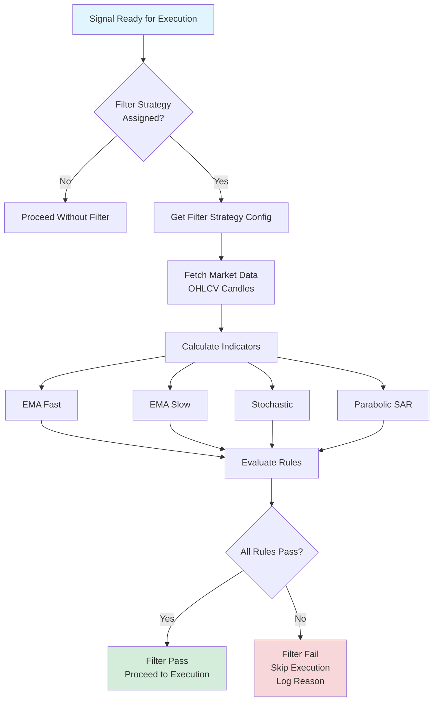

# Filter Strategy

<cite>
**Referenced Files in This Document**   
- [FilterStrategy.php](file://main/addons/trading-management-addon/Modules/FilterStrategy/Models/FilterStrategy.php)
- [FilterStrategyEvaluator.php](file://main/addons/trading-management-addon/Modules/FilterStrategy/Services/FilterStrategyEvaluator.php)
- [IndicatorService.php](file://main/addons/trading-management-addon/Modules/FilterStrategy/Services/IndicatorService.php)
- [FilterStrategyController.php](file://main/addons/trading-management-addon/Modules/FilterStrategy/Controllers/Backend/FilterStrategyController.php)
- [2025_12_02_105100_add_filter_strategy_to_trading_presets.php](file://main/addons/trading-management-addon/database/migrations/2025_12_02_105100_add_filter_strategy_to_trading_presets.php)
- [filter-strategy-guide.md](file://docs/filter-strategy-guide.md)
</cite>

## Table of Contents
1. [Introduction](#introduction)
2. [Filter Strategy Model](#filter-strategy-model)
3. [Filter Evaluation Engine](#filter-evaluation-engine)
4. [Admin Interface and Management](#admin-interface-and-management)
5. [Common Filtering Patterns](#common-filtering-patterns)
6. [Integration with Trading Presets](#integration-with-trading-presets)
7. [Testing and Optimization](#testing-and-optimization)

## Introduction

The Filter Strategy system is a critical component in the trading signal processing pipeline, designed to pre-process and validate trading signals before execution. It ensures that only signals meeting specific technical criteria are allowed to proceed, thereby improving trade quality and reducing false positives. The system supports rule-based filtering, technical indicator conditions, and time-based filters, providing a robust mechanism for signal validation.

## Filter Strategy Model

The Filter Strategy model defines the structure and configuration of filter strategies used to evaluate trading signals. It includes rule-based filtering criteria, technical indicator conditions, and time-based filters.

### Model Structure

The `FilterStrategy` model is defined with the following attributes:

- **id**: Primary key
- **name**: Strategy name
- **description**: Description of the strategy
- **created_by_user_id**: Owner of the strategy (nullable)
- **visibility**: Visibility setting (PRIVATE or PUBLIC_MARKETPLACE)
- **clonable**: Boolean indicating if the strategy can be cloned
- **enabled**: Boolean indicating if the strategy is active
- **config**: JSON configuration containing indicators and rules

### Configuration Format

The configuration is stored as a JSON object with the following structure:

```json
{
    "indicators": {
        "ema_fast": {"period": 10},
        "ema_slow": {"period": 100},
        "stochastic": {"k": 14, "d": 3, "smooth": 3},
        "psar": {"step": 0.02, "max": 0.2}
    },
    "rules": {
        "logic": "AND",
        "conditions": [
            {"left": "ema_fast", "operator": ">", "right": "ema_slow"},
            {"left": "stochastic", "operator": "<", "right": 80},
            {"left": "psar", "operator": "below_price", "right": null}
        ]
    }
}
```

### Supported Indicators

The system supports several technical indicators for filtering:

- **EMA (Exponential Moving Average)**: Fast and slow EMAs for trend identification
- **Stochastic Oscillator**: Measures momentum and overbought/oversold conditions
- **Parabolic SAR**: Identifies potential reversals in price direction
- **Fibonacci Retracement**: Identifies potential support and resistance levels
- **Support/Resistance**: Detects key price levels based on historical data

**Section sources**
- [FilterStrategy.php](file://main/addons/trading-management-addon/Modules/FilterStrategy/Models/FilterStrategy.php#L1-L134)
- [filter-strategy-guide.md](file://docs/filter-strategy-guide.md#L42-L126)

## Filter Evaluation Engine

The filter evaluation engine processes incoming signals against configured strategies to determine if they should proceed to execution.

### Evaluation Process

The evaluation process follows these steps:

1. **Fetch Market Data**: Retrieve OHLCV (Open, High, Low, Close, Volume) data for the relevant symbol and timeframe.
2. **Calculate Indicators**: Compute the values of all configured technical indicators using the market data.
3. **Evaluate Rules**: Apply the configured rules to the calculated indicator values.
4. **Return Result**: Determine if the signal passes or fails based on the rule evaluation.

### Rule Evaluation Logic

Rules are evaluated using logical operators (AND/OR) and comparison operators (>, <, >=, <=, ==). Special operators include `below_price` and `above_price` for comparing indicator values to the current price.



**Diagram sources**
- [FilterStrategyEvaluator.php](file://main/addons/trading-management-addon/Modules/FilterStrategy/Services/FilterStrategyEvaluator.php#L37-L134)
- [IndicatorService.php](file://main/addons/trading-management-addon/Modules/FilterStrategy/Services/IndicatorService.php#L16-L189)

**Section sources**
- [FilterStrategyEvaluator.php](file://main/addons/trading-management-addon/Modules/FilterStrategy/Services/FilterStrategyEvaluator.php#L37-L134)
- [IndicatorService.php](file://main/addons/trading-management-addon/Modules/FilterStrategy/Services/IndicatorService.php#L16-L189)

## Admin Interface and Management

The admin interface allows users to create, edit, and manage filter strategies through a web-based UI.

### Creating Filter Strategies

To create a new filter strategy:

1. Navigate to `/user/filter-strategies/create`
2. Enter a name and description
3. Select and configure the desired indicators
4. Define the filtering rules
5. Set visibility (PRIVATE or PUBLIC_MARKETPLACE)
6. Enable or disable the strategy
7. Save the configuration

### Strategy Visibility

- **PRIVATE**: Visible only to the creator, cannot be cloned by others
- **PUBLIC_MARKETPLACE**: Visible to all users, can be cloned if `clonable` is set to true

### Editing and Deleting

Existing strategies can be edited or deleted through the admin interface. The edit form allows modification of all strategy attributes, while deletion permanently removes the strategy from the system.

**Section sources**
- [FilterStrategyController.php](file://main/addons/trading-management-addon/Modules/FilterStrategy/Controllers/Backend/FilterStrategyController.php#L1-L76)
- [filter-strategy-guide.md](file://docs/filter-strategy-guide.md#L416-L443)

## Common Filtering Patterns

Several common filtering patterns are used to improve signal quality and trade outcomes.

### Trend Following

This pattern ensures trades are only taken in the direction of the prevailing trend.

```json
{
    "conditions": [
        {"left": "ema_fast", "operator": ">", "right": "ema_slow"},
        {"left": "psar", "operator": "below_price", "right": null}
    ]
}
```

### Mean Reversion

This pattern identifies oversold conditions for potential buy signals.

```json
{
    "conditions": [
        {"left": "stochastic", "operator": "<", "right": 20}
    ]
}
```

### Trend Confirmation

This pattern combines trend and momentum indicators to confirm the strength of a trend.

```json
{
    "conditions": [
        {"left": "ema_fast", "operator": ">", "right": "ema_slow"},
        {"left": "stochastic", "operator": ">", "right": 50}
    ]
}
```

**Section sources**
- [filter-strategy-guide.md](file://docs/filter-strategy-guide.md#L500-L543)

## Integration with Trading Presets

Filter strategies are integrated with trading presets, allowing multiple filters to be chained together.

### Assignment Hierarchy

Filter strategies can be assigned at multiple levels:

1. **Trading Preset** (highest priority): Applied to all signals using this preset
2. **Execution Connection**: Applied to all signals executed on this connection
3. **Channel Source** (future): Applied to signals from specific channels

### Resolution Priority

When a signal is ready for execution, the system checks for filter strategies in the following order:

1. Trading Preset → filter_strategy_id
2. If not set, check Execution Connection → filter_strategy_id
3. If not set, no filter is applied

```php
1. Check Trading Preset → filter_strategy_id
2. If not set, check Execution Connection → filter_strategy_id
3. If not set, no filter applied
```

**Section sources**
- [2025_12_02_105100_add_filter_strategy_to_trading_presets.php](file://main/addons/trading-management-addon/database/migrations/2025_12_02_105100_add_filter_strategy_to_trading_presets.php#L1-L49)
- [filter-strategy-guide.md](file://docs/filter-strategy-guide.md#L278-L303)

## Testing and Optimization

Testing and optimizing filter strategies is crucial for ensuring their effectiveness in different market conditions.

### Testing Strategies

- **Backtesting**: Test filter strategies on historical data to evaluate performance
- **Paper Trading**: Use simulated trading to validate strategy effectiveness
- **A/B Testing**: Compare different filter configurations to identify the best performers

### Optimization Guidelines

- **Start Simple**: Begin with 1-2 indicators and gradually add more as needed
- **Avoid Over-Filtering**: Too many rules may block valid signals
- **Performance**: Limit the number of indicators to reduce evaluation time
- **Logical Combinations**: Use AND for strict conditions and OR for flexible ones

**Section sources**
- [filter-strategy-guide.md](file://docs/filter-strategy-guide.md#L555-L573)