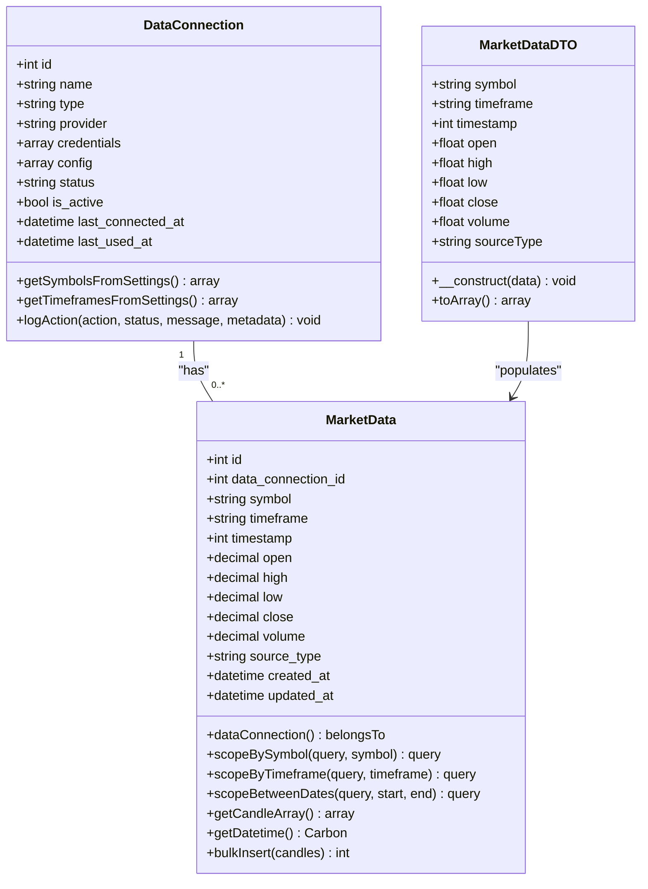
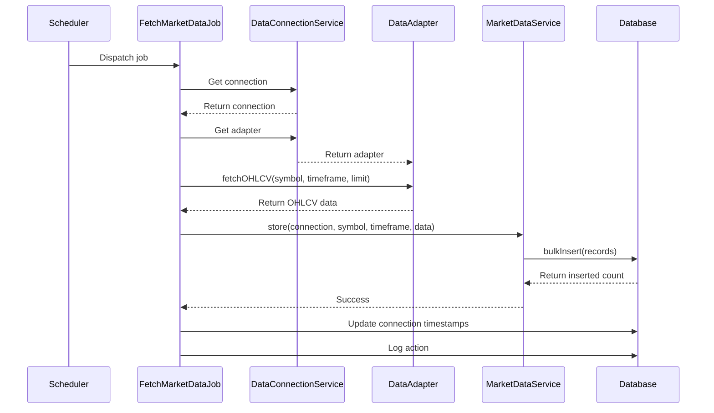
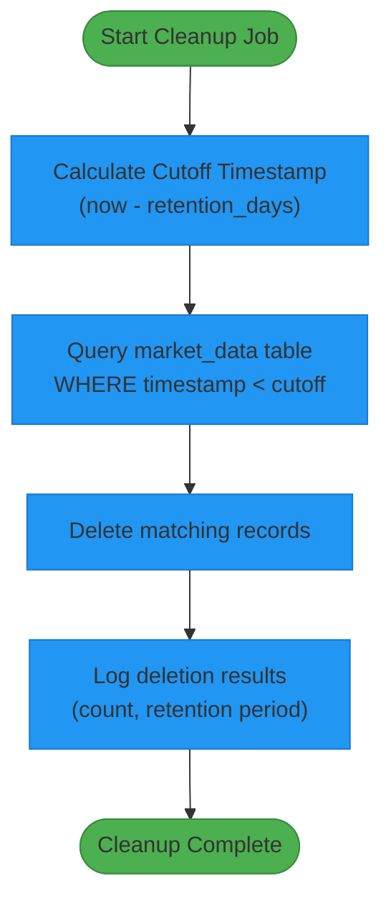
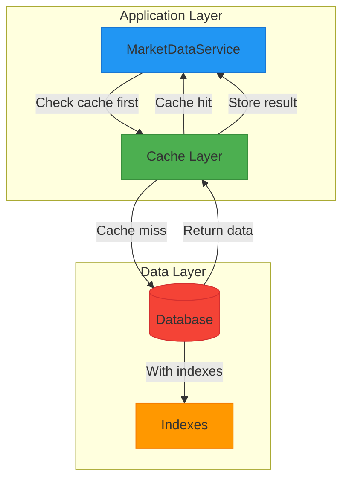
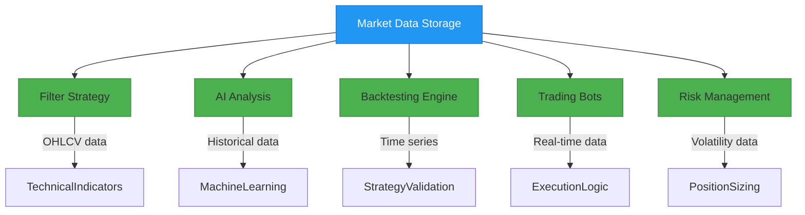

# Market Data Storage

<cite>
**Referenced Files in This Document**   
- [MarketData.php](file://main/addons/trading-management-addon/Modules/MarketData/Models/MarketData.php)
- [MarketDataService.php](file://main/addons/trading-management-addon/Modules/MarketData/Services/MarketDataService.php)
- [FetchMarketDataJob.php](file://main/addons/trading-management-addon/Modules/MarketData/Jobs/FetchMarketDataJob.php)
- [CleanOldMarketDataJob.php](file://main/addons/trading-management-addon/Modules/MarketData/Jobs/CleanOldMarketDataJob.php)
- [DataConnection.php](file://main/addons/trading-management-addon/Modules/DataProvider/Models/DataConnection.php)
- [DataConnectionService.php](file://main/addons/trading-management-addon/Modules/DataProvider/Services/DataConnectionService.php)
- [MarketDataDTO.php](file://main/addons/trading-management-addon/Shared/DTOs/MarketDataDTO.php)
- [create_market_data_table.php](file://main/addons/trading-management-addon/database/migrations_backup/2025_12_04_100001_create_market_data_table.php)
- [create_market_data_subscriptions_table.php](file://main/database/migrations/2025_12_05_015237_create_market_data_subscriptions_table.php)
- [add_cache_metadata_to_market_data_table.php](file://main/database/migrations/2025_12_05_015242_add_cache_metadata_to_market_data_table.php)
</cite>

## Table of Contents
1. [Introduction](#introduction)
2. [Market Data Model Structure](#market-data-model-structure)
3. [Data Storage and Normalization](#data-storage-and-normalization)
4. [Background Jobs and Data Processing](#background-jobs-and-data-processing)
5. [Data Retention and Cleanup](#data-retention-and-cleanup)
6. [Indexing and Query Performance](#indexing-and-query-performance)
7. [Integration with Other Modules](#integration-with-other-modules)
8. [Configuration and Monitoring](#configuration-and-monitoring)
9. [Conclusion](#conclusion)

## Introduction

The Market Data Storage system serves as the central repository for both historical and real-time market data within the trading platform. It is designed to handle candlestick (OHLCV) data from multiple data providers, ensuring consistent storage, efficient retrieval, and proper lifecycle management. The system supports various trading functionalities including strategy filtering, AI analysis, and backtesting by providing reliable and timely market information. This document details the architecture, implementation, and operational aspects of the Market Data Storage system.

## Market Data Model Structure

The MarketData model is the core entity for storing candlestick data and includes essential price points, volume, timestamps, and metadata. It follows a standardized structure to ensure consistency across different data sources.

### Core Attributes

The MarketData model contains the following key attributes:

- **symbol**: Trading pair identifier (e.g., EURUSD, BTC/USDT)
- **timeframe**: Time interval for the candle (M1, M5, M15, M30, H1, H4, D1, W1, MN)
- **timestamp**: Unix timestamp representing the candle's open time
- **open**: Opening price of the candle
- **high**: Highest price during the candle period
- **low**: Lowest price during the candle period
- **close**: Closing price of the candle
- **volume**: Trading volume (nullable for FX pairs)
- **source_type**: Origin of the data (mtapi, ccxt, etc.)

### Data Types and Precision

The system uses precise data types to maintain accuracy in financial calculations:

- **Decimal precision**: 20,8 for price and volume fields to accommodate high-precision cryptocurrency and forex pricing
- **Timestamp storage**: Unsigned big integer for Unix timestamps, ensuring compatibility with various time-based queries
- **Casting configuration**: Automatic casting of decimal fields to ensure consistent precision in application logic

```mermaid
erDiagram
MARKET_DATA {
int id PK
int data_connection_id FK
string symbol
string timeframe
int timestamp
decimal open
decimal high
decimal low
decimal close
decimal volume Nullable
string source_type
datetime created_at
datetime updated_at
}
DATA_CONNECTION ||--o{ MARKET_DATA : "provides"
```

**Diagram sources**
- [MarketData.php](file://main/addons/trading-management-addon/Modules/MarketData/Models/MarketData.php#L13-L25)
- [create_market_data_table.php](file://main/addons/trading-management-addon/database/migrations_backup/2025_12_04_100001_create_market_data_table.php#L26-L45)

**Section sources**
- [MarketData.php](file://main/addons/trading-management-addon/Modules/MarketData/Models/MarketData.php#L8-L26)
- [create_market_data_table.php](file://main/addons/trading-management-addon/database/migrations_backup/2025_12_04_100001_create_market_data_table.php#L22-L45)

## Data Storage and Normalization

The system implements a robust data storage mechanism that handles normalization across different exchange formats and ensures data integrity through proper relationships and constraints.

### Data Normalization Process

Market data from various providers is normalized through the MarketDataDTO (Data Transfer Object) which standardizes the format before storage:

- **Symbol standardization**: Converts exchange-specific symbol formats to a consistent internal representation
- **Timeframe mapping**: Translates provider-specific timeframe identifiers to the standardized set
- **Price and volume formatting**: Ensures consistent decimal precision across all data sources
- **Source type tracking**: Maintains the origin of data for audit and quality control purposes

### Relationship with DataConnection

The MarketData entity has a direct relationship with the DataConnection entity, establishing a clear lineage from data source to stored information:

- **Foreign key constraint**: Each MarketData record references its originating DataConnection
- **Ownership tracking**: Data is associated with either a user or admin-owned connection
- **Provider metadata**: Connection configuration and credentials are securely stored and referenced



**Diagram sources**
- [DataConnection.php](file://main/addons/trading-management-addon/Modules/DataProvider/Models/DataConnection.php#L20-L36)
- [MarketData.php](file://main/addons/trading-management-addon/Modules/MarketData/Models/MarketData.php#L13-L25)
- [MarketDataDTO.php](file://main/addons/trading-management-addon/Shared/DTOs/MarketDataDTO.php#L12-L21)

**Section sources**
- [DataConnection.php](file://main/addons/trading-management-addon/Modules/DataProvider/Models/DataConnection.php#L14-L18)
- [MarketData.php](file://main/addons/trading-management-addon/Modules/MarketData/Models/MarketData.php#L57-L59)
- [MarketDataDTO.php](file://main/addons/trading-management-addon/Shared/DTOs/MarketDataDTO.php#L5-L9)

## Background Jobs and Data Processing

The system employs a comprehensive background job architecture to handle data fetching, processing, and distribution, ensuring real-time availability and historical completeness.

### Data Fetching Workflow

The FetchMarketDataJob orchestrates the retrieval of market data from configured connections:

- **Scheduled execution**: Runs at regular intervals to maintain up-to-date market information
- **Connection validation**: Verifies the active status of data connections before fetching
- **Adapter-based retrieval**: Uses provider-specific adapters to fetch OHLCV data
- **Batch processing**: Handles multiple symbols and timeframes in a single job execution
- **Error resilience**: Implements retry mechanisms with exponential backoff for transient failures

### Job Configuration and Execution

Key configuration parameters for the data fetching job include:

- **Retry policy**: 3 attempts with backoff intervals of 30, 60, and 120 seconds
- **Execution timeout**: 120 seconds to prevent hanging jobs
- **Queue prioritization**: Configured for reliable delivery and processing
- **Failure handling**: Comprehensive logging and connection status updates on failure



**Diagram sources**
- [FetchMarketDataJob.php](file://main/addons/trading-management-addon/Modules/MarketData/Jobs/FetchMarketDataJob.php#L15-L20)
- [DataConnectionService.php](file://main/addons/trading-management-addon/Modules/DataProvider/Services/DataConnectionService.php#L10-L13)
- [MarketDataService.php](file://main/addons/trading-management-addon/Modules/MarketData/Services/MarketDataService.php#L28-L36)

**Section sources**
- [FetchMarketDataJob.php](file://main/addons/trading-management-addon/Modules/MarketData/Jobs/FetchMarketDataJob.php#L15-L170)
- [DataConnectionService.php](file://main/addons/trading-management-addon/Modules/DataProvider/Services/DataConnectionService.php#L9-L13)
- [MarketDataService.php](file://main/addons/trading-management-addon/Modules/MarketData/Services/MarketDataService.php#L28-L69)

## Data Retention and Cleanup

The system implements automated data retention policies to manage storage requirements while maintaining access to historically relevant market information.

### Retention Policy Configuration

The data retention system is configured with the following parameters:

- **Default retention period**: 365 days (configurable via system settings)
- **Configurable override**: Ability to specify custom retention periods per connection or globally
- **Daily execution**: Cleanup job runs once per day to remove expired data
- **Size monitoring**: Tracks storage consumption and provides statistics

### Cleanup Process

The CleanOldMarketDataJob handles the removal of expired market data:

- **Cutoff calculation**: Determines the timestamp threshold based on retention days
- **Batch deletion**: Removes all records older than the cutoff timestamp
- **Comprehensive logging**: Records the number of deleted rows and execution status
- **Error handling**: Robust exception handling to ensure job reliability



**Diagram sources**
- [CleanOldMarketDataJob.php](file://main/addons/trading-management-addon/Modules/MarketData/Jobs/CleanOldMarketDataJob.php#L12-L16)
- [MarketDataService.php](file://main/addons/trading-management-addon/Modules/MarketData/Services/MarketDataService.php#L171-L195)

**Section sources**
- [CleanOldMarketDataJob.php](file://main/addons/trading-management-addon/Modules/MarketData/Jobs/CleanOldMarketDataJob.php#L18-L72)
- [MarketDataService.php](file://main/addons/trading-management-addon/Modules/MarketData/Services/MarketDataService.php#L171-L195)

## Indexing and Query Performance

The system employs strategic indexing and caching mechanisms to ensure optimal query performance for both real-time trading and historical analysis.

### Database Indexing Strategy

The market_data table is optimized with the following indexes:

- **Primary key**: Auto-incrementing ID for record identification
- **Symbol-timeframe-timestamp composite index**: Optimizes queries filtering by trading pair, timeframe, and date range
- **Data connection index**: Facilitates queries by data source
- **Timestamp index**: Enables efficient time-based range queries

### Caching Architecture

A multi-tiered caching strategy enhances performance:

- **Real-time cache**: 1-minute TTL for live trading data
- **Backtesting cache**: 24-hour TTL for historical analysis
- **Cache key structure**: Hierarchical keys based on symbol, timeframe, and query type
- **Cache invalidation**: Automatic clearing when new data is inserted
- **Cache statistics**: Monitoring of hit rates and storage usage



**Diagram sources**
- [MarketDataService.php](file://main/addons/trading-management-addon/Modules/MarketData/Services/MarketDataService.php#L19-L21)
- [MarketDataService.php](file://main/addons/trading-management-addon/Modules/MarketData/Services/MarketDataService.php#L89-L99)

**Section sources**
- [MarketDataService.php](file://main/addons/trading-management-addon/Modules/MarketData/Services/MarketDataService.php#L19-L21)
- [MarketDataService.php](file://main/addons/trading-management-addon/Modules/MarketData/Services/MarketDataService.php#L89-L99)

## Integration with Other Modules

The Market Data Storage system serves as a foundational component for various trading and analysis modules, providing standardized data access across the platform.

### Filter Strategy Integration

The Filter Strategy module utilizes market data to evaluate trading conditions:

- **Technical indicator calculation**: Uses OHLCV data to compute moving averages, RSI, MACD, and other indicators
- **Pattern recognition**: Analyzes candlestick patterns and price action
- **Condition evaluation**: Assesses entry and exit criteria based on market conditions
- **Backtesting support**: Provides historical data for strategy validation

### AI Analysis Integration

The AI Analysis module leverages market data for machine learning and predictive modeling:

- **Feature engineering**: Transforms raw price data into training features
- **Time series analysis**: Processes sequential market data for forecasting
- **Model training**: Uses historical data to train predictive algorithms
- **Real-time inference**: Provides current market context for AI decision-making

### Data Access Patterns

Common data access patterns include:

- **Latest candles**: Retrieval of recent price action for real-time monitoring
- **Historical ranges**: Fetching data for specific date ranges for analysis
- **Single timestamp lookup**: Accessing data for a specific moment in time
- **Availability checking**: Verifying data coverage for backtesting periods



**Diagram sources**
- [MarketDataService.php](file://main/addons/trading-management-addon/Modules/MarketData/Services/MarketDataService.php#L80-L117)
- [MarketDataService.php](file://main/addons/trading-management-addon/Modules/MarketData/Services/MarketDataService.php#L354-L440)

**Section sources**
- [MarketDataService.php](file://main/addons/trading-management-addon/Modules/MarketData/Services/MarketDataService.php#L80-L117)
- [MarketDataService.php](file://main/addons/trading-management-addon/Modules/MarketData/Services/MarketDataService.php#L354-L440)

## Configuration and Monitoring

The system provides comprehensive configuration options and monitoring capabilities to ensure reliable operation and optimal performance.

### Configuration Parameters

Key configurable parameters include:

- **Cache TTL**: Configurable time-to-live for cached market data (default: 300 seconds)
- **Retention days**: Number of days to retain market data (default: 365 days)
- **Fetch limit**: Number of candles to retrieve per request (configurable per connection)
- **Active symbols and timeframes**: Selectable trading pairs and intervals for each data connection

### Monitoring and Health Checks

The system includes robust monitoring features:

- **Connection status tracking**: Real-time monitoring of data connection health
- **Last activity timestamps**: Tracking of last connection, test, and usage times
- **Error logging**: Comprehensive error recording with context
- **Performance metrics**: Storage size, query statistics, and cache hit rates
- **Action logging**: Audit trail of all connection-related operations

### Configuration Management

Configuration is managed through:

- **Environment variables**: System-wide defaults
- **Database settings**: Per-connection configuration
- **Administrative interface**: GUI for configuration management
- **API endpoints**: Programmatic configuration access

**Section sources**
- [MarketDataService.php](file://main/addons/trading-management-addon/Modules/MarketData/Services/MarketDataService.php#L24-L25)
- [CleanOldMarketDataJob.php](file://main/addons/trading-management-addon/Modules/MarketData/Jobs/CleanOldMarketDataJob.php#L31-L32)
- [DataConnection.php](file://main/addons/trading-management-addon/Modules/DataProvider/Models/DataConnection.php#L35-L36)

## Conclusion

The Market Data Storage system provides a robust foundation for the trading platform's data needs, offering reliable storage, efficient retrieval, and comprehensive lifecycle management of market information. By standardizing data formats across providers, implementing automated background processing, and optimizing for performance, the system ensures that trading strategies, AI analysis, and other modules have access to high-quality market data. The integration with DataConnection entities establishes clear data provenance, while configurable retention policies and monitoring capabilities enable effective system management. This architecture supports both real-time trading operations and historical analysis, making it a critical component of the overall trading ecosystem.