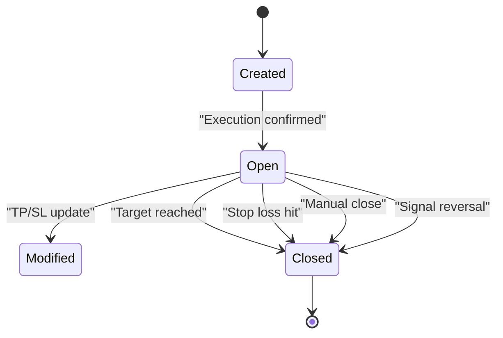
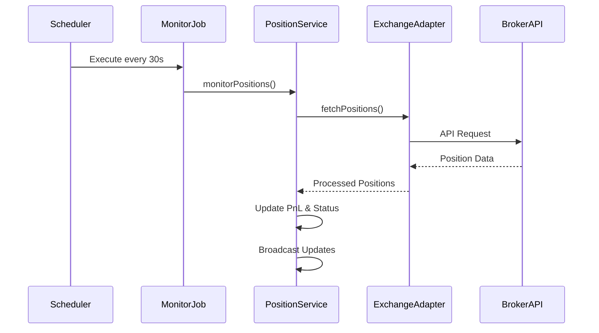
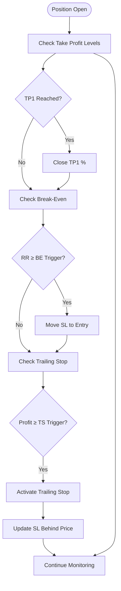
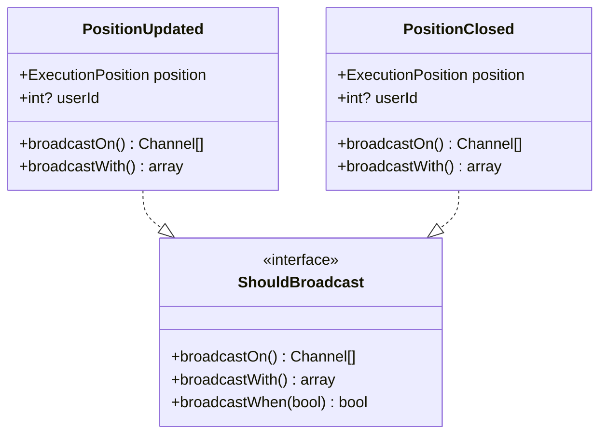
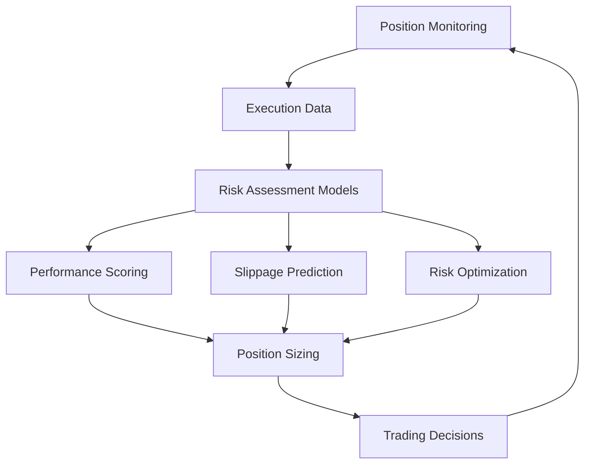

# Position Monitoring

<cite>
**Referenced Files in This Document**   
- [PositionController.php](file://main/addons/trading-management-addon/Modules/PositionMonitoring/Controllers/Api/PositionController.php)
- [PositionControlService.php](file://main/addons/trading-management-addon/Modules/PositionMonitoring/Services/PositionControlService.php)
- [ExecutionPosition.php](file://main/addons/trading-management-addon/Modules/PositionMonitoring/Models/ExecutionPosition.php)
- [MonitorPositionsJob.php](file://main/addons/_deprecated/trading-execution-engine-addon/app/Jobs/MonitorPositionsJob.php)
- [PositionUpdated.php](file://main/addons/trading-management-addon/Modules/PositionMonitoring/Events/PositionUpdated.php)
- [PositionClosed.php](file://main/addons/trading-management-addon/Modules/PositionMonitoring/Events/PositionClosed.php)
- [trading_presets_table.php](file://main/addons/trading-management-addon/database/migrations/2025_01_29_100000_create_trading_presets_table.php)
- [TradeDecisionEngine.php](file://main/addons/trading-management-addon/Modules/TradingBot/Services/TradeDecisionEngine.php)
- [PositionServiceTest.php](file://main/tests/Unit/PositionServiceTest.php)
- [trading-presets.md](file://docs/trading-presets.md)
</cite>

## Table of Contents
1. [Introduction](#introduction)
2. [Position Lifecycle Management](#position-lifecycle-management)
3. [Real-Time Position Tracking](#real-time-position-tracking)
4. [Automated Position Management Rules](#automated-position-management-rules)
5. [Alerting System](#alerting-system)
6. [Position Data Aggregation and UI Display](#position-data-aggregation-and-ui-display)
7. [Integration with Risk Management](#integration-with-risk-management)
8. [Customization and Configuration](#customization-and-configuration)
9. [Conclusion](#conclusion)

## Introduction

The Position Monitoring system is a critical component of the trading infrastructure, responsible for tracking active trades, managing position lifecycle, and ensuring accurate synchronization with broker APIs. This system provides real-time visibility into open positions, enables automated management rules, and delivers timely alerts for significant market events. The architecture integrates tightly with execution engines, risk management models, and user interfaces to provide a comprehensive trading experience.

The system monitors positions across multiple exchanges through standardized adapters, calculates profit/loss metrics in real-time, and supports advanced position management strategies such as trailing stops, partial profit taking, and time-based exits. It also serves as a feedback mechanism for risk assessment models by providing performance data and execution analytics.

**Section sources**
- [PositionController.php](file://main/addons/trading-management-addon/Modules/PositionMonitoring/Controllers/Api/PositionController.php#L1-L24)
- [PositionControlService.php](file://main/addons/trading-management-addon/Modules/PositionMonitoring/Services/PositionControlService.php#L1-L374)

## Position Lifecycle Management

The Position Monitoring system manages the complete lifecycle of trading positions from entry to exit. Each position transitions through well-defined states: created, open, modified, and closed. The system maintains both application-level positions (TradingBotPosition) and execution-level positions (ExecutionPosition) to ensure consistency between strategy decisions and actual market execution.

Positions are created when trading signals are executed, with initial parameters including entry price, direction, quantity, stop loss, and take profit levels. During the open state, the system continuously monitors market conditions and applies management rules. When exit conditions are met—whether through target achievement, stop loss triggers, or manual intervention—the position transitions to closed status with final profit/loss calculations recorded.

The system implements robust state validation to prevent invalid transitions and ensures atomic updates to position data. Event broadcasting (via PositionUpdated and PositionClosed events) notifies connected clients of state changes in real-time through WebSocket connections.

**Diagram sources**
- [ExecutionPosition.php](file://main/addons/trading-management-addon/Modules/PositionMonitoring/Models/ExecutionPosition.php#L79-L82)
- [PositionControlService.php](file://main/addons/trading-management-addon/Modules/PositionMonitoring/Services/PositionControlService.php#L100-L136)

**Section sources**
- [PositionControlService.php](file://main/addons/trading-management-addon/Modules/PositionMonitoring/Services/PositionControlService.php#L99-L136)
- [ExecutionPosition.php](file://main/addons/trading-management-addon/Modules/PositionMonitoring/Models/ExecutionPosition.php#L79-L82)

## Real-Time Position Tracking

The Position Monitoring system maintains real-time synchronization with broker APIs through exchange adapters that interface with various trading platforms. The system uses a polling mechanism (implemented via MonitorPositionsJob) to regularly fetch position updates from connected exchanges and reconcile them with internal state.

The tracking system employs adapter patterns to support multiple exchange providers, including CCXT-based exchanges and MetaAPI connections. Each adapter implements standardized methods for fetching balance information, position details, and order status. The PositionControlService orchestrates communication between the application and exchange APIs, handling position updates, stop loss/take profit modifications, and closure requests.

Real-time price updates are processed through the ExecutionPosition model's updatePnL method, which recalculates profit/loss metrics whenever new market data arrives. The system includes validation checks to prevent calculation errors due to invalid price data and logs warnings when anomalous values are detected.

**Diagram sources**
- [MonitorPositionsJob.php](file://main/addons/_deprecated/trading-execution-engine-addon/app/Jobs/MonitorPositionsJob.php#L13-L30)
- [PositionControlService.php](file://main/addons/trading-management-addon/Modules/PositionMonitoring/Services/PositionControlService.php#L156-L181)
- [ExecutionPosition.php](file://main/addons/trading-management-addon/Modules/PositionMonitoring/Models/ExecutionPosition.php#L84-L115)

**Section sources**
- [MonitorPositionsJob.php](file://main/addons/_deprecated/trading-execution-engine-addon/app/Jobs/MonitorPositionsJob.php#L13-L30)
- [PositionControlService.php](file://main/addons/trading-management-addon/Modules/PositionMonitoring/Services/PositionControlService.php#L156-L181)

## Automated Position Management Rules

The system implements sophisticated position management rules that automate trading decisions based on predefined criteria. These rules are configured through trading presets and applied dynamically to active positions. The core automation features include multi-tier take profit, break-even adjustment, trailing stops, and position layering.

### Multi-Tier Take Profit
The system supports up to three take profit levels with configurable close percentages. Traders can define different risk-reward ratios for each tier and specify whether remaining positions should be closed at the final target. This allows for partial profit taking while maintaining exposure to favorable trends.

### Break-Even Functionality
When a specified risk-reward threshold is reached (typically 1.5R), the system automatically moves the stop loss to the entry price, eliminating potential losses on the trade. An optional offset can be applied to lock in small profits. This rule is particularly useful for protecting gains during volatile market conditions.

### Trailing Stop Mechanisms
The system offers multiple trailing stop modes:
- **STEP_PIPS**: Fixed pip distance trailing
- **STEP_ATR**: Adaptive trailing based on Average True Range
- **CHANDELIER**: Volatility-based trailing stop

Trailing stops activate only after a minimum profit threshold is achieved, preventing premature triggering during normal price fluctuations.

**Diagram sources**
- [trading_presets_table.php](file://main/addons/trading-management-addon/database/migrations/2025_01_29_100000_create_trading_presets_table.php#L61-L83)
- [trading-presets.md](file://docs/trading-presets.md#L171-L255)

**Section sources**
- [trading_presets_table.php](file://main/addons/trading-management-addon/database/migrations/2025_01_29_100000_create_trading_presets_table.php#L61-L83)
- [trading-presets.md](file://docs/trading-presets.md#L171-L255)
- [PositionServiceTest.php](file://main/tests/Unit/PositionServiceTest.php#L17-L32)

## Alerting System

The Position Monitoring system includes a comprehensive alerting framework that notifies users of significant position changes, threshold breaches, and required actions. Alerts are triggered by various events including position openings, modifications, closures, and specific market conditions.

The system broadcasts real-time updates through WebSocket channels using Laravel's event broadcasting system. The PositionUpdated and PositionClosed events carry the current position state and are pushed to authenticated users, enabling instant UI updates without requiring manual refreshes.

Alert types include:
- **Position Status Changes**: Notifications when positions are opened, modified, or closed
- **Threshold Breaches**: Alerts when profit targets or stop loss levels are approached
- **Risk Level Warnings**: Notifications when drawdown exceeds configurable thresholds
- **Action Required**: Alerts for manual intervention when automated rules cannot execute

The alerting system is designed to be extensible, allowing for additional notification channels (email, SMS, push) to be integrated while maintaining a consistent event-driven architecture.

**Diagram sources**
- [PositionUpdated.php](file://main/addons/trading-management-addon/Modules/PositionMonitoring/Events/PositionUpdated.php#L1-L23)
- [PositionClosed.php](file://main/addons/trading-management-addon/Modules/PositionMonitoring/Events/PositionClosed.php#L1-L23)

**Section sources**
- [PositionUpdated.php](file://main/addons/trading-management-addon/Modules/PositionMonitoring/Events/PositionUpdated.php#L1-L23)
- [PositionClosed.php](file://main/addons/trading-management-addon/Modules/PositionMonitoring/Events/PositionClosed.php#L1-L23)

## Position Data Aggregation and UI Display

Position data is aggregated from multiple sources and presented through a unified interface that provides comprehensive insights into trading performance. The system calculates key metrics including profit/loss, return on risk, win rate, and maximum drawdown, which are displayed in real-time on the trading dashboard.

The UI components render both open and closed positions with detailed information such as entry/exit prices, holding duration, and performance metrics. Profit/loss calculations are updated continuously as market prices change, with visual indicators showing current performance relative to risk parameters.

Aggregation occurs at multiple levels:
- **Position Level**: Individual trade performance with entry/exit details
- **Strategy Level**: Performance metrics for specific trading bots or strategies
- **Portfolio Level**: Overall performance across all connected accounts and strategies

The system supports filtering and sorting of position data by various criteria including time period, symbol, strategy, and performance thresholds, enabling users to analyze their trading history and identify patterns.

**Section sources**
- [PositionControlService.php](file://main/addons/trading-management-addon/Modules/PositionMonitoring/Services/PositionControlService.php#L337-L354)
- [ExecutionPosition.php](file://main/addons/trading-management-addon/Modules/PositionMonitoring/Models/ExecutionPosition.php#L84-L115)

## Integration with Risk Management

The Position Monitoring system plays a crucial role in the overall risk management framework by providing real-time data that feeds into risk assessment models. Monitoring data is used to calculate performance scores, adjust position sizing, and identify potential risk exposures.

The system captures detailed execution analytics including slippage, fill rates, and order timing, which are used to refine risk models. Performance data from closed positions updates provider metrics and influences future position sizing decisions through the TradeDecisionEngine.

Risk feedback loops include:
- **Performance-Based Position Sizing**: Adjusting trade size based on historical performance of signal providers
- **Drawdown Monitoring**: Tracking maximum adverse excursion and adjusting risk parameters accordingly
- **Volatility-Adaptive Rules**: Modifying stop loss and take profit distances based on current market volatility
- **Correlation Analysis**: Identifying unintended portfolio exposures across multiple strategies

The integration between position monitoring and risk management creates a self-improving system where execution data continuously informs and refines risk parameters.

**Diagram sources**
- [TradeDecisionEngine.php](file://main/addons/trading-management-addon/Modules/TradingBot/Services/TradeDecisionEngine.php#L65-L101)
- [spec.md](file://specs/active/ai-smart-risk-management/plan.md#L461-L503)

**Section sources**
- [TradeDecisionEngine.php](file://main/addons/trading-management-addon/Modules/TradingBot/Services/TradeDecisionEngine.php#L65-L101)
- [spec.md](file://specs/active/ai-smart-risk-management/plan.md#L461-L503)

## Customization and Configuration

Users can customize position monitoring parameters through trading presets that define specific management rules for different strategies. The configuration system allows for granular control over automated rules, alert thresholds, and display preferences.

Key customizable parameters include:
- **Take Profit Configuration**: Number of levels, risk-reward ratios, and close percentages
- **Stop Loss Management**: Break-even triggers, trailing stop activation thresholds, and update frequencies
- **Alert Settings**: Notification types, threshold levels, and delivery channels
- **Display Options**: Metrics to show, timeframes for performance calculations, and visualization preferences

The system supports both global defaults and strategy-specific overrides, enabling users to maintain consistent risk parameters while allowing for tactical adjustments based on market conditions or strategy characteristics.

Configuration is stored in the trading_presets table with fields for each rule type, and changes are applied dynamically to active positions when appropriate. The system validates configurations to ensure they meet exchange requirements and risk management guidelines before activation.

**Section sources**
- [trading_presets_table.php](file://main/addons/trading-management-addon/database/migrations/2025_01_29_100000_create_trading_presets_table.php#L61-L83)
- [trading-presets.md](file://docs/trading-presets.md#L171-L255)

## Conclusion

The Position Monitoring system provides a comprehensive solution for tracking and managing active trades with robust support for automated position management rules, real-time alerts, and performance analytics. By maintaining tight synchronization with broker APIs and implementing sophisticated monitoring logic, the system ensures accurate position tracking and timely execution of management rules.

The integration with risk management models creates a feedback loop that continuously improves trading performance by adapting to market conditions and historical results. The flexible configuration system allows users to tailor monitoring parameters to their specific strategies while maintaining appropriate risk controls.

Future enhancements could include machine learning-based exit prediction, enhanced correlation analysis across multiple strategies, and more sophisticated volatility-adaptive rules. The current architecture provides a solid foundation for these advanced features while delivering reliable position monitoring capabilities.