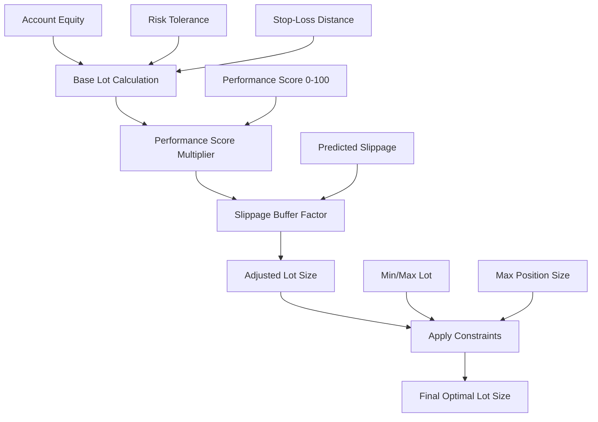
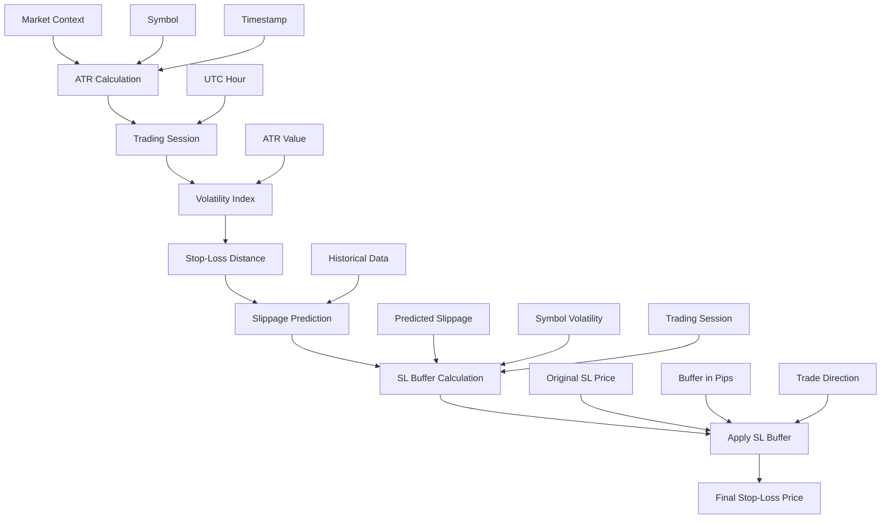
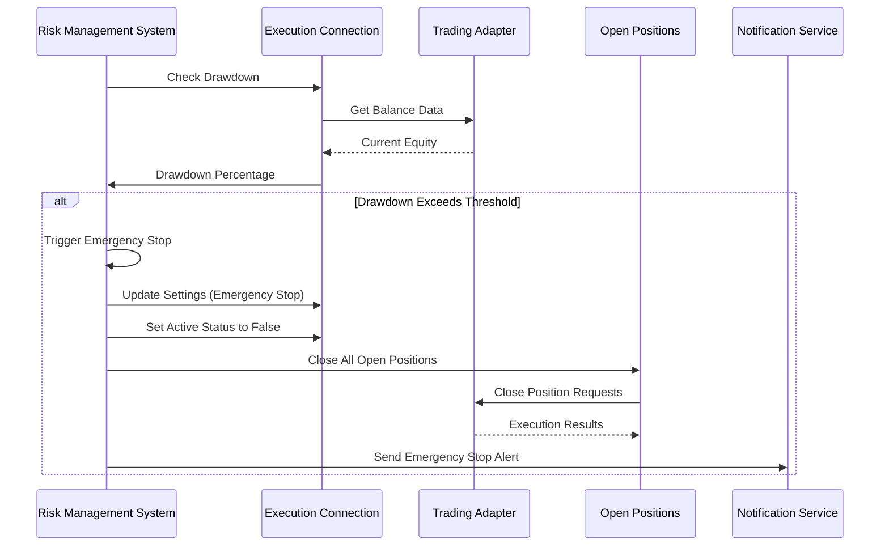
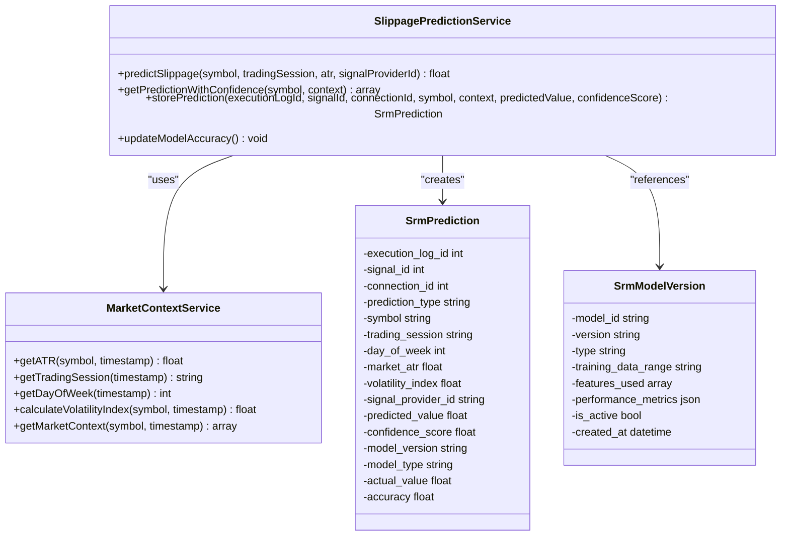
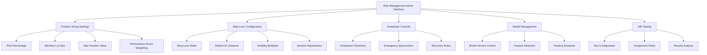
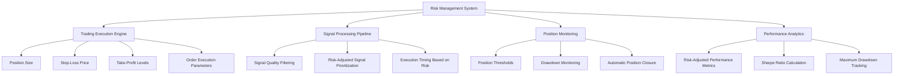

# Risk Management

<cite>
**Referenced Files in This Document**   
- [RiskOptimizationService.php](file://main/addons/_deprecated/smart-risk-management-addon/app/Services/RiskOptimizationService.php)
- [MaxDrawdownControlService.php](file://main/addons/_deprecated/smart-risk-management-addon/app/Services/MaxDrawdownControlService.php)
- [SlBufferingService.php](file://main/addons/_deprecated/smart-risk-management-addon/app/Services/SlBufferingService.php)
- [SlippagePredictionService.php](file://main/addons/_deprecated/smart-risk-management-addon/app/Services/SlippagePredictionService.php)
- [MarketContextService.php](file://main/addons/_deprecated/smart-risk-management-addon/app/Services/MarketContextService.php)
- [position-risk.blade.php](file://main/addons/_deprecated/trading-preset-addon/resources/views/backend/presets/partials/position-risk.blade.php)
- [trading-presets.md](file://docs/trading-presets.md)
- [RiskCalculatorService.php](file://main/addons/trading-management-addon/Modules/RiskManagement/Services/RiskCalculatorService.php)
</cite>

## Table of Contents
1. [Introduction](#introduction)
2. [Dynamic Position Sizing](#dynamic-position-sizing)
3. [Volatility-Based Stop-Loss Calculation](#volatility-based-stop-loss-calculation)
4. [Maximum Drawdown Controls](#maximum-drawdown-controls)
5. [Machine Learning for Risk Parameter Optimization](#machine-learning-for-risk-parameter-optimization)
6. [Risk Management Configuration Interface](#risk-management-configuration-interface)
7. [Risk Management Strategies](#risk-management-strategies)
8. [Integration with Trading Modules](#integration-with-trading-modules)
9. [Backtesting and Parameter Adjustment](#backtesting-and-parameter-adjustment)
10. [Conclusion](#conclusion)

## Introduction
The Risk Management system is designed to protect trading capital through a comprehensive, multi-layered approach that combines traditional risk management principles with advanced machine learning techniques. The system implements dynamic position sizing, volatility-based stop-loss calculation, and maximum drawdown controls to adapt to changing market conditions and protect against excessive losses. At its core, the system uses machine learning models to predict optimal risk parameters based on market context, enabling more intelligent and adaptive risk management decisions.

The risk management framework is tightly integrated with other trading modules, influencing trade execution parameters and position monitoring thresholds. Risk assessments directly affect position sizing, stop-loss placement, and overall portfolio exposure. The system provides both automated risk optimization and manual configuration options through an intuitive admin interface, allowing users to customize risk parameters according to their risk tolerance and trading objectives.

**Section sources**
- [RiskOptimizationService.php](file://main/addons/_deprecated/smart-risk-management-addon/app/Services/RiskOptimizationService.php)
- [MaxDrawdownControlService.php](file://main/addons/_deprecated/smart-risk-management-addon/app/Services/MaxDrawdownControlService.php)

## Dynamic Position Sizing
The dynamic position sizing system calculates optimal lot sizes based on multiple factors including account equity, risk tolerance, stop-loss distance, predicted slippage, and performance scores. The core formula combines these elements to determine the appropriate position size for each trade:

**Diagram sources**
- [RiskOptimizationService.php](file://main/addons/_deprecated/smart-risk-management-addon/app/Services/RiskOptimizationService.php)

The base lot calculation follows the risk percentage formula: (Equity × Risk%) / Stop-Loss Distance. This ensures that each trade risks a consistent percentage of account equity. The system then applies two key multipliers to adjust the base lot size:

1. **Performance Score Multiplier**: Adjusts position size based on historical performance, ranging from 0.5x (for low scores) to 1.5x (for high scores). This creates a feedback loop where successful trading strategies are rewarded with larger position sizes.

2. **Slippage Buffer Factor**: Reduces position size when high slippage is predicted, with up to a 30% reduction if slippage exceeds 10 pips. This helps protect against execution risk in volatile market conditions.

The system also applies constraints to ensure position sizes remain within predefined limits, including minimum and maximum lot sizes and maximum position values in currency units.

**Section sources**
- [RiskOptimizationService.php](file://main/addons/_deprecated/smart-risk-management-addon/app/Services/RiskOptimizationService.php)
- [trading-presets.md](file://docs/trading-presets.md)

## Volatility-Based Stop-Loss Calculation
The stop-loss calculation system incorporates volatility considerations through a multi-step process that includes both initial stop-loss placement and dynamic buffering. The system uses Average True Range (ATR) and trading session context to determine appropriate stop-loss distances, ensuring they are neither too tight (causing premature exits) nor too wide (exposing excessive capital).

**Diagram sources**
- [SlBufferingService.php](file://main/addons/_deprecated/smart-risk-management-addon/app/Services/SlBufferingService.php)
- [SlippagePredictionService.php](file://main/addons/_deprecated/smart-risk-management-addon/app/Services/SlippagePredictionService.php)
- [MarketContextService.php](file://main/addons/_deprecated/smart-risk-management-addon/app/Services/MarketContextService.php)

The system implements a sophisticated buffering mechanism to protect against slippage during stop-loss execution. The buffer calculation considers:

- **Predicted Slippage**: Based on historical execution data for similar market conditions
- **Symbol Volatility**: High volatility symbols like XAUUSD and BTC receive larger buffers
- **Trading Session**: Overlap sessions (London-New York) receive 20% more buffer due to higher volatility

The buffer is applied differently based on trade direction: subtracted from the stop-loss price for buy positions and added for sell positions, ensuring the stop-loss is placed further from the current price to account for potential slippage.

**Section sources**
- [SlBufferingService.php](file://main/addons/_deprecated/smart-risk-management-addon/app/Services/SlBufferingService.php)
- [SlippagePredictionService.php](file://main/addons/_deprecated/smart-risk-management-addon/app/Services/SlippagePredictionService.php)
- [MarketContextService.php](file://main/addons/_deprecated/smart-risk-management-addon/app/Services/MarketContextService.php)

## Maximum Drawdown Controls
The maximum drawdown control system provides a critical safety net to protect trading capital from catastrophic losses. It continuously monitors account performance and can trigger emergency stops when predefined drawdown thresholds are exceeded. The system calculates drawdown as the percentage difference between the initial account balance and current equity.

**Diagram sources**
- [MaxDrawdownControlService.php](file://main/addons/_deprecated/smart-risk-management-addon/app/Services/MaxDrawdownControlService.php)

When the drawdown percentage exceeds the configured threshold (default 20%), the system initiates an emergency stop protocol:

1. Marks the execution connection as emergency stopped in the database
2. Deactivates the connection to prevent new trades
3. Closes all open positions through the trading adapter
4. Sends notifications to alert the user of the emergency stop

The system handles potential failures gracefully, with comprehensive error logging and fallback mechanisms. If the trading adapter is unavailable, the system still deactivates the connection to prevent further losses, even if it cannot immediately close existing positions.

**Section sources**
- [MaxDrawdownControlService.php](file://main/addons/_deprecated/smart-risk-management-addon/app/Services/MaxDrawdownControlService.php)

## Machine Learning for Risk Parameter Optimization
The risk management system incorporates machine learning models to predict optimal risk parameters based on market conditions. While currently in Phase 2 with a weighted average prediction model, the architecture is designed to support more sophisticated machine learning approaches in future iterations.

**Diagram sources**
- [SlippagePredictionService.php](file://main/addons/_deprecated/smart-risk-management-addon/app/Services/SlippagePredictionService.php)
- [MarketContextService.php](file://main/addons/_deprecated/smart-risk-management-addon/app/Services/MarketContextService.php)
- [database/migrations/2025_12_02_120001_create_srm_predictions_table.php](file://main/addons/_deprecated/smart-risk-management-addon/database/migrations/2025_12_02_120001_create_srm_predictions_table.php)
- [database/migrations/2025_12_02_120002_create_srm_model_versions_table.php](file://main/addons/_deprecated/smart-risk-management-addon/database/migrations/2025_12_02_120002_create_srm_model_versions_table.php)

The slippage prediction model uses a weighted average of historical slippage data, with more recent executions given higher weight. The confidence score increases with the amount of historical data available:

- 0-10 samples: 30-60% confidence
- 10-50 samples: 60-80% confidence
- 50+ samples: 80-95% confidence

The system stores predictions in the database along with context variables (symbol, trading session, ATR, volatility index, signal provider) to enable future model training and accuracy assessment. When actual slippage values become available, the system updates model accuracy metrics to track performance over time.

**Section sources**
- [SlippagePredictionService.php](file://main/addons/_deprecated/smart-risk-management-addon/app/Services/SlippagePredictionService.php)
- [MarketContextService.php](file://main/addons/_deprecated/smart-risk-management-addon/app/Services/MarketContextService.php)

## Risk Management Configuration Interface
The risk management configuration interface allows users to set and prioritize risk management rules through an intuitive admin panel. The interface provides access to key risk parameters and enables customization of risk behavior based on trading objectives and risk tolerance.

**Diagram sources**
- [position-risk.blade.php](file://main/addons/_deprecated/trading-preset-addon/resources/views/backend/presets/partials/position-risk.blade.php)
- [resources/views/backend/settings/index.blade.php](file://main/addons/_deprecated/smart-risk-management-addon/resources/views/backend/settings/index.blade.php)

The configuration interface supports multiple risk management strategies and allows users to switch between them based on market conditions or trading goals. Key configuration options include:

- **Position Sizing Mode**: Fixed lot, risk percentage, or Kelly criterion
- **Risk Tolerance**: Percentage of equity to risk per trade
- **Stop-Loss Parameters**: Pips, ATR multiple, or volatility-based
- **Drawdown Thresholds**: Percentage at which emergency stops are triggered
- **Model Preferences**: Selection of active risk prediction models

The interface also provides transparency into risk decisions, showing the reasoning behind position size adjustments and stop-loss buffering to help users understand the system's risk management logic.

**Section sources**
- [position-risk.blade.php](file://main/addons/_deprecated/trading-preset-addon/resources/views/backend/presets/partials/position-risk.blade.php)
- [SrmSettingsController.php](file://main/addons/_deprecated/smart-risk-management-addon/app/Http/Controllers/Backend/SrmSettingsController.php)

## Risk Management Strategies
The system supports multiple risk management strategies that can be applied based on trading objectives and market conditions. These strategies range from simple fixed approaches to sophisticated adaptive methods.

### Fixed Fractional Strategy
The fixed fractional strategy risks a consistent percentage of account equity on each trade, regardless of account size. This approach provides scalable risk management that grows with the account.

**Implementation**:
- Risk percentage typically set between 1-2%
- Position size calculated as (Equity × Risk%) / Stop-Loss Distance
- Provides consistent risk exposure across different account sizes

### Kelly Criterion Strategy
The Kelly criterion strategy optimizes position sizing based on the probability of success and reward-to-risk ratio. This mathematical approach aims to maximize long-term capital growth.

**Implementation**:
- Position size = (BP - Q) / B
- Where B = net odds received (profit/loss ratio)
- P = probability of winning
- Q = probability of losing (1-P)
- Requires accurate estimation of win probability and reward-to-risk

### Volatility Targeting Strategy
The volatility targeting strategy adjusts position sizes to maintain consistent portfolio volatility. This approach normalizes risk exposure across different instruments and market conditions.

**Implementation**:
- Uses ATR or standard deviation to measure volatility
- Inverse position sizing: larger positions in low volatility, smaller in high volatility
- Maintains consistent risk profile regardless of market conditions

Each strategy can be configured through trading presets and applied to specific trading connections or signal providers. The system allows for easy comparison and A/B testing of different strategies to determine optimal performance.

**Section sources**
- [trading-presets.md](file://docs/trading-presets.md)
- [RiskCalculatorService.php](file://main/addons/trading-management-addon/Modules/RiskManagement/Services/RiskCalculatorService.php)

## Integration with Trading Modules
The risk management system is deeply integrated with other trading modules, influencing trade execution parameters and position monitoring thresholds. Risk assessments directly affect position sizing, stop-loss placement, and overall portfolio exposure.

**Diagram sources**
- [RiskCalculatorService.php](file://main/addons/trading-management-addon/Modules/RiskManagement/Services/RiskCalculatorService.php)
- [ExecutionPosition.php](file://main/addons/trading-management-addon/database/migrations/2025_01_29_100002_create_execution_positions_table.php)
- [ExecutionLog.php](file://main/addons/trading-management-addon/database/migrations/2025_01_29_100001_create_execution_logs_table.php)

The integration occurs at multiple levels:

1. **Pre-Execution**: Risk calculations determine position size and stop-loss placement before trade execution
2. **Execution**: Risk parameters are passed to the trading execution engine as order parameters
3. **Post-Execution**: Risk metrics are stored with execution logs for performance analysis
4. **Monitoring**: Open positions are continuously monitored against risk thresholds

This tight integration ensures that risk management is not an afterthought but an integral part of the entire trading workflow, from signal generation to execution and monitoring.

**Section sources**
- [RiskCalculatorService.php](file://main/addons/trading-management-addon/Modules/RiskManagement/Services/RiskCalculatorService.php)
- [RiskOptimizationService.php](file://main/addons/_deprecated/smart-risk-management-addon/app/Services/RiskOptimizationService.php)

## Backtesting and Parameter Adjustment
The risk management system supports comprehensive backtesting capabilities to evaluate strategy performance and optimize parameters. Users can test different risk management approaches against historical data to determine optimal settings for various asset classes and market regimes.

The backtesting framework allows for:

- **Strategy Comparison**: Testing multiple risk management strategies simultaneously
- **Parameter Optimization**: Finding optimal values for risk tolerance, position sizing, and stop-loss parameters
- **Market Regime Analysis**: Evaluating performance across different market conditions (trending, ranging, volatile)
- **Asset Class Specific Tuning**: Adjusting parameters for different instruments (forex, commodities, cryptocurrencies)

Key metrics for backtesting include:

- **Risk-Adjusted Returns**: Sharpe ratio, Sortino ratio
- **Maximum Drawdown**: Largest peak-to-trough decline
- **Win Rate**: Percentage of profitable trades
- **Profit Factor**: Gross profit divided by gross loss
- **Expectancy**: Average profit per trade

The system also supports forward testing through A/B testing frameworks, allowing users to compare new risk parameters against existing ones in live trading conditions with controlled exposure.

**Section sources**
- [AbTest.php](file://main/addons/_deprecated/smart-risk-management-addon/app/Models/AbTest.php)
- [AbTestController.php](file://main/addons/_deprecated/smart-risk-management-addon/app/Http/Controllers/Backend/AbTestController.php)
- [AbTestingService.php](file://main/addons/_deprecated/smart-risk-management-addon/app/Services/AbTestingService.php)

## Conclusion
The Risk Management system provides a comprehensive framework for protecting trading capital through dynamic position sizing, volatility-based stop-loss calculation, and maximum drawdown controls. By integrating machine learning models that predict optimal risk parameters based on market conditions, the system adapts to changing environments and makes more intelligent risk decisions.

The configurable admin interface allows users to customize risk parameters according to their risk tolerance and trading objectives, while the integration with other trading modules ensures that risk considerations are embedded throughout the entire trading workflow. With support for multiple risk management strategies and comprehensive backtesting capabilities, users can optimize their risk approach for different asset classes and market regimes.

Future enhancements will focus on advancing the machine learning models from the current weighted average approach to more sophisticated algorithms that can better capture complex market dynamics and improve prediction accuracy. The system's modular architecture supports these enhancements while maintaining backward compatibility with existing risk management strategies.