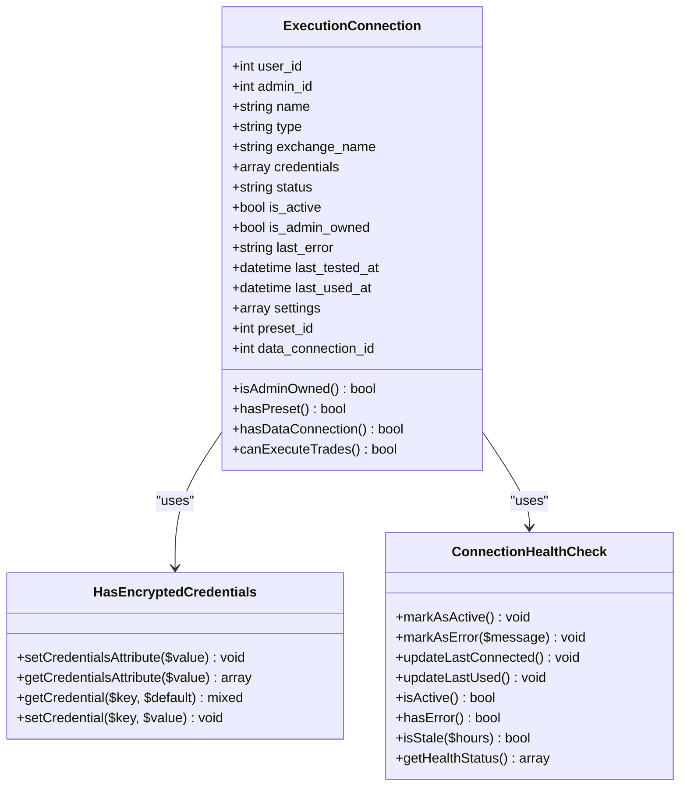
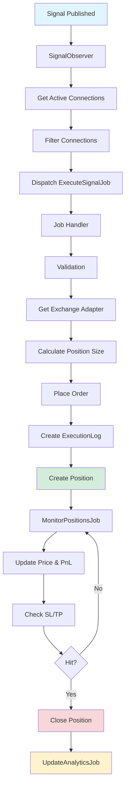
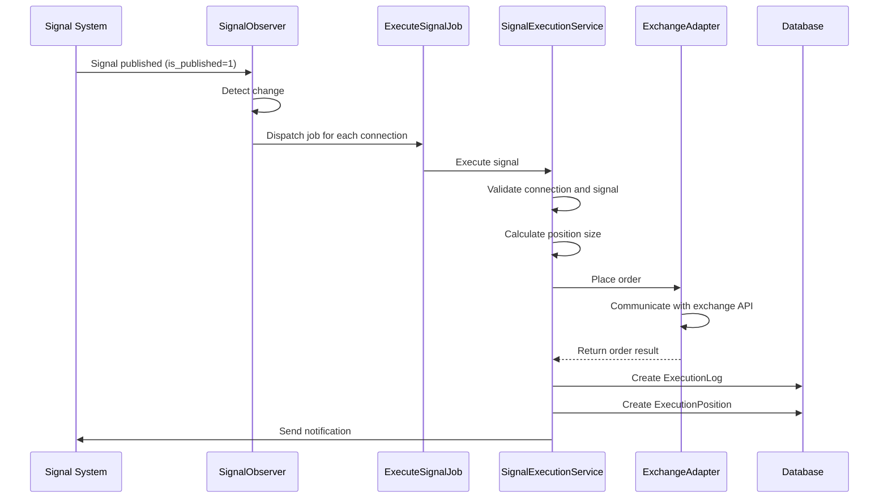
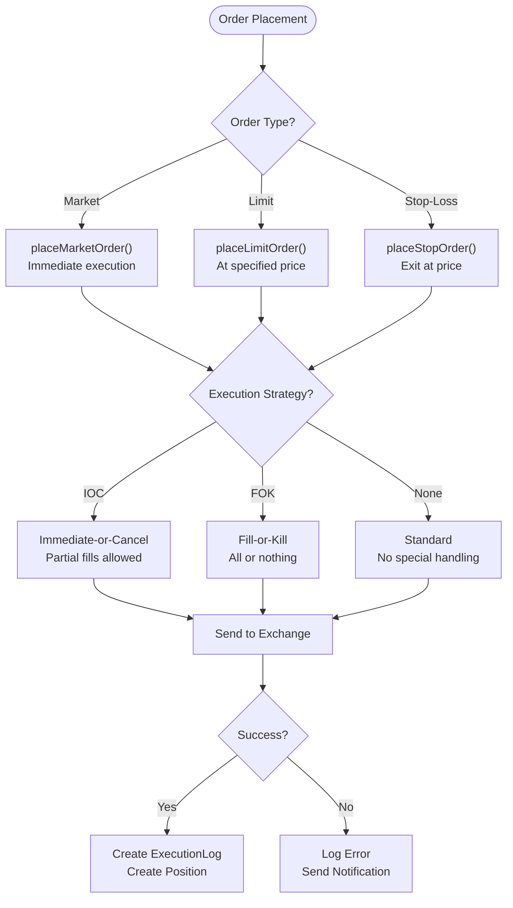

# Trade Execution

<cite>
**Referenced Files in This Document**   
- [ExecutionConnection.php](file://main/addons/trading-management-addon/Modules/Execution/Models/ExecutionConnection.php)
- [HasEncryptedCredentials.php](file://main/addons/trading-management-addon/Shared/Traits/HasEncryptedCredentials.php)
- [ConnectionHealthCheck.php](file://main/addons/trading-management-addon/Shared/Traits/ConnectionHealthCheck.php)
- [ExecutionLog.php](file://main/addons/trading-management-addon/Modules/Execution/Models/ExecutionLog.php)
- [trading-execution-flow.md](file://docs/trading-execution-flow.md)
- [ProcessSignalBasedBotWorker.php](file://main/addons/trading-management-addon/Modules/TradingBot/Workers/ProcessSignalBasedBotWorker.php)
- [ExecutionJob.php](file://main/addons/trading-management-addon/Modules/Execution/Jobs/ExecutionJob.php)
</cite>

## Table of Contents
1. [Introduction](#introduction)
2. [Execution Connection Model](#execution-connection-model)
3. [Execution Engine Implementation](#execution-engine-implementation)
4. [Order Placement and Execution Flow](#order-placement-and-execution-flow)
5. [Execution Monitoring and Maintenance](#execution-monitoring-and-maintenance)
6. [Order Types and Execution Strategies](#order-types-and-execution-strategies)
7. [Signal to Execution Translation](#signal-to-execution-translation)
8. [Performance Optimization and API Limitations](#performance-optimization-and-api-limitations)

## Introduction
The Trade Execution system enables reliable execution of trading signals across multiple brokerages and exchanges through a robust, asynchronous architecture. This system supports both admin-level and user-level execution connections, with comprehensive logging, monitoring, and error recovery mechanisms. The execution engine integrates with various exchange APIs through adapters, handles different order types, and supports advanced execution strategies while maintaining security through encrypted credential storage.

**Section sources**
- [trading-execution-flow.md](file://docs/trading-execution-flow.md)

## Execution Connection Model
The ExecutionConnection model manages API credentials, account information, and execution parameters for connecting to various exchanges and brokerages. This model serves as the foundation for executing trades on behalf of users or administrators.

### Core Attributes
The ExecutionConnection model contains several key attributes that define its behavior and configuration:

- **Connection Identification**: `name`, `exchange_name`, `type`
- **Ownership and Access**: `user_id`, `admin_id`, `is_admin_owned`
- **Status and Health**: `status`, `is_active`, `last_error`, `last_tested_at`, `last_used_at`
- **Credentials Management**: `credentials` (encrypted)
- **Execution Configuration**: `settings`, `preset_id`, `data_connection_id`

### Security Implementation
The model implements robust security through the HasEncryptedCredentials trait, which automatically encrypts credentials before storage and decrypts them when accessed. This trait ensures that sensitive API keys and authentication information are protected at rest.

**Diagram sources**
- [ExecutionConnection.php](file://main/addons/trading-management-addon/Modules/Execution/Models/ExecutionConnection.php)
- [HasEncryptedCredentials.php](file://main/addons/trading-management-addon/Shared/Traits/HasEncryptedCredentials.php)
- [ConnectionHealthCheck.php](file://main/addons/trading-management-addon/Shared/Traits/ConnectionHealthCheck.php)

### Relationships
The ExecutionConnection model maintains several important relationships:

- **User/Admin Ownership**: Links to User or Admin models for access control
- **Trading Preset**: References a TradingPreset for position sizing and risk management
- **Data Connection**: Associates with a DataConnection for market data (separated concerns)
- **Execution Logs**: Has many ExecutionLog entries for audit and debugging
- **Positions**: Has many ExecutionPosition records for active and historical trades

**Section sources**
- [ExecutionConnection.php](file://main/addons/trading-management-addon/Modules/Execution/Models/ExecutionConnection.php)
- [HasEncryptedCredentials.php](file://main/addons/trading-management-addon/Shared/Traits/HasEncryptedCredentials.php)
- [ConnectionHealthCheck.php](file://main/addons/trading-management-addon/Shared/Traits/ConnectionHealthCheck.php)

## Execution Engine Implementation
The execution engine is implemented as an asynchronous, event-driven system that reliably processes trading signals and executes them across configured connections.

### Architecture Overview
The execution engine follows a producer-consumer pattern with the following components:

- **Signal Observer**: Detects when signals are published and triggers execution
- **Execution Job**: Asynchronous job that processes each execution request
- **Execution Service**: Core business logic for order placement and validation
- **Position Monitoring**: Continuous monitoring of open positions
- **Analytics Engine**: Daily calculation of performance metrics

**Diagram sources**
- [trading-execution-flow.md](file://docs/trading-execution-flow.md)

### Key Components
The execution engine consists of several key components that work together to ensure reliable trade execution:

#### SignalExecutionService
This service handles the core execution logic, including:
- AI decision integration
- Market analysis checks
- Position size calculation
- Order placement on exchanges

#### PositionService
Responsible for monitoring open positions and managing their lifecycle:
- Updates current prices and PnL calculations
- Checks Stop Loss and Take Profit conditions
- Handles position closing
- Synchronizes with exchange state

#### ConnectionService
Manages exchange connections and adapters:
- Creates appropriate adapters based on connection type
- Handles API authentication
- Manages connection health and error recovery

**Section sources**
- [trading-execution-flow.md](file://docs/trading-execution-flow.md)

## Order Placement and Execution Flow
The order placement process follows a well-defined flow from signal publication to position monitoring.

### Execution Flow
The complete execution flow consists of the following steps:

1. **Signal Publication**: When a signal is published (is_published = 1), the system detects this change
2. **Connection Discovery**: The system retrieves all active execution connections
3. **Connection Filtering**: Connections are filtered based on ownership and subscription status
4. **Job Dispatching**: An ExecuteSignalJob is dispatched for each eligible connection
5. **Execution Process**: The job processes the execution request through validation, size calculation, and order placement
6. **Logging**: Execution attempts are logged in the ExecutionLog table
7. **Position Creation**: Successful executions create ExecutionPosition records
8. **Monitoring**: Open positions are continuously monitored for SL/TP conditions

### Error Handling and Recovery
The system implements robust error handling and recovery mechanisms:

- **Retry Mechanism**: Failed executions can be retried through the queue system
- **Comprehensive Logging**: All execution attempts are logged with detailed error information
- **Notifications**: Users and administrators receive notifications for both successful and failed executions
- **Isolation**: Errors in one connection do not affect other connections

**Diagram sources**
- [trading-execution-flow.md](file://docs/trading-execution-flow.md)
- [ExecutionLog.php](file://main/addons/trading-management-addon/Modules/Execution/Models/ExecutionLog.php)

**Section sources**
- [trading-execution-flow.md](file://docs/trading-execution-flow.md)
- [ExecutionLog.php](file://main/addons/trading-management-addon/Modules/Execution/Models/ExecutionLog.php)

## Execution Monitoring and Maintenance
The system provides comprehensive monitoring and maintenance capabilities through the admin interface.

### Health Monitoring
The ConnectionHealthCheck trait provides several methods for monitoring connection health:

- **markAsActive()**: Updates status to active after successful operations
- **markAsError()**: Records errors and sets status to error
- **isStale()**: Determines if a connection hasn't been tested recently
- **getHealthStatus()**: Returns comprehensive health information

### Admin Interface Features
The admin interface allows for comprehensive management of execution connections:

- **Connection Testing**: Manual testing of API connectivity
- **Status Monitoring**: Real-time view of connection health
- **Credential Management**: Secure storage and updating of API credentials
- **Execution Logs**: Detailed logs of all execution attempts
- **Position Monitoring**: Real-time view of open positions

**Section sources**
- [ConnectionHealthCheck.php](file://main/addons/trading-management-addon/Shared/Traits/ConnectionHealthCheck.php)

## Order Types and Execution Strategies
The system supports multiple order types and execution strategies to accommodate different trading requirements.

### Supported Order Types
The execution engine supports the following order types:

#### Market Orders
Immediate execution at the current market price:
- **Use Case**: When immediate execution is required
- **Implementation**: placeMarketOrder() method
- **Parameters**: symbol, direction, quantity, SL/TP prices

#### Limit Orders
Execution at a specified price or better:
- **Use Case**: When specific entry price is required
- **Implementation**: placeLimitOrder() method
- **Parameters**: symbol, direction, quantity, limit price, SL/TP prices

#### Stop-Loss Orders
Automatic exit at a specified price to limit losses:
- **Use Case**: Risk management
- **Implementation**: Integrated into order placement
- **Parameters**: sl_price

### Execution Strategies
The system supports various execution strategies:

#### Immediate-or-Cancel (IOC)
Orders that must be executed immediately or canceled:
- **Implementation**: Exchange-specific order parameters
- **Use Case**: Prevent partial fills

#### Fill-or-Kill (FOK)
Orders that must be filled completely or not at all:
- **Implementation**: Exchange-specific order parameters
- **Use Case**: Ensure complete position sizing

**Diagram sources**
- [trading-execution-flow.md](file://docs/trading-execution-flow.md)

**Section sources**
- [trading-execution-flow.md](file://docs/trading-execution-flow.md)

## Signal to Execution Translation
The system translates trading signals into exchange-specific order instructions through a well-defined process.

### Signal Parameters
Trading signals contain the following key parameters:
- **currency_pair**: The trading pair (e.g., EUR/USD)
- **open_price**: Entry price for limit orders
- **direction**: Buy or sell
- **sl**: Stop Loss price
- **tp**: Take Profit price

### Translation Process
The translation process converts signal parameters into exchange-specific order instructions:

1. **Symbol Resolution**: Converts currency_pair to exchange-specific symbol format
2. **Direction Mapping**: Maps signal direction to exchange-specific side
3. **Price Validation**: Ensures prices are within exchange requirements
4. **Quantity Calculation**: Determines position size based on strategy
5. **Order Parameter Mapping**: Translates SL/TP to exchange-specific parameters

### Position Sizing Strategies
The system supports multiple position sizing strategies:

- **Fixed**: Uses a preset fixed quantity
- **Percentage**: Percentage of account balance
- **Fixed Amount**: Fixed dollar amount
- **With Multipliers**: Applies AI risk adjustments

**Section sources**
- [trading-execution-flow.md](file://docs/trading-execution-flow.md)
- [ProcessSignalBasedBotWorker.php](file://main/addons/trading-management-addon/Modules/TradingBot/Workers/ProcessSignalBasedBotWorker.php)

## Performance Optimization and API Limitations
The system implements several optimizations to handle exchange API limitations and ensure reliable performance.

### Queue-Based Architecture
The system uses a queue-based architecture to handle high volumes of execution requests:

- **Asynchronous Processing**: Non-blocking execution
- **Scalability**: Multiple connections execute in parallel
- **Retry Mechanism**: Failed executions can be retried

### Rate Limiting and Throttling
The system handles exchange API rate limits through:

- **Connection Pooling**: Efficient reuse of connections
- **Request Throttling**: Respects exchange rate limits
- **Error Recovery**: Handles rate limit errors gracefully

### Performance Requirements
The system requires the following components to be running for optimal performance:

- **Queue Workers**: Must be running for async execution
- **Laravel Scheduler**: Required for position monitoring
- **Monitoring Jobs**: Run every minute for real-time updates
- **Analytics Jobs**: Run daily for performance reporting

**Section sources**
- [trading-execution-flow.md](file://docs/trading-execution-flow.md)
- [ExecutionJob.php](file://main/addons/trading-management-addon/Modules/Execution/Jobs/ExecutionJob.php)