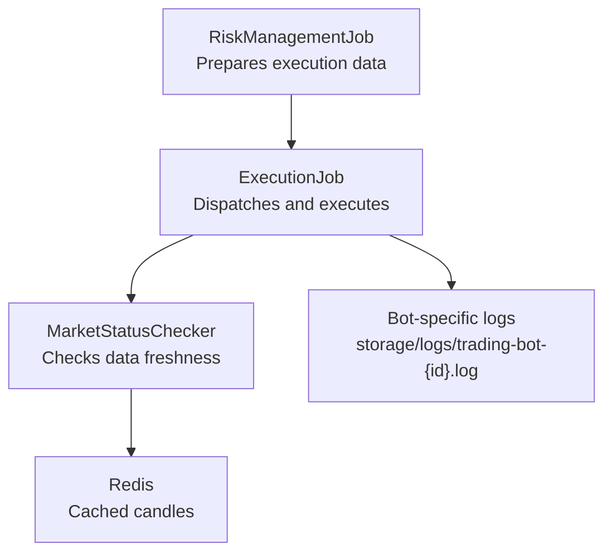
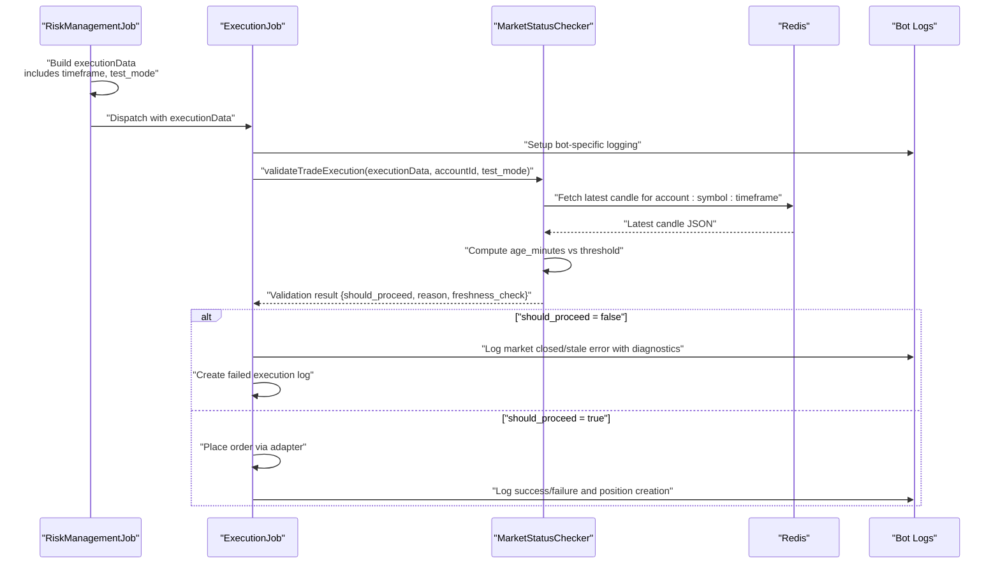
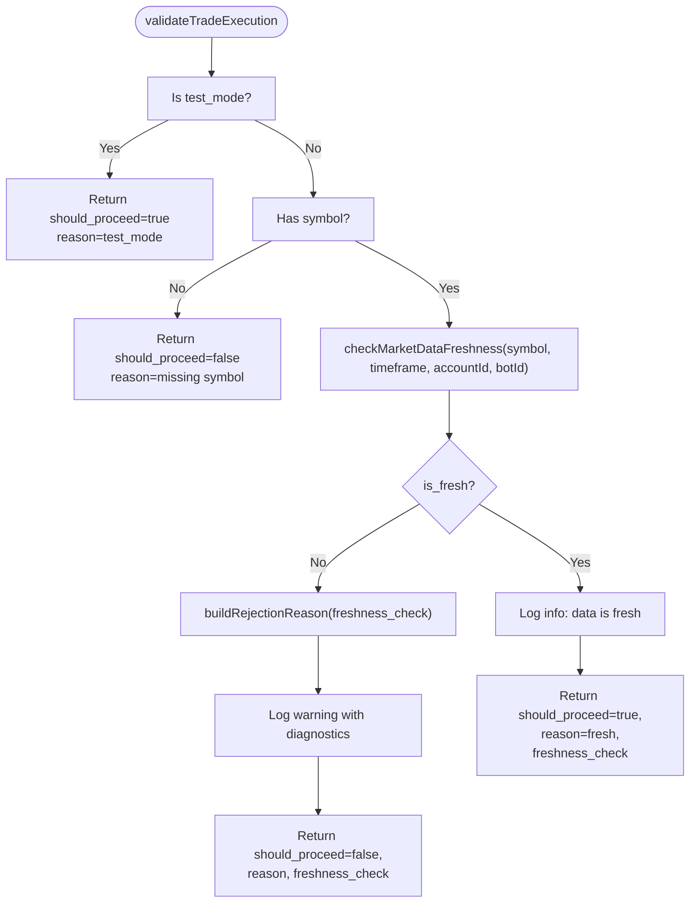
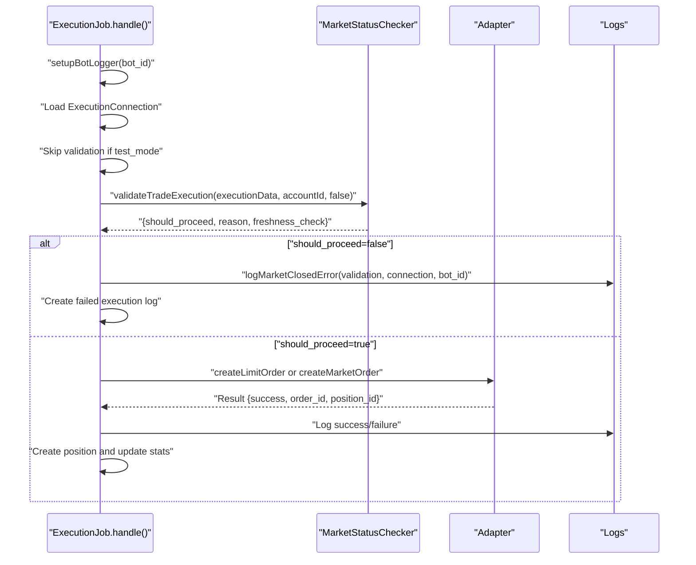
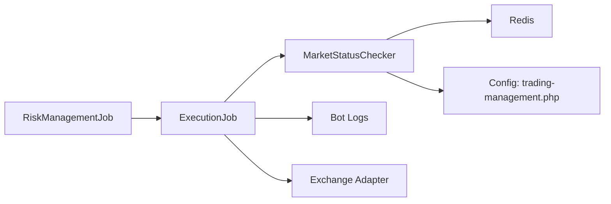

# Market Status Validation

<cite>
**Referenced Files in This Document**
- [MarketStatusChecker.php](file://main/addons/trading-management-addon/Modules/Execution/Services/MarketStatusChecker.php)
- [ExecutionJob.php](file://main/addons/trading-management-addon/Modules/Execution/Jobs/ExecutionJob.php)
- [RiskManagementJob.php](file://main/addons/trading-management-addon/Modules/RiskManagement/Jobs/RiskManagementJob.php)
- [trading-management.php](file://main/addons/trading-management-addon/config/trading-management.php)
- [market-closed-handling.md](file://docs/market-closed-handling.md)
- [TradingPreset.php](file://main/addons/trading-management-addon/Modules/RiskManagement/Models/TradingPreset.php)
</cite>

## Table of Contents
1. [Introduction](#introduction)
2. [Project Structure](#project-structure)
3. [Core Components](#core-components)
4. [Architecture Overview](#architecture-overview)
5. [Detailed Component Analysis](#detailed-component-analysis)
6. [Dependency Analysis](#dependency-analysis)
7. [Performance Considerations](#performance-considerations)
8. [Troubleshooting Guide](#troubleshooting-guide)
9. [Conclusion](#conclusion)

## Introduction
This document explains the Market Status Validation system that prevents trading when market data is stale or markets are closed. It focuses on the proactive validation performed before execution, the logging improvements for diagnosing root causes, and the integration points across the trading pipeline. The solution leverages Redis-cached MetaAPI candles to compute data freshness per symbol and timeframe, and it integrates seamlessly with the execution worker and risk management jobs.

## Project Structure
The market status validation spans three primary areas:
- Risk management job prepares execution data and passes it to the execution worker.
- Execution worker validates market freshness before placing orders and logs actionable diagnostics.
- Market status checker encapsulates the logic to determine whether market data is fresh enough for trading.

**Diagram sources**
- [RiskManagementJob.php](file://main/addons/trading-management-addon/Modules/RiskManagement/Jobs/RiskManagementJob.php#L139-L152)
- [ExecutionJob.php](file://main/addons/trading-management-addon/Modules/Execution/Jobs/ExecutionJob.php#L72-L92)
- [MarketStatusChecker.php](file://main/addons/trading-management-addon/Modules/Execution/Services/MarketStatusChecker.php#L46-L85)
- [trading-management.php](file://main/addons/trading-management-addon/config/trading-management.php#L45-L59)

**Section sources**
- [RiskManagementJob.php](file://main/addons/trading-management-addon/Modules/RiskManagement/Jobs/RiskManagementJob.php#L139-L152)
- [ExecutionJob.php](file://main/addons/trading-management-addon/Modules/Execution/Jobs/ExecutionJob.php#L72-L92)
- [MarketStatusChecker.php](file://main/addons/trading-management-addon/Modules/Execution/Services/MarketStatusChecker.php#L46-L85)
- [trading-management.php](file://main/addons/trading-management-addon/config/trading-management.php#L45-L59)

## Core Components
- MarketStatusChecker: Computes market data freshness by checking the latest candle timestamp in Redis for MetaAPI streams and compares it to timeframe-specific thresholds. It returns a structured result indicating whether trading should proceed and provides detailed diagnostics.
- ExecutionJob: Orchestrates trade execution. It sets up bot-specific logging, validates market status before execution (except in test mode), and records execution logs for tracking.
- RiskManagementJob: Builds execution data including symbol, timeframe, and test_mode flags, then dispatches to the execution worker.

Key behaviors:
- Freshness thresholds vary by timeframe to reflect appropriate tolerance for higher-frequency charts.
- Test mode bypasses validation to allow immediate execution for testing.
- Detailed logs include data age, last candle timestamp, and actionable recommendations.

**Section sources**
- [MarketStatusChecker.php](file://main/addons/trading-management-addon/Modules/Execution/Services/MarketStatusChecker.php#L20-L27)
- [MarketStatusChecker.php](file://main/addons/trading-management-addon/Modules/Execution/Services/MarketStatusChecker.php#L114-L185)
- [ExecutionJob.php](file://main/addons/trading-management-addon/Modules/Execution/Jobs/ExecutionJob.php#L55-L92)
- [RiskManagementJob.php](file://main/addons/trading-management-addon/Modules/RiskManagement/Jobs/RiskManagementJob.php#L139-L152)

## Architecture Overview
The validation pipeline ensures that trading decisions are made only when market data is fresh. The flow below maps the actual code components and their interactions.

**Diagram sources**
- [RiskManagementJob.php](file://main/addons/trading-management-addon/Modules/RiskManagement/Jobs/RiskManagementJob.php#L139-L152)
- [ExecutionJob.php](file://main/addons/trading-management-addon/Modules/Execution/Jobs/ExecutionJob.php#L72-L92)
- [ExecutionJob.php](file://main/addons/trading-management-addon/Modules/Execution/Jobs/ExecutionJob.php#L583-L618)
- [MarketStatusChecker.php](file://main/addons/trading-management-addon/Modules/Execution/Services/MarketStatusChecker.php#L46-L85)
- [MarketStatusChecker.php](file://main/addons/trading-management-addon/Modules/Execution/Services/MarketStatusChecker.php#L114-L185)

## Detailed Component Analysis

### MarketStatusChecker
Responsibilities:
- Determine maximum allowed age per timeframe.
- Fetch the latest candle from Redis using a MetaAPI stream key pattern.
- Compute age in minutes and decide if data is fresh.
- Return structured validation results with reason and status.
- Provide human-readable rejection reasons.

Important behaviors:
- Uses Redis list range to retrieve the most recent candle and parses its timestamp.
- Falls back to “no data” when Redis lookup fails or yields empty results.
- Treats missing symbol as an immediate rejection.
- Skips validation in test mode and returns a pass-through result.

**Diagram sources**
- [MarketStatusChecker.php](file://main/addons/trading-management-addon/Modules/Execution/Services/MarketStatusChecker.php#L114-L185)
- [MarketStatusChecker.php](file://main/addons/trading-management-addon/Modules/Execution/Services/MarketStatusChecker.php#L195-L217)

**Section sources**
- [MarketStatusChecker.php](file://main/addons/trading-management-addon/Modules/Execution/Services/MarketStatusChecker.php#L20-L27)
- [MarketStatusChecker.php](file://main/addons/trading-management-addon/Modules/Execution/Services/MarketStatusChecker.php#L38-L112)
- [MarketStatusChecker.php](file://main/addons/trading-management-addon/Modules/Execution/Services/MarketStatusChecker.php#L114-L185)
- [MarketStatusChecker.php](file://main/addons/trading-management-addon/Modules/Execution/Services/MarketStatusChecker.php#L195-L217)

### ExecutionJob
Responsibilities:
- Set up bot-specific logging to a dedicated log file for easier troubleshooting.
- Validate market status before execution (production only).
- Dispatch execution logs regardless of outcome for tracking.
- Place orders via adapters and record success/failure.
- Detect and log market closed errors distinctly.

Key integration points:
- Reads timeframe and test_mode from execution data.
- Uses MarketStatusChecker to gate execution.
- Creates execution logs for both success and failure scenarios.

**Diagram sources**
- [ExecutionJob.php](file://main/addons/trading-management-addon/Modules/Execution/Jobs/ExecutionJob.php#L55-L92)
- [ExecutionJob.php](file://main/addons/trading-management-addon/Modules/Execution/Jobs/ExecutionJob.php#L583-L618)
- [ExecutionJob.php](file://main/addons/trading-management-addon/Modules/Execution/Jobs/ExecutionJob.php#L172-L264)

**Section sources**
- [ExecutionJob.php](file://main/addons/trading-management-addon/Modules/Execution/Jobs/ExecutionJob.php#L41-L92)
- [ExecutionJob.php](file://main/addons/trading-management-addon/Modules/Execution/Jobs/ExecutionJob.php#L583-L618)
- [ExecutionJob.php](file://main/addons/trading-management-addon/Modules/Execution/Jobs/ExecutionJob.php#L172-L264)

### RiskManagementJob
Responsibilities:
- Prepare execution data for the execution worker, including symbol, timeframe, direction, quantities, and SL/TP.
- Inject test_mode and timeframe into execution data so MarketStatusChecker can apply appropriate validation.
- Dispatch the execution job with validated data.

Impact on market validation:
- Ensures timeframe is present for freshness checks.
- Enables test_mode to bypass validation for testing scenarios.

**Section sources**
- [RiskManagementJob.php](file://main/addons/trading-management-addon/Modules/RiskManagement/Jobs/RiskManagementJob.php#L139-L152)

### Configuration and Environment
- MetaAPI streaming Redis prefix is configurable and used by MarketStatusChecker to construct cache keys.
- Streaming settings include TTL and reconnect parameters that influence data freshness.

**Section sources**
- [trading-management.php](file://main/addons/trading-management-addon/config/trading-management.php#L45-L59)

### Preset-based Trading Hours (Context)
While not part of the core validation logic, presets define trading hours and timezones that can be considered alongside market data freshness. The preset model includes fields for trading hours, timezone, and session profiles.

**Section sources**
- [TradingPreset.php](file://main/addons/trading-management-addon/Modules/RiskManagement/Models/TradingPreset.php#L49-L54)

## Dependency Analysis
The following diagram shows how components depend on each other and external systems.

**Diagram sources**
- [RiskManagementJob.php](file://main/addons/trading-management-addon/Modules/RiskManagement/Jobs/RiskManagementJob.php#L139-L152)
- [ExecutionJob.php](file://main/addons/trading-management-addon/Modules/Execution/Jobs/ExecutionJob.php#L72-L92)
- [MarketStatusChecker.php](file://main/addons/trading-management-addon/Modules/Execution/Services/MarketStatusChecker.php#L46-L85)
- [trading-management.php](file://main/addons/trading-management-addon/config/trading-management.php#L45-L59)

**Section sources**
- [RiskManagementJob.php](file://main/addons/trading-management-addon/Modules/RiskManagement/Jobs/RiskManagementJob.php#L139-L152)
- [ExecutionJob.php](file://main/addons/trading-management-addon/Modules/Execution/Jobs/ExecutionJob.php#L72-L92)
- [MarketStatusChecker.php](file://main/addons/trading-management-addon/Modules/Execution/Services/MarketStatusChecker.php#L46-L85)
- [trading-management.php](file://main/addons/trading-management-addon/config/trading-management.php#L45-L59)

## Performance Considerations
- Redis access is O(1) for fetching the latest candle via list range.
- Timeframe thresholds are constant-time comparisons.
- Logging overhead is minimal compared to broker API calls.
- Test mode avoids validation to reduce latency during development.

[No sources needed since this section provides general guidance]

## Troubleshooting Guide
Common scenarios and resolutions:
- Market closed or data stale:
  - The system logs a detailed error with data age, last candle timestamp, and recommendation to wait for the market to open or check the data stream.
  - Execution logs are created for tracking.
- Market closed error during execution:
  - The system detects market closed errors and logs a contextual message with a recommendation to retry when the market reopens.
- Test mode:
  - Validation is skipped to allow immediate execution for testing. Ensure test_mode is not enabled in production.

Operational tips:
- Verify Redis connectivity and that MetaAPI streaming is active for the account/symbol/timeframe.
- Confirm the Redis prefix configuration matches the streaming settings.
- Review bot-specific logs for detailed diagnostics.

**Section sources**
- [ExecutionJob.php](file://main/addons/trading-management-addon/Modules/Execution/Jobs/ExecutionJob.php#L583-L618)
- [ExecutionJob.php](file://main/addons/trading-management-addon/Modules/Execution/Jobs/ExecutionJob.php#L234-L264)
- [market-closed-handling.md](file://docs/market-closed-handling.md#L164-L208)

## Conclusion
The Market Status Validation system proactively prevents trading when market data is stale or markets are closed. By integrating Redis-cached MetaAPI candles, configurable timeframe thresholds, and bot-specific logging, it delivers actionable diagnostics and robust protection for production trading while preserving flexibility for testing.