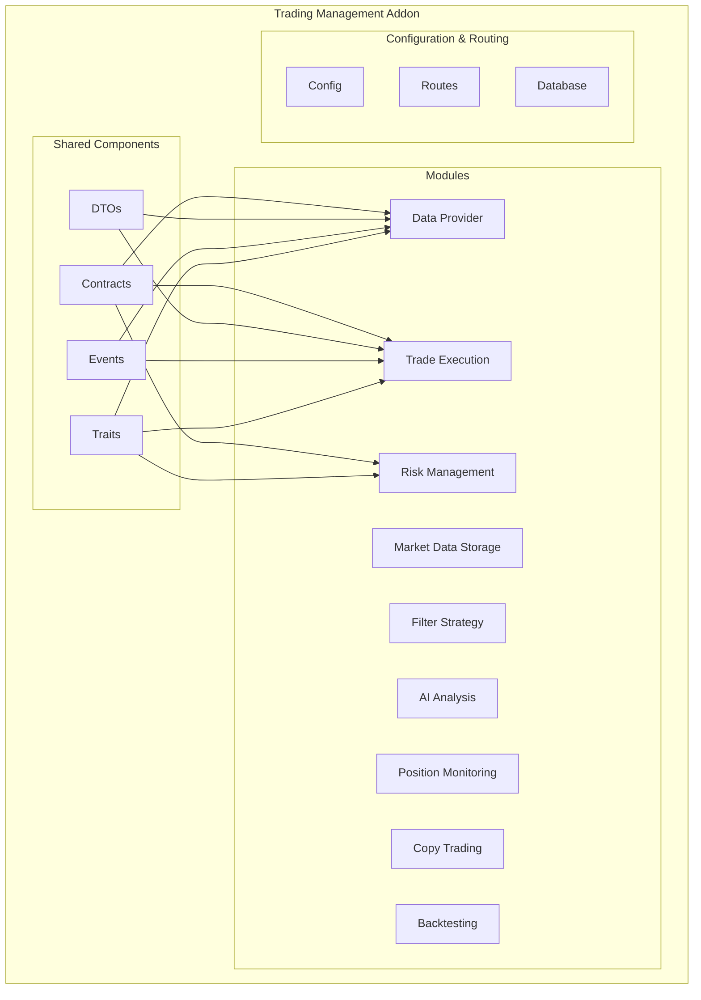
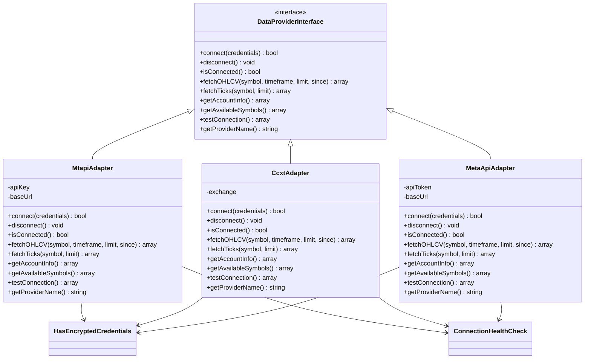
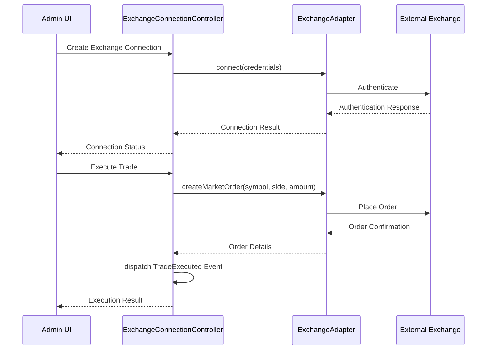
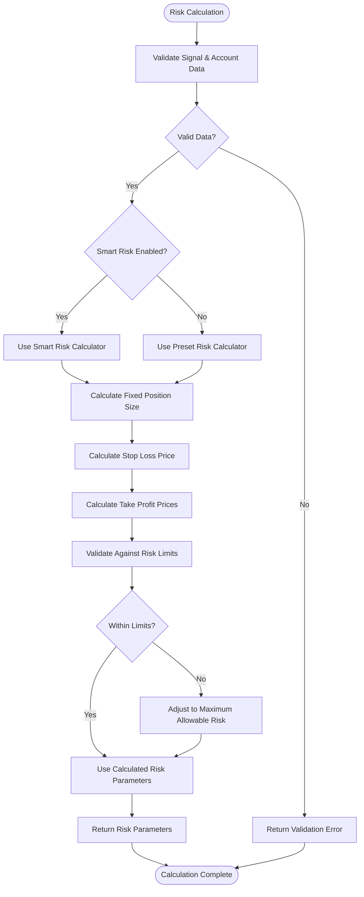
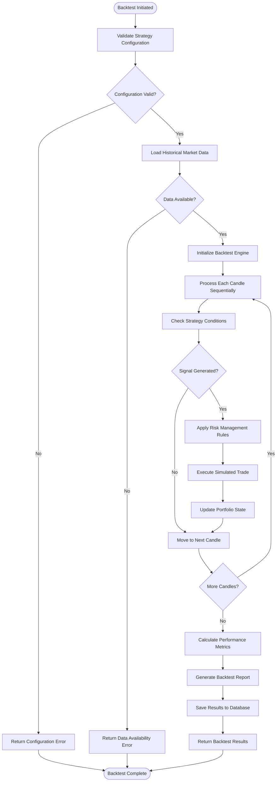
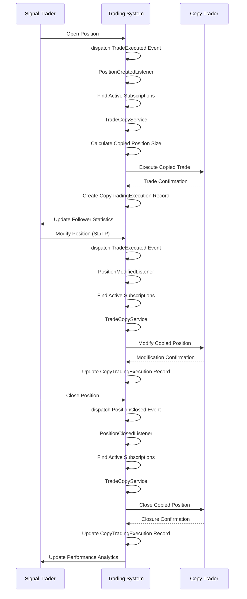
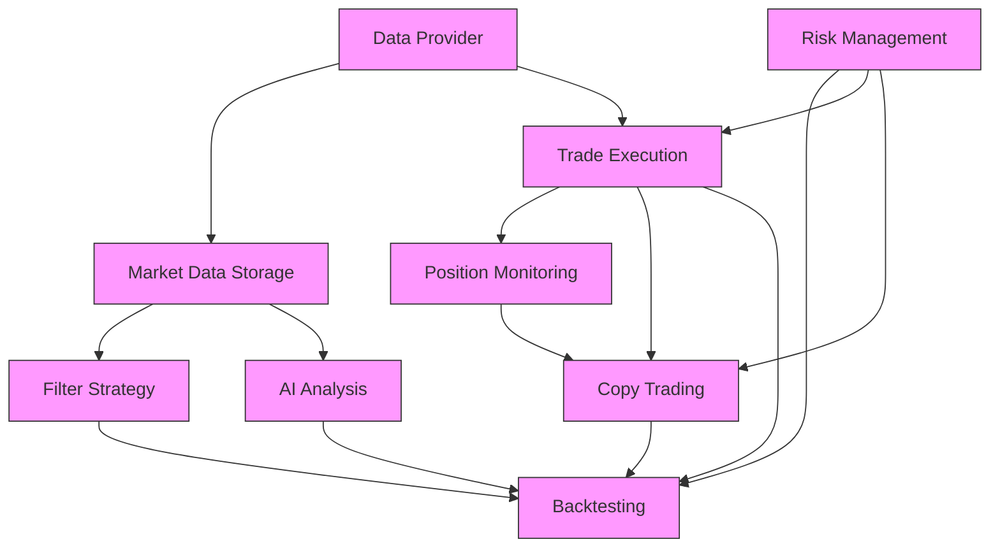

# Trading Management System

<cite>
**Referenced Files in This Document**   
- [addon.json](file://main/addons/trading-management-addon/addon.json)
- [README.md](file://main/addons/trading-management-addon/README.md)
- [trading-management.php](file://main/addons/trading-management-addon/config/trading-management.php)
- [admin.php](file://main/addons/trading-management-addon/routes/admin.php)
- [api.php](file://main/addons/trading-management-addon/routes/api.php)
- [DataProviderInterface.php](file://main/addons/trading-management-addon/Shared/Contracts/DataProviderInterface.php)
- [ExchangeAdapterInterface.php](file://main/addons/trading-management-addon/Shared/Contracts/ExchangeAdapterInterface.php)
- [RiskCalculatorInterface.php](file://main/addons/trading-management-addon/Shared/Contracts/RiskCalculatorInterface.php)
- [MarketDataDTO.php](file://main/addons/trading-management-addon/Shared/DTOs/MarketDataDTO.php)
- [TradeExecutionDTO.php](file://main/addons/trading-management-addon/Shared/DTOs/TradeExecutionDTO.php)
- [DataReceived.php](file://main/addons/trading-management-addon/Shared/Events/DataReceived.php)
- [TradeExecuted.php](file://main/addons/trading-management-addon/Shared/Events/TradeExecuted.php)
- [HasEncryptedCredentials.php](file://main/addons/trading-management-addon/Shared/Traits/HasEncryptedCredentials.php)
- [ConnectionHealthCheck.php](file://main/addons/trading-management-addon/Shared/Traits/ConnectionHealthCheck.php)
- [MtapiAdapter.php](file://main/addons/trading-management-addon/Modules/DataProvider/Adapters/MtapiAdapter.php)
- [CcxtAdapter.php](file://main/addons/trading-management-addon/Modules/DataProvider/Adapters/CcxtAdapter.php)
- [MetaApiAdapter.php](file://main/addons/trading-management-addon/Modules/DataProvider/Adapters/MetaApiAdapter.php)
- [BacktestEngine.php](file://main/addons/trading-management-addon/Modules/Backtesting/Services/BacktestEngine.php)
- [TradeCopyService.php](file://main/addons/trading-management-addon/Modules/CopyTrading/Services/TradeCopyService.php)
</cite>

## Table of Contents
1. [Introduction](#introduction)
2. [Project Structure](#project-structure)
3. [Core Components](#core-components)
4. [Architecture Overview](#architecture-overview)
5. [Detailed Component Analysis](#detailed-component-analysis)
6. [Dependency Analysis](#dependency-analysis)
7. [Performance Considerations](#performance-considerations)
8. [Troubleshooting Guide](#troubleshooting-guide)
9. [Conclusion](#conclusion)

## Introduction

The Trading Management System is a comprehensive solution for automated trading that consolidates multiple trading functionalities into a unified modular architecture. This system enables users to manage the complete trading lifecycle from data acquisition to execution, monitoring, and analysis. The platform supports integration with various data providers and exchanges through standardized interfaces, allowing for flexible configuration and scalability.

The system follows an event-driven architecture with clearly defined modules that communicate through Laravel events, ensuring loose coupling and high testability. Each module can be independently enabled or disabled, providing flexibility in deployment and resource management. The design emphasizes code reusability, with shared contracts, traits, and DTOs that standardize interactions across different components.

**Section sources**
- [addon.json](file://main/addons/trading-management-addon/addon.json#L1-L203)
- [README.md](file://main/addons/trading-management-addon/README.md#L1-L281)

## Project Structure

The Trading Management System is organized as a modular addon within the main application, following a clear directory structure that separates concerns and promotes maintainability. The system is divided into distinct modules, each responsible for a specific aspect of trading functionality.

The core structure includes:
- **Modules**: Individual components for each trading function (Data Provider, Market Data Storage, Filter Strategy, AI Analysis, Risk Management, Trade Execution, Position Monitoring, Copy Trading, Backtesting)
- **Shared**: Common components including contracts, DTOs, events, and traits used across multiple modules
- **Config**: Configuration files for system settings
- **Routes**: API and admin routes for module access
- **Database**: Migrations for data models

Each module follows a consistent internal structure with controllers, models, services, jobs, and observers, promoting code organization and discoverability. The system uses Laravel's service container and event system to manage dependencies and inter-module communication.



**Diagram sources**
- [addon.json](file://main/addons/trading-management-addon/addon.json#L18-L202)
- [README.md](file://main/addons/trading-management-addon/README.md#L97-L112)

**Section sources**
- [addon.json](file://main/addons/trading-management-addon/addon.json#L1-L203)
- [README.md](file://main/addons/trading-management-addon/README.md#L1-L281)

## Core Components

The Trading Management System comprises nine core modules that work together to provide a complete automated trading solution. Each module serves a specific purpose in the trading pipeline and can be independently configured and managed.

The system's modular design allows for flexible deployment scenarios, where specific modules can be enabled or disabled based on user requirements. The modules are interconnected through a well-defined event system that ensures loose coupling while maintaining the integrity of the trading workflow.

The core components include:
- **Data Provider**: Manages connections to market data sources
- **Market Data Storage**: Handles centralized storage and caching of market data
- **Filter Strategy**: Applies technical indicator-based filtering to trading signals
- **AI Analysis**: Uses AI models to confirm market conditions
- **Risk Management**: Calculates position sizing and risk parameters
- **Trade Execution**: Executes trades on exchanges and brokers
- **Position Monitoring**: Tracks open positions and manages SL/TP
- **Copy Trading**: Enables social trading by copying trades from other users
- **Backtesting**: Tests strategies against historical data

These components work together in a pipeline that starts with data acquisition and ends with performance analysis, providing a comprehensive solution for automated trading.

**Section sources**
- [addon.json](file://main/addons/trading-management-addon/addon.json#L18-L202)
- [README.md](file://main/addons/trading-management-addon/README.md#L14-L22)

## Architecture Overview

The Trading Management System follows a modular, event-driven architecture that enables flexible configuration and scalable deployment. The system is designed around a clear data pipeline that processes market information from acquisition to execution and monitoring.

The architecture is built on several key principles:
- **Modularity**: Each component is self-contained and can be independently enabled/disabled
- **Event-Driven**: Modules communicate through Laravel events rather than direct dependencies
- **Loose Coupling**: Shared interfaces ensure components can be swapped without affecting the overall system
- **Testability**: Contracts and dependency injection enable easy mocking for testing
- **Scalability**: The design allows for easy addition of new modules and features

The system processes trading workflows through a series of stages, with each module handling a specific aspect of the trading process. Data flows through the system in a pipeline fashion, with events triggering the next stage of processing.

```mermaid
graph TB
subgraph "Data Pipeline"
DF[Data Fetching\n(mtapi.io, CCXT)]
--> DS[Market Data Storage\n(OHLCV + cache)]
--> TF[Technical Filtering\n(EMA, RSI)]
--> AI[AI Analysis\n(OpenAI/Gemini)]
--> RC[Risk Calculation\n(Preset OR Smart Risk)]
--> TE[Trade Execution\n(CCXT/mtapi.io)]
--> PM[Position Monitoring\n(SL/TP)]
--> AN[Analytics\n(Win rate, profit factor)]
end
subgraph "Event Flow"
E1[DataReceived Event]
E2[DataStored Event]
E3[DataFiltered Event]
E4[SignalAnalyzed Event]
E5[RiskCalculated Event]
E6[TradeExecuted Event]
E7[PositionClosed Event]
end
DF --> E1
E1 --> DS
DS --> E2
E2 --> TF
TF --> E3
E3 --> AI
AI --> E4
E4 --> RC
RC --> E5
E5 --> TE
TE --> E6
E6 --> PM
PM --> E7
E7 --> AN
```

**Diagram sources**
- [README.md](file://main/addons/trading-management-addon/README.md#L117-L133)

**Section sources**
- [README.md](file://main/addons/trading-management-addon/README.md#L218-L235)
- [addon.json](file://main/addons/trading-management-addon/addon.json#L18-L202)

## Detailed Component Analysis

### Data Provider Module

The Data Provider module manages connections to various market data sources, including mtapi.io and CCXT exchanges. It provides a standardized interface for data acquisition through the DataProviderInterface contract, ensuring consistent behavior across different providers.

The module supports multiple adapter types, including MtapiAdapter, CcxtAdapter, and MetaApiAdapter, each implementing the common interface while handling provider-specific details. Data is fetched at configurable intervals and dispatched through the DataReceived event for further processing by other modules.

The module includes health checking and credential encryption capabilities through shared traits, ensuring secure and reliable data connections. It also provides testing endpoints to validate connections and measure latency before deployment.

#### For Object-Oriented Components:


**Diagram sources**
- [DataProviderInterface.php](file://main/addons/trading-management-addon/Shared/Contracts/DataProviderInterface.php#L11-L88)
- [MtapiAdapter.php](file://main/addons/trading-management-addon/Modules/DataProvider/Adapters/MtapiAdapter.php)
- [CcxtAdapter.php](file://main/addons/trading-management-addon/Modules/DataProvider/Adapters/CcxtAdapter.php)
- [MetaApiAdapter.php](file://main/addons/trading-management-addon/Modules/DataProvider/Adapters/MetaApiAdapter.php)
- [HasEncryptedCredentials.php](file://main/addons/trading-management-addon/Shared/Traits/HasEncryptedCredentials.php)
- [ConnectionHealthCheck.php](file://main/addons/trading-management-addon/Shared/Traits/ConnectionHealthCheck.php)

**Section sources**
- [DataProviderInterface.php](file://main/addons/trading-management-addon/Shared/Contracts/DataProviderInterface.php#L1-L89)
- [MtapiAdapter.php](file://main/addons/trading-management-addon/Modules/DataProvider/Adapters/MtapiAdapter.php)
- [CcxtAdapter.php](file://main/addons/trading-management-addon/Modules/DataProvider/Adapters/CcxtAdapter.php)
- [MetaApiAdapter.php](file://main/addons/trading-management-addon/Modules/DataProvider/Adapters/MetaApiAdapter.php)

### Trade Execution Module

The Trade Execution module handles the execution of trades on exchanges and brokers through standardized interfaces. It implements the ExchangeAdapterInterface contract, providing a consistent API for trade operations regardless of the underlying exchange.

The module supports various order types including market and limit orders, as well as position management operations like closing positions and modifying stop loss/take profit levels. It uses the TradeExecutionDTO to standardize trade data across different exchanges and ensure consistent processing.

Execution connections are managed through the admin interface, with options to test connections, activate/deactivate connections, and monitor connection status. The module dispatches the TradeExecuted event upon successful trade execution, which triggers downstream processes like position monitoring and copy trading.

#### For API/Service Components:


**Diagram sources**
- [ExchangeAdapterInterface.php](file://main/addons/trading-management-addon/Shared/Contracts/ExchangeAdapterInterface.php#L11-L130)
- [TradeExecutionDTO.php](file://main/addons/trading-management-addon/Shared/DTOs/TradeExecutionDTO.php#L12-L80)
- [admin.php](file://main/addons/trading-management-addon/routes/admin.php#L28-L47)

**Section sources**
- [ExchangeAdapterInterface.php](file://main/addons/trading-management-addon/Shared/Contracts/ExchangeAdapterInterface.php#L1-L131)
- [TradeExecutionDTO.php](file://main/addons/trading-management-addon/Shared/DTOs/TradeExecutionDTO.php#L1-L81)

### Risk Management Module

The Risk Management module provides both manual risk presets and AI-powered adaptive risk calculation through the RiskCalculatorInterface. This dual approach allows users to choose between predefined risk settings or dynamic risk adjustment based on market conditions.

The module calculates position sizing, stop loss, and take profit levels based on user-defined parameters and account information. It validates trades against risk criteria before execution, preventing trades that exceed acceptable risk thresholds.

Risk settings can be configured globally or on a per-connection basis, with options to set default and maximum risk percentages, minimum and maximum lot sizes, and other risk parameters. The Smart Risk feature uses AI to adjust risk parameters dynamically based on market volatility and other factors.

#### For Complex Logic Components:


**Diagram sources**
- [RiskCalculatorInterface.php](file://main/addons/trading-management-addon/Shared/Contracts/RiskCalculatorInterface.php#L13-L62)
- [trading-management.php](file://main/addons/trading-management-addon/config/trading-management.php#L66-L71)

**Section sources**
- [RiskCalculatorInterface.php](file://main/addons/trading-management-addon/Shared/Contracts/RiskCalculatorInterface.php#L1-L63)
- [trading-management.php](file://main/addons/trading-management-addon/config/trading-management.php#L1-L104)

### Backtesting Module

The Backtesting module enables users to test trading strategies against historical market data before deploying them in live trading. It provides a comprehensive environment for strategy evaluation, including performance metrics calculation and result visualization.

The module supports backtesting across multiple timeframes and instruments, with options to include transaction costs and slippage in the simulation. It integrates with other modules like Filter Strategy, AI Analysis, and Risk Management to provide realistic testing conditions that mirror the live trading environment.

Backtest results include key performance indicators such as win rate, profit factor, maximum drawdown, and Sharpe ratio, helping users evaluate strategy effectiveness. The module also supports optimization of strategy parameters through parameter scanning.

#### For Complex Logic Components:


**Diagram sources**
- [BacktestEngine.php](file://main/addons/trading-management-addon/Modules/Backtesting/Services/BacktestEngine.php)
- [admin.php](file://main/addons/trading-management-addon/routes/admin.php#L329-L376)

**Section sources**
- [BacktestEngine.php](file://main/addons/trading-management-addon/Modules/Backtesting/Services/BacktestEngine.php)
- [Backtest.php](file://main/addons/trading-management-addon/Modules/Backtesting/Models/Backtest.php)
- [BacktestResult.php](file://main/addons/trading-management-addon/Modules/Backtesting/Models/BacktestResult.php)

### Copy Trading Module

The Copy Trading module enables social trading by allowing users to automatically copy trades from other traders. This feature creates a network effect where successful traders can attract followers, and followers can benefit from proven trading strategies.

The module monitors the positions of designated traders and automatically executes corresponding trades for followers, adjusting for account size and risk preferences. It supports various copy modes, including fixed lot size, percentage of equity, and risk-based copying.

The system includes safeguards to prevent excessive risk exposure, with options to set maximum risk limits and position size caps. It also provides analytics to track copying performance and follower statistics.

#### For API/Service Components:


**Diagram sources**
- [TradeCopyService.php](file://main/addons/trading-management-addon/Modules/CopyTrading/Services/TradeCopyService.php)
- [PositionCreatedListener.php](file://main/addons/trading-management-addon/Modules/CopyTrading/Listeners/PositionCreatedListener.php)
- [PositionClosedListener.php](file://main/addons/trading-management-addon/Modules/CopyTrading/Listeners/PositionClosedListener.php)
- [CopyTradingSubscription.php](file://main/addons/trading-management-addon/Modules/CopyTrading/Models/CopyTradingSubscription.php)
- [CopyTradingExecution.php](file://main/addons/trading-management-addon/Modules/CopyTrading/Models/CopyTradingExecution.php)

**Section sources**
- [TradeCopyService.php](file://main/addons/trading-management-addon/Modules/CopyTrading/Services/TradeCopyService.php)
- [CopyTradingController.php](file://main/addons/trading-management-addon/Modules/CopyTrading/Controllers/Backend/CopyTradingController.php)
- [CopyTradeJob.php](file://main/addons/trading-management-addon/Modules/CopyTrading/Jobs/CopyTradeJob.php)

## Dependency Analysis

The Trading Management System modules have a well-defined dependency structure that ensures proper execution order and data flow. Dependencies are explicitly declared in the addon.json configuration file, allowing the system to validate module relationships and prevent configuration errors.

The dependency graph shows a clear progression from data acquisition to execution and monitoring, with each module depending on the outputs of previous stages. This linear dependency chain ensures that data is properly processed and validated before reaching the execution stage.

Some modules have more complex dependency patterns, particularly those that integrate with multiple upstream modules like Backtesting and Copy Trading. These modules serve as integration points that combine functionality from several sources to provide enhanced features.



**Diagram sources**
- [addon.json](file://main/addons/trading-management-addon/addon.json#L18-L202)

**Section sources**
- [addon.json](file://main/addons/trading-management-addon/addon.json#L1-L203)
- [README.md](file://main/addons/trading-management-addon/README.md#L116-L133)

## Performance Considerations

The Trading Management System incorporates several performance optimization strategies to ensure efficient operation, particularly in high-frequency trading scenarios. The system uses caching extensively to reduce database load and improve response times for frequently accessed data.

Market data is cached with a configurable TTL (Time To Live) to balance freshness with performance. The system also implements data retention policies to prevent unbounded growth of historical data, with configurable retention periods for different data types.

Background jobs are used for resource-intensive operations like data fetching, backtesting, and analytics calculation, preventing these tasks from blocking the main application thread. The system leverages Laravel's queue system to process jobs asynchronously, with support for multiple queue workers to handle high loads.

For real-time data streaming, the system uses Server-Sent Events (SSE) to push updates to clients without requiring constant polling. This reduces network overhead and ensures timely delivery of market data and position updates.

The database schema includes performance optimization indexes on frequently queried fields, improving query efficiency for critical operations. The system also implements query optimization techniques like eager loading to minimize the number of database queries.

**Section sources**
- [trading-management.php](file://main/addons/trading-management-addon/config/trading-management.php#L23-L27)
- [README.md](file://main/addons/trading-management-addon/README.md#L230-L234)

## Troubleshooting Guide

When encountering issues with the Trading Management System, follow this systematic approach to identify and resolve problems:

1. **Connection Issues**: Verify that API credentials are correctly configured and encrypted. Test connections using the built-in testing endpoints to identify authentication or network problems.

2. **Data Pipeline Problems**: Check the event system to ensure that events like DataReceived and TradeExecuted are being dispatched and handled properly. Verify that event listeners are registered and functioning.

3. **Execution Failures**: Review the trade execution logs and check for validation errors from the risk management system. Ensure that account balances and position limits are not being exceeded.

4. **Performance Bottlenecks**: Monitor queue workers and job processing times. Check cache hit rates and database query performance to identify optimization opportunities.

5. **Configuration Errors**: Validate module dependencies in addon.json to ensure that required modules are enabled. Check configuration files for correct settings and environment variables.

The system provides comprehensive logging and monitoring capabilities through the admin interface, including real-time connection status, job processing statistics, and error logs. These tools can help diagnose issues and track system performance over time.

**Section sources**
- [README.md](file://main/addons/trading-management-addon/README.md#L264-L270)
- [admin.php](file://main/addons/trading-management-addon/routes/admin.php#L406-L407)

## Conclusion

The Trading Management System provides a comprehensive, modular solution for automated trading that integrates multiple functionalities into a cohesive platform. By consolidating previously fragmented components into a unified architecture, the system offers improved maintainability, scalability, and user experience.

The event-driven design with clearly defined interfaces enables flexible configuration and easy extension, allowing new modules to be added without disrupting existing functionality. The system's modular nature supports both simple deployment scenarios with basic features and complex setups with advanced capabilities like AI analysis and copy trading.

Key strengths of the system include its standardized data pipeline, comprehensive risk management, and robust integration with external data sources and exchanges. The architecture promotes code reuse and testability while providing a rich feature set for both novice and experienced traders.

As the system continues to evolve, future enhancements could include additional AI models for market analysis, more sophisticated risk management algorithms, and expanded support for alternative data sources and trading venues.