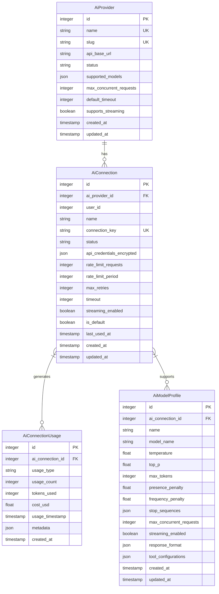

# AI Integration Schema

<cite>
**Referenced Files in This Document**   
- [2025_12_03_100000_create_ai_providers_table.php](file://main/addons/ai-connection-addon/database/migrations/2025_12_03_100000_create_ai_providers_table.php)
- [2025_12_03_100001_create_ai_connections_table.php](file://main/addons/ai-connection-addon/database/migrations/2025_12_03_100001_create_ai_connections_table.php)
- [2025_12_03_100002_create_ai_connection_usage_table.php](file://main/addons/ai-connection-addon/database/migrations/2025_12_03_100002_create_ai_connection_usage_table.php)
- [2025_12_03_100003_add_default_connection_foreign_key.php](file://main/addons/ai-connection-addon/database/migrations/2025_12_03_100003_add_default_connection_foreign_key.php)
- [AIProviderSeeder.php](file://main/database/seeders/AIProviderSeeder.php)
- [AiConnectionSeeder.php](file://main/database/seeders/AiConnectionSeeder.php)
- [AiModelProfileSeeder.php](file://main/database/seeders/AiModelProfileSeeder.php)
- [AiUsageAnalyticsSeeder.php](file://main/database/seeders/AiUsageAnalyticsSeeder.php)
</cite>

## Table of Contents
1. [Introduction](#introduction)
2. [Data Model Overview](#data-model-overview)
3. [Entity Relationships](#entity-relationships)
4. [Field Definitions](#field-definitions)
5. [Schema Diagram](#schema-diagram)
6. [Sample Data](#sample-data)
7. [Data Access Patterns](#data-access-patterns)
8. [Data Lifecycle Management](#data-lifecycle-management)
9. [Security Considerations](#security-considerations)
10. [Conclusion](#conclusion)

## Introduction
This document provides comprehensive documentation for the AI Integration schema, detailing the data model for AI service integration within the trading platform. The schema enables secure and efficient management of AI provider connections, usage tracking, and model configurations. It supports multiple AI providers with configurable connection parameters, usage monitoring, and model-specific settings for trading applications.

**Section sources**
- [2025_12_03_100000_create_ai_providers_table.php](file://main/addons/ai-connection-addon/database/migrations/2025_12_03_100000_create_ai_providers_table.php)
- [2025_12_03_100001_create_ai_connections_table.php](file://main/addons/ai-connection-addon/database/migrations/2025_12_03_100001_create_ai_connections_table.php)

## Data Model Overview
The AI Integration schema consists of four core entities: AiProvider, AiConnection, AiConnectionUsage, and AiModelProfile. These entities work together to manage AI service integration, configuration, and usage monitoring. The schema supports multiple AI providers with different authentication methods, rate limiting parameters, and model configurations.

The AiProvider entity stores information about available AI service providers, including their API endpoints, supported models, and service capabilities. AiConnection represents user-configured connections to AI providers with encrypted credentials and connection parameters. AiConnectionUsage tracks API usage metrics for monitoring, billing, and rate limiting purposes. AiModelProfile stores model-specific configurations and optimization parameters for different trading strategies.

**Section sources**
- [2025_12_03_100000_create_ai_providers_table.php](file://main/addons/ai-connection-addon/database/migrations/2025_12_03_100000_create_ai_providers_table.php)
- [2025_12_03_100001_create_ai_connections_table.php](file://main/addons/ai-connection-addon/database/migrations/2025_12_03_100001_create_ai_connections_table.php)
- [2025_12_03_100002_create_ai_connection_usage_table.php](file://main/addons/ai-connection-addon/database/migrations/2025_12_03_100002_create_ai_connection_usage_table.php)
- [2025_12_03_100003_add_default_connection_foreign_key.php](file://main/addons/ai-connection-addon/database/migrations/2025_12_03_100003_add_default_connection_foreign_key.php)

## Entity Relationships
The AI Integration schema features a hierarchical relationship structure where AiProvider serves as the foundation for AiConnection, which in turn supports AiConnectionUsage and AiModelProfile. Each AiProvider can have multiple AiConnections, allowing users to configure different connection profiles for the same provider with varying credentials and parameters.

AiConnection establishes a one-to-many relationship with AiConnectionUsage, enabling detailed tracking of API usage over time. This relationship supports usage-based billing, rate limiting enforcement, and performance monitoring. AiConnection also maintains a one-to-many relationship with AiModelProfile, allowing different model configurations to be associated with the same connection for various trading strategies.

The foreign key constraints ensure referential integrity, with AiConnection referencing AiProvider through ai_provider_id, AiConnectionUsage linking to AiConnection via ai_connection_id, and AiModelProfile associating with AiConnection through the same foreign key.



**Diagram sources**
- [2025_12_03_100000_create_ai_providers_table.php](file://main/addons/ai-connection-addon/database/migrations/2025_12_03_100000_create_ai_providers_table.php)
- [2025_12_03_100001_create_ai_connections_table.php](file://main/addons/ai-connection-addon/database/migrations/2025_12_03_100001_create_ai_connections_table.php)
- [2025_12_03_100002_create_ai_connection_usage_table.php](file://main/addons/ai-connection-addon/database/migrations/2025_12_03_100002_create_ai_connection_usage_table.php)
- [2025_12_03_100003_add_default_connection_foreign_key.php](file://main/addons/ai-connection-addon/database/migrations/2025_12_03_100003_add_default_connection_foreign_key.php)

**Section sources**
- [2025_12_03_100000_create_ai_providers_table.php](file://main/addons/ai-connection-addon/database/migrations/2025_12_03_100000_create_ai_providers_table.php)
- [2025_12_03_100001_create_ai_connections_table.php](file://main/addons/ai-connection-addon/database/migrations/2025_12_03_100001_create_ai_connections_table.php)
- [2025_12_03_100002_create_ai_connection_usage_table.php](file://main/addons/ai-connection-addon/database/migrations/2025_12_03_100002_create_ai_connection_usage_table.php)

## Field Definitions
### AiProvider Fields
- **id**: Primary key, auto-incrementing integer identifier
- **name**: Unique provider name (e.g., "OpenAI", "Anthropic")
- **slug**: URL-friendly identifier for API routing
- **api_base_url**: Base endpoint for API requests
- **status**: Provider status (active, maintenance, deprecated)
- **supported_models**: JSON array of supported model identifiers
- **max_concurrent_requests**: Maximum concurrent connections allowed
- **default_timeout**: Default API timeout in seconds
- **supports_streaming**: Boolean indicating streaming API support

### AiConnection Fields
- **id**: Primary key, auto-incrementing integer identifier
- **ai_provider_id**: Foreign key referencing AiProvider
- **user_id**: Owner of the connection configuration
- **name**: User-defined connection name
- **connection_key**: Unique identifier for API routing
- **status**: Connection status (active, inactive, suspended)
- **api_credentials_encrypted**: Encrypted JSON storage for API keys and secrets
- **rate_limit_requests**: Number of requests allowed per period
- **rate_limit_period**: Time period in seconds for rate limiting
- **max_retries**: Maximum retry attempts on failure
- **timeout**: Connection timeout in seconds
- **streaming_enabled**: Whether streaming is enabled for this connection
- **is_default**: Boolean indicating default connection for user
- **last_used_at**: Timestamp of last API usage

### AiConnectionUsage Fields
- **id**: Primary key, auto-incrementing integer identifier
- **ai_connection_id**: Foreign key referencing AiConnection
- **usage_type**: Type of usage (request, token, compute)
- **usage_count**: Number of usage units consumed
- **tokens_used**: Number of tokens processed (for LLMs)
- **cost_usd**: Estimated cost in USD
- **usage_timestamp**: When the usage occurred
- **metadata**: JSON storage for additional context

### AiModelProfile Fields
- **id**: Primary key, auto-incrementing integer identifier
- **ai_connection_id**: Foreign key referencing AiConnection
- **name**: User-defined profile name
- **model_name**: Specific model identifier
- **temperature**: Sampling temperature (0.0-2.0)
- **top_p**: Nucleus sampling parameter
- **max_tokens**: Maximum response tokens
- **presence_penalty**: Presence penalty (frequency-based)
- **frequency_penalty**: Frequency penalty
- **stop_sequences**: JSON array of stop sequences
- **max_concurrent_requests**: Per-profile concurrency limit
- **streaming_enabled**: Profile-specific streaming setting
- **response_format**: Expected response format
- **tool_configurations**: JSON configuration for function calling

**Section sources**
- [2025_12_03_100000_create_ai_providers_table.php](file://main/addons/ai-connection-addon/database/migrations/2025_12_03_100000_create_ai_providers_table.php)
- [2025_12_03_100001_create_ai_connections_table.php](file://main/addons/ai-connection-addon/database/migrations/2025_12_03_100001_create_ai_connections_table.php)
- [2025_12_03_100002_create_ai_connection_usage_table.php](file://main/addons/ai-connection-addon/database/migrations/2025_12_03_100002_create_ai_connection_usage_table.php)
- [2025_12_03_100003_add_default_connection_foreign_key.php](file://main/addons/ai-connection-addon/database/migrations/2025_12_03_100003_add_default_connection_foreign_key.php)

## Schema Diagram
The AI Integration schema follows a star topology with AiConnection at the center, connecting to AiProvider, AiConnectionUsage, and AiModelProfile. This design enables flexible configuration while maintaining data integrity and efficient querying.


**Diagram sources**
- [2025_12_03_100000_create_ai_providers_table.php](file://main/addons/ai-connection-addon/database/migrations/2025_12_03_100000_create_ai_providers_table.php)
- [2025_12_03_100001_create_ai_connections_table.php](file://main/addons/ai-connection-addon/database/migrations/2025_12_03_100001_create_ai_connections_table.php)
- [2025_12_03_100002_create_ai_connection_usage_table.php](file://main/addons/ai-connection-addon/database/migrations/2025_12_03_100002_create_ai_connection_usage_table.php)
- [2025_12_03_100003_add_default_connection_foreign_key.php](file://main/addons/ai-connection-addon/database/migrations/2025_12_03_100003_add_default_connection_foreign_key.php)

## Sample Data
### AiProvider Sample
```json
{
  "id": 1,
  "name": "OpenAI",
  "slug": "openai",
  "api_base_url": "https://api.openai.com/v1",
  "status": "active",
  "supported_models": ["gpt-4-turbo", "gpt-3.5-turbo", "text-embedding-ada-002"],
  "max_concurrent_requests": 100,
  "default_timeout": 30,
  "supports_streaming": true
}
```

### AiConnection Sample
```json
{
  "id": 101,
  "ai_provider_id": 1,
  "user_id": 12345,
  "name": "Primary OpenAI Connection",
  "connection_key": "conn_openai_prod_001",
  "status": "active",
  "api_credentials_encrypted": "ENCRYPTED_DATA_HERE",
  "rate_limit_requests": 1000,
  "rate_limit_period": 60,
  "max_retries": 3,
  "timeout": 45,
  "streaming_enabled": true,
  "is_default": true
}
```

### AiConnectionUsage Sample
```json
{
  "id": 1001,
  "ai_connection_id": 101,
  "usage_type": "token",
  "usage_count": 1,
  "tokens_used": 156,
  "cost_usd": 0.00312,
  "usage_timestamp": "2025-12-03 10:30:45",
  "metadata": {
    "model": "gpt-4-turbo",
    "request_type": "chat_completion",
    "prompt_tokens": 100,
    "completion_tokens": 56
  }
}
```

### AiModelProfile Sample
```json
{
  "id": 201,
  "ai_connection_id": 101,
  "name": "Trading Analysis Profile",
  "model_name": "gpt-4-turbo",
  "temperature": 0.3,
  "top_p": 0.9,
  "max_tokens": 1000,
  "presence_penalty": 0.2,
  "frequency_penalty": 0.2,
  "stop_sequences": ["###"],
  "max_concurrent_requests": 10,
  "streaming_enabled": true,
  "response_format": {
    "type": "json_object"
  },
  "tool_configurations": {
    "tools": [
      {
        "type": "function",
        "function": {
          "name": "analyze_market_trend",
          "description": "Analyze market trend from price data"
        }
      }
    ]
  }
}
```

**Section sources**
- [AIProviderSeeder.php](file://main/database/seeders/AIProviderSeeder.php)
- [AiConnectionSeeder.php](file://main/database/seeders/AiConnectionSeeder.php)
- [AiModelProfileSeeder.php](file://main/database/seeders/AiModelProfileSeeder.php)
- [AiUsageAnalyticsSeeder.php](file://main/database/seeders/AiUsageAnalyticsSeeder.php)

## Data Access Patterns
### Connection Pooling
The schema supports connection pooling through the rate_limit_requests and rate_limit_period fields, which define the maximum number of requests allowed within a specified time window. Applications can implement token bucket or leaky bucket algorithms to manage connection pooling and prevent rate limit violations.

### Usage Monitoring
Usage monitoring is facilitated by the AiConnectionUsage table, which records each API interaction with timestamp, usage type, and cost metrics. Aggregation queries can be performed to generate usage reports by connection, provider, or time period. The usage_timestamp index enables efficient time-based queries for monitoring and billing purposes.

### Failover Management
Failover management is supported through the status field in AiConnection, which can be set to "active", "inactive", or "suspended". Applications can implement failover logic by attempting connections to alternative AiConnection records when the primary connection fails. The last_used_at timestamp helps identify stale connections that may need to be rotated.

**Section sources**
- [2025_12_03_100001_create_ai_connections_table.php](file://main/addons/ai-connection-addon/database/migrations/2025_12_03_100001_create_ai_connections_table.php)
- [2025_12_03_100002_create_ai_connection_usage_table.php](file://main/addons/ai-connection-addon/database/migrations/2025_12_03_100002_create_ai_connection_usage_table.php)

## Data Lifecycle Management
### Credential Rotation
Credential rotation is supported through the api_credentials_encrypted field, which stores API keys and secrets in encrypted format. The system can implement automated credential rotation by updating this field with new credentials and maintaining versioning information in the metadata. The is_default flag allows for seamless transition between old and new credentials.

### Usage Data Aggregation
Usage data aggregation occurs through scheduled jobs that process raw AiConnectionUsage records and generate summarized metrics. Daily, weekly, and monthly aggregates are created for billing, reporting, and analytics purposes. Raw usage data is retained for 90 days before archival to balance storage costs with audit requirements.

### Model Versioning
Model versioning is managed through the AiModelProfile entity, which allows multiple configurations for the same underlying model. When AI providers release new model versions, administrators can create new AiProvider entries or update the supported_models JSON array. Existing AiModelProfile records continue to use the previous version until explicitly updated.

**Section sources**
- [2025_12_03_100001_create_ai_connections_table.php](file://main/addons/ai-connection-addon/database/migrations/2025_12_03_100001_create_ai_connections_table.php)
- [2025_12_03_100002_create_ai_connection_usage_table.php](file://main/addons/ai-connection-addon/database/migrations/2025_12_03_100002_create_ai_connection_usage_table.php)
- [2025_12_03_100003_add_default_connection_foreign_key.php](file://main/addons/ai-connection-addon/database/migrations/2025_12_03_100003_add_default_connection_foreign_key.php)

## Security Considerations
### Encrypted Credential Storage
API credentials are stored in the api_credentials_encrypted field using AES-256 encryption with keys managed by the application's key management system. The encryption process occurs at the application layer before data persistence, ensuring credentials are never stored in plaintext. Regular key rotation is performed to maintain cryptographic security.

### API Key Rotation
The schema supports API key rotation through the ability to update AiConnection records with new credentials. Automated rotation policies can be implemented to refresh keys at regular intervals. The system maintains audit logs of credential changes for security monitoring and compliance purposes.

### Usage-Based Access Control
Usage-based access control is enforced through the rate_limit_requests and rate_limit_period fields, which define per-connection rate limits. Additional constraints can be implemented at the application level based on user subscription tiers or organizational policies. The AiConnectionUsage table provides the data needed to enforce these controls and generate alerts when thresholds are approached.

**Section sources**
- [2025_12_03_100001_create_ai_connections_table.php](file://main/addons/ai-connection-addon/database/migrations/2025_12_03_100001_create_ai_connections_table.php)
- [2025_12_03_100002_create_ai_connection_usage_table.php](file://main/addons/ai-connection-addon/database/migrations/2025_12_03_100002_create_ai_connection_usage_table.php)

## Conclusion
The AI Integration schema provides a robust foundation for managing AI service connections within the trading platform. Its modular design supports multiple providers, flexible configuration, and comprehensive usage tracking. The schema emphasizes security through encrypted credential storage and provides the data model needed for effective rate limiting, monitoring, and access control. By following the patterns outlined in this documentation, developers can implement reliable and secure AI integrations that support sophisticated trading strategies while maintaining operational efficiency and compliance.