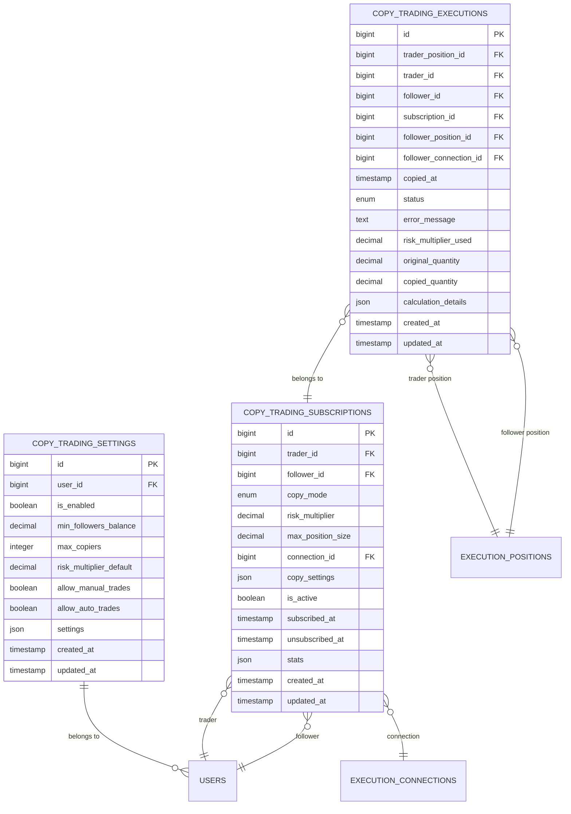
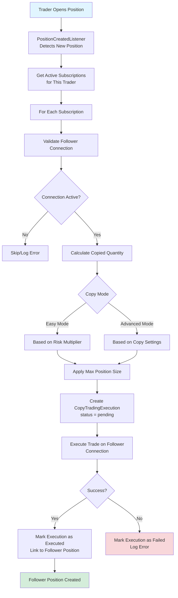
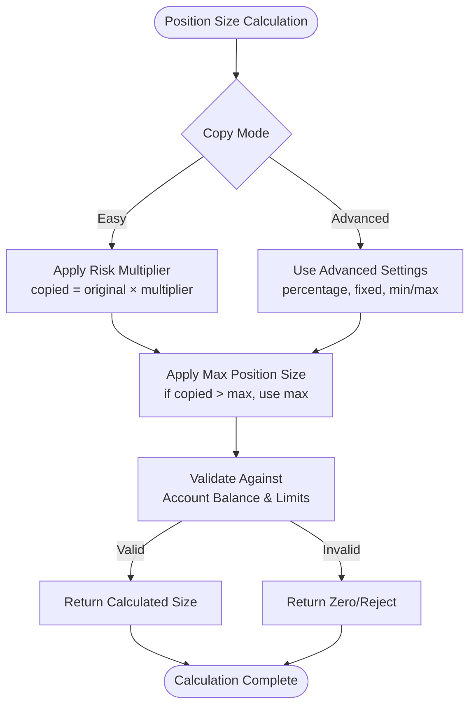

# Copy Trading Schema

<cite>
**Referenced Files in This Document**   
- [copy-trading-system.md](file://docs/copy-trading-system.md)
- [database-schema-reference.md](file://docs/database-schema-reference.md)
- [2025_01_30_100000_create_copy_trading_settings_table.php](file://main/addons/trading-management-addon/database/migrations/2025_01_30_100000_create_copy_trading_settings_table.php)
- [2025_01_30_100001_create_copy_trading_subscriptions_table.php](file://main/addons/trading-management-addon/database/migrations/2025_01_30_100001_create_copy_trading_subscriptions_table.php)
- [2025_01_30_100002_create_copy_trading_executions_table.php](file://main/addons/trading-management-addon/database/migrations/2025_01_30_100002_create_copy_trading_executions_table.php)
- [CopyTradingSubscription.php](file://main/addons/trading-management-addon/Modules/CopyTrading/Models/CopyTradingSubscription.php)
- [CopyTradingExecution.php](file://main/addons/trading-management-addon/Modules/CopyTrading/Models/CopyTradingExecution.php)
- [CopyTradingSeeder.php](file://main/database/seeders/CopyTradingSeeder.php)
- [CopyTradingSubscriptionSeeder.php](file://main/database/seeders/CopyTradingSubscriptionSeeder.php)
</cite>

## Table of Contents
1. [Introduction](#introduction)
2. [Core Entities](#core-entities)
3. [Entity Relationships](#entity-relationships)
4. [Field Definitions](#field-definitions)
5. [Primary and Foreign Keys](#primary-and-foreign-keys)
6. [Indexes and Constraints](#indexes-and-constraints)
7. [Copy Trading Workflow](#copy-trading-workflow)
8. [Subscription Parameters](#subscription-parameters)
9. [Risk Management Rules](#risk-management-rules)
10. [Execution Mapping](#execution-mapping)
11. [Sample Data](#sample-data)
12. [Data Access Patterns](#data-access-patterns)
13. [Data Lifecycle](#data-lifecycle)
14. [Security Aspects](#security-aspects)
15. [Conclusion](#conclusion)

## Introduction

The Copy Trading Schema enables a social trading system where users (followers) can automatically replicate trades from experienced traders. This documentation details the data model, entity relationships, and operational workflow of the copy trading system. The schema consists of three core entities: `CopyTradingSetting`, `CopyTradingSubscription`, and `CopyTradingExecution`, which work together to manage the subscription, execution, and tracking of copied trades.

**Section sources**
- [copy-trading-system.md](file://docs/copy-trading-system.md#L1-L427)

## Core Entities

The copy trading system is built around three primary entities that define the relationships and execution flow between traders and followers.

### CopyTradingSetting

This entity represents a trader's configuration for allowing others to copy their trades. It contains settings that control who can follow, risk parameters, and trade filtering options.

### CopyTradingSubscription

This entity establishes the relationship between a trader and a follower. It defines how trades are copied, including position sizing rules, risk multipliers, and the execution connection used for the follower's trades.

### CopyTradingExecution

This entity tracks each individual trade replication event. It records the original trade details, the calculated copied trade parameters, execution status, and any error information if the copy fails.

**Section sources**
- [copy-trading-system.md](file://docs/copy-trading-system.md#L49-L83)
- [2025_01_30_100000_create_copy_trading_settings_table.php](file://main/addons/trading-management-addon/database/migrations/2025_01_30_100000_create_copy_trading_settings_table.php#L16-L30)
- [2025_01_30_100001_create_copy_trading_subscriptions_table.php](file://main/addons/trading-management-addon/database/migrations/2025_01_30_100001_create_copy_trading_subscriptions_table.php#L16-L40)
- [2025_01_30_100002_create_copy_trading_executions_table.php](file://main/addons/trading-management-addon/database/migrations/2025_01_30_100002_create_copy_trading_executions_table.php#L16-L45)

## Entity Relationships

The copy trading entities are interconnected through well-defined relationships that ensure data integrity and enable efficient querying of the trading network.



**Diagram sources**
- [2025_01_30_100000_create_copy_trading_settings_table.php](file://main/addons/trading-management-addon/database/migrations/2025_01_30_100000_create_copy_trading_settings_table.php#L16-L30)
- [2025_01_30_100001_create_copy_trading_subscriptions_table.php](file://main/addons/trading-management-addon/database/migrations/2025_01_30_100001_create_copy_trading_subscriptions_table.php#L16-L40)
- [2025_01_30_100002_create_copy_trading_executions_table.php](file://main/addons/trading-management-addon/database/migrations/2025_01_30_100002_create_copy_trading_executions_table.php#L16-L45)

## Field Definitions

### CopyTradingSetting Fields

| Field | Type | Description |
|-------|------|-------------|
| user_id | bigint | The trader who owns these settings |
| is_enabled | boolean | Whether copy trading is enabled for this user |
| min_followers_balance | decimal(20,8) | Minimum balance required for followers to subscribe |
| max_copiers | integer | Maximum number of followers allowed |
| risk_multiplier_default | decimal(10,4) | Default risk multiplier applied to followers |
| allow_manual_trades | boolean | Whether manual trades should be copied |
| allow_auto_trades | boolean | Whether signal-based trades should be copied |
| settings | json | Additional configuration options in JSON format |

### CopyTradingSubscription Fields

| Field | Type | Description |
|-------|------|-------------|
| trader_id | bigint | User ID of the trader being copied |
| follower_id | bigint | User ID of the follower copying trades |
| copy_mode | enum | Mode of copying: 'easy' or 'advanced' |
| risk_multiplier | decimal(10,4) | Multiplier applied to position size (0.1 to 10.0) |
| max_position_size | decimal(20,8) | Maximum USD amount per copied trade |
| connection_id | bigint | Execution connection used for the follower's trades |
| copy_settings | json | Advanced settings for position sizing and risk management |
| is_active | boolean | Current subscription status |
| subscribed_at | timestamp | When the subscription was created |
| unsubscribed_at | timestamp | When the subscription was cancelled |
| stats | json | Statistics about copied trades and performance |

### CopyTradingExecution Fields

| Field | Type | Description |
|-------|------|-------------|
| trader_position_id | bigint | Original position ID from the trader |
| trader_id | bigint | User ID of the trader |
| follower_id | bigint | User ID of the follower |
| subscription_id | bigint | Subscription that triggered this execution |
| follower_position_id | bigint | Created position ID for the follower (nullable) |
| follower_connection_id | bigint | Connection used for the follower's trade |
| copied_at | timestamp | When the trade was copied |
| status | enum | Execution status: pending, executed, failed, closed |
| error_message | text | Error details if execution failed |
| risk_multiplier_used | decimal(10,4) | Risk multiplier applied during this execution |
| original_quantity | decimal(20,8) | Original position size from the trader |
| copied_quantity | decimal(20,8) | Calculated position size for the follower |
| calculation_details | json | Details about how the copied quantity was calculated |

**Section sources**
- [2025_01_30_100000_create_copy_trading_settings_table.php](file://main/addons/trading-management-addon/database/migrations/2025_01_30_100000_create_copy_trading_settings_table.php#L16-L30)
- [2025_01_30_100001_create_copy_trading_subscriptions_table.php](file://main/addons/trading-management-addon/database/migrations/2025_01_30_100001_create_copy_trading_subscriptions_table.php#L16-L40)
- [2025_01_30_100002_create_copy_trading_executions_table.php](file://main/addons/trading-management-addon/database/migrations/2025_01_30_100002_create_copy_trading_executions_table.php#L16-L45)

## Primary and Foreign Keys

### Primary Keys

Each table has a primary key that uniquely identifies each record:

- `copy_trading_settings.id`: Primary key for trader settings
- `copy_trading_subscriptions.id`: Primary key for subscriptions
- `copy_trading_executions.id`: Primary key for execution records

### Foreign Keys

The schema implements referential integrity through foreign key constraints:

- `copy_trading_settings.user_id` references `users.id` with ON DELETE CASCADE
- `copy_trading_subscriptions.trader_id` references `users.id` with ON DELETE CASCADE
- `copy_trading_subscriptions.follower_id` references `users.id` with ON DELETE CASCADE
- `copy_trading_subscriptions.connection_id` references `execution_connections.id` with ON DELETE CASCADE
- `copy_trading_executions.trader_position_id` references `execution_positions.id` with ON DELETE CASCADE
- `copy_trading_executions.trader_id` references `users.id` with ON DELETE CASCADE
- `copy_trading_executions.follower_id` references `users.id` with ON DELETE CASCADE
- `copy_trading_executions.subscription_id` references `copy_trading_subscriptions.id` with ON DELETE CASCADE
- `copy_trading_executions.follower_position_id` references `execution_positions.id` with ON DELETE SET NULL
- `copy_trading_executions.follower_connection_id` references `execution_connections.id` with ON DELETE CASCADE

**Section sources**
- [2025_01_30_100000_create_copy_trading_settings_table.php](file://main/addons/trading-management-addon/database/migrations/2025_01_30_100000_create_copy_trading_settings_table.php#L28-L30)
- [2025_01_30_100001_create_copy_trading_subscriptions_table.php](file://main/addons/trading-management-addon/database/migrations/2025_01_30_100001_create_copy_trading_subscriptions_table.php#L31-L34)
- [2025_01_30_100002_create_copy_trading_executions_table.php](file://main/addons/trading-management-addon/database/migrations/2025_01_30_100002_create_copy_trading_executions_table.php#L33-L38)

## Indexes and Constraints

### Indexes

The schema includes several indexes to optimize query performance:

- `copy_trading_settings.is_enabled`: Index on enabled status for quickly finding active traders
- `copy_trading_subscriptions.trader_id`: Index on trader ID for finding all followers of a trader
- `copy_trading_subscriptions.follower_id`: Index on follower ID for finding all subscriptions for a user
- `copy_trading_subscriptions.is_active`: Index on active status for filtering active subscriptions
- `copy_trading_subscriptions.copy_mode`: Index on copy mode for mode-based queries
- `copy_trading_executions.trader_position_id`: Index on trader position ID for finding all copies of a trade
- `copy_trading_executions.trader_id`: Index on trader ID for finding all executions by a trader
- `copy_trading_executions.follower_id`: Index on follower ID for finding all executions for a follower
- `copy_trading_executions.subscription_id`: Index on subscription ID for linking executions to subscriptions
- `copy_trading_executions.status`: Index on status for monitoring execution workflow

### Constraints

The schema enforces data integrity through several constraints:

- Unique constraint on `copy_trading_settings.user_id` to ensure each user has only one settings record
- Unique constraint on `copy_trading_subscriptions(trader_id, follower_id)` to prevent duplicate subscriptions
- Check constraints on `copy_trading_subscriptions.risk_multiplier` to ensure values between 0.1 and 10.0
- Status enum constraints to ensure valid values for execution status
- Foreign key constraints with appropriate ON DELETE behaviors to maintain referential integrity

**Section sources**
- [2025_01_30_100000_create_copy_trading_settings_table.php](file://main/addons/trading-management-addon/database/migrations/2025_01_30_100000_create_copy_trading_settings_table.php#L29-L30)
- [2025_01_30_100001_create_copy_trading_subscriptions_table.php](file://main/addons/trading-management-addon/database/migrations/2025_01_30_100001_create_copy_trading_subscriptions_table.php#L35-L40)
- [2025_01_30_100002_create_copy_trading_executions_table.php](file://main/addons/trading-management-addon/database/migrations/2025_01_30_100002_create_copy_trading_executions_table.php#L40-L45)

## Copy Trading Workflow

The copy trading workflow follows a systematic process from subscription to execution and tracking.



**Diagram sources**
- [copy-trading-system.md](file://docs/copy-trading-system.md#L12-L45)

## Subscription Parameters

### Allocation Percentage

The allocation percentage determines how much of the follower's capital is used for copying trades. This is controlled through the risk multiplier and copy settings:

- In easy mode, the risk_multiplier (default 1.0) scales the position size proportionally
- In advanced mode, copy_settings can specify percentage-based allocation methods
- The system prevents over-leveraging by respecting the follower's account balance and risk parameters

### Maximum Trades

The maximum trades parameter limits the exposure of followers through several mechanisms:

- `max_position_size` field limits the USD value of each copied trade
- `risk_multiplier` caps position size relative to the trader's position
- Trader settings can limit the total number of copiers with `max_copiers`
- Follower connection settings may impose additional position size limits

**Section sources**
- [CopyTradingSubscription.php](file://main/addons/trading-management-addon/Modules/CopyTrading/Models/CopyTradingSubscription.php#L21-L36)
- [copy-trading-system.md](file://docs/copy-trading-system.md#L57-L64)

## Risk Management Rules

The copy trading system implements multiple layers of risk management to protect both traders and followers.

### Trader-Level Risk Controls

Traders can configure their copy trading settings to manage risk:

- Set `min_followers_balance` to ensure followers have sufficient capital
- Limit `max_copiers` to maintain quality and performance
- Configure `risk_multiplier_default` to suggest appropriate risk levels
- Choose whether to allow manual trades or only signal-based trades

### Follower-Level Risk Controls

Followers have several options to manage their risk exposure:

- Select a conservative `risk_multiplier` (e.g., 0.5 for 50% risk)
- Set `max_position_size` to cap individual trade exposure
- Choose execution connections with appropriate risk profiles
- Use advanced copy settings to implement custom risk rules

### System-Level Risk Controls

The system enforces risk management through validation and monitoring:

- Validates that risk_multiplier is within acceptable bounds (0.1 to 10.0)
- Ensures followers have active connections before copying trades
- Monitors execution success rates and logs failures for analysis
- Prevents subscription to traders who exceed follower limits

**Section sources**
- [2025_01_30_100000_create_copy_trading_settings_table.php](file://main/addons/trading-management-addon/database/migrations/2025_01_30_100000_create_copy_trading_settings_table.php#L19-L25)
- [CopyTradingSubscription.php](file://main/addons/trading-management-addon/Modules/CopyTrading/Models/CopyTradingSubscription.php#L21-L36)

## Execution Mapping

The execution mapping process translates a trader's position into a follower's position while respecting risk parameters and account constraints.

### Position Size Calculation

The system calculates the copied position size based on the subscription parameters:



**Diagram sources**
- [copy-trading-system.md](file://docs/copy-trading-system.md#L147-L201)

### Execution Status Tracking

The system tracks the status of each copied trade through its lifecycle:

- **pending**: The copy has been initiated but not yet executed
- **executed**: The trade was successfully placed on the follower's account
- **failed**: The copy attempt failed (insufficient funds, connection error, etc.)
- **closed**: The copied position has been closed (mirroring the trader's exit)

**Section sources**
- [2025_01_30_100002_create_copy_trading_executions_table.php](file://main/addons/trading-management-addon/database/migrations/2025_01_30_100002_create_copy_trading_executions_table.php#L25-L26)
- [CopyTradingExecution.php](file://main/addons/trading-management-addon/Modules/CopyTrading/Models/CopyTradingExecution.php#L12-L21)

## Sample Data

### Sample CopyTradingSetting

```json
{
  "id": 1,
  "user_id": 1001,
  "is_enabled": true,
  "min_followers_balance": 1000.00,
  "max_copiers": 50,
  "risk_multiplier_default": 1.0,
  "allow_manual_trades": true,
  "allow_auto_trades": true,
  "settings": {
    "commission_rate": 0.25,
    "copy_delay_seconds": 0
  },
  "created_at": "2025-01-15 10:30:00",
  "updated_at": "2025-01-15 10:30:00"
}
```

### Sample CopyTradingSubscription

```json
{
  "id": 101,
  "trader_id": 1001,
  "follower_id": 2001,
  "copy_mode": "easy",
  "risk_multiplier": 0.5,
  "max_position_size": 500.00,
  "connection_id": 3001,
  "copy_settings": null,
  "is_active": true,
  "subscribed_at": "2025-01-16 09:15:00",
  "unsubscribed_at": null,
  "stats": {
    "copied_trades": 24,
    "successful_copies": 24,
    "failed_copies": 0,
    "total_pnl": 1250.75
  },
  "created_at": "2025-01-16 09:15:00",
  "updated_at": "2025-01-16 09:15:00"
}
```

### Sample CopyTradingExecution

```json
{
  "id": 1001,
  "trader_position_id": 5001,
  "trader_id": 1001,
  "follower_id": 2001,
  "subscription_id": 101,
  "follower_position_id": 5002,
  "follower_connection_id": 3001,
  "copied_at": "2025-01-16 14:30:00",
  "status": "executed",
  "error_message": null,
  "risk_multiplier_used": 0.5,
  "original_quantity": 0.5,
  "copied_quantity": 0.25,
  "calculation_details": {
    "method": "risk_multiplier",
    "original_balance": 25000.00,
    "follower_balance": 12500.00,
    "balance_ratio": 0.5,
    "applied_multiplier": 0.5,
    "final_ratio": 0.25
  },
  "created_at": "2025-01-16 14:30:00",
  "updated_at": "2025-01-16 14:30:05"
}
```

**Section sources**
- [CopyTradingSeeder.php](file://main/database/seeders/CopyTradingSeeder.php)
- [CopyTradingSubscriptionSeeder.php](file://main/database/seeders/CopyTradingSubscriptionSeeder.php)

## Data Access Patterns

### Subscription Management

Queries for managing subscriptions follow these patterns:

- Find all followers of a trader: `SELECT * FROM copy_trading_subscriptions WHERE trader_id = ? AND is_active = true`
- Find all subscriptions for a follower: `SELECT * FROM copy_trading_subscriptions WHERE follower_id = ?`
- Count active followers: `SELECT COUNT(*) FROM copy_trading_subscriptions WHERE trader_id = ? AND is_active = true`

### Performance Tracking

Performance tracking queries include:

- Calculate success rate: `SELECT (COUNT(CASE WHEN status = 'executed' THEN 1 END) * 100.0 / COUNT(*)) FROM copy_trading_executions WHERE trader_id = ?`
- Get average execution time: `SELECT AVG(TIMESTAMPDIFF(SECOND, created_at, copied_at)) FROM copy_trading_executions WHERE status = 'executed'`
- Track follower performance: `SELECT subscription_id, SUM(copied_quantity * price_change) FROM copy_trading_executions GROUP BY subscription_id`

### Fee Calculation

Fee calculation queries would use:

- Count successful copies: `SELECT COUNT(*) FROM copy_trading_executions WHERE trader_id = ? AND status = 'executed' AND copied_at >= ?`
- Calculate commission basis: `SELECT SUM(original_quantity * entry_price) FROM copy_trading_executions WHERE trader_id = ? AND status = 'executed'`

**Section sources**
- [copy-trading-system.md](file://docs/copy-trading-system.md#L133-L143)
- [CopyTradingSubscription.php](file://main/addons/trading-management-addon/Modules/CopyTrading/Models/CopyTradingSubscription.php#L73-L87)

## Data Lifecycle

### Subscription Lifecycle

The subscription lifecycle follows this sequence:

1. **Creation**: A follower subscribes to a trader, creating a subscription record
2. **Active**: The subscription is active and trades are copied automatically
3. **Paused**: The follower temporarily pauses copying (is_active = false)
4. **Cancelled**: The follower unsubscribes, setting is_active = false and unsubscribed_at timestamp

### Execution Lifecycle

The execution lifecycle for each copied trade:

1. **Pending**: When a trader opens a position, pending executions are created for all active subscriptions
2. **Executed**: If the trade is successfully placed on the follower's account
3. **Failed**: If the copy fails due to connection issues, insufficient funds, etc.
4. **Closed**: When the trader closes their position, the follower's position is also closed

### Historical Data Retention

The system retains historical data for performance analysis:

- Completed executions are never deleted (status other than pending)
- Subscription history is preserved even after cancellation
- Statistical data is maintained for performance reporting
- Error logs are retained for troubleshooting and system improvement

**Section sources**
- [CopyTradingSubscription.php](file://main/addons/trading-management-addon/Modules/CopyTrading/Models/CopyTradingSubscription.php#L93-L108)
- [2025_01_30_100002_create_copy_trading_executions_table.php](file://main/addons/trading-management-addon/database/migrations/2025_01_30_100002_create_copy_trading_executions_table.php#L25-L26)

## Security Aspects

### Subscription Authorization

The system implements strict authorization for copy trading:

- Followers must have an active execution connection to subscribe
- Traders can set minimum balance requirements for followers
- Each subscription is validated against the trader's maximum follower limit
- Users can only subscribe to traders who have copy trading enabled

### Execution Validation

Execution validation ensures the integrity of the copy trading process:

- Each execution is verified against the original trader's position
- Position sizes are validated against account balances and risk parameters
- Connection status is checked before attempting to copy a trade
- Error handling captures and logs all execution failures for audit purposes

### Data Protection

The system protects sensitive data through:

- Encryption of API credentials in execution connections
- Proper access controls to prevent unauthorized access to trading data
- Audit logging of subscription changes and execution attempts
- Rate limiting to prevent abuse of the copy trading system

**Section sources**
- [copy-trading-system.md](file://docs/copy-trading-system.md#L253-L264)
- [2025_01_30_100001_create_copy_trading_subscriptions_table.php](file://main/addons/trading-management-addon/database/migrations/2025_01_30_100001_create_copy_trading_subscriptions_table.php#L31-L34)

## Conclusion

The Copy Trading Schema provides a robust foundation for social trading functionality, enabling users to copy trades from experienced traders while maintaining appropriate risk controls and data integrity. The three core entities—CopyTradingSetting, CopyTradingSubscription, and CopyTradingExecution—work together to create a seamless copy trading experience with comprehensive tracking and reporting capabilities. The schema supports multiple copy modes, flexible risk management, and detailed performance monitoring, making it suitable for both novice followers and experienced traders. With proper indexing and constraints, the schema ensures efficient query performance and data consistency across the trading network.