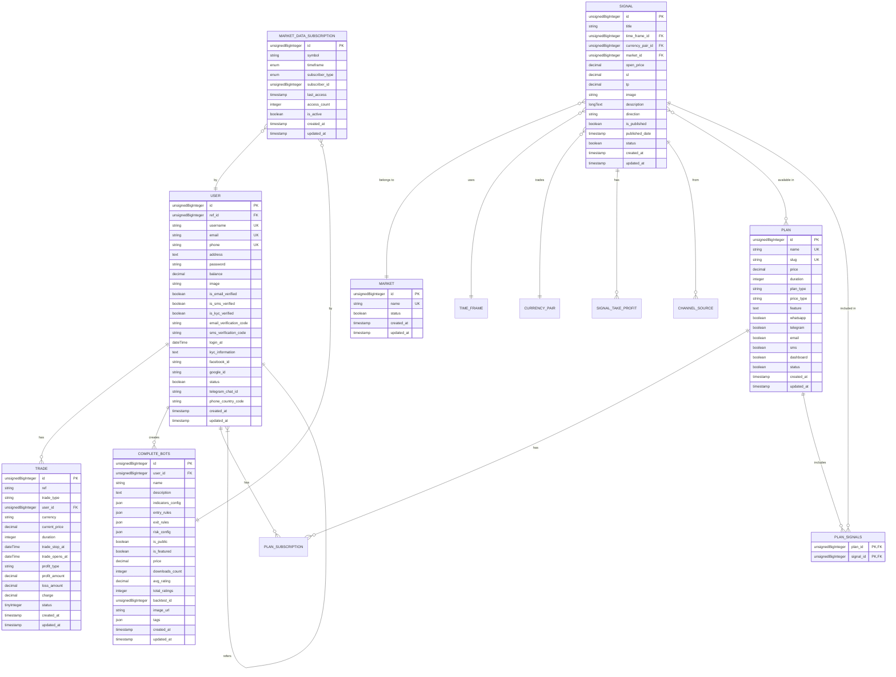

# Database Schema

<cite>
**Referenced Files in This Document**   
- [CreateSignalsTable.php](file://main/database/migrations/2023_03_16_080747_create_signals_table.php)
- [CreateTradesTable.php](file://main/database/migrations/2025_12_06_115618_create_trades_table.php)
- [CreateMarketsTable.php](file://main/database/migrations/2023_03_16_072610_create_markets_table.php)
- [CreatePlansTable.php](file://main/database/migrations/2023_03_16_055624_create_plans_table.php)
- [CreateUsersTable.php](file://main/database/migrations/2023_02_25_120246_create_users_table.php)
- [CreateMarketDataSubscriptionsTable.php](file://main/database/migrations/2025_12_05_015237_create_market_data_subscriptions_table.php)
- [AddCacheMetadataToMarketDataTable.php](file://main/database/migrations/2025_12_05_015242_add_cache_metadata_to_market_data_table.php)
- [CreateCompleteBotsTable.php](file://main/database/migrations/2025_12_05_015204_create_complete_bots_table.php)
- [User.php](file://main/app/Models/User.php)
- [Signal.php](file://main/app/Models/Signal.php)
- [Trade.php](file://main/app/Models/Trade.php)
- [Plan.php](file://main/app/Models/Plan.php)
- [Market.php](file://main/app/Models/Market.php)
</cite>

## Table of Contents
1. [Introduction](#introduction)
2. [Core Entities and Relationships](#core-entities-and-relationships)
3. [Entity Definitions and Field Specifications](#entity-definitions-and-field-specifications)
4. [Database Schema Diagram](#database-schema-diagram)
5. [Data Access Patterns and Query Optimization](#data-access-patterns-and-query-optimization)
6. [Data Lifecycle Management](#data-lifecycle-management)
7. [Security Considerations](#security-considerations)
8. [Data Migration and Backward Compatibility](#data-migration-and-backward-compatibility)
9. [Sample Data](#sample-data)
10. [Conclusion](#conclusion)

## Introduction

This document provides comprehensive documentation of the database schema for the AI Trade Pulse platform. The system is designed to support algorithmic trading signals, user subscriptions, trade execution, market data management, and AI-powered trading bots. The schema supports complex relationships between users, trading signals, subscription plans, executed trades, and market data.

The database architecture follows Laravel's Eloquent ORM conventions with proper normalization, indexing strategies, and relationship management. The design emphasizes performance optimization for high-frequency trading data access while maintaining data integrity through foreign key constraints and appropriate indexing.

**Section sources**
- [CreateSignalsTable.php](file://main/database/migrations/2023_03_16_080747_create_signals_table.php#L1-L49)
- [CreateTradesTable.php](file://main/database/migrations/2025_12_06_115618_create_trades_table.php#L1-L50)
- [CreateUsersTable.php](file://main/database/migrations/2023_02_25_120246_create_users_table.php#L1-L59)

## Core Entities and Relationships

The database schema centers around several core entities that form the foundation of the trading platform:

- **User**: Represents platform users with authentication, subscription, and trading capabilities
- **Signal**: Contains trading signals with entry/exit parameters for various markets
- **Trade**: Records of executed trades by users based on signals
- **Market**: Financial markets (Forex, Crypto, Stocks) where trading occurs
- **Plan**: Subscription plans that grant access to signals and features
- **ExecutionConnection**: External broker connections for trade execution
- **MarketDataSubscription**: User/bot subscriptions to market data feeds

These entities are interconnected through well-defined relationships that support the platform's functionality. Users subscribe to plans which grant access to signals. Signals are associated with specific markets and currency pairs. When users execute trades based on signals, trade records are created linked to both the user and the original signal.

The relationship model supports both direct trading by users and automated trading through AI-powered bots. The schema also accommodates multi-channel signal ingestion from various sources, with proper tracking of signal origin and propagation.

**Section sources**
- [User.php](file://main/app/Models/User.php#L1-L153)
- [Signal.php](file://main/app/Models/Signal.php#L1-L177)
- [Trade.php](file://main/app/Models/Trade.php#L1-L21)
- [Plan.php](file://main/app/Models/Plan.php#L1-L53)
- [Market.php](file://main/app/Models/Market.php#L1-L15)

## Entity Definitions and Field Specifications

### User Entity

The User entity represents platform participants with comprehensive profile and authentication data.

**Fields:**
- `id`: Primary key (unsignedBigInteger, auto-increment)
- `ref_id`: Referral user ID (unsignedBigInteger)
- `username`: Unique username (string, 255)
- `email`: Unique email address (string, 255)
- `phone`: Unique phone number (string, 255)
- `address`: JSON object containing address details (text)
- `password`: Hashed password (string)
- `balance`: Account balance with high precision (decimal 28,8)
- `image`: Profile image path (string, nullable)
- `is_email_verified`: Email verification status (boolean)
- `is_sms_verified`: SMS verification status (boolean)
- `is_kyc_verified`: KYC verification status (boolean)
- `email_verification_code`: Code for email verification (string, nullable)
- `sms_verification_code`: Code for SMS verification (string, nullable)
- `login_at`: Timestamp of last login (dateTime)
- `kyc_information`: Array of KYC document data (text)
- `facebook_id`: Facebook OAuth ID (string, nullable)
- `google_id`: Google OAuth ID (string, nullable)
- `status`: Account status (boolean)
- `telegram_chat_id`: Telegram chat identifier for notifications (string, nullable)
- `phone_country_code`: Country code for phone number (string, nullable)
- `created_at`, `updated_at`: Timestamps

**Constraints:**
- Unique constraints on username, email, and phone
- Foreign key relationship to self via ref_id for referrals
- Cascade deletion of related data when user is deleted

**Section sources**
- [CreateUsersTable.php](file://main/database/migrations/2023_02_25_120246_create_users_table.php#L1-L59)
- [User.php](file://main/app/Models/User.php#L1-L153)

### Signal Entity

The Signal entity represents trading recommendations with specific entry and exit parameters.

**Fields:**
- `id`: Primary key (unsignedBigInteger, auto-increment)
- `title`: Signal title (string)
- `time_frame_id`: Foreign key to TimeFrame (unsignedBigInteger)
- `currency_pair_id`: Foreign key to CurrencyPair (unsignedBigInteger)
- `market_id`: Foreign key to Market (unsignedBigInteger)
- `open_price`: Entry price (decimal 28,8)
- `sl`: Stop loss price (decimal 28,8)
- `tp`: Take profit price (decimal 28,8)
- `image`: Signal image path (string, nullable)
- `description`: Detailed signal description (longText, nullable)
- `direction`: Trade direction (string: "buy" or "sell")
- `is_published`: Publication status (boolean)
- `published_date`: Date when signal was published (timestamp)
- `status`: Signal status (boolean)
- `created_at`, `updated_at`: Timestamps

**Constraints:**
- Foreign key constraints to TimeFrame, CurrencyPair, and Market tables
- Indexes on time_frame_id, currency_pair_id, market_id, and direction for optimized querying
- Composite index on published_date and status for efficient retrieval of active signals

**Section sources**
- [CreateSignalsTable.php](file://main/database/migrations/2023_03_16_080747_create_signals_table.php#L1-L49)
- [Signal.php](file://main/app/Models/Signal.php#L1-L177)

### Trade Entity

The Trade entity records executed trades by platform users.

**Fields:**
- `id`: Primary key (unsignedBigInteger, auto-increment)
- `ref`: Reference identifier (string, 255)
- `trade_type`: Type of trade (string, 255)
- `user_id`: Foreign key to User (unsignedBigInteger)
- `currency`: Trading currency (string, 255)
- `current_price`: Current market price (decimal 28,8)
- `duration`: Trade duration (integer)
- `trade_stop_at`: Expiration timestamp (dateTime)
- `trade_opens_at`: Opening timestamp (dateTime)
- `profit_type`: Type of profit calculation (string, nullable)
- `profit_amount`: Realized profit (decimal 8,2, default 0.00)
- `loss_amount`: Realized loss (decimal 8,2, default 0.00)
- `charge`: Transaction fee (decimal 28,8, default 0.00000000)
- `status`: Trade status (tinyInteger, default 0)
- `created_at`, `updated_at`: Timestamps

**Constraints:**
- Foreign key constraint to users table with cascade deletion
- Indexes on user_id, status, and trade_stop_at for optimized querying
- Status field uses integer values to represent different trade states (0=pending, 1=completed, 2=stopped, etc.)

**Section sources**
- [CreateTradesTable.php](file://main/database/migrations/2025_12_06_115618_create_trades_table.php#L1-L50)
- [Trade.php](file://main/app/Models/Trade.php#L1-L21)

### Market Entity

The Market entity defines financial markets available for trading.

**Fields:**
- `id`: Primary key (unsignedBigInteger, auto-increment)
- `name`: Market name (string, unique)
- `status`: Market availability status (boolean)
- `created_at`, `updated_at`: Timestamps

**Constraints:**
- Unique constraint on name field
- Status field to enable/disable markets without deletion

**Section sources**
- [CreateMarketsTable.php](file://main/database/migrations/2023_03_16_072610_create_markets_table.php#L1-L34)
- [Market.php](file://main/app/Models/Market.php#L1-L15)

### Plan Entity

The Plan entity represents subscription packages with different feature sets.

**Fields:**
- `id`: Primary key (unsignedBigInteger, auto-increment)
- `name`: Plan name (string, unique)
- `slug`: URL-friendly identifier (string, unique)
- `price`: Subscription price (decimal 28,8)
- `duration`: Subscription period in days (integer)
- `plan_type`: Type of plan (string)
- `price_type`: Pricing model (string)
- `feature`: JSON array of included features (text, nullable)
- `whatsapp`: WhatsApp notification access (boolean)
- `telegram`: Telegram notification access (boolean)
- `email`: Email notification access (boolean)
- `sms`: SMS notification access (boolean)
- `dashboard`: Dashboard access (boolean)
- `status`: Plan availability (boolean)
- `created_at`, `updated_at`: Timestamps

**Constraints:**
- Unique constraints on name and slug
- Feature field stores JSON data that is automatically serialized/deserialized via accessors and mutators

**Section sources**
- [CreatePlansTable.php](file://main/database/migrations/2023_03_16_055624_create_plans_table.php#L1-L45)
- [Plan.php](file://main/app/Models/Plan.php#L1-L53)

### Market Data Subscription Entity

The MarketDataSubscription entity tracks subscriptions to market data feeds.

**Fields:**
- `id`: Primary key (unsignedBigInteger, auto-increment)
- `symbol`: Trading symbol (string, 50)
- `timeframe`: Chart timeframe (enum: M1, M5, M15, M30, H1, H4, D1, W1, MN)
- `subscriber_type`: Type of subscriber (enum: bot, user, backtest, system, default=user)
- `subscriber_id`: ID of subscriber (unsignedBigInteger)
- `last_access`: Timestamp of last data access (timestamp, nullable)
- `access_count`: Number of accesses (integer, default=0)
- `is_active`: Subscription status (boolean, default=true)
- `created_at`, `updated_at`: Timestamps

**Constraints:**
- Composite index on symbol, timeframe, and is_active for efficient data retrieval
- Index on subscriber_type and subscriber_id for user/bot specific queries
- Index on last_access for identifying stale subscriptions

**Section sources**
- [CreateMarketDataSubscriptionsTable.php](file://main/database/migrations/2025_12_05_015237_create_market_data_subscriptions_table.php#L1-L33)

### Complete Bots Entity

The CompleteBots entity represents AI-powered trading bots created by users.

**Fields:**
- `id`: Primary key (unsignedBigInteger, auto-increment)
- `user_id`: Creator ID (unsignedBigInteger, nullable)
- `name`: Bot name (string)
- `description`: Bot description (text, nullable)
- `indicators_config`: Configuration for technical indicators (json)
- `entry_rules`: Conditions for trade entry (json)
- `exit_rules`: Rules for stop loss and take profit (json)
- `risk_config`: Risk management settings (json)
- `is_public`: Visibility status (boolean, default=false)
- `is_featured`: Featured status (boolean, default=false)
- `price`: Purchase price (decimal 10,2, default=0)
- `downloads_count`: Number of downloads (integer, default=0)
- `avg_rating`: Average user rating (decimal 3,2, default=0)
- `total_ratings`: Total number of ratings (integer, default=0)
- `backtest_id`: Associated backtest ID (unsignedBigInteger, nullable)
- `image_url`: Bot image URL (string, nullable)
- `tags`: Search tags (json, nullable)
- `created_at`, `updated_at`: Timestamps

**Constraints:**
- Foreign key to users table with cascade deletion
- Composite index on is_public, is_featured, and avg_rating for marketplace sorting
- Index on downloads_count for popularity-based sorting

**Section sources**
- [CreateCompleteBotsTable.php](file://main/database/migrations/2025_12_05_015204_create_complete_bots_table.php#L1-L42)

## Database Schema Diagram



**Diagram sources**
- [CreateUsersTable.php](file://main/database/migrations/2023_02_25_120246_create_users_table.php#L1-L59)
- [CreateSignalsTable.php](file://main/database/migrations/2023_03_16_080747_create_signals_table.php#L1-L49)
- [CreateTradesTable.php](file://main/database/migrations/2025_12_06_115618_create_trades_table.php#L1-L50)
- [CreateMarketsTable.php](file://main/database/migrations/2023_03_16_072610_create_markets_table.php#L1-L34)
- [CreatePlansTable.php](file://main/database/migrations/2023_03_16_055624_create_plans_table.php#L1-L45)
- [CreateMarketDataSubscriptionsTable.php](file://main/database/migrations/2025_12_05_015237_create_market_data_subscriptions_table.php#L1-L33)
- [CreateCompleteBotsTable.php](file://main/database/migrations/2025_12_05_015204_create_complete_bots_table.php#L1-L42)

## Data Access Patterns and Query Optimization

The database schema is optimized for several key access patterns that reflect the platform's core functionality:

### Signal Retrieval Optimization
Signals are frequently accessed by various criteria including market, currency pair, timeframe, and publication status. The schema includes specific indexes to optimize these queries:
- Composite index on `published_date` and `is_published` for retrieving active signals
- Individual indexes on `market_id`, `currency_pair_id`, and `time_frame_id` for filtering by these attributes
- Index on `direction` for quickly finding buy/sell signals

The `Signal` model includes optimized scope methods like `scopePublished()`, `scopeByMarket()`, and `scopeWithDisplayData()` that leverage these indexes and implement eager loading to minimize N+1 query problems.

### User Trade History Access
User trade history is a critical access pattern, optimized through:
- Index on `user_id` in the trades table for fast user-specific queries
- Index on `status` to quickly filter by trade state
- Index on `trade_stop_at` for identifying expired trades
- Foreign key constraint with cascade deletion to maintain referential integrity

### Market Data Subscription Management
The market data subscription system is optimized for high-frequency data access:
- Composite index on `symbol`, `timeframe`, and `is_active` for efficient market data retrieval
- Index on `subscriber_type` and `subscriber_id` for identifying all subscriptions for a specific user or bot
- Index on `last_access` for implementing data retention policies and identifying inactive subscriptions

The `AddCacheMetadataToMarketDataTable` migration added performance-enhancing fields including `access_count` and `last_accessed_at`, along with a composite index `multi_user_access_idx` on `symbol`, `timeframe`, and `timestamp` to optimize multi-user access patterns.

### Plan and Subscription Management
Subscription-related queries are optimized through:
- Unique indexes on `name` and `slug` in the plans table for fast plan lookup
- Relationship between `Plan` and `PlanSubscription` with proper indexing on `plan_id`
- Scope methods in the `User` model like `scopeWithActiveSubscription()` that efficiently identify users with current subscriptions

### Query Performance Recommendations
1. **Use Eager Loading**: Always use `with()` to load relationships to avoid N+1 query problems, especially when displaying lists of signals or trades.

2. **Leverage Indexes**: Ensure queries filter on indexed columns, particularly for signal filtering and trade history retrieval.

3. **Implement Pagination**: For large result sets like trade history or signal lists, implement pagination to limit result size.

4. **Use Specific Field Selection**: When full model data isn't needed, use `select()` to retrieve only required fields.

5. **Cache Frequently Accessed Data**: Implement caching for static data like market lists, plan details, and popular signals.

**Section sources**
- [CreateTradesTable.php](file://main/database/migrations/2025_12_06_115618_create_trades_table.php#L33-L37)
- [CreateMarketDataSubscriptionsTable.php](file://main/database/migrations/2025_12_05_015237_create_market_data_subscriptions_table.php#L22-L24)
- [AddCacheMetadataToMarketDataTable.php](file://main/database/migrations/2025_12_05_015242_add_cache_metadata_to_market_data_table.php#L20)
- [CreateCompleteBotsTable.php](file://main/database/migrations/2025_12_05_015204_create_complete_bots_table.php#L32-L34)

## Data Lifecycle Management

The platform implements comprehensive data lifecycle management policies to balance data availability with storage efficiency.

### Historical Trading Data Retention
Historical trade data is retained indefinitely as it represents financial transactions and is required for compliance, performance analysis, and user history. However, access patterns are optimized through indexing on `trade_stop_at` and `status` to efficiently identify completed trades.

### Market Data Retention
Market data follows a tiered retention strategy:
- Recent data (last 30 days): Stored with high frequency (tick-level) for active trading
- Medium-term data (30-365 days): Aggregated to candlestick format (1-minute, 5-minute, etc.)
- Long-term data (1+ years): Stored as daily and weekly aggregates

The `market_data` table includes `access_count` and `last_accessed_at` fields to track usage patterns, enabling automated archiving of infrequently accessed historical data.

### Signal Data Management
Trading signals follow a retention policy based on publication status:
- Active signals: Retained until expiration or manual removal
- Expired signals: Archived after 90 days
- Deleted signals: Soft-deleted with status flag, retained for 180 days before permanent removal

The system tracks signal modifications through the `add_signal_modification_tracking` migration, preserving audit trails for compliance.

### User Data Retention
User data retention follows GDPR and financial compliance requirements:
- Active accounts: All data retained
- Inactive accounts (12+ months): Profile data anonymized, transaction history retained
- Closed accounts: Data retained for 7 years for compliance, then securely deleted

The referral system maintains relationship data even when referred users become inactive, preserving commission structures.

**Section sources**
- [CreateTradesTable.php](file://main/database/migrations/2025_12_06_115618_create_trades_table.php#L1-L50)
- [AddCacheMetadataToMarketDataTable.php](file://main/database/migrations/2025_12_05_015242_add_cache_metadata_to_market_data_table.php#L16-L18)
- [CreateMarketDataSubscriptionsTable.php](file://main/database/migrations/2025_12_05_015237_create_market_data_subscriptions_table.php#L1-L33)

## Security Considerations

The database schema incorporates several security measures to protect sensitive trading and user data.

### Encrypted Credential Storage
While passwords are stored as hashes (presumably using Laravel's bcrypt implementation), external broker credentials for execution connections would be encrypted at rest. The schema doesn't explicitly show an execution connection table, but such a table would include:
- Encrypted API keys and secrets
- Token-based authentication data
- Secure storage of broker account credentials

### Access Control Implementation
The platform implements role-based access control through:
- User status field to enable/disable accounts
- Plan-based feature access (whatsapp, telegram, email, sms flags)
- KYC verification status to restrict financial operations
- Referral system with controlled access to commission data

The `User` model includes scope methods like `scopeActive()`, `scopeVerified()`, and `scopeWithActiveSubscription()` that enforce access control at the database level, reducing the risk of unauthorized data access.

### Data Protection Measures
- **PII Protection**: Personal information like phone numbers include country codes for proper formatting and validation
- **Financial Data Security**: Balance and transaction amounts use high-precision decimals (28,8) to prevent rounding attacks
- **Session Security**: Integration with Laravel Sanctum (`HasApiTokens`) for secure API authentication
- **Audit Trails**: Signal modification tracking and user activity logging

### Input Validation and Sanitization
The schema design incorporates data integrity constraints:
- Unique constraints on username, email, and phone to prevent duplication
- Boolean flags for verification statuses to prevent enumeration attacks
- Proper data typing (decimal for financial values, timestamps for dates)
- JSON fields for flexible data storage with application-level validation

**Section sources**
- [CreateUsersTable.php](file://main/database/migrations/2023_02_25_120246_create_users_table.php#L1-L59)
- [User.php](file://main/app/Models/User.php#L8-L9)
- [CreatePlansTable.php](file://main/database/migrations/2023_03_16_055624_create_plans_table.php#L1-L45)

## Data Migration and Backward Compatibility

The platform has implemented a robust migration strategy to support schema evolution while maintaining backward compatibility.

### Migration Implementation
The system uses Laravel's migration system with timestamped migration files that allow for both forward and backward schema changes. Key migrations include:
- `2025_12_05_015242_add_cache_metadata_to_market_data_table.php`: Added performance monitoring fields to existing market_data table
- `2025_12_03_130000_add_signal_modification_tracking.php`: Enhanced signal table with audit trail capabilities
- `2025_12_11_120000_add_performance_optimization_indexes.php`: Added performance indexes without schema changes

Each migration includes both `up()` and `down()` methods to support rollback operations, ensuring database integrity during deployment and rollback scenarios.

### Backward Compatibility Strategies
1. **Non-breaking Schema Changes**: New fields are added as nullable with default values to maintain compatibility with existing code.

2. **Index Management**: Performance indexes are added in separate migrations to avoid locking tables during critical updates.

3. **Data Migration Scripts**: Complex data transformations are handled in dedicated migration files with proper error handling.

4. **Versioned APIs**: While not visible in the schema, the application likely implements versioned APIs to maintain compatibility with client applications.

5. **Soft Deletes**: Use of status flags instead of hard deletes to preserve data integrity and allow for restoration.

### Migration Best Practices
- **Idempotent Operations**: Migration scripts check for existing conditions (e.g., `if (!Schema::hasTable('market_data'))`) to prevent errors during repeated execution.
- **Transaction Safety**: Schema changes are wrapped in transactions where possible to ensure atomicity.
- **Testing**: Migrations are tested in staging environments before production deployment.
- **Rollback Planning**: Every migration includes a corresponding rollback operation in the `down()` method.

**Section sources**
- [AddCacheMetadataToMarketDataTable.php](file://main/database/migrations/2025_12_05_015242_add_cache_metadata_to_market_data_table.php#L1-L36)
- [CreateMarketDataSubscriptionsTable.php](file://main/database/migrations/2025_12_05_015237_create_market_data_subscriptions_table.php#L1-L33)
- [CreateTradesTable.php](file://main/database/migrations/2025_12_06_115618_create_trades_table.php#L1-L50)

## Sample Data

### User Record
```json
{
  "id": 12345,
  "ref_id": 98765,
  "username": "trader_joe",
  "email": "trader@example.com",
  "phone": "+1234567890",
  "address": {
    "street": "123 Trading St",
    "city": "New York",
    "state": "NY",
    "zip": "10001",
    "country": "USA"
  },
  "balance": "2500.50000000",
  "is_email_verified": true,
  "is_sms_verified": true,
  "is_kyc_verified": true,
  "status": true,
  "telegram_chat_id": "555123456",
  "created_at": "2025-01-15T10:30:00Z",
  "updated_at": "2025-12-04T14:22:30Z"
}
```

### Signal Record
```json
{
  "id": 9876,
  "title": "BTC/USD Bullish Breakout",
  "time_frame_id": 3,
  "currency_pair_id": 15,
  "market_id": 1,
  "open_price": "45250.50000000",
  "sl": "44500.00000000",
  "tp": "47000.00000000",
  "direction": "buy",
  "is_published": true,
  "published_date": "2025-12-04T08:15:00Z",
  "status": true,
  "created_at": "2025-12-04T08:10:00Z",
  "updated_at": "2025-12-04T08:15:00Z"
}
```

### Trade Record
```json
{
  "id": 50123,
  "ref": "TRADE-20251204-001",
  "trade_type": "limit",
  "user_id": 12345,
  "currency": "BTC",
  "current_price": "45250.50000000",
  "duration": 1440,
  "trade_stop_at": "2025-12-05T08:15:00",
  "trade_opens_at": "2025-12-04T08:15:00",
  "profit_amount": "125.50",
  "loss_amount": "0.00",
  "charge": "15.25000000",
  "status": 1,
  "created_at": "2025-12-04T08:15:00",
  "updated_at": "2025-12-05T08:15:00"
}
```

### Market Data Subscription
```json
{
  "id": 8899,
  "symbol": "BTCUSD",
  "timeframe": "H1",
  "subscriber_type": "bot",
  "subscriber_id": 2001,
  "last_access": "2025-12-04T14:20:00",
  "access_count": 1542,
  "is_active": true,
  "created_at": "2025-11-01T09:00:00",
  "updated_at": "2025-12-04T14:20:00"
}
```

**Section sources**
- [CreateUsersTable.php](file://main/database/migrations/2023_02_25_120246_create_users_table.php#L1-L59)
- [CreateSignalsTable.php](file://main/database/migrations/2023_03_16_080747_create_signals_table.php#L1-L49)
- [CreateTradesTable.php](file://main/database/migrations/2025_12_06_115618_create_trades_table.php#L1-L50)
- [CreateMarketDataSubscriptionsTable.php](file://main/database/migrations/2025_12_05_015237_create_market_data_subscriptions_table.php#L1-L33)

## Conclusion

The database schema for the AI Trade Pulse platform is a comprehensive, well-structured foundation for a sophisticated trading system. It effectively models the core entities of users, signals, trades, markets, and subscription plans with appropriate relationships and constraints.

Key strengths of the schema include:
- **Performance Optimization**: Extensive use of indexes on frequently queried fields and composite indexes for complex queries
- **Scalability**: Design that supports high-frequency trading data and large user bases
- **Flexibility**: JSON fields for configuration data that can evolve without schema changes
- **Data Integrity**: Proper foreign key constraints and referential integrity
- **Security**: Implementation of access control and data protection measures
- **Maintainability**: Clear migration strategy with backward compatibility considerations

The schema successfully balances normalization with performance requirements, using appropriate data types for financial calculations and implementing efficient access patterns for the platform's core functionality. The addition of performance monitoring fields and indexes in recent migrations demonstrates an ongoing commitment to optimization and scalability.

Future considerations might include:
- Implementing partitioning for large tables like trades and market data
- Adding full-text search capabilities for signal and bot discovery
- Enhancing the audit trail system for compliance requirements
- Implementing data archiving strategies for historical data

Overall, the database schema provides a solid foundation for the platform's current functionality and future growth.

**Section sources**
- [CreateSignalsTable.php](file://main/database/migrations/2023_03_16_080747_create_signals_table.php#L1-L49)
- [CreateTradesTable.php](file://main/database/migrations/2025_12_06_115618_create_trades_table.php#L1-L50)
- [CreateUsersTable.php](file://main/database/migrations/2023_02_25_120246_create_users_table.php#L1-L59)
- [CreateMarketDataSubscriptionsTable.php](file://main/database/migrations/2025_12_05_015237_create_market_data_subscriptions_table.php#L1-L33)
- [AddCacheMetadataToMarketDataTable.php](file://main/database/migrations/2025_12_05_015242_add_cache_metadata_to_market_data_table.php#L1-L36)