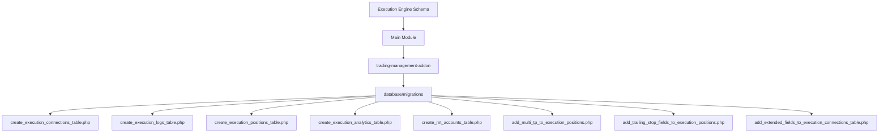
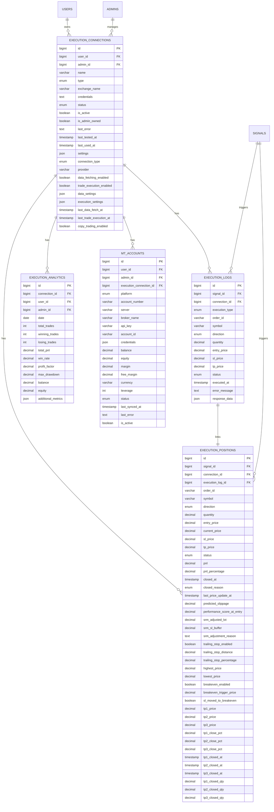
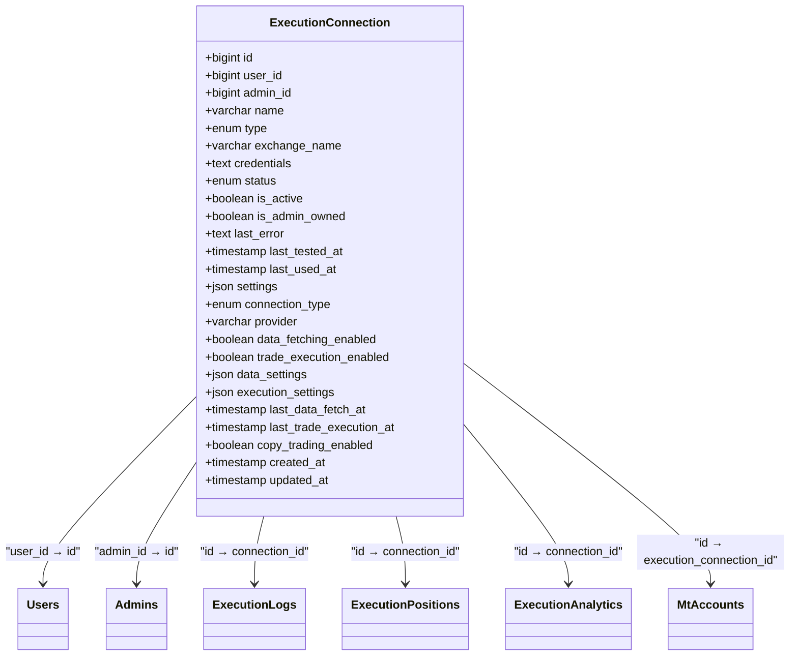
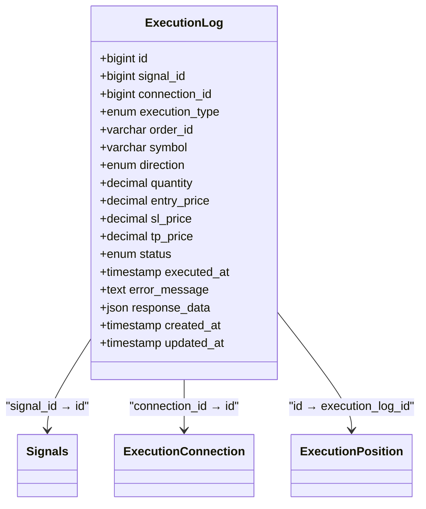
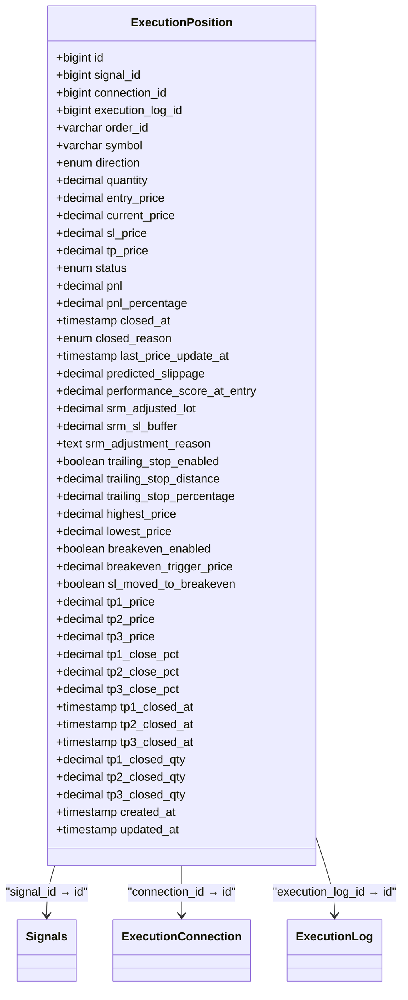
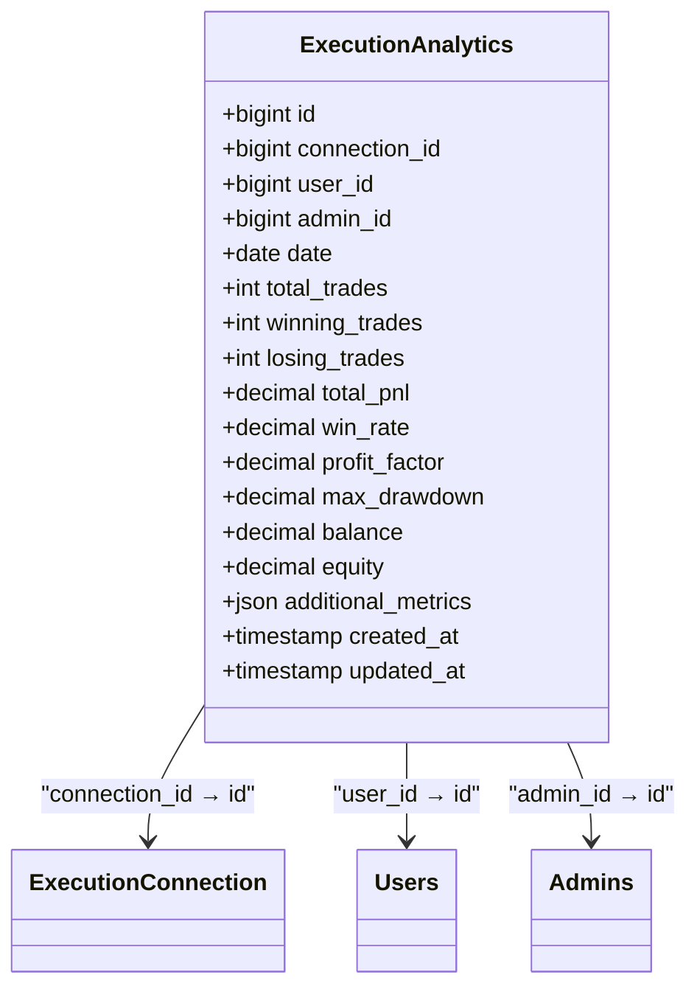
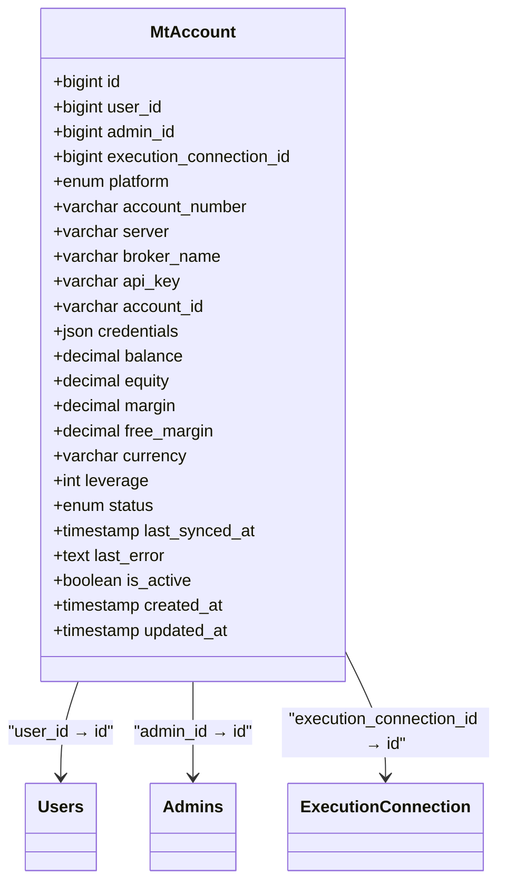
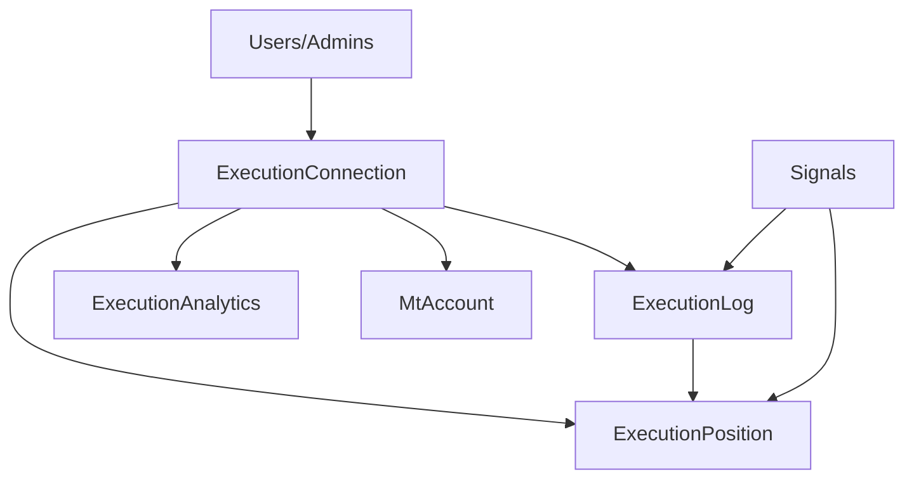

# Execution Engine Schema

<cite>
**Referenced Files in This Document**   
- [2025_01_29_100000_create_execution_connections_table.php](file://main/addons/trading-management-addon/database/migrations/2025_01_29_100000_create_execution_connections_table.php)
- [2025_01_29_100001_create_execution_logs_table.php](file://main/addons/trading-management-addon/database/migrations/2025_01_29_100001_create_execution_logs_table.php)
- [2025_01_29_100002_create_execution_positions_table.php](file://main/addons/trading-management-addon/database/migrations/2025_01_29_100002_create_execution_positions_table.php)
- [2025_01_29_100003_create_execution_analytics_table.php](file://main/addons/trading-management-addon/database/migrations/2025_01_29_100003_create_execution_analytics_table.php)
- [2025_12_05_121113_create_mt_accounts_table.php](file://main/addons/trading-management-addon/database/migrations/2025_12_05_121113_create_mt_accounts_table.php)
- [2025_12_02_120006_add_srm_fields_to_execution_positions_table.php](file://main/addons/trading-management-addon/database/migrations/2025_12_02_120006_add_srm_fields_to_execution_positions_table.php)
- [2025_12_05_121638_add_trailing_stop_fields_to_execution_positions_table.php](file://main/addons/trading-management-addon/database/migrations/2025_12_05_121638_add_trailing_stop_fields_to_execution_positions_table.php)
- [2025_01_29_100004_add_multi_tp_to_execution_positions.php](file://main/addons/trading-management-addon/database/migrations/2025_01_29_100004_add_multi_tp_to_execution_positions.php)
- [2025_12_07_125651_add_extended_fields_to_execution_connections_table.php](file://main/addons/trading-management-addon/database/migrations/2025_12_07_125651_add_extended_fields_to_execution_connections_table.php)
- [2025_12_07_134706_add_copy_trading_enabled_to_execution_connections_table.php](file://main/addons/trading-management-addon/database/migrations/2025_12_07_134706_add_copy_trading_enabled_to_execution_connections_table.php)
</cite>

## Table of Contents
1. [Introduction](#introduction)
2. [Project Structure](#project-structure)
3. [Core Components](#core-components)
4. [Architecture Overview](#architecture-overview)
5. [Detailed Component Analysis](#detailed-component-analysis)
6. [Dependency Analysis](#dependency-analysis)
7. [Performance Considerations](#performance-considerations)
8. [Troubleshooting Guide](#troubleshooting-guide)
9. [Conclusion](#conclusion)

## Introduction
This document provides comprehensive data model documentation for the Execution Engine schema, detailing the entity relationships, field definitions, constraints, and data access patterns for key components including ExecutionConnection, ExecutionLog, ExecutionPosition, ExecutionAnalytics, and MtAccount. The schema supports automated trading execution with robust security, analytics, and lifecycle management.

## Project Structure
The Execution Engine schema is implemented within the trading-management-addon module, with database migrations located in the `database/migrations` directory. The core schema components are defined across multiple migration files that establish the foundational tables and subsequent enhancements.

**Diagram sources**
- [2025_01_29_100000_create_execution_connections_table.php](file://main/addons/trading-management-addon/database/migrations/2025_01_29_100000_create_execution_connections_table.php)
- [2025_01_29_100001_create_execution_logs_table.php](file://main/addons/trading-management-addon/database/migrations/2025_01_29_100001_create_execution_logs_table.php)
- [2025_01_29_100002_create_execution_positions_table.php](file://main/addons/trading-management-addon/database/migrations/2025_01_29_100002_create_execution_positions_table.php)

**Section sources**
- [main/addons/trading-management-addon/database/migrations](file://main/addons/trading-management-addon/database/migrations)

## Core Components
The Execution Engine schema consists of five primary entities that work together to manage trading execution workflows: ExecutionConnection, ExecutionLog, ExecutionPosition, ExecutionAnalytics, and MtAccount. These components form a cohesive system for managing trading connections, recording execution events, tracking open positions, analyzing performance, and interfacing with MetaTrader accounts.

**Section sources**
- [2025_01_29_100000_create_execution_connections_table.php](file://main/addons/trading-management-addon/database/migrations/2025_01_29_100000_create_execution_connections_table.php)
- [2025_01_29_100001_create_execution_logs_table.php](file://main/addons/trading-management-addon/database/migrations/2025_01_29_100001_create_execution_logs_table.php)
- [2025_01_29_100002_create_execution_positions_table.php](file://main/addons/trading-management-addon/database/migrations/2025_01_29_100002_create_execution_positions_table.php)
- [2025_01_29_100003_create_execution_analytics_table.php](file://main/addons/trading-management-addon/database/migrations/2025_01_29_100003_create_execution_analytics_table.php)
- [2025_12_05_121113_create_mt_accounts_table.php](file://main/addons/trading-management-addon/database/migrations/2025_12_05_121113_create_mt_accounts_table.php)

## Architecture Overview
The Execution Engine schema follows a normalized relational design with clear entity relationships and referential integrity constraints. The architecture supports atomic execution operations, comprehensive analytics, and secure credential management.

**Diagram sources**
- [2025_01_29_100000_create_execution_connections_table.php](file://main/addons/trading-management-addon/database/migrations/2025_01_29_100000_create_execution_connections_table.php)
- [2025_01_29_100001_create_execution_logs_table.php](file://main/addons/trading-management-addon/database/migrations/2025_01_29_100001_create_execution_logs_table.php)
- [2025_01_29_100002_create_execution_positions_table.php](file://main/addons/trading-management-addon/database/migrations/2025_01_29_100002_create_execution_positions_table.php)
- [2025_01_29_100003_create_execution_analytics_table.php](file://main/addons/trading-management-addon/database/migrations/2025_01_29_100003_create_execution_analytics_table.php)
- [2025_12_05_121113_create_mt_accounts_table.php](file://main/addons/trading-management-addon/database/migrations/2025_12_05_121113_create_mt_accounts_table.php)

## Detailed Component Analysis

### ExecutionConnection Analysis
The ExecutionConnection entity represents a trading connection to an exchange or broker, storing encrypted credentials and configuration settings. It serves as the foundation for all execution operations.

**Diagram sources**
- [2025_01_29_100000_create_execution_connections_table.php](file://main/addons/trading-management-addon/database/migrations/2025_01_29_100000_create_execution_connections_table.php)
- [2025_12_07_125651_add_extended_fields_to_execution_connections_table.php](file://main/addons/trading-management-addon/database/migrations/2025_12_07_125651_add_extended_fields_to_execution_connections_table.php)
- [2025_12_07_134706_add_copy_trading_enabled_to_execution_connections_table.php](file://main/addons/trading-management-addon/database/migrations/2025_12_07_134706_add_copy_trading_enabled_to_execution_connections_table.php)

**Section sources**
- [2025_01_29_100000_create_execution_connections_table.php](file://main/addons/trading-management-addon/database/migrations/2025_01_29_100000_create_execution_connections_table.php)
- [2025_12_07_125651_add_extended_fields_to_execution_connections_table.php](file://main/addons/trading-management-addon/database/migrations/2025_12_07_125651_add_extended_fields_to_execution_connections_table.php)

### ExecutionLog Analysis
The ExecutionLog entity records the execution events for trading signals, capturing the status and outcome of each execution attempt.

**Diagram sources**
- [2025_01_29_100001_create_execution_logs_table.php](file://main/addons/trading-management-addon/database/migrations/2025_01_29_100001_create_execution_logs_table.php)

**Section sources**
- [2025_01_29_100001_create_execution_logs_table.php](file://main/addons/trading-management-addon/database/migrations/2025_01_29_100001_create_execution_logs_table.php)

### ExecutionPosition Analysis
The ExecutionPosition entity tracks open and closed trading positions with comprehensive risk management parameters including multi-take profit levels, trailing stops, and smart risk management adjustments.

**Diagram sources**
- [2025_01_29_100002_create_execution_positions_table.php](file://main/addons/trading-management-addon/database/migrations/2025_01_29_100002_create_execution_positions_table.php)
- [2025_12_02_120006_add_srm_fields_to_execution_positions_table.php](file://main/addons/trading-management-addon/database/migrations/2025_12_02_120006_add_srm_fields_to_execution_positions_table.php)
- [2025_12_05_121638_add_trailing_stop_fields_to_execution_positions_table.php](file://main/addons/trading-management-addon/database/migrations/2025_12_05_121638_add_trailing_stop_fields_to_execution_positions_table.php)
- [2025_01_29_100004_add_multi_tp_to_execution_positions.php](file://main/addons/trading-management-addon/database/migrations/2025_01_29_100004_add_multi_tp_to_execution_positions.php)

**Section sources**
- [2025_01_29_100002_create_execution_positions_table.php](file://main/addons/trading-management-addon/database/migrations/2025_01_29_100002_create_execution_positions_table.php)
- [2025_12_02_120006_add_srm_fields_to_execution_positions_table.php](file://main/addons/trading-management-addon/database/migrations/2025_12_02_120006_add_srm_fields_to_execution_positions_table.php)
- [2025_12_05_121638_add_trailing_stop_fields_to_execution_positions_table.php](file://main/addons/trading-management-addon/database/migrations/2025_12_05_121638_add_trailing_stop_fields_to_execution_positions_table.php)
- [2025_01_29_100004_add_multi_tp_to_execution_positions.php](file://main/addons/trading-management-addon/database/migrations/2025_01_29_100004_add_multi_tp_to_execution_positions.php)

### ExecutionAnalytics Analysis
The ExecutionAnalytics entity provides daily performance metrics for execution connections, enabling comprehensive performance analysis and reporting.

**Diagram sources**
- [2025_01_29_100003_create_execution_analytics_table.php](file://main/addons/trading-management-addon/database/migrations/2025_01_29_100003_create_execution_analytics_table.php)

**Section sources**
- [2025_01_29_100003_create_execution_analytics_table.php](file://main/addons/trading-management-addon/database/migrations/2025_01_29_100003_create_execution_analytics_table.php)

### MtAccount Analysis
The MtAccount entity represents MetaTrader accounts linked to execution connections, storing account-specific details and real-time balance information.

**Diagram sources**
- [2025_12_05_121113_create_mt_accounts_table.php](file://main/addons/trading-management-addon/database/migrations/2025_12_05_121113_create_mt_accounts_table.php)

**Section sources**
- [2025_12_05_121113_create_mt_accounts_table.php](file://main/addons/trading-management-addon/database/migrations/2025_12_05_121113_create_mt_accounts_table.php)

## Dependency Analysis
The Execution Engine schema demonstrates a well-structured dependency graph with clear parent-child relationships. The ExecutionConnection serves as the central entity, with other components depending on it for referential integrity.

**Diagram sources**
- [2025_01_29_100000_create_execution_connections_table.php](file://main/addons/trading-management-addon/database/migrations/2025_01_29_100000_create_execution_connections_table.php)
- [2025_01_29_100001_create_execution_logs_table.php](file://main/addons/trading-management-addon/database/migrations/2025_01_29_100001_create_execution_logs_table.php)
- [2025_01_29_100002_create_execution_positions_table.php](file://main/addons/trading-management-addon/database/migrations/2025_01_29_100002_create_execution_positions_table.php)

**Section sources**
- [2025_01_29_100000_create_execution_connections_table.php](file://main/addons/trading-management-addon/database/migrations/2025_01_29_100000_create_execution_connections_table.php)
- [2025_01_29_100001_create_execution_logs_table.php](file://main/addons/trading-management-addon/database/migrations/2025_01_29_100001_create_execution_logs_table.php)
- [2025_01_29_100002_create_execution_positions_table.php](file://main/addons/trading-management-addon/database/migrations/2025_01_29_100002_create_execution_positions_table.php)

## Performance Considerations
The schema includes multiple indexes to optimize query performance for common access patterns:
- Indexes on foreign keys (user_id, admin_id, connection_id, signal_id)
- Indexes on status fields for filtering active/inactive records
- Indexes on timestamps for time-based queries
- Composite indexes on frequently queried field combinations
- Unique constraints to prevent duplicate records

The indexing strategy supports efficient queries for real-time position monitoring, execution performance analysis, and connection health tracking.

**Section sources**
- [2025_01_29_100000_create_execution_connections_table.php](file://main/addons/trading-management-addon/database/migrations/2025_01_29_100000_create_execution_connections_table.php)
- [2025_01_29_100001_create_execution_logs_table.php](file://main/addons/trading-management-addon/database/migrations/2025_01_29_100001_create_execution_logs_table.php)
- [2025_01_29_100002_create_execution_positions_table.php](file://main/addons/trading-management-addon/database/migrations/2025_01_29_100002_create_execution_positions_table.php)

## Troubleshooting Guide
Common issues and their resolutions:
- **Connection failures**: Check credentials encryption, verify API key validity, ensure network connectivity
- **Execution timeouts**: Verify exchange API rate limits, check server load, review execution settings
- **Position synchronization issues**: Validate MtAccount configuration, check last_synced_at timestamps, verify API connectivity
- **Analytics discrepancies**: Ensure daily aggregation jobs are running, verify data consistency between related tables
- **Performance degradation**: Monitor index usage, check for long-running queries, review database statistics

**Section sources**
- [2025_01_29_100000_create_execution_connections_table.php](file://main/addons/trading-management-addon/database/migrations/2025_01_29_100000_create_execution_connections_table.php)
- [2025_01_29_100001_create_execution_logs_table.php](file://main/addons/trading-management-addon/database/migrations/2025_01_29_100001_create_execution_logs_table.php)
- [2025_12_05_121113_create_mt_accounts_table.php](file://main/addons/trading-management-addon/database/migrations/2025_12_05_121113_create_mt_accounts_table.php)

## Conclusion
The Execution Engine schema provides a robust foundation for automated trading execution with comprehensive support for connection management, execution logging, position tracking, performance analytics, and MetaTrader integration. The schema design emphasizes data integrity, security, and performance with appropriate constraints, indexes, and encryption mechanisms. The modular structure allows for extensibility through additional fields and tables while maintaining referential integrity across components.