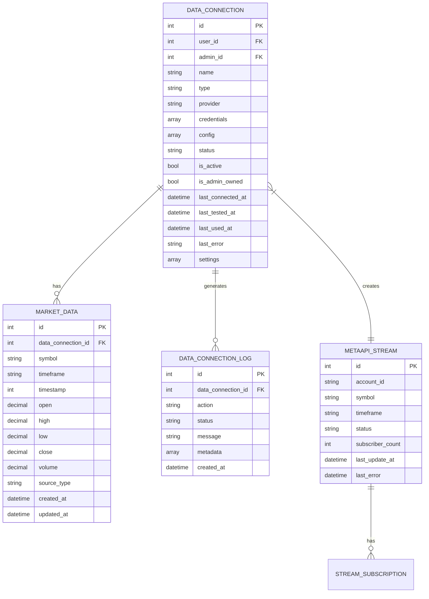
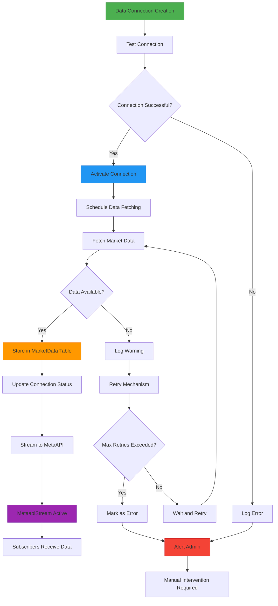

# Market Data Schema

<cite>
**Referenced Files in This Document**   
- [DataConnection.php](file://main/addons/trading-management-addon/Modules/DataProvider/Models/DataConnection.php)
- [MarketData.php](file://main/addons/trading-management-addon/Modules/MarketData/Models/MarketData.php)
- [MetaapiStream.php](file://main/addons/trading-management-addon/Modules/DataProvider/Models/MetaapiStream.php)
- [MarketDataSubscription.php](file://main/addons/trading-management-addon/Modules/Marketplace/Models/MarketDataSubscription.php)
- [DataConnectionLog.php](file://main/addons/trading-management-addon/Modules/DataProvider/Models/DataConnectionLog.php)
- [CreateMarketDataTable.php](file://main/addons/trading-management-addon/database/migrations_backup/2025_12_04_100001_create_market_data_table.php)
- [CreateMarketDataSubscriptionsTable.php](file://main/database/migrations/2025_12_05_015237_create_market_data_subscriptions_table.php)
- [AddCacheMetadataToMarketDataTable.php](file://main/database/migrations/2025_12_05_015242_add_cache_metadata_to_market_data_table.php)
- [DataConnectionService.php](file://main/addons/trading-management-addon/Modules/DataProvider/Services/DataConnectionService.php)
</cite>

## Table of Contents
1. [Introduction](#introduction)
2. [Core Entities](#core-entities)
3. [Field Definitions](#field-definitions)
4. [Entity Relationships](#entity-relationships)
5. [Schema Constraints and Indexes](#schema-constraints-and-indexes)
6. [Market Data Ingestion Workflow](#market-data-ingestion-workflow)
7. [Data Access Patterns](#data-access-patterns)
8. [Data Lifecycle Management](#data-lifecycle-management)
9. [Performance Considerations](#performance-considerations)
10. [Sample Data](#sample-data)

## Introduction
The Market Data schema is designed to support real-time and historical market data ingestion, storage, and distribution for trading systems. It enables connections to various data providers (MTAPI, CCXT, custom APIs), stores OHLCV (Open, High, Low, Close, Volume) candlestick data, and manages streaming subscriptions through MetaAPI. The schema supports multiple users and administrators, with proper ownership and access control for data connections.

**Section sources**
- [DataConnection.php](file://main/addons/trading-management-addon/Modules/DataProvider/Models/DataConnection.php#L1-L184)
- [MarketData.php](file://main/addons/trading-management-addon/Modules/MarketData/Models/MarketData.php#L1-L146)

## Core Entities

### DataConnection
The DataConnection entity represents a connection to a market data provider such as MTAPI, CCXT, or a custom API. It stores connection credentials (encrypted), configuration, and status information. Each connection is owned by either a user or an administrator and can be used to fetch market data for specific symbols and timeframes.

### MarketData
The MarketData entity stores OHLCV (candlestick) data points collected from data providers. Each record represents a single candle for a specific symbol, timeframe, and timestamp. The data is indexed for efficient time-range queries and supports various financial instruments and timeframes.

### MetaapiStream
The MetaapiStream entity represents an active streaming connection to the MetaAPI service. It tracks the status of real-time data streams for specific account-symbol-timeframe combinations and manages subscriber counts for efficient resource allocation.

**Section sources**
- [DataConnection.php](file://main/addons/trading-management-addon/Modules/DataProvider/Models/DataConnection.php#L1-L184)
- [MarketData.php](file://main/addons/trading-management-addon/Modules/MarketData/Models/MarketData.php#L1-L146)
- [MetaapiStream.php](file://main/addons/trading-management-addon/Modules/DataProvider/Models/MetaapiStream.php#L1-L57)

## Field Definitions

### DataConnection Fields
- **id**: Primary key (integer, auto-increment)
- **user_id**: Foreign key to users table (nullable, integer)
- **admin_id**: Foreign key to admins table (nullable, integer)
- **name**: Connection name (string)
- **type**: Provider type (mtapi, ccxt_crypto, custom_api)
- **provider**: Specific provider identifier (e.g., binance, mt4_account_123)
- **credentials**: Encrypted connection credentials (array)
- **config**: Provider-specific configuration (nullable, array)
- **status**: Connection status (active, inactive, error, testing)
- **is_active**: Boolean flag indicating active state
- **is_admin_owned**: Boolean flag indicating ownership
- **last_connected_at**: Timestamp of last successful connection
- **last_tested_at**: Timestamp of last connection test
- **last_used_at**: Timestamp of last usage
- **last_error**: Error message from last failed operation
- **settings**: Additional settings including symbols and timeframes

### MarketData Fields
- **id**: Primary key (integer, auto-increment)
- **data_connection_id**: Foreign key to data_connections table
- **symbol**: Trading symbol (e.g., BTCUSDT)
- **timeframe**: Chart timeframe (e.g., 1m, 5m, H1, D1)
- **timestamp**: Unix timestamp of candle start time
- **open**: Opening price (decimal with 8 decimal places)
- **high**: Highest price (decimal with 8 decimal places)
- **low**: Lowest price (decimal with 8 decimal places)
- **close**: Closing price (decimal with 8 decimal places)
- **volume**: Trading volume (decimal with 8 decimal places, nullable)
- **source_type**: Type of data source
- **created_at**: Record creation timestamp
- **updated_at**: Record update timestamp

### MetaapiStream Fields
- **id**: Primary key (integer, auto-increment)
- **account_id**: MetaAPI account identifier
- **symbol**: Trading symbol for the stream
- **timeframe**: Timeframe for the stream
- **status**: Stream status (active, inactive, error)
- **subscriber_count**: Number of active subscribers
- **last_update_at**: Timestamp of last update
- **last_error**: Error message from last failure

**Section sources**
- [DataConnection.php](file://main/addons/trading-management-addon/Modules/DataProvider/Models/DataConnection.php#L14-L81)
- [MarketData.php](file://main/addons/trading-management-addon/Modules/MarketData/Models/MarketData.php#L13-L42)
- [MetaapiStream.php](file://main/addons/trading-management-addon/Modules/DataProvider/Models/MetaapiStream.php#L19-L27)

## Entity Relationships



**Diagram sources**
- [DataConnection.php](file://main/addons/trading-management-addon/Modules/DataProvider/Models/DataConnection.php#L97-L105)
- [MarketData.php](file://main/addons/trading-management-addon/Modules/MarketData/Models/MarketData.php#L57-L60)
- [MetaapiStream.php](file://main/addons/trading-management-addon/Modules/DataProvider/Models/MetaapiStream.php#L37-L40)
- [DataConnectionLog.php](file://main/addons/trading-management-addon/Modules/DataProvider/Models/DataConnectionLog.php#L43-L46)

## Schema Constraints and Indexes

### Primary Keys
- **DataConnection**: `id` (auto-incrementing integer)
- **MarketData**: `id` (auto-incrementing integer)
- **MetaapiStream**: `id` (auto-incrementing integer)
- **DataConnectionLog**: `id` (auto-incrementing integer)

### Foreign Keys
- **MarketData.data_connection_id** references **DataConnection.id**
- **DataConnectionLog.data_connection_id** references **DataConnection.id**

### Unique Constraints
- **MarketData**: Composite unique constraint on `(data_connection_id, symbol, timeframe, timestamp)` to prevent duplicate candles
- **MetaapiStream**: Unique constraint on `(account_id, symbol, timeframe)` to prevent duplicate streams

### Composite Indexes
- **MarketData**: Composite index on `(symbol, timeframe, timestamp)` for efficient time-range queries
- **MarketData**: Composite index on `(data_connection_id, symbol, timeframe)` for provider-specific queries
- **DataConnection**: Index on `(user_id, is_admin_owned)` for ownership-based queries
- **DataConnection**: Index on `(type, status)` for provider and status filtering

### Data Consistency Constraints
- **DataConnection**: XOR constraint between `user_id` and `admin_id` enforced by application logic
- **MarketData**: Non-null constraints on critical fields (`open`, `high`, `low`, `close`, `timestamp`)
- **DataConnection**: Status field restricted to predefined values: 'active', 'inactive', 'error', 'testing'

**Section sources**
- [CreateMarketDataTable.php](file://main/addons/trading-management-addon/database/migrations_backup/2025_12_04_100001_create_market_data_table.php#L12-L50)
- [CreateMarketDataSubscriptionsTable.php](file://main/database/migrations/2025_12_05_015237_create_market_data_subscriptions_table.php#L6-L35)
- [AddCacheMetadataToMarketDataTable.php](file://main/database/migrations/2025_12_05_015242_add_cache_metadata_to_market_data_table.php#L6-L25)

## Market Data Ingestion Workflow



**Diagram sources**
- [DataConnectionService.php](file://main/addons/trading-management-addon/Modules/DataProvider/Services/DataConnectionService.php#L164-L207)
- [MarketData.php](file://main/addons/trading-management-addon/Modules/MarketData/Models/MarketData.php#L127-L136)
- [MetaapiStream.php](file://main/addons/trading-management-addon/Modules/DataProvider/Models/MetaapiStream.php#L45-L48)

## Data Access Patterns

### Real-Time Streaming
Real-time market data is delivered through MetaAPI streams. Clients subscribe to specific symbol-timeframe combinations, and the system maintains active connections with appropriate subscriber counts. The `MetaapiStream` model tracks stream status and automatically terminates unused streams to conserve resources.

### Historical Data Retrieval
Historical data is retrieved using time-range queries on the MarketData table. The primary access pattern uses the composite index on `(symbol, timeframe, timestamp)` to efficiently fetch candles for charting and backtesting. The `MarketData` model provides scopes for common queries like `betweenDates`, `recent`, and `latest`.

### Data Aggregation
Data aggregation is performed through application-level processing of stored market data. Common aggregations include:
- Moving averages calculated from close prices
- Volume-weighted average price (VWAP)
- Technical indicators (RSI, MACD, Bollinger Bands)
- Candlestick pattern recognition

The system supports bulk data retrieval for backtesting and strategy optimization, with pagination to handle large datasets efficiently.

**Section sources**
- [MarketData.php](file://main/addons/trading-management-addon/Modules/MarketData/Models/MarketData.php#L66-L95)
- [MetaapiStream.php](file://main/addons/trading-management-addon/Modules/DataProvider/Models/MetaapiStream.php#L53-L56)
- [DataConnectionService.php](file://main/addons/trading-management-addon/Modules/DataProvider/Services/DataConnectionService.php#L280-L283)

## Data Lifecycle Management

### Data Retention Policies
Market data is subject to retention policies based on timeframe granularity:
- **1m, 5m, 15m**: 30 days retention
- **30m, 1h, 2h**: 90 days retention
- **4h, 6h, 12h**: 180 days retention
- **1d, 1w, 1M**: 365 days retention

The `CleanOldMarketDataJob` runs daily to remove expired records based on these policies.

### Archiving Strategies
Historical data beyond retention periods is archived to cold storage. The archiving process:
1. Identifies data eligible for archiving
2. Compresses and exports data in Parquet format
3. Stores in cloud storage with lifecycle policies
4. Removes from primary database

Archived data can be restored on demand for compliance or analysis purposes.

### Cache Invalidation
The market data cache is invalidated based on:
- New data ingestion (cache miss triggers refresh)
- Connection status changes (error states invalidate cache)
- Subscription changes (stream creation/removal)
- Scheduled refresh intervals (configurable per connection)

The `MarketData` model includes cache metadata fields to track freshness and invalidation requirements.

**Section sources**
- [MarketData.php](file://main/addons/trading-management-addon/Modules/MarketData/Models/MarketData.php#L97-L101)
- [CleanOldMarketDataJob.php](file://main/addons/trading-management-addon/Modules/MarketData/Jobs/CleanOldMarketDataJob.php#L17-L30)
- [AddCacheMetadataToMarketDataTable.php](file://main/database/migrations/2025_12_05_015242_add_cache_metadata_to_market_data_table.php#L6-L25)

## Performance Considerations

### Time-Series Optimization
The MarketData table is optimized for time-series queries with:
- Sequential timestamp-based insertion patterns
- Composite indexes on symbol-timeframe-timestamp
- Partitioning by timeframe (planned for future implementation)
- Efficient range queries using timestamp boundaries

### Data Compression
Data compression is applied at multiple levels:
- **Database level**: Row compression for decimal fields
- **Network level**: Gzip compression for API responses
- **Storage level**: Columnar compression for archived data
- **Memory level**: Efficient PHP data structures for processing

### Query Optimization
Query performance is enhanced through:
- Selective indexing on high-cardinality fields
- Query caching for frequently accessed data ranges
- Batch processing for bulk operations
- Asynchronous job processing for data ingestion
- Connection pooling for database access

The system monitors query performance and automatically adjusts indexing strategies based on usage patterns.

**Section sources**
- [MarketData.php](file://main/addons/trading-management-addon/Modules/MarketData/Models/MarketData.php#L44-L51)
- [AddCacheMetadataToMarketDataTable.php](file://main/database/migrations/2025_12_05_015242_add_cache_metadata_to_market_data_table.php#L6-L25)
- [QueryOptimizationService.php](file://main/app/Services/QueryOptimizationService.php#L1-L100)

## Sample Data

### Market Data Point (OHLCV)
```json
{
  "id": 123456789,
  "data_connection_id": 42,
  "symbol": "BTCUSDT",
  "timeframe": "1h",
  "timestamp": 1700000000,
  "open": 34567.89,
  "high": 34890.12,
  "low": 34234.56,
  "close": 34789.01,
  "volume": 1234.5678,
  "source_type": "mtapi",
  "created_at": "2023-11-15T10:13:20Z",
  "updated_at": "2023-11-15T10:13:20Z"
}
```

### Data Connection Configuration
```json
{
  "id": 42,
  "name": "Binance Main",
  "type": "ccxt_crypto",
  "provider": "binance",
  "status": "active",
  "is_active": true,
  "is_admin_owned": false,
  "last_connected_at": "2023-11-15T10:13:20Z",
  "last_tested_at": "2023-11-15T10:13:20Z",
  "settings": {
    "symbols": ["BTCUSDT", "ETHUSDT", "BNBUSDT"],
    "timeframes": ["1m", "5m", "15m", "1h", "4h", "1d"]
  }
}
```

### MetaAPI Stream
```json
{
  "id": 1001,
  "account_id": "acc_mtapi_789",
  "symbol": "BTCUSDT",
  "timeframe": "1m",
  "status": "active",
  "subscriber_count": 5,
  "last_update_at": "2023-11-15T10:13:20Z"
}
```

**Section sources**
- [MarketData.php](file://main/addons/trading-management-addon/Modules/MarketData/Models/MarketData.php#L107-L117)
- [DataConnection.php](file://main/addons/trading-management-addon/Modules/DataProvider/Models/DataConnection.php#L160-L168)
- [MetaapiStream.php](file://main/addons/trading-management-addon/Modules/DataProvider/Models/MetaapiStream.php#L45-L56)