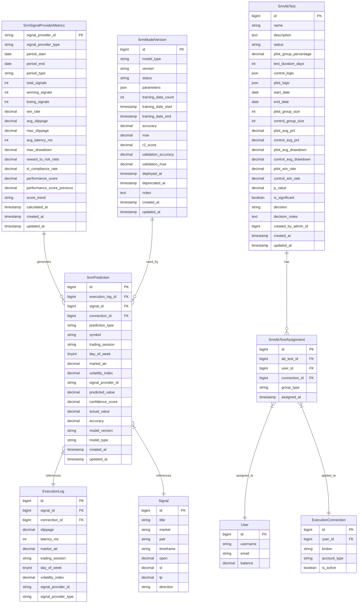
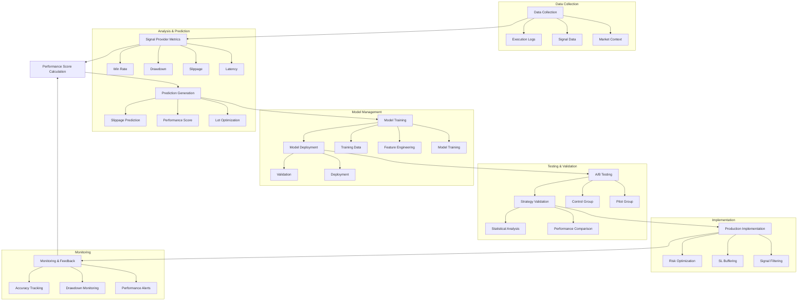

# Risk Management Schema

<cite>
**Referenced Files in This Document**   
- [plan.md](file://main/specs/active/ai-smart-risk-management/plan.md)
- [tasks.md](file://main/specs/active/ai-smart-risk-management/tasks.md)
- [database.sql](file://install/lib/database.sql)
- [admin.php](file://main/addons/_deprecated/smart-risk-management-addon/routes/admin.php)
</cite>

## Table of Contents
1. [Introduction](#introduction)
2. [Entity Relationship Model](#entity-relationship-model)
3. [Core Entities and Field Definitions](#core-entities-and-field-definitions)
4. [Risk Metrics and Prediction Models](#risk-metrics-and-prediction-models)
5. [Primary and Foreign Keys](#primary-and-foreign-keys)
6. [Indexes and Constraints](#indexes-and-constraints)
7. [Risk Assessment Workflow](#risk-assessment-workflow)
8. [Sample Data and Risk Profiles](#sample-data-and-risk-profiles)
9. [Data Access Patterns](#data-access-patterns)
10. [Data Lifecycle Management](#data-lifecycle-management)
11. [Security and Integrity](#security-and-integrity)
12. [Conclusion](#conclusion)

## Introduction

The Risk Management Schema is a comprehensive system designed to evaluate and mitigate trading risks through AI-powered analytics and adaptive mechanisms. This schema centers around four core entities: SrmSignalProviderMetrics, SrmPrediction, SrmModelVersion, and SrmAbTest, which work together to create a dynamic risk assessment framework. The system collects performance data from signal providers, generates predictions using machine learning models, manages model versions, and conducts A/B testing to validate new risk strategies. By analyzing historical performance, market conditions, and execution quality, the schema enables intelligent decision-making for position sizing, stop-loss placement, and trade filtering. This documentation provides a detailed overview of the schema's structure, relationships, and operational workflows, serving as a comprehensive reference for developers, analysts, and risk managers.

**Section sources**
- [plan.md](file://main/specs/active/ai-smart-risk-management/plan.md#L1-L756)

## Entity Relationship Model



**Diagram sources**
- [plan.md](file://main/specs/active/ai-smart-risk-management/plan.md#L46-L2707)
- [database.sql](file://install/lib/database.sql#L1720-L2707)

## Core Entities and Field Definitions

The Risk Management Schema comprises four primary entities that work in concert to assess and manage trading risks. Each entity serves a distinct purpose in the risk assessment workflow, from collecting provider performance data to generating predictions and managing model versions.

### SrmSignalProviderMetrics

This entity stores comprehensive performance metrics for signal providers, enabling the calculation of a dynamic performance score. The metrics are aggregated over specific time periods (daily, weekly, monthly) and include both quantitative measures and qualitative assessments.

**Field Definitions:**
- **signal_provider_id**: Unique identifier for the signal provider (channel_source_id or user_id)
- **signal_provider_type**: Type of provider (channel_source or user)
- **period_start/period_end**: Date range for the metrics aggregation
- **period_type**: Granularity of the period (daily, weekly, monthly)
- **total_signals**: Total number of signals generated in the period
- **winning_signals/losing_signals**: Count of profitable and unprofitable signals
- **win_rate**: Percentage of winning signals
- **avg_slippage/max_slippage**: Average and maximum slippage in pips
- **avg_latency_ms**: Average execution latency in milliseconds
- **max_drawdown**: Maximum drawdown as a percentage
- **reward_to_risk_ratio**: Average reward-to-risk ratio across trades
- **sl_compliance_rate**: Percentage of trades where the signal provider respected stop-loss levels
- **performance_score**: Dynamic score (0-100) reflecting overall provider quality
- **performance_score_previous**: Previous performance score for trend calculation
- **score_trend**: Direction of score change (up, down, stable)
- **calculated_at**: Timestamp when metrics were last calculated

**Section sources**
- [plan.md](file://main/specs/active/ai-smart-risk-management/plan.md#L46-L83)

### SrmPrediction

This entity captures predictions generated by machine learning models for various risk parameters. Each prediction includes both the predicted value and confidence metrics, along with actual outcomes for accuracy tracking.

**Field Definitions:**
- **execution_log_id**: Foreign key to execution_logs table
- **signal_id**: Foreign key to signals table
- **connection_id**: Foreign key to execution_connections table
- **prediction_type**: Type of prediction (slippage, performance_score, lot_optimization)
- **symbol**: Trading symbol for which prediction was made
- **trading_session**: Market session (TOKYO, LONDON, NEW_YORK, ASIAN, OVERLAP)
- **day_of_week**: Day of week (1-7) when prediction was made
- **market_atr**: Average True Range value at prediction time
- **volatility_index**: Calculated market volatility metric
- **signal_provider_id**: Identifier of the signal provider
- **predicted_value**: Predicted value (slippage in pips, performance score, or lot size)
- **confidence_score**: Confidence level of the prediction (0-100)
- **actual_value**: Actual outcome after execution for accuracy calculation
- **accuracy**: Percentage accuracy when actual value is available
- **model_version**: Version of ML model used for prediction
- **model_type**: Type of model used (regression, weighted_scoring, etc.)

**Section sources**
- [plan.md](file://main/specs/active/ai-smart-risk-management/plan.md#L84-L127)

### SrmModelVersion

This entity manages the lifecycle of machine learning models used in the risk management system. It tracks model parameters, training data, performance metrics, and deployment status.

**Field Definitions:**
- **model_type**: Type of model (slippage_prediction, performance_score, risk_optimization)
- **version**: Version identifier for the model
- **status**: Current status (training, active, deprecated, testing)
- **parameters**: JSON field containing model hyperparameters and weights
- **training_data_count**: Number of samples used in training
- **training_date_start/end**: Date range for model training
- **accuracy/mse/r2_score**: Performance metrics from training
- **validation_accuracy/validation_mse**: Performance metrics from validation
- **deployed_at/deprecated_at**: Timestamps for deployment and deprecation
- **notes**: Additional information about the model

**Section sources**
- [plan.md](file://main/specs/active/ai-smart-risk-management/plan.md#L130-L165)

### SrmAbTest

This entity facilitates A/B testing of different risk management strategies. It allows comparison of control and pilot logic variants to determine optimal approaches.

**Field Definitions:**
- **name**: Descriptive name for the A/B test
- **description**: Detailed explanation of the test purpose
- **status**: Current status (draft, running, paused, completed, cancelled)
- **pilot_group_percentage**: Percentage of users in the pilot group
- **test_duration_days**: Planned duration of the test
- **control_logic/pilot_logic**: JSON representations of the control and pilot strategies
- **start_date/end_date**: Actual start and end dates of the test
- **pilot_group_size/control_group_size**: Number of participants in each group
- **pilot_avg_pnl/control_avg_pnl**: Average profit and loss for each group
- **pilot_avg_drawdown/control_avg_drawdown**: Average drawdown for each group
- **pilot_win_rate/control_win_rate**: Win rates for each group
- **p_value**: Statistical significance of results
- **is_significant**: Boolean indicating if results are statistically significant
- **decision**: Final decision (deploy, reject, extend)
- **decision_notes**: Explanation of the decision

**Section sources**
- [plan.md](file://main/specs/active/ai-smart-risk-management/plan.md#L168-L213)

## Risk Metrics and Prediction Models

The Risk Management Schema employs a sophisticated system of risk metrics and prediction models to assess trading performance and forecast potential outcomes. These models leverage historical data and machine learning techniques to generate actionable insights for risk mitigation.

### Risk Metrics

The schema tracks a comprehensive set of risk metrics that evaluate signal provider performance from multiple dimensions:

**Drawdown**: Maximum drawdown is calculated as the largest peak-to-trough decline in equity percentage. This metric helps identify providers with excessive risk-taking behavior. The system monitors both individual trade drawdown and cumulative drawdown across multiple trades.

**Volatility**: Volatility is measured using multiple indicators including Average True Range (ATR) and a custom volatility index. The ATR provides a measure of price movement magnitude, while the volatility index combines multiple factors to assess overall market turbulence.

**Sharpe Ratio**: The Sharpe ratio is calculated as the average return earned in excess of the risk-free rate per unit of volatility. In this system, it's adapted to trading contexts by comparing average profit per trade to standard deviation of returns.

**Performance Score**: A composite metric ranging from 0-100 that combines multiple factors:
- Win Rate (35% weight)
- Max Drawdown (25% weight) 
- Reward-to-Risk Ratio (20% weight)
- SL Compliance Rate (15% weight)
- Recent Performance Trend (5% weight)

### Prediction Models

The system implements three primary prediction models that serve different risk management functions:

**Slippage Prediction Model**: A regression model that forecasts expected slippage in pips based on features including symbol, trading session, market ATR, day of week, and signal provider history. The model uses historical execution data to identify patterns in slippage occurrence.

**Performance Score Model**: Initially implemented as a weighted scoring system, this model evolves into a Bayesian ranking algorithm. It dynamically updates provider scores based on recent performance, giving more weight to recent results while maintaining historical context.

**Risk Optimization Model**: This model calculates optimal position sizing by combining multiple factors:
- Base lot size based on risk tolerance and stop-loss distance
- Performance score multiplier (0.5x to 1.5x)
- Slippage buffer factor (reducing lot size when high slippage is predicted)
- Constraints for minimum and maximum lot sizes

**Section sources**
- [plan.md](file://main/specs/active/ai-smart-risk-management/plan.md#L436-L503)

## Primary and Foreign Keys

The Risk Management Schema employs a robust system of primary and foreign keys to maintain data integrity and enable efficient querying across related entities.

### Primary Keys

Each core table in the schema has a primary key that uniquely identifies records:

- **SrmSignalProviderMetrics**: Composite primary key consisting of signal_provider_id, signal_provider_type, period_start, period_end, and period_type. This ensures each provider's metrics are unique for a specific time period.
- **SrmPrediction**: Single-column primary key (id) with BIGINT UNSIGNED data type and AUTO_INCREMENT property.
- **SrmModelVersion**: Single-column primary key (id) with BIGINT UNSIGNED data type and AUTO_INCREMENT property.
- **SrmAbTest**: Single-column primary key (id) with BIGINT UNSIGNED data type and AUTO_INCREMENT property.
- **SrmAbTestAssignment**: Single-column primary key (id) with BIGINT UNSIGNED data type and AUTO_INCREMENT property.

### Foreign Keys

The schema establishes relationships between tables through foreign key constraints:

- **SrmPrediction.execution_log_id**: References execution_logs.id, with ON DELETE SET NULL to preserve prediction data even if the execution log is removed.
- **SrmPrediction.signal_id**: References signals.id, with ON DELETE SET NULL to maintain prediction history even if the original signal is deleted.
- **SrmAbTestAssignment.ab_test_id**: References srm_ab_tests.id, with ON DELETE CASCADE to automatically remove assignments when a test is deleted.
- **SrmAbTestAssignment.user_id**: References users.id, with ON DELETE CASCADE to remove assignments when a user account is deleted.
- **SrmAbTestAssignment.connection_id**: References execution_connections.id, with ON DELETE CASCADE to clean up assignments when connections are removed.

These foreign key relationships enable the system to trace predictions back to their source execution logs and signals, while maintaining referential integrity across the data model.

**Section sources**
- [plan.md](file://main/specs/active/ai-smart-risk-management/plan.md#L46-L2707)

## Indexes and Constraints

The Risk Management Schema implements a comprehensive indexing strategy and constraint system to ensure data integrity, optimize query performance, and enforce business rules.

### Indexes

The schema includes multiple indexes to accelerate common query patterns:

**SrmSignalProviderMetrics:**
- idx_signal_provider: Composite index on signal_provider_id and signal_provider_type for fast provider lookups
- idx_period: Composite index on period_start, period_end, and period_type for date range queries
- idx_performance_score: Index on performance_score for sorting and filtering by quality
- uk_provider_period: Unique constraint ensuring no duplicate metric records for the same provider and period

**SrmPrediction:**
- idx_execution_log: Index on execution_log_id for linking predictions to execution records
- idx_signal: Index on signal_id for connecting predictions to specific signals
- idx_connection: Index on connection_id for filtering by execution connection
- idx_prediction_type: Index on prediction_type for categorizing predictions
- idx_created_at: Index on created_at for time-based queries and sorting

**SrmModelVersion:**
- idx_model_type: Composite index on model_type and status for filtering by model category and lifecycle stage
- idx_version: Index on version for quick version lookups
- uk_model_version: Unique constraint preventing duplicate model versions for the same model type

**SrmAbTest:**
- idx_status: Index on status for filtering tests by their current state
- idx_dates: Composite index on start_date and end_date for time-based queries

**SrmAbTestAssignment:**
- idx_ab_test: Composite index on ab_test_id and group_type for efficient test group analysis
- idx_user: Index on user_id for user-based queries
- idx_connection: Index on connection_id for connection-based filtering

### Constraints

The schema enforces data validity through various constraints:

- **ENUM constraints**: Strict validation for categorical fields like prediction_type (slippage, performance_score, lot_optimization), trading_session (TOKYO, LONDON, NEW_YORK, ASIAN, OVERLAP), and model status (training, active, deprecated, testing).
- **NOT NULL constraints**: Critical fields like signal_provider_id, period_start, period_end, and predicted_value cannot be null.
- **DEFAULT values**: Fields like confidence_score default to 0.00, while performance_score defaults to 50.00 to represent neutral quality.
- **CHECK constraints**: JSON fields include CHECK constraints to ensure valid JSON format.
- **UNIQUE constraints**: Prevent duplicate records for the same provider and period combination.

These indexing and constraint mechanisms ensure the schema maintains high data quality while supporting efficient querying for risk analysis and reporting.

**Section sources**
- [plan.md](file://main/specs/active/ai-smart-risk-management/plan.md#L46-L2707)
- [database.sql](file://install/lib/database.sql#L1720-L2707)

## Risk Assessment Workflow

The Risk Management Schema implements a comprehensive workflow that transforms raw trading data into actionable risk insights. This workflow spans from data collection through model evaluation, creating a continuous learning loop that improves risk management over time.



**Diagram sources**
- [plan.md](file://main/specs/active/ai-smart-risk-management/plan.md#L264-L756)

The workflow begins with comprehensive data collection from execution logs, signal data, and market context. This data feeds into the SrmSignalProviderMetrics entity, where performance metrics are calculated for each provider over defined time periods. These metrics are then used to compute a dynamic performance score that reflects the provider's current quality.

Based on historical data and current market conditions, the system generates predictions for key risk parameters including slippage, performance scores, and optimal lot sizes. These predictions are stored in the SrmPrediction table with associated confidence scores and actual outcomes for accuracy tracking.

The prediction models are continuously trained and improved through a machine learning pipeline. Historical prediction accuracy and actual outcomes serve as training data for model retraining. New model versions are created and tested before deployment to production.

A/B testing plays a crucial role in validating new risk strategies. The SrmAbTest entity allows comparison of control and pilot logic variants across user groups, with statistical analysis determining the optimal approach. Successful strategies are then implemented in production.

The implemented risk management strategies include position sizing optimization, stop-loss buffering, and signal quality filtering. These mechanisms work together to reduce risk exposure while maintaining profitability.

Continuous monitoring provides feedback to the system, with accuracy tracking, drawdown monitoring, and performance alerts ensuring the risk management system adapts to changing market conditions. This closed-loop workflow creates a self-improving system that enhances risk management effectiveness over time.

**Section sources**
- [plan.md](file://main/specs/active/ai-smart-risk-management/plan.md#L264-L756)

## Sample Data and Risk Profiles

The Risk Management Schema supports various risk profiles through sample data that illustrates different trading scenarios and risk management outcomes. These examples demonstrate how the system evaluates provider performance and generates risk-adjusted trading decisions.

### High-Performance Signal Provider

```json
{
  "signal_provider_id": "channel_12345",
  "signal_provider_type": "channel_source",
  "period_start": "2025-12-01",
  "period_end": "2025-12-31",
  "period_type": "monthly",
  "total_signals": 120,
  "winning_signals": 84,
  "losing_signals": 36,
  "win_rate": 70.00,
  "avg_slippage": 1.2500,
  "max_slippage": 3.5000,
  "avg_latency_ms": 125,
  "max_drawdown": 12.50,
  "reward_to_risk_ratio": 2.8500,
  "sl_compliance_rate": 98.00,
  "performance_score": 87.50,
  "score_trend": "up"
}
```

This profile represents an excellent signal provider with a 70% win rate, low average slippage, and high stop-loss compliance. The performance score of 87.50 triggers favorable risk adjustments, including increased position sizing (1.35x multiplier) and reduced stop-loss buffering.

### Moderate-Performance Signal Provider

```json
{
  "signal_provider_id": "user_67890",
  "signal_provider_type": "user",
  "period_start": "2025-12-01",
  "period_end": "2025-12-31",
  "period_type": "monthly",
  "total_signals": 85,
  "winning_signals": 48,
  "losing_signals": 37,
  "win_rate": 56.47,
  "avg_slippage": 2.8000,
  "max_slippage": 7.2000,
  "avg_latency_ms": 210,
  "max_drawdown": 18.75,
  "reward_to_risk_ratio": 1.6500,
  "sl_compliance_rate": 85.00,
  "performance_score": 62.30,
  "score_trend": "stable"
}
```

This profile shows a moderate performer with slightly better than even win rate but higher slippage and drawdown. The performance score of 62.30 results in neutral risk adjustments, maintaining standard position sizing and moderate stop-loss buffering.

### Prediction Example

```json
{
  "prediction_type": "slippage",
  "symbol": "XAUUSD",
  "trading_session": "LONDON",
  "market_atr": 15.2500,
  "volatility_index": 78.40,
  "predicted_value": 3.2000,
  "confidence_score": 85.00,
  "model_version": "v2.1",
  "model_type": "regression"
}
```

This prediction demonstrates the system forecasting 3.2 pips of slippage for a gold trade during the London session, with high confidence due to the model's strong historical accuracy in similar market conditions.

### A/B Test Results

```json
{
  "name": "SL Buffer Optimization",
  "status": "completed",
  "pilot_avg_pnl": 1245.50,
  "control_avg_pnl": 1180.25,
  "pilot_avg_drawdown": 14.20,
  "control_avg_drawdown": 16.80,
  "pilot_win_rate": 68.50,
  "control_win_rate": 65.20,
  "p_value": 0.023456,
  "is_significant": true,
  "decision": "deploy"
}
```

This A/B test compares a new stop-loss buffering strategy against the control. The pilot group shows improved profitability, reduced drawdown, and higher win rate with statistical significance, leading to the decision to deploy the new strategy.

**Section sources**
- [plan.md](file://main/specs/active/ai-smart-risk-management/plan.md#L46-L2707)

## Data Access Patterns

The Risk Management Schema supports several key data access patterns that enable efficient risk scoring, model performance tracking, and A/B test analysis. These patterns are optimized through strategic indexing and query design to handle the high-volume, time-sensitive nature of trading data.

### Risk Scoring Access Pattern

The primary access pattern for risk scoring involves retrieving provider metrics and generating performance scores. This pattern typically follows these steps:

1. Query SrmSignalProviderMetrics for a specific provider and time period
2. Calculate or retrieve the current performance score
3. Fetch recent prediction accuracy for the provider
4. Return comprehensive risk profile

```sql
SELECT 
    spm.*,
    sp.performance_score,
    AVG(p.accuracy) as avg_prediction_accuracy
FROM srm_signal_provider_metrics spm
LEFT JOIN srm_predictions p ON spm.signal_provider_id = p.signal_provider_id
WHERE spm.signal_provider_id = ?
    AND spm.period_type = 'monthly'
    AND spm.period_start = ?
GROUP BY spm.id
```

This query pattern is optimized by indexes on signal_provider_id and period_start, enabling rapid risk assessment for trading decisions.

### Model Performance Tracking

Monitoring model effectiveness involves analyzing prediction accuracy over time. The access pattern includes:

1. Retrieve predictions for a specific model version
2. Calculate accuracy metrics (mean, median, standard deviation)
3. Analyze performance by prediction type and market conditions
4. Identify degradation in model performance

```sql
SELECT 
    model_version,
    model_type,
    prediction_type,
    COUNT(*) as prediction_count,
    AVG(accuracy) as avg_accuracy,
    STDDEV(accuracy) as accuracy_stddev,
    MIN(created_at) as first_prediction,
    MAX(created_at) as last_prediction
FROM srm_predictions 
WHERE model_version = ?
    AND accuracy IS NOT NULL
GROUP BY model_version, model_type, prediction_type
ORDER BY prediction_type
```

This pattern leverages the idx_created_at and idx_prediction_type indexes for efficient time-based analysis.

### A/B Test Analysis

Evaluating A/B test results requires comparing performance between control and pilot groups:

1. Retrieve test configuration and results
2. Join with assignment data to identify group members
3. Aggregate performance metrics by group
4. Calculate statistical significance

```sql
SELECT 
    ab.name,
    ab.status,
    ab.start_date,
    ab.end_date,
    COUNT(DISTINCT a.user_id) as total_participants,
    SUM(CASE WHEN a.group_type = 'pilot' THEN 1 ELSE 0 END) as pilot_size,
    SUM(CASE WHEN a.group_type = 'control' THEN 1 ELSE 0 END) as control_size,
    AVG(CASE WHEN a.group_type = 'pilot' THEN e.pnl ELSE NULL END) as pilot_avg_pnl,
    AVG(CASE WHEN a.group_type = 'control' THEN e.pnl ELSE NULL END) as control_avg_pnl,
    ab.p_value,
    ab.is_significant
FROM srm_ab_tests ab
LEFT JOIN srm_ab_test_assignments a ON ab.id = a.ab_test_id
LEFT JOIN execution_analytics e ON a.user_id = e.user_id 
    AND e.date BETWEEN ab.start_date AND ab.end_date
WHERE ab.id = ?
GROUP BY ab.id
```

This complex analytical query benefits from indexes on ab_test_id, group_type, and date fields.

### Real-time Risk Assessment

For trading execution, the system requires low-latency access to risk data:

1. Retrieve current performance score for signal provider
2. Fetch recent slippage predictions for the symbol and session
3. Check for active A/B tests affecting risk parameters
4. Return risk assessment for immediate decision-making

```sql
SELECT 
    sp.performance_score,
    AVG(p.predicted_value) as avg_predicted_slippage,
    COUNT(p.id) as recent_predictions,
    MAX(p.created_at) as last_prediction_time
FROM srm_signal_provider_metrics sp
LEFT JOIN srm_predictions p ON sp.signal_provider_id = p.signal_provider_id
    AND p.symbol = ?
    AND p.trading_session = ?
    AND p.created_at >= DATE_SUB(NOW(), INTERVAL 1 HOUR)
WHERE sp.signal_provider_id = ?
    AND sp.period_type = 'daily'
    AND sp.period_start = CURDATE()
GROUP BY sp.id
```

This real-time pattern is optimized for speed with composite indexes and time-limited data retrieval.

**Section sources**
- [plan.md](file://main/specs/active/ai-smart-risk-management/plan.md#L264-L756)

## Data Lifecycle Management

The Risk Management Schema implements comprehensive data lifecycle management practices to ensure data integrity, optimize storage, and support regulatory compliance. This includes structured approaches to model versioning, metric aggregation, and test result retention.

### Model Versioning

The schema employs a systematic approach to model versioning that tracks the complete lifecycle of machine learning models:

**Versioning Strategy:**
- Semantic versioning (major.minor.patch) for model identification
- Immutable model versions that cannot be modified after creation
- Status tracking through distinct phases: training, testing, active, deprecated
- Comprehensive metadata including training data size, dates, and performance metrics

**Version Lifecycle:**
1. **Training**: New model versions are created with status "training" while being developed
2. **Testing**: Models move to "testing" status for validation against holdout datasets
3. **Active**: Successful models are promoted to "active" status for production use
4. **Deprecated**: Older models are marked as "deprecated" when superseded by better versions
5. **Archival**: After a retention period, deprecated models may be archived or deleted

The SrmModelVersion table maintains complete history of all model iterations, enabling rollback to previous versions if needed and providing audit trails for regulatory purposes.

### Metric Aggregation

Performance metrics are aggregated through a tiered approach that balances granularity with storage efficiency:

**Aggregation Levels:**
- **Raw Data**: Individual trade outcomes stored in execution logs
- **Daily Aggregates**: Daily performance metrics calculated at midnight
- **Weekly Aggregates**: Weekly summaries derived from daily data
- **Monthly Aggregates**: Monthly performance overviews

**Aggregation Process:**
1. Real-time updates to daily metrics as trades close
2. Scheduled jobs to calculate weekly and monthly aggregates
3. Data roll-up from higher granularity to lower granularity
4. Automatic purging of raw data after aggregation (configurable retention)

This hierarchical approach enables efficient querying at different time scales while minimizing storage requirements.

### Test Result Retention

A/B test results are managed according to a structured retention policy:

**Retention Policy:**
- **Active Tests**: Full data retention with all assignment details
- **Completed Tests**: Complete results retained for 24 months
- **Historical Tests**: Summary statistics retained indefinitely
- **Sensitive Data**: Personal identifiers removed after 12 months

**Retention Process:**
1. Immediate archiving of test configuration and results upon completion
2. Regular cleanup of temporary assignment data
3. Migration of older test results to cold storage
4. Permanent deletion according to retention schedule

The system maintains referential integrity throughout the retention process, ensuring that statistical conclusions remain verifiable even as detailed data is archived.

### Data Archival and Purging

The schema implements automated data management processes:

**Archival Strategy:**
- Time-based archiving of older prediction records
- Compression of historical metric data
- Migration of infrequently accessed data to cost-effective storage

**Purging Rules:**
- Execution log references in predictions preserved even if logs are purged
- Model version metadata retained even if parameters are archived
- Aggregate statistics preserved when detailed data is removed

These lifecycle management practices ensure the system maintains optimal performance while preserving the integrity of risk assessment capabilities over time.

**Section sources**
- [plan.md](file://main/specs/active/ai-smart-risk-management/plan.md#L718-L756)

## Security and Integrity

The Risk Management Schema incorporates comprehensive security measures to protect model integrity and control access to risk parameters. These measures ensure the reliability of risk assessments and prevent unauthorized manipulation of the system.

### Model Integrity Verification

The system implements multiple layers of model integrity verification:

**Digital Signatures**: Each model version is cryptographically signed upon creation and deployment. The signature is verified before loading the model for predictions, ensuring that only authorized models are used in production.

**Hash Verification**: Model parameters and weights are hashed using SHA-256, with the hash stored alongside the model metadata. Before deployment, the system verifies that the hash matches the expected value, detecting any tampering.

**Immutable Storage**: Model versions are stored in write-once storage that prevents modification after creation. This immutability ensures that historical models remain unchanged for audit and comparison purposes.

**Version Attestation**: A blockchain-inspired ledger records all model version changes, creating an immutable audit trail of model evolution. This attestation system provides non-repudiation for model deployment decisions.

### Access Control

The schema implements granular access control for risk parameters and system functionality:

**Role-Based Permissions**: 
- **Admins**: Full access to model management, A/B testing, and system configuration
- **Risk Analysts**: Read-only access to metrics and predictions, ability to create A/B tests
- **Traders**: View-only access to their own risk profiles and predictions
- **Auditors**: Read-only access to historical data and audit logs

**Permission Matrix:**
- Model retraining: Restricted to senior risk managers
- Model deployment: Requires dual approval from risk and technology teams
- A/B test creation: Available to risk analysts with approval workflow
- Parameter modification: Logged and requires justification

**API Security**: All risk management endpoints are protected by authentication and rate limiting. Sensitive operations require multi-factor authentication and are logged for audit purposes.

### Data Protection

The system employs multiple data protection mechanisms:

**Encryption**: 
- At-rest encryption for all sensitive data using AES-256
- In-transit encryption with TLS 1.3 for all communications
- Field-level encryption for model parameters and prediction confidence scores

**Audit Logging**: Comprehensive audit trails record all access to risk parameters, model changes, and A/B test modifications. Logs include timestamp, user, IP address, and operation details.

**Anomaly Detection**: Machine learning-based anomaly detection monitors for unusual access patterns, such as rapid-fire model deployments or bulk data exports, triggering alerts for investigation.

### Regulatory Compliance

The security framework aligns with financial industry regulations:

**Compliance Features:**
- SOX-compliant controls for financial reporting
- GDPR-compliant data handling for personal information
- MiFID II requirements for trade transparency
- SEC guidelines for algorithmic trading

**Audit Readiness**: The system maintains complete documentation of all risk management decisions, model changes, and access events, enabling rapid response to regulatory inquiries.

These security and integrity measures ensure that the Risk Management Schema operates with the highest standards of reliability and trustworthiness in the financial trading environment.

**Section sources**
- [plan.md](file://main/specs/active/ai-smart-risk-management/plan.md#L711-L717)

## Conclusion

The Risk Management Schema provides a comprehensive framework for assessing and mitigating trading risks through AI-powered analytics and adaptive mechanisms. By integrating performance metrics, machine learning predictions, model versioning, and A/B testing, the system creates a dynamic risk assessment workflow that continuously improves over time. The schema's robust data model, with well-defined entities and relationships, supports efficient querying for risk scoring, model performance tracking, and test analysis. Strategic indexing and constraints ensure data integrity and optimal performance, while comprehensive lifecycle management practices maintain system efficiency. Security measures, including model integrity verification and granular access control, protect the system from unauthorized manipulation. This documentation serves as a complete reference for understanding and implementing the Risk Management Schema, enabling organizations to make informed, data-driven decisions in their trading operations.