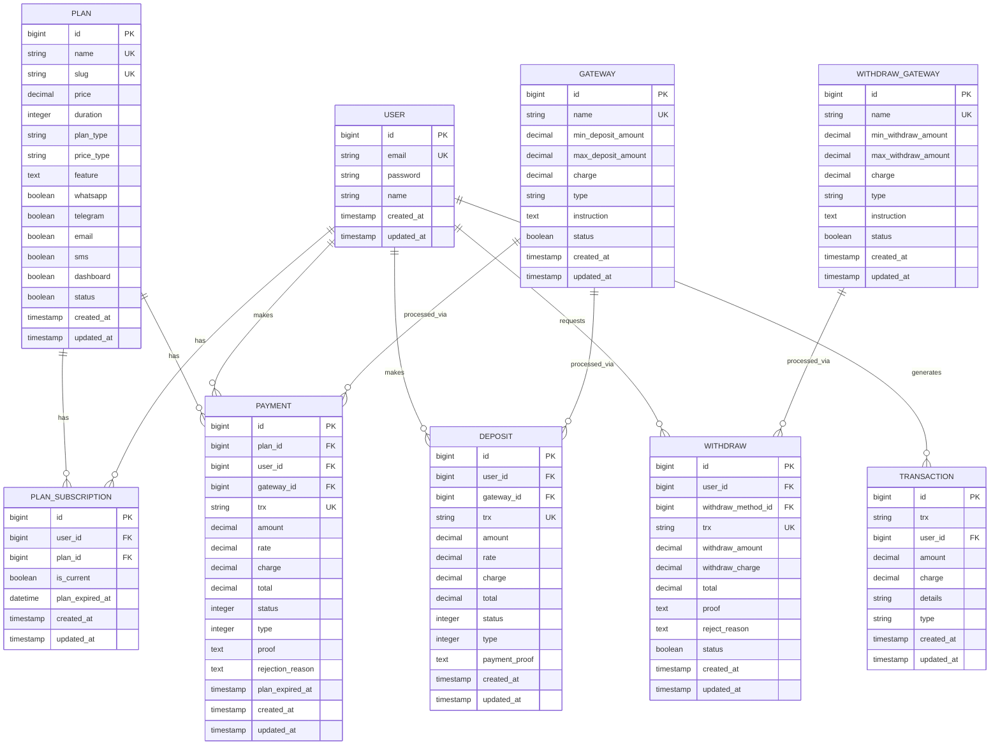

# Subscription & Billing Schema

<cite>
**Referenced Files in This Document**   
- [CreatePlansTable.php](file://main/database/migrations/2023_03_16_055624_create_plans_table.php)
- [CreatePlanSubscriptionsTable.php](file://main/database/migrations/2023_03_16_054806_create_plan_subscriptions_table.php)
- [CreateDepositsTable.php](file://main/database/migrations/2023_02_26_081605_create_deposits_table.php)
- [CreateWithdrawsTable.php](file://main/database/migrations/2023_02_26_084519_create_withdraws_table.php)
- [CreateWithdrawGatewaysTable.php](file://main/database/migrations/2023_02_26_082931_create_withdraw_gateways_table.php)
- [CreatePaymentsTable.php](file://main/database/migrations/2023_02_26_085758_create_payments_table.php)
- [CreateTransactionsTable.php](file://main/database/migrations/2023_03_16_055208_create_transactions_table.php)
- [Plan.php](file://main/app/Models/Plan.php)
- [PlanSubscription.php](file://main/app/Models/PlanSubscription.php)
- [Payment.php](file://main/app/Models/Payment.php)
- [Deposit.php](file://main/app/Models/Deposit.php)
- [Withdraw.php](file://main/app/Models/Withdraw.php)
- [database-schema-reference.md](file://docs/database-schema-reference.md)
</cite>

## Table of Contents
1. [Introduction](#introduction)
2. [Core Entities and Relationships](#core-entities-and-relationships)
3. [Entity Field Definitions](#entity-field-definitions)
4. [Primary and Foreign Keys](#primary-and-foreign-keys)
5. [Indexes and Constraints](#indexes-and-constraints)
6. [Subscription Lifecycle](#subscription-lifecycle)
7. [Data Access Patterns](#data-access-patterns)
8. [Data Lifecycle Management](#data-lifecycle-management)
9. [Security and Compliance](#security-and-compliance)
10. [Sample Data Scenarios](#sample-data-scenarios)

## Introduction

This document provides comprehensive documentation for the Subscription & Billing schema of the AI Trade Pulse platform. The schema supports a subscription-based business model with multiple pricing tiers, various payment methods, and financial transaction management. It encompasses the core entities of Plan, PlanSubscription, Deposit, Withdraw, and Payment, along with supporting entities for transaction tracking and financial integrity.

The system is designed to handle the complete subscription lifecycle from user signup through renewal and cancellation, while maintaining financial data integrity through robust constraints and audit trails. The schema supports both automated and manual payment processing, with comprehensive tracking of deposits, withdrawals, and internal transactions.

**Section sources**
- [database-schema-reference.md](file://docs/database-schema-reference.md)

## Core Entities and Relationships

The Subscription & Billing system consists of five core entities that work together to manage user subscriptions and financial transactions. The Plan entity defines available subscription offerings with pricing and features. PlanSubscription tracks active user subscriptions and their expiration dates. Payment records all subscription payments made by users. Deposit captures user deposits into their account balance, while Withdraw manages withdrawal requests.

These entities are interconnected through well-defined relationships. A Plan can have multiple PlanSubscriptions (one-to-many), representing users who have subscribed to that plan. Each PlanSubscription belongs to one Plan and one User. Payments are linked to both a Plan and a User, creating an audit trail for subscription renewals. Deposits and Withdraws are connected to Users and payment gateways, forming a complete financial transaction history.

**Diagram sources**
- [CreatePlansTable.php](file://main/database/migrations/2023_03_16_055624_create_plans_table.php)
- [CreatePlanSubscriptionsTable.php](file://main/database/migrations/2023_03_16_054806_create_plan_subscriptions_table.php)
- [CreatePaymentsTable.php](file://main/database/migrations/2023_02_26_085758_create_payments_table.php)
- [CreateDepositsTable.php](file://main/database/migrations/2023_02_26_081605_create_deposits_table.php)
- [CreateWithdrawsTable.php](file://main/database/migrations/2023_02_26_084519_create_withdraws_table.php)
- [CreateWithdrawGatewaysTable.php](file://main/database/migrations/2023_02_26_082931_create_withdraw_gateways_table.php)
- [CreateTransactionsTable.php](file://main/database/migrations/2023_03_16_055208_create_transactions_table.php)

**Section sources**
- [Plan.php](file://main/app/Models/Plan.php)
- [PlanSubscription.php](file://main/app/Models/PlanSubscription.php)
- [Payment.php](file://main/app/Models/Payment.php)
- [Deposit.php](file://main/app/Models/Deposit.php)
- [Withdraw.php](file://main/app/Models/Withdraw.php)

## Entity Field Definitions

### Plan Entity
The Plan entity defines subscription offerings with the following fields:
- **id**: Primary key, auto-incrementing identifier
- **name**: Unique name of the subscription plan
- **slug**: URL-friendly identifier for the plan
- **price**: Subscription cost with precision of 28 digits and 8 decimal places
- **duration**: Length of the subscription period in days
- **plan_type**: Type of plan (e.g., "premium", "standard")
- **price_type**: Pricing model (e.g., "fixed", "tiered")
- **feature**: JSON-encoded array of features included in the plan
- **whatsapp, telegram, email, sms, dashboard**: Boolean flags indicating communication channel access
- **status**: Boolean indicating if the plan is currently available
- **created_at, updated_at**: Timestamps for record creation and modification

### PlanSubscription Entity
The PlanSubscription entity tracks user subscriptions with these fields:
- **id**: Primary key, auto-incrementing identifier
- **user_id**: Foreign key referencing the User table
- **plan_id**: Foreign key referencing the Plan table
- **is_current**: Boolean indicating if this is the user's active subscription
- **plan_expired_at**: DateTime indicating when the subscription expires
- **created_at, updated_at**: Timestamps for record creation and modification

### Payment Entity
The Payment entity records subscription payments with the following fields:
- **id**: Primary key, auto-incrementing identifier
- **plan_id**: Foreign key referencing the Plan table
- **user_id**: Foreign key referencing the User table
- **gateway_id**: Foreign key referencing the payment gateway used
- **trx**: Unique transaction identifier
- **amount**: Base payment amount
- **rate**: Exchange rate applied (for cryptocurrency payments)
- **charge**: Processing fee
- **total**: Total amount charged (amount + charge)
- **status**: Integer status (1=approved, 2=pending, 3=rejected)
- **type**: Integer type (0=manual, 1=automatic)
- **proof**: Text field for payment verification details
- **rejection_reason**: Text field explaining why a payment was rejected
- **plan_expired_at**: Timestamp indicating when the paid subscription expires
- **created_at, updated_at**: Timestamps for record creation and modification

### Deposit Entity
The Deposit entity captures user deposits with these fields:
- **id**: Primary key, auto-incrementing identifier
- **user_id**: Foreign key referencing the User table
- **gateway_id**: Foreign key referencing the deposit gateway used
- **trx**: Unique transaction identifier
- **amount**: Base deposit amount
- **rate**: Exchange rate applied
- **charge**: Processing fee
- **total**: Total amount deposited (amount + charge)
- **status**: Integer status (1=approved, 2=pending, 3=rejected)
- **type**: Integer type (0=manual, 1=automatic)
- **payment_proof**: Text field for deposit verification details
- **created_at, updated_at**: Timestamps for record creation and modification

### Withdraw Entity
The Withdraw entity manages withdrawal requests with the following fields:
- **id**: Primary key, auto-incrementing identifier
- **user_id**: Foreign key referencing the User table
- **withdraw_method_id**: Foreign key referencing the withdrawal gateway
- **trx**: Unique transaction identifier
- **withdraw_amount**: Amount requested for withdrawal
- **withdraw_charge**: Processing fee for withdrawal
- **total**: Total amount to be withdrawn (withdraw_amount + withdraw_charge)
- **proof**: Text field for withdrawal verification details
- **reject_reason**: Text field explaining why a withdrawal was rejected
- **status**: Boolean status (0=pending, 1=approved, 2=rejected)
- **created_at, updated_at**: Timestamps for record creation and modification

**Section sources**
- [CreatePlansTable.php](file://main/database/migrations/2023_03_16_055624_create_plans_table.php)
- [CreatePlanSubscriptionsTable.php](file://main/database/migrations/2023_03_16_054806_create_plan_subscriptions_table.php)
- [CreatePaymentsTable.php](file://main/database/migrations/2023_02_26_085758_create_payments_table.php)
- [CreateDepositsTable.php](file://main/database/migrations/2023_02_26_081605_create_deposits_table.php)
- [CreateWithdrawsTable.php](file://main/database/migrations/2023_02_26_084519_create_withdraws_table.php)

## Primary and Foreign Keys

The Subscription & Billing schema implements a robust key structure to maintain data integrity and enable efficient querying. Each core entity has a primary key (id) that serves as a unique identifier. These primary keys are implemented as auto-incrementing big integers to accommodate large datasets.

Foreign key relationships establish the connections between entities:
- PlanSubscription.plan_id references Plan.id, creating a one-to-many relationship where each plan can have multiple subscriptions
- PlanSubscription.user_id references User.id, linking subscriptions to specific users
- Payment.plan_id references Plan.id, associating payments with specific plans
- Payment.user_id references User.id, connecting payments to the paying user
- Payment.gateway_id references Gateway.id, identifying the payment method used
- Deposit.user_id references User.id, linking deposits to users
- Deposit.gateway_id references Gateway.id, specifying the deposit method
- Withdraw.user_id references User.id, associating withdrawals with users
- Withdraw.withdraw_method_id references WithdrawGateway.id, indicating the withdrawal method

These foreign key constraints ensure referential integrity, preventing orphaned records and maintaining consistency across related tables. The database enforces these relationships at the schema level, requiring that referenced records exist before related records can be created.

**Section sources**
- [CreatePlansTable.php](file://main/database/migrations/2023_03_16_055624_create_plans_table.php)
- [CreatePlanSubscriptionsTable.php](file://main/database/migrations/2023_03_16_054806_create_plan_subscriptions_table.php)
- [CreatePaymentsTable.php](file://main/database/migrations/2023_02_26_085758_create_payments_table.php)
- [CreateDepositsTable.php](file://main/database/migrations/2023_02_26_081605_create_deposits_table.php)
- [CreateWithdrawsTable.php](file://main/database/migrations/2023_02_26_084519_create_withdraws_table.php)

## Indexes and Constraints

The schema implements several indexes and constraints to ensure financial data integrity and optimize query performance. Unique constraints are applied to critical fields to prevent duplicates:
- Plan.name and Plan.slug have unique constraints to prevent duplicate plan definitions
- Payment.trx and Deposit.trx have unique constraints to ensure transaction identifiers are globally unique
- Withdraw.trx has a unique constraint to prevent duplicate withdrawal requests

Indexes are strategically placed on frequently queried fields:
- Indexes on user_id in PlanSubscription, Payment, Deposit, and Withdraw tables enable fast retrieval of user-specific financial records
- Indexes on plan_id in PlanSubscription and Payment tables facilitate efficient plan usage reporting
- Indexes on status fields in Payment, Deposit, and Withdraw tables allow quick filtering of transaction states
- Composite indexes on (user_id, is_current) in PlanSubscription table optimize queries for finding a user's current subscription

Data type constraints ensure financial precision:
- Decimal fields use precision of 28 digits with 8 decimal places to accommodate cryptocurrency transactions with high precision requirements
- Status fields use integer or boolean types with documented meaning to prevent invalid states
- Timestamp fields use database-native datetime types for consistent time handling

These constraints work together to maintain data accuracy, prevent financial discrepancies, and support reliable billing operations.

**Section sources**
- [CreatePlansTable.php](file://main/database/migrations/2023_03_16_055624_create_plans_table.php)
- [CreatePlanSubscriptionsTable.php](file://main/database/migrations/2023_03_16_054806_create_plan_subscriptions_table.php)
- [CreatePaymentsTable.php](file://main/database/migrations/2023_02_26_085758_create_payments_table.php)
- [CreateDepositsTable.php](file://main/database/migrations/2023_02_26_081605_create_deposits_table.php)
- [CreateWithdrawsTable.php](file://main/database/migrations/2023_02_26_084519_create_withdraws_table.php)

## Subscription Lifecycle

The subscription lifecycle in the AI Trade Pulse platform follows a structured flow from signup through renewal and potential cancellation. When a user signs up for a plan, a PlanSubscription record is created with the user_id, plan_id, and plan_expired_at set to the current date plus the plan's duration. The is_current flag is set to true, indicating this is the user's active subscription.

When a user makes a payment for a subscription, a Payment record is created with details of the transaction. Upon successful payment processing, the system updates the associated PlanSubscription by extending the plan_expired_at date and creating a corresponding transaction record. The system supports both automatic payments (type=1) through integrated payment gateways and manual payments (type=0) with proof submission.

For subscription renewal, the system checks the plan_expired_at date and can trigger renewal reminders as the expiration approaches. Users can upgrade or downgrade plans, which creates a new PlanSubscription record with the new plan_id and updated expiration date, while marking the previous subscription as inactive (is_current=false).

If a subscription expires, the system can automatically create a grace period or immediately restrict access to premium features. Users can cancel their subscription at any time, which updates the is_current flag to false and prevents automatic renewal. The system maintains historical records of all past subscriptions for billing and analytics purposes.

**Diagram sources**
- [PlanSubscription.php](file://main/app/Models/PlanSubscription.php)
- [Payment.php](file://main/app/Models/Payment.php)
- [CreatePlanSubscriptionsTable.php](file://main/database/migrations/2023_03_16_054806_create_plan_subscriptions_table.php)
- [CreatePaymentsTable.php](file://main/database/migrations/2023_02_26_085758_create_payments_table.php)

**Section sources**
- [PlanSubscription.php](file://main/app/Models/PlanSubscription.php)
- [Payment.php](file://main/app/Models/Payment.php)

## Data Access Patterns

The Subscription & Billing schema supports several key data access patterns for operational and analytical purposes. For billing cycle management, the system queries PlanSubscription records with user_id and is_current=true to determine a user's active plan and expiration date. This information is used to control feature access and trigger renewal processes.

Revenue reporting is facilitated by aggregating Payment records grouped by plan_id, status=1 (approved), and time periods. This allows the business to track revenue by plan type, payment method, and temporal trends. The decimal precision of 28,8 ensures accurate financial calculations even with cryptocurrency fluctuations.

Transaction reconciliation is supported by the Transaction entity, which maintains a comprehensive ledger of all financial activities. Each payment, deposit, and withdrawal generates corresponding transaction records with detailed descriptions. The system can reconcile account balances by summing all transactions for a user_id, providing an audit trail for financial verification.

User-specific queries are optimized through indexes on user_id across all financial tables. This enables fast retrieval of a user's complete financial history, including all subscriptions, payments, deposits, and withdrawals. Plan-specific queries leverage indexes on plan_id to generate usage statistics and revenue reports by plan.

The system also supports status-based queries for operational workflows. Admin interfaces can filter Payment, Deposit, and Withdraw records by status to identify pending transactions requiring review. This supports manual verification processes for payments and withdrawals that require administrative approval.

**Section sources**
- [PlanSubscription.php](file://main/app/Models/PlanSubscription.php)
- [Payment.php](file://main/app/Models/Payment.php)
- [Deposit.php](file://main/app/Models/Deposit.php)
- [Withdraw.php](file://main/app/Models/Withdraw.php)
- [CreateTransactionsTable.php](file://main/database/migrations/2023_03_16_055208_create_transactions_table.php)

## Data Lifecycle Management

The Subscription & Billing system implements comprehensive data lifecycle management practices to balance data retention requirements with storage efficiency. Subscription data follows a tiered retention model based on activity status. Active PlanSubscription records are retained with full detail for the duration of the subscription plus a configurable retention period after cancellation or expiration.

Historical subscription data is archived according to regulatory requirements and business needs. The system maintains complete audit trails of all financial transactions indefinitely, as required for financial compliance. Transaction records in the Transaction table serve as the system of record for all financial activities.

For data archiving, the system can migrate older, inactive records to cold storage while maintaining referential integrity. This process preserves the ability to generate historical reports while reducing the load on primary databases. Archived data remains accessible through specialized reporting interfaces.

Audit logging is implemented at multiple levels. The system automatically logs creation and modification timestamps for all financial records. Sensitive operations like payment approvals, withdrawal requests, and subscription changes are logged with user context for security auditing. These logs support forensic analysis in case of disputes or security incidents.

Data retention policies are configurable through the system administration interface, allowing compliance with evolving regulatory requirements. The system supports data subject rights under privacy regulations, enabling user data export and deletion workflows while maintaining financial integrity requirements.

**Section sources**
- [PlanSubscription.php](file://main/app/Models/PlanSubscription.php)
- [Payment.php](file://main/app/Models/Payment.php)
- [Transaction.php](file://main/app/Models/Transaction.php)
- [CreateTransactionsTable.php](file://main/database/migrations/2023_03_16_055208_create_transactions_table.php)

## Security and Compliance

The Subscription & Billing schema incorporates multiple security measures to protect financial data and ensure regulatory compliance. PCI compliance is addressed through the separation of payment data from the core application database. While transaction metadata is stored in the Payment table, sensitive payment credentials are handled by external payment gateways and not stored in the system.

Payment credential encryption is implemented for any sensitive data that must be stored. The system uses industry-standard encryption algorithms to protect payment proof data and other sensitive information. Encryption keys are managed through a secure key management system with restricted access controls.

Fraud detection is supported through several mechanisms in the schema. The system tracks multiple payment attempts for the same transaction (trx) to identify potential fraud patterns. Unusual withdrawal amounts or frequencies can be flagged for review based on the withdraw_amount and timing data. The status workflow for payments and withdrawals (pending, approved, rejected) enables manual review of suspicious transactions.

Access controls are enforced at both the application and database levels. Database users have least-privilege access to financial tables, with separate credentials for read-only reporting and write operations. The application implements role-based access control, ensuring that only authorized personnel can approve payments or modify subscription statuses.

The system also supports two-factor authentication for administrative operations involving financial data. Audit logs capture all access to financial records, providing a trail for security investigations. Regular security assessments and penetration testing are recommended to identify and address potential vulnerabilities in the billing system.

**Section sources**
- [Payment.php](file://main/app/Models/Payment.php)
- [Deposit.php](file://main/app/Models/Deposit.php)
- [Withdraw.php](file://main/app/Models/Withdraw.php)
- [CreatePaymentsTable.php](file://main/database/migrations/2023_02_26_085758_create_payments_table.php)

## Sample Data Scenarios

### Scenario 1: New User Subscription
A new user signs up for the "Premium" plan ($99.99/month, 30-day duration). The system creates:
- A PlanSubscription record with user_id=123, plan_id=2, is_current=true, and plan_expired_at set to current date + 30 days
- A Payment record with amount=99.99, status=1 (approved), type=1 (automatic), and a unique trx identifier
- A Transaction record with details="Premium Plan Subscription" and type="subscription_payment"
- The user gains access to all premium features (whatsapp, telegram, email, sms, dashboard) as defined in the Plan record

### Scenario 2: Manual Deposit and Withdrawal
An existing user deposits $500 via bank transfer and later requests a $200 withdrawal:
- A Deposit record is created with amount=500, status=2 (pending), type=0 (manual), and payment_proof containing bank transfer details
- After admin verification, the status is updated to 1 (approved) and a Transaction record is created
- A Withdraw record is created with withdraw_amount=200, status=0 (pending), and proof containing withdrawal address
- After admin approval, the status is updated to 1 (approved) and a Transaction record is created with type="withdrawal"

### Scenario 3: Subscription Renewal and Upgrade
A user with an active "Standard" plan renews and upgrades to "Premium":
- The existing PlanSubscription is updated with is_current=false
- A new PlanSubscription is created with the Premium plan_id and extended expiration date
- A Payment record is created for the upgrade cost difference
- Transaction records are created for both the renewal and upgrade
- The user's feature access is updated to include all Premium plan features

These scenarios demonstrate the schema's ability to handle common billing operations while maintaining data integrity and audit trails.

**Section sources**
- [PlanSubscription.php](file://main/app/Models/PlanSubscription.php)
- [Payment.php](file://main/app/Models/Payment.php)
- [Deposit.php](file://main/app/Models/Deposit.php)
- [Withdraw.php](file://main/app/Models/Withdraw.php)
- [Transaction.php](file://main/app/Models/Transaction.php)