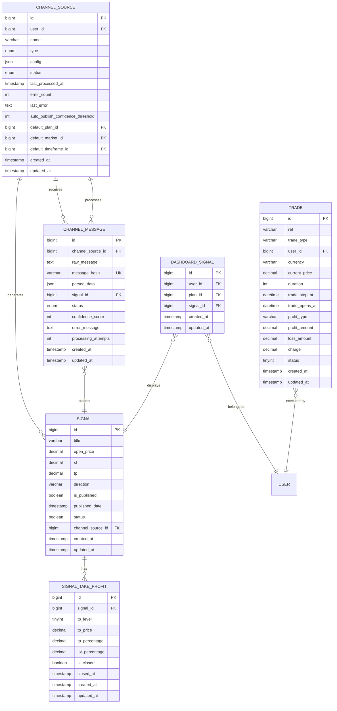
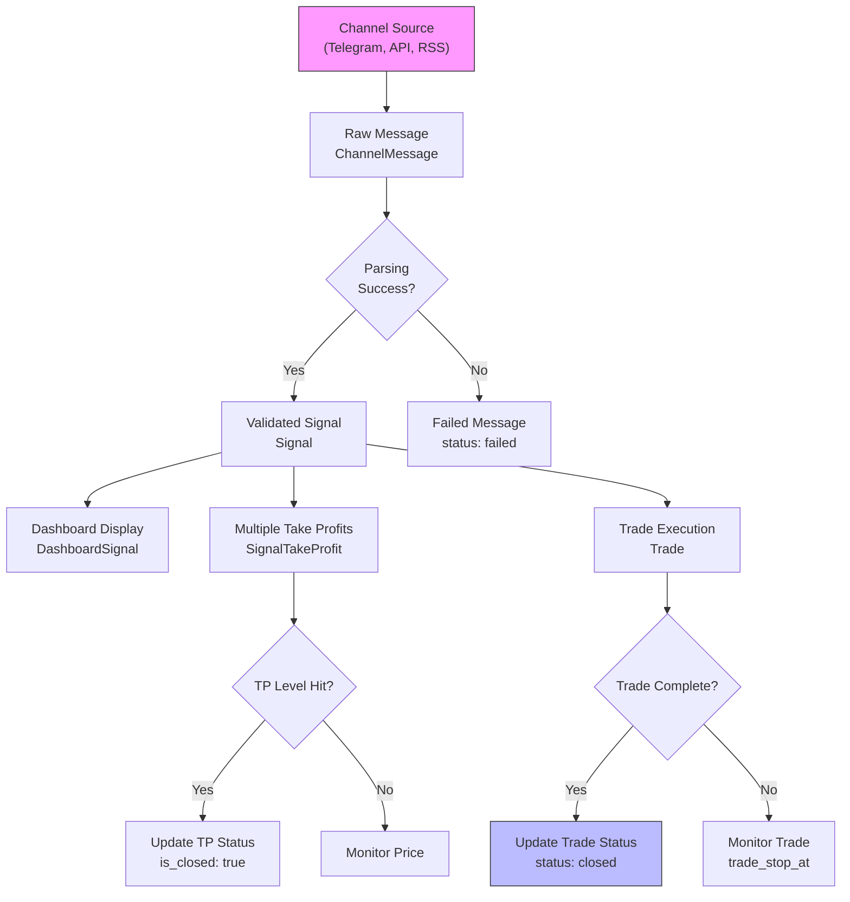

# Trading Operations Schema

<cite>
**Referenced Files in This Document**   
- [CreateSignalsTable.php](file://main/database/migrations/2023_03_16_080747_create_signals_table.php)
- [CreateSignalTakeProfitsTable.php](file://main/database/migrations/2025_12_05_100000_create_signal_take_profits_table.php)
- [CreateChannelSourcesTable.php](file://main/database/migrations/2025_01_27_100000_create_channel_sources_table.php)
- [CreateChannelMessagesTable.php](file://main/database/migrations/2025_01_27_100001_create_channel_messages_table.php)
- [CreateTradesTable.php](file://main/database/migrations/2025_12_06_115618_create_trades_table.php)
- [CreateDashboardSignalsTable.php](file://main/database/migrations/2023_03_18_052943_create_dashboard_signals_table.php)
- [Signal.php](file://main/app/Models/Signal.php)
- [SignalTakeProfit.php](file://main/app/Models/SignalTakeProfit.php)
- [ChannelSource.php](file://main/app/Models/ChannelSource.php)
- [ChannelMessage.php](file://main/app/Models/ChannelMessage.php)
- [Trade.php](file://main/app/Models/Trade.php)
- [DashboardSignal.php](file://main/app/Models/DashboardSignal.php)
</cite>

## Table of Contents
1. [Introduction](#introduction)
2. [Core Entities and Relationships](#core-entities-and-relationships)
3. [Field Definitions](#field-definitions)
4. [Primary and Foreign Keys](#primary-and-foreign-keys)
5. [Indexes and Constraints](#indexes-and-constraints)
6. [Schema Diagram](#schema-diagram)
7. [Signal-to-Trade Lifecycle](#signal-to-trade-lifecycle)
8. [Data Access Patterns](#data-access-patterns)
9. [Data Lifecycle Management](#data-lifecycle-management)
10. [Security Considerations](#security-considerations)

## Introduction
The Trading Operations schema is designed to support a comprehensive signal processing and trade execution system. It captures trading signals from multiple sources, manages their lifecycle through analysis and execution, and tracks resulting trades. The schema supports complex signal parameters including multiple take profit levels, while ensuring data integrity through proper constraints and indexes. This documentation details the entity relationships, field definitions, and operational patterns that enable reliable trading operations.

## Core Entities and Relationships

The Trading Operations schema consists of six core entities that form a complete signal processing pipeline:

- **Signal**: Represents a trading opportunity with entry price, stop loss, take profit levels, and execution parameters
- **ChannelSource**: Defines the source of trading signals (Telegram, API, RSS, etc.) with configuration and processing rules
- **ChannelMessage**: Captures raw messages from channel sources before they are parsed into signals
- **SignalTakeProfit**: Supports multiple take profit levels per signal with customizable percentages and closure tracking
- **Trade**: Records executed trades with profit/loss calculations and status tracking
- **DashboardSignal**: Associates signals with user dashboards for personalized signal viewing

These entities form a hierarchical data flow from signal ingestion through execution and analysis.

**Section sources**
- [Signal.php](file://main/app/Models/Signal.php#L1-L177)
- [ChannelSource.php](file://main/app/Models/ChannelSource.php#L1-L224)
- [ChannelMessage.php](file://main/app/Models/ChannelMessage.php#L1-L184)
- [SignalTakeProfit.php](file://main/app/Models/SignalTakeProfit.php#L1-L77)
- [Trade.php](file://main/app/Models/Trade.php#L1-L21)
- [DashboardSignal.php](file://main/app/Models/DashboardSignal.php#L1-L22)

## Field Definitions

### Signal Parameters
The Signal entity contains comprehensive trading parameters:

- **open_price**: Decimal (28,8) - Entry price for the trade
- **sl**: Decimal (28,8) - Stop loss price level
- **tp**: Decimal (28,8) - Primary take profit price (legacy field)
- **direction**: String - Trade direction (e.g., "buy", "sell")
- **is_published**: Boolean - Publication status of the signal
- **published_date**: Timestamp - When the signal was published
- **status**: Boolean - Active/inactive status of the signal

### Channel Source Configuration
The ChannelSource entity manages signal ingestion sources:

- **type**: Enum ['telegram', 'telegram_mtproto', 'api', 'web_scrape', 'rss'] - Source type
- **config**: JSON (encrypted) - Connection credentials and parsing configuration
- **status**: Enum ['active', 'paused', 'error'] - Processing status
- **auto_publish_confidence_threshold**: Integer (0-100) - Confidence level for auto-publishing signals
- **last_processed_at**: Timestamp - When the channel was last processed

### Channel Message Processing
The ChannelMessage entity tracks raw message ingestion:

- **raw_message**: Text - Original message content from the channel
- **message_hash**: String (64) - SHA256 hash for duplicate detection
- **parsed_data**: JSON - Extracted signal parameters after parsing
- **status**: Enum ['pending', 'processed', 'failed', 'duplicate', 'manual_review'] - Processing status
- **confidence_score**: Integer (0-100) - Parsing confidence level
- **processing_attempts**: Integer - Number of processing attempts

### Multiple Take Profit Levels
The SignalTakeProfit entity enables sophisticated exit strategies:

- **tp_level**: TinyInteger - Take profit level number (1, 2, 3, etc.)
- **tp_price**: Decimal (28,8) - Take profit price for this level
- **tp_percentage**: Decimal (5,2) - Percentage of position to close at this TP
- **lot_percentage**: Decimal (5,2) - Alternative lot size percentage for this TP
- **is_closed**: Boolean - Whether this TP level has been hit
- **closed_at**: Timestamp - When this TP was achieved

### Trade Execution
The Trade entity records executed trades:

- **ref**: String (255) - Reference identifier
- **trade_type**: String (255) - Type of trade (e.g., "forex", "crypto")
- **current_price**: Decimal (28,8) - Price at trade execution
- **duration**: Integer - Trade duration in minutes
- **trade_stop_at**: DateTime - When the trade expires
- **profit_amount**: Decimal (8,2) - Realized profit
- **loss_amount**: Decimal (8,2) - Realized loss
- **status**: TinyInteger - Trade status (0 = open, 1 = closed, etc.)

**Section sources**
- [CreateSignalsTable.php](file://main/database/migrations/2023_03_16_080747_create_signals_table.php#L1-L49)
- [CreateChannelSourcesTable.php](file://main/database/migrations/2025_01_27_100000_create_channel_sources_table.php#L1-L54)
- [CreateChannelMessagesTable.php](file://main/database/migrations/2025_01_27_100001_create_channel_messages_table.php#L1-L51)
- [CreateSignalTakeProfitsTable.php](file://main/database/migrations/2025_12_05_100000_create_signal_take_profits_table.php#L1-L49)
- [CreateTradesTable.php](file://main/database/migrations/2025_12_06_115618_create_trades_table.php#L1-L50)

## Primary and Foreign Keys

### Primary Keys
Each entity has a single auto-incrementing primary key:
- Signal: `id` (unsignedBigInteger)
- ChannelSource: `id` (unsignedBigInteger)
- ChannelMessage: `id` (unsignedBigInteger)
- SignalTakeProfit: `id` (unsignedBigInteger)
- Trade: `id` (unsignedBigInteger)
- DashboardSignal: `id` (unsignedBigInteger)

### Foreign Key Relationships
The schema implements referential integrity through the following foreign key constraints:

- **Signal → ChannelSource**: `channel_source_id` references `channel_sources.id` with cascade delete
- **ChannelMessage → ChannelSource**: `channel_source_id` references `channel_sources.id` with cascade delete
- **ChannelMessage → Signal**: `signal_id` references `signals.id` with set null on delete
- **SignalTakeProfit → Signal**: `signal_id` references `signals.id` with cascade delete
- **Trade → User**: `user_id` references `users.id` with cascade delete
- **DashboardSignal → User**: `user_id` references `users.id`
- **DashboardSignal → Signal**: `signal_id` references `signals.id`
- **DashboardSignal → Plan**: `plan_id` references `plans.id`

These relationships ensure data consistency while allowing appropriate cascade behaviors for related records.

**Section sources**
- [CreateSignalsTable.php](file://main/database/migrations/2023_03_16_080747_create_signals_table.php#L1-L49)
- [CreateChannelSourcesTable.php](file://main/database/migrations/2025_01_27_100000_create_channel_sources_table.php#L1-L54)
- [CreateChannelMessagesTable.php](file://main/database/migrations/2025_01_27_100001_create_channel_messages_table.php#L1-L51)
- [CreateSignalTakeProfitsTable.php](file://main/database/migrations/2025_12_05_100000_create_signal_take_profits_table.php#L1-L49)
- [CreateTradesTable.php](file://main/database/migrations/2025_12_06_115618_create_trades_table.php#L1-L50)
- [CreateDashboardSignalsTable.php](file://main/database/migrations/2023_03_18_052943_create_dashboard_signals_table.php#L1-L35)

## Indexes and Constraints

### Indexes
The schema includes optimized indexes for common query patterns:

**Signal Table**
- `published_date` index for chronological signal retrieval
- Composite index on `market_id`, `currency_pair_id`, and `direction` for filtering by trading parameters

**ChannelSource Table**
- Index on `user_id` for user-specific channel queries
- Index on `status` for monitoring channel health
- Index on `type` for filtering by source type

**ChannelMessage Table**
- Index on `channel_source_id` for retrieving messages by source
- Index on `message_hash` for duplicate detection
- Index on `status` for processing workflow management
- Index on `created_at` for time-based message retrieval
- Index on `signal_id` for linking messages to signals

**SignalTakeProfit Table**
- Composite index on `signal_id` and `tp_level` for ordered TP retrieval
- Composite index on `signal_id` and `is_closed` for status-based queries

**Trade Table**
- Index on `user_id` for user-specific trade queries
- Index on `status` for trade status filtering
- Index on `trade_stop_at` for expiration-based queries

### Constraints
The schema enforces data integrity through the following constraints:

- **Unique Constraints**: 
  - `signal_take_profits`: Unique constraint on `signal_id` and `tp_level` to prevent duplicate TP levels
  - `channel_messages`: Unique constraint on `message_hash` to prevent duplicate messages

- **Check Constraints**:
  - `signal_take_profits.tp_percentage`: CHECK constraint ensuring values between 0 and 100
  - `signal_take_profits.lot_percentage`: CHECK constraint ensuring values between 0 and 100
  - `channel_sources.auto_publish_confidence_threshold`: CHECK constraint ensuring values between 0 and 100

- **Validation Rules**:
  - `Signal.open_price`, `sl`, `tp`: Must be positive decimal values
  - `Signal.direction`: Must be either "buy" or "sell"
  - `ChannelMessage.confidence_score`: Must be between 0 and 100
  - `SignalTakeProfit.tp_level`: Must be a positive integer

These indexes and constraints optimize query performance while ensuring signal validity and data consistency.

**Section sources**
- [CreateSignalsTable.php](file://main/database/migrations/2023_03_16_080747_create_signals_table.php#L1-L49)
- [CreateChannelSourcesTable.php](file://main/database/migrations/2025_01_27_100000_create_channel_sources_table.php#L1-L54)
- [CreateChannelMessagesTable.php](file://main/database/migrations/2025_01_27_100001_create_channel_messages_table.php#L1-L51)
- [CreateSignalTakeProfitsTable.php](file://main/database/migrations/2025_12_05_100000_create_signal_take_profits_table.php#L1-L49)
- [CreateTradesTable.php](file://main/database/migrations/2025_12_06_115618_create_trades_table.php#L1-L50)

## Schema Diagram



**Diagram sources**
- [CreateSignalsTable.php](file://main/database/migrations/2023_03_16_080747_create_signals_table.php#L1-L49)
- [CreateChannelSourcesTable.php](file://main/database/migrations/2025_01_27_100000_create_channel_sources_table.php#L1-L54)
- [CreateChannelMessagesTable.php](file://main/database/migrations/2025_01_27_100001_create_channel_messages_table.php#L1-L51)
- [CreateSignalTakeProfitsTable.php](file://main/database/migrations/2025_12_05_100000_create_signal_take_profits_table.php#L1-L49)
- [CreateTradesTable.php](file://main/database/migrations/2025_12_06_115618_create_trades_table.php#L1-L50)
- [CreateDashboardSignalsTable.php](file://main/database/migrations/2023_03_18_052943_create_dashboard_signals_table.php#L1-L35)

## Signal-to-Trade Lifecycle

The complete signal-to-trade lifecycle follows this flow:

1. **Signal Ingestion**: A ChannelSource (e.g., Telegram bot) receives raw messages from trading signal providers
2. **Message Processing**: ChannelMessage records are created with raw content and processed through parsing algorithms
3. **Signal Creation**: Validated messages generate Signal records with trading parameters (entry price, SL, TP, direction)
4. **Signal Distribution**: Signals are associated with user dashboards via DashboardSignal records
5. **Trade Execution**: Trading systems execute trades based on signal parameters, creating Trade records
6. **Take Profit Management**: As price reaches TP levels, SignalTakeProfit records are updated with closure status
7. **Lifecycle Completion**: Trades are closed, and signal performance is analyzed

This lifecycle is supported by the schema's foreign key relationships and status tracking fields, ensuring complete auditability from signal creation to trade completion.



**Diagram sources**
- [Signal.php](file://main/app/Models/Signal.php#L1-L177)
- [ChannelSource.php](file://main/app/Models/ChannelSource.php#L1-L224)
- [ChannelMessage.php](file://main/app/Models/ChannelMessage.php#L1-L184)
- [SignalTakeProfit.php](file://main/app/Models/SignalTakeProfit.php#L1-L77)
- [Trade.php](file://main/app/Models/Trade.php#L1-L21)

## Data Access Patterns

### Signal Processing Queries
Common queries for signal ingestion and processing:

- Retrieve pending messages for processing:
```sql
SELECT * FROM channel_messages 
WHERE status = 'pending' 
ORDER BY created_at ASC;
```

- Find signals by channel source and publication status:
```sql
SELECT * FROM signals 
WHERE channel_source_id = ? AND is_published = 1 
ORDER BY published_date DESC;
```

- Get all open take profit levels for active signals:
```sql
SELECT stp.*, s.open_price, s.sl 
FROM signal_take_profits stp
JOIN signals s ON stp.signal_id = s.id
WHERE stp.is_closed = false AND s.status = 1;
```

### Execution Tracking Queries
Queries for monitoring trade execution:

- Retrieve active trades for a user:
```sql
SELECT * FROM trades 
WHERE user_id = ? AND status = 0 
ORDER BY trade_opens_at DESC;
```

- Find signals that have generated trades:
```sql
SELECT s.*, t.ref, t.profit_amount 
FROM signals s
JOIN trades t ON t.signal_id = s.id
WHERE s.user_id = ?;
```

### Performance Analysis Queries
Analytics queries for evaluating signal performance:

- Calculate win rate for a channel source:
```sql
SELECT 
    cs.name,
    COUNT(s.id) as total_signals,
    SUM(CASE WHEN t.profit_amount > t.loss_amount THEN 1 ELSE 0 END) as winning_trades,
    AVG(t.profit_amount - t.loss_amount) as avg_pnl
FROM channel_sources cs
JOIN signals s ON s.channel_source_id = cs.id
JOIN trades t ON t.signal_id = s.id
GROUP BY cs.id;
```

- Analyze take profit hit rates:
```sql
SELECT 
    tp.tp_level,
    COUNT(*) as total_tp,
    SUM(CASE WHEN tp.is_closed THEN 1 ELSE 0 END) as hit_count,
    (SUM(CASE WHEN tp.is_closed THEN 1 ELSE 0 END) * 100.0 / COUNT(*)) as hit_rate
FROM signal_take_profits tp
GROUP BY tp.tp_level
ORDER BY tp.tp_level;
```

These access patterns are optimized by the schema's indexing strategy, particularly on status fields, foreign keys, and timestamps.

**Section sources**
- [Signal.php](file://main/app/Models/Signal.php#L1-L177)
- [ChannelSource.php](file://main/app/Models/ChannelSource.php#L1-L224)
- [ChannelMessage.php](file://main/app/Models/ChannelMessage.php#L1-L184)
- [SignalTakeProfit.php](file://main/app/Models/SignalTakeProfit.php#L1-L77)
- [Trade.php](file://main/app/Models/Trade.php#L1-L21)

## Data Lifecycle Management

### Signal Expiration
Signals are managed through their status lifecycle:
- Active signals (status = 1) are available for execution
- Expired signals are automatically deactivated when their validity period ends
- The system maintains historical signal data for performance analysis
- Soft deletion is used to preserve signal history while removing from active views

### Trade Closure
Trade records are finalized when:
- The trade reaches its `trade_stop_at` expiration time
- All take profit levels have been hit
- The stop loss is triggered
- Manual closure by the user or system

Upon closure, the trade status is updated and profit/loss calculations are finalized.

### Historical Signal Archiving
The system implements a tiered data retention strategy:
- **Active Data**: Recent signals (last 90 days) are kept in primary tables with full indexing
- **Historical Data**: Older signals are moved to archive tables with reduced indexing
- **Analytics Data**: Aggregated performance metrics are preserved long-term
- **Compliance Data**: Trade records are retained for regulatory compliance (minimum 7 years)

Archiving is triggered automatically based on the `published_date` and executed through scheduled jobs that maintain query performance on active data.

### Data Integrity Maintenance
The system ensures data consistency through:
- Foreign key constraints with appropriate cascade behaviors
- Transactional processing of related records
- Regular data validation checks
- Automated cleanup of orphaned records
- Backup and recovery procedures

These lifecycle management practices ensure system performance while maintaining complete trading history for analysis and compliance.

**Section sources**
- [Signal.php](file://main/app/Models/Signal.php#L1-L177)
- [ChannelSource.php](file://main/app/Models/ChannelSource.php#L1-L224)
- [ChannelMessage.php](file://main/app/Models/ChannelMessage.php#L1-L184)
- [SignalTakeProfit.php](file://main/app/Models/SignalTakeProfit.php#L1-L77)
- [Trade.php](file://main/app/Models/Trade.php#L1-L21)

## Security Considerations

### Signal Source Verification
The system implements multiple layers of signal validation:
- **Channel Authentication**: Each ChannelSource requires secure credentials stored in encrypted format
- **Message Signing**: Where supported, messages are verified with digital signatures
- **Confidence Scoring**: Parsing algorithms assign confidence scores to validate signal integrity
- **Duplicate Detection**: SHA256 hashing prevents processing of duplicate signals
- **Manual Review**: Low-confidence signals are flagged for manual verification

The `auto_publish_confidence_threshold` setting in ChannelSource determines the minimum confidence score required for automatic signal publication.

### Execution Authorization
Trade execution is protected by:
- **User Authentication**: All trade operations require authenticated user sessions
- **Permission Checks**: Role-based access control limits who can execute trades
- **Two-Factor Authentication**: Sensitive operations require 2FA verification
- **Execution Logs**: All trade actions are recorded with timestamps and user identifiers
- **Rate Limiting**: Protection against automated abuse through request throttling

### Data Protection
Sensitive information is protected through:
- **Encryption at Rest**: Channel configuration data is encrypted using Laravel's Crypt facade
- **Secure Transmission**: All data transfers use TLS encryption
- **Access Logging**: User access to signals and trades is logged for audit purposes
- **Data Minimization**: Only necessary information is stored and processed
- **Regular Security Audits**: Automated scanning for vulnerabilities and misconfigurations

### Operational Security
The system includes operational safeguards:
- **Channel Monitoring**: Automated alerts for channel errors or processing failures
- **Rate Limiting**: Protection against API abuse and denial-of-service attacks
- **Input Validation**: Comprehensive validation of all user and external inputs
- **Error Handling**: Graceful degradation when components fail
- **Backup and Recovery**: Regular backups with tested recovery procedures

These security measures ensure the integrity of trading signals and protect user assets throughout the signal processing lifecycle.

**Section sources**
- [ChannelSource.php](file://main/app/Models/ChannelSource.php#L1-L224)
- [ChannelMessage.php](file://main/app/Models/ChannelMessage.php#L1-L184)
- [Signal.php](file://main/app/Models/Signal.php#L1-L177)
- [SignalTakeProfit.php](file://main/app/Models/SignalTakeProfit.php#L1-L77)
- [Trade.php](file://main/app/Models/Trade.php#L1-L21)