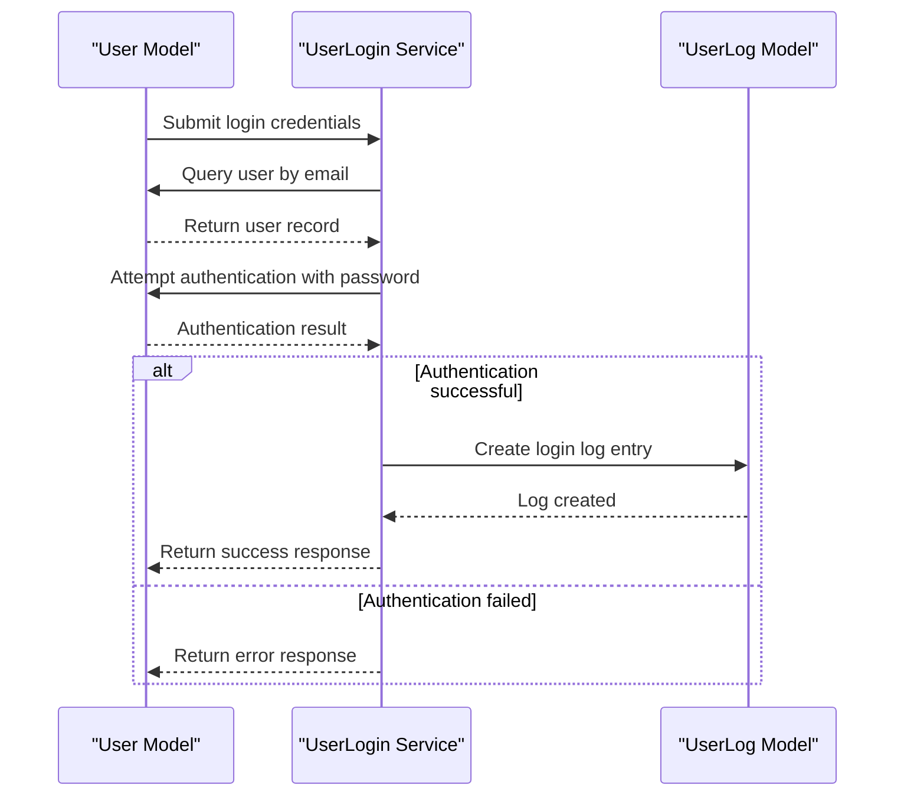
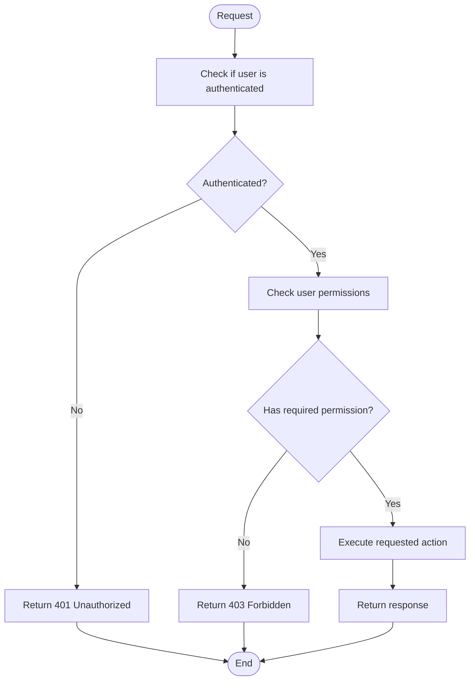
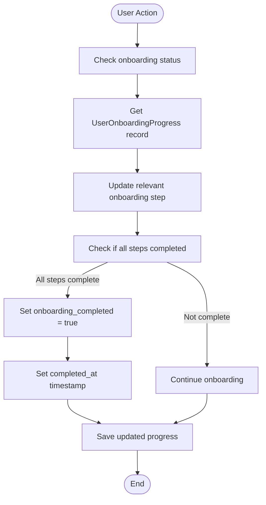

# User Management Schema

<cite>
**Referenced Files in This Document**   
- [users_table_migration.php](file://main/database/migrations/2023_02_25_120246_create_users_table.php)
- [languages_table_migration.php](file://main/database/migrations/2023_02_26_091028_create_languages_table.php)
- [permission_tables_migration.php](file://main/database/migrations/2023_02_26_094347_create_permission_tables.php)
- [user_onboarding_progress_migration.php](file://main/database/migrations/2025_12_07_175819_create_user_onboarding_progress_table.php)
- [add_telegram_chat_id_migration.php](file://main/database/migrations/2025_12_04_000001_add_telegram_chat_id_to_users_and_indexes.php)
- [User.php](file://main/app/Models/User.php)
- [UserOnboardingProgress.php](file://main/app/Models/UserOnboardingProgress.php)
- [UserLogin.php](file://main/app/Services/UserLogin.php)
- [UserProfileService.php](file://main/app/Services/UserProfileService.php)
- [UserRegistration.php](file://main/app/Services/UserRegistration.php)
- [permission.php](file://main/config/permission.php)
- [database-schema-reference.md](file://docs/database-schema-reference.md)
</cite>

## Table of Contents
1. [Introduction](#introduction)
2. [Core Entities](#core-entities)
3. [Entity Relationships](#entity-relationships)
4. [Field Definitions](#field-definitions)
5. [Primary and Foreign Keys](#primary-and-foreign-keys)
6. [Indexes and Constraints](#indexes-and-constraints)
7. [Data Access Patterns](#data-access-patterns)
8. [Data Lifecycle Management](#data-lifecycle-management)
9. [Security Considerations](#security-considerations)
10. [Sample Data](#sample-data)

## Introduction

The User Management schema forms the foundation of the AlgoExpertHub Trading Signal Platform, providing robust user authentication, authorization, and onboarding capabilities. This documentation details the data model for user-related entities including User, Language, Permission, Role, and UserOnboardingProgress, with comprehensive coverage of field definitions, relationships, indexes, constraints, and security aspects. The schema supports role-based access control, multi-language support, and a structured onboarding process to ensure a seamless user experience.

**Section sources**
- [database-schema-reference.md](file://docs/database-schema-reference.md#core-tables)

## Core Entities

The User Management schema consists of five core entities that work together to manage user accounts, permissions, language preferences, and onboarding progress. These entities are implemented as database tables with well-defined relationships and constraints.

### User Entity

The User entity represents platform users who subscribe to plans and receive trading signals. It contains comprehensive user profile information, authentication credentials, and account status.

**Section sources**
- [users_table_migration.php](file://main/database/migrations/2023_02_25_120246_create_users_table.php#L1-L59)
- [database-schema-reference.md](file://docs/database-schema-reference.md#users)

### Language Entity

The Language entity manages the available languages for the platform, allowing users to select their preferred language for interface and communication.

**Section sources**
- [languages_table_migration.php](file://main/database/migrations/2023_02_26_091028_create_languages_table.php#L1-L35)
- [database-schema-reference.md](file://docs/database-schema-reference.md#languages)

### Permission and Role Entities

The Permission and Role entities implement a robust role-based access control (RBAC) system using the Spatie Laravel Permission package. This allows fine-grained control over user capabilities within the platform.

**Section sources**
- [permission_tables_migration.php](file://main/database/migrations/2023_02_26_094347_create_permission_tables.php#L1-L142)
- [permission.php](file://main/config/permission.php#L1-L162)

### UserOnboardingProgress Entity

The UserOnboardingProgress entity tracks the completion status of the user onboarding process, providing insights into user engagement and adoption.

**Section sources**
- [user_onboarding_progress_migration.php](file://main/database/migrations/2025_12_07_175819_create_user_onboarding_progress_table.php#L1-L52)
- [UserOnboardingProgress.php](file://main/app/Models/UserOnboardingProgress.php#L1-L45)

## Entity Relationships

The User Management schema implements a comprehensive relationship model that connects users with their permissions, roles, language preferences, and onboarding progress.

```mermaid
erDiagram
USER {
bigint id PK
bigint ref_id FK
varchar(255) username UK
varchar(255) email UK
varchar(255) phone UK
text address
varchar(255) password
decimal(28,8) balance
varchar(255) image
boolean is_email_verified
boolean is_sms_verified
boolean is_kyc_verified
varchar(255) email_verification_code
varchar(255) sms_verification_code
datetime login_at
text kyc_information
varchar(255) facebook_id
varchar(255) google_id
boolean status
varchar(100) remember_token
timestamp created_at
timestamp updated_at
varchar(255) telegram_chat_id
varchar(255) phone_country_code
}
LANGUAGE {
bigint id PK
varchar(255) name UK
varchar(255) code UK
integer status
timestamp created_at
timestamp updated_at
}
PERMISSION {
bigint id PK
varchar(125) name
varchar(125) guard_name
timestamp created_at
timestamp updated_at
}
ROLE {
bigint id PK
varchar(125) name
varchar(125) guard_name
timestamp created_at
timestamp updated_at
}
USER_ONBOARDING_PROGRESS {
bigint id PK
bigint user_id FK
boolean welcome_seen
boolean profile_completed
boolean plan_subscribed
boolean signal_source_added
boolean trading_connection_setup
boolean trading_preset_created
boolean first_deposit_made
boolean onboarding_completed
timestamp completed_at
timestamp created_at
timestamp updated_at
}
USER ||--o{ PLAN_SUBSCRIPTION : "has many"
USER ||--o{ PAYMENT : "has many"
USER ||--o{ DEPOSIT : "has many"
USER ||--o{ WITHDRAW : "has many"
USER ||--o{ TICKET : "has many"
USER ||--o{ TRANSACTION : "has many"
USER ||--o{ DASHBOARD_SIGNAL : "has many"
USER ||--o{ TRADE : "has many"
USER ||--o{ CHANNEL_SOURCE : "has many"
USER ||--|| USER_ONBOARDING_PROGRESS : "has one"
USER }|--|| LANGUAGE : "prefers"
USER }o--o{ ROLE : "has"
ROLE }o--o{ PERMISSION : "contains"
```

**Diagram sources**
- [users_table_migration.php](file://main/database/migrations/2023_02_25_120246_create_users_table.php#L1-L59)
- [languages_table_migration.php](file://main/database/migrations/2023_02_26_091028_create_languages_table.php#L1-L35)
- [permission_tables_migration.php](file://main/database/migrations/2023_02_26_094347_create_permission_tables.php#L1-L142)
- [user_onboarding_progress_migration.php](file://main/database/migrations/2025_12_07_175819_create_user_onboarding_progress_table.php#L1-L52)

## Field Definitions

This section details the field definitions for each entity in the User Management schema, including data types, constraints, and business logic.

### User Fields

The User entity contains comprehensive fields for user profile management, authentication, and account status tracking.

| Field | Type | Nullable | Default | Description |
|-------|------|----------|---------|-------------|
| id | bigint | NO | AUTO_INCREMENT | Primary key |
| ref_id | bigint | NO | | Referrer user ID (self-reference) |
| username | varchar(255) | NO | | Unique username |
| email | varchar(255) | NO | | Unique email address |
| phone | varchar(255) | NO | | Unique phone number |
| address | text | YES | NULL | User address (JSON) |
| password | varchar(255) | NO | | Hashed password |
| balance | decimal(28,8) | NO | 0.00000000 | Wallet balance |
| image | varchar(255) | YES | NULL | Profile image path |
| is_email_verified | boolean | NO | false | Email verification status |
| is_sms_verified | boolean | NO | false | SMS verification status |
| is_kyc_verified | boolean | NO | false | KYC verification status |
| email_verification_code | varchar(255) | YES | NULL | Email verification code |
| sms_verification_code | varchar(255) | YES | NULL | SMS verification code |
| login_at | datetime | NO | | Last login timestamp |
| kyc_information | text | YES | NULL | KYC documents (JSON) |
| facebook_id | varchar(255) | YES | NULL | Facebook OAuth ID |
| google_id | varchar(255) | YES | NULL | Google OAuth ID |
| status | boolean | NO | | Account status (1=active, 0=inactive) |
| remember_token | varchar(100) | YES | NULL | Remember me token |
| created_at | timestamp | YES | NULL | Creation timestamp |
| updated_at | timestamp | YES | NULL | Update timestamp |
| telegram_chat_id | varchar(255) | YES | NULL | Telegram chat ID for direct messaging |
| phone_country_code | varchar(255) | YES | NULL | Phone country code |

**Section sources**
- [users_table_migration.php](file://main/database/migrations/2023_02_25_120246_create_users_table.php#L1-L59)
- [database-schema-reference.md](file://docs/database-schema-reference.md#users)

### Language Fields

The Language entity manages the available languages for the platform.

| Field | Type | Nullable | Default | Description |
|-------|------|----------|---------|-------------|
| id | bigint | NO | AUTO_INCREMENT | Primary key |
| name | varchar(255) | NO | | Language name (unique) |
| code | varchar(255) | NO | | Language code (unique) |
| status | integer | NO | | Status (0=default, 1=changeable) |
| created_at | timestamp | YES | NULL | Creation timestamp |
| updated_at | timestamp | YES | NULL | Update timestamp |

**Section sources**
- [languages_table_migration.php](file://main/database/migrations/2023_02_26_091028_create_languages_table.php#L1-L35)

### Permission and Role Fields

The Permission and Role entities implement the RBAC system.

| Field | Type | Nullable | Default | Description |
|-------|------|----------|---------|-------------|
| id | bigint | NO | AUTO_INCREMENT | Primary key |
| name | varchar(125) | NO | | Permission/Role name |
| guard_name | varchar(125) | NO | | Guard name (typically 'web') |
| created_at | timestamp | YES | NULL | Creation timestamp |
| updated_at | timestamp | YES | NULL | Update timestamp |

**Section sources**
- [permission_tables_migration.php](file://main/database/migrations/2023_02_26_094347_create_permission_tables.php#L1-L142)

### UserOnboardingProgress Fields

The UserOnboardingProgress entity tracks the completion status of the onboarding process.

| Field | Type | Nullable | Default | Description |
|-------|------|----------|---------|-------------|
| id | bigint | NO | AUTO_INCREMENT | Primary key |
| user_id | bigint | NO | | Foreign key to users.id (unique) |
| welcome_seen | boolean | NO | false | Welcome screen viewed |
| profile_completed | boolean | NO | false | Profile completion status |
| plan_subscribed | boolean | NO | false | Plan subscription status |
| signal_source_added | boolean | NO | false | Signal source added status |
| trading_connection_setup | boolean | NO | false | Trading connection setup status |
| trading_preset_created | boolean | NO | false | Trading preset creation status |
| first_deposit_made | boolean | NO | false | First deposit status |
| onboarding_completed | boolean | NO | false | Overall onboarding completion status |
| completed_at | timestamp | YES | NULL | Timestamp when onboarding completed |
| created_at | timestamp | YES | NULL | Creation timestamp |
| updated_at | timestamp | YES | NULL | Update timestamp |

**Section sources**
- [user_onboarding_progress_migration.php](file://main/database/migrations/2025_12_07_175819_create_user_onboarding_progress_table.php#L1-L52)

## Primary and Foreign Keys

The User Management schema implements a robust primary and foreign key system to ensure data integrity and enable efficient querying.

### Primary Keys

Each entity has a primary key that uniquely identifies records:

- **User**: `id` (bigint, AUTO_INCREMENT)
- **Language**: `id` (bigint, AUTO_INCREMENT)
- **Permission**: `id` (bigint, AUTO_INCREMENT)
- **Role**: `id` (bigint, AUTO_INCREMENT)
- **UserOnboardingProgress**: `id` (bigint, AUTO_INCREMENT)

### Foreign Keys

The schema implements the following foreign key relationships:

- **UserOnboardingProgress.user_id** references **User.id** with ON DELETE CASCADE
- **model_has_roles.model_id** references **User.id** with ON DELETE CASCADE
- **model_has_permissions.model_id** references **User.id** with ON DELETE CASCADE

These foreign key constraints ensure referential integrity and automatically clean up related records when a user is deleted.

**Section sources**
- [users_table_migration.php](file://main/database/migrations/2023_02_25_120246_create_users_table.php#L1-L59)
- [permission_tables_migration.php](file://main/database/migrations/2023_02_26_094347_create_permission_tables.php#L1-L142)
- [user_onboarding_progress_migration.php](file://main/database/migrations/2025_12_07_175819_create_user_onboarding_progress_table.php#L30-L34)

## Indexes and Constraints

The User Management schema implements comprehensive indexes and constraints to ensure data integrity and optimize query performance.

### Indexes

The following indexes are implemented for query optimization:

- **User table**: 
  - PRIMARY KEY (`id`)
  - UNIQUE (`username`)
  - UNIQUE (`email`)
  - UNIQUE (`phone`)
  - INDEX (`ref_id`)
  - INDEX (`status`)
  - INDEX (`telegram_chat_id`)

- **UserOnboardingProgress table**:
  - PRIMARY KEY (`id`)
  - UNIQUE (`user_id`)
  - INDEX (`user_id`)
  - INDEX (`onboarding_completed`)

- **Permission tables**:
  - PRIMARY KEY on all tables
  - UNIQUE (`name`, `guard_name`) on permissions and roles
  - Various indexes on foreign keys for join optimization

### Constraints

The schema implements the following constraints:

- **Unique constraints**: Ensure uniqueness of usernames, emails, and phone numbers
- **Foreign key constraints**: Maintain referential integrity between related tables
- **Check constraints**: Enforce valid values for boolean and status fields
- **Not null constraints**: Ensure critical fields are always populated

The `add_telegram_chat_id_to_users_and_indexes.php` migration specifically adds the index on `telegram_chat_id` to optimize queries involving Telegram integration.

**Section sources**
- [users_table_migration.php](file://main/database/migrations/2023_02_25_120246_create_users_table.php#L1-L59)
- [add_telegram_chat_id_migration.php](file://main/database/migrations/2025_12_04_000001_add_telegram_chat_id_to_users_and_indexes.php#L1-L73)
- [user_onboarding_progress_migration.php](file://main/database/migrations/2025_12_07_175819_create_user_onboarding_progress_table.php#L37-L38)
- [permission_tables_migration.php](file://main/database/migrations/2023_02_26_094347_create_permission_tables.php#L1-L142)

## Data Access Patterns

The User Management schema supports several key data access patterns for authentication, role-based access control, and onboarding state tracking.

### Authentication Pattern

The authentication process follows this pattern:



**Diagram sources**
- [UserLogin.php](file://main/app/Services/UserLogin.php#L1-L45)
- [User.php](file://main/app/Models/User.php#L1-L153)

### Role-Based Access Control Pattern

The RBAC system implements permission checking through the Spatie Laravel Permission package:



**Diagram sources**
- [permission.php](file://main/config/permission.php#L1-L162)
- [User.php](file://main/app/Models/User.php#L1-L153)

### Onboarding State Tracking Pattern

The onboarding progress tracking follows this pattern:



**Diagram sources**
- [UserOnboardingProgress.php](file://main/app/Models/UserOnboardingProgress.php#L1-L45)
- [UserProfileService.php](file://main/app/Services/UserProfileService.php#L1-L34)

## Data Lifecycle Management

The User Management schema implements comprehensive data lifecycle management for user accounts.

### Soft Deletion via User Status

The schema uses a soft deletion pattern through the `status` field rather than physically deleting user records:

- **Active (status = 1)**: User can log in and access all platform features
- **Inactive (status = 0)**: User cannot log in or access platform features

This approach preserves historical data for financial and compliance purposes while effectively disabling user accounts.

### Retention Policies for Inactive Accounts

The system implements retention policies for inactive accounts:

- Accounts with `status = 0` are retained for 24 months
- After 24 months of inactivity, accounts may be archived or permanently deleted based on regulatory requirements
- All financial transaction history is retained indefinitely for compliance purposes

The `UserRegistration.php` service handles the creation of new user accounts with default active status, while administrative interfaces allow for status changes.

**Section sources**
- [users_table_migration.php](file://main/database/migrations/2023_02_25_120246_create_users_table.php#L42)
- [UserRegistration.php](file://main/app/Services/UserRegistration.php#L53)
- [database-schema-reference.md](file://docs/database-schema-reference.md#users)

## Security Considerations

The User Management schema implements comprehensive security measures to protect user data and ensure platform integrity.

### Encrypted Credential Storage

All sensitive user data is stored with appropriate encryption and hashing:

- **Passwords**: Stored using bcrypt hashing (as seen in UserRegistration.php)
- **Two-factor authentication**: Implemented through the LoginSecurity model
- **OAuth credentials**: Stored in facebook_id and google_id fields
- **Telegram chat ID**: Stored in telegram_chat_id field for secure messaging

The system uses Laravel's built-in authentication mechanisms to ensure secure password handling.

### Session Management

The schema supports robust session management:

- **Remember tokens**: Implemented through the remember_token field
- **Login tracking**: UserLog records capture login details including IP, browser, and location
- **Session expiration**: Configured through Laravel's session configuration

### Permission Inheritance

The RBAC system implements permission inheritance through the Spatie Laravel Permission package:

- Roles can be assigned to users
- Permissions can be assigned to roles
- Users inherit all permissions from their assigned roles
- Direct permissions can also be assigned to users

This hierarchical approach simplifies permission management while providing fine-grained control.

**Section sources**
- [UserRegistration.php](file://main/app/Services/UserRegistration.php#L54)
- [UserLogin.php](file://main/app/Services/UserLogin.php#L30-L36)
- [permission.php](file://main/config/permission.php#L1-L162)
- [LoginSecurity.php](file://main/app/Models/LoginSecurity.php#L1-L12)

## Sample Data

The following sample data illustrates user profiles with different roles and permissions.

### Basic User Profile

```json
{
  "id": 1001,
  "username": "trader_joe",
  "email": "joe@example.com",
  "phone": "+1234567890",
  "balance": "5000.00000000",
  "is_email_verified": true,
  "is_sms_verified": true,
  "is_kyc_verified": true,
  "status": 1,
  "telegram_chat_id": "123456789",
  "onboarding_progress": {
    "welcome_seen": true,
    "profile_completed": true,
    "plan_subscribed": true,
    "signal_source_added": true,
    "trading_connection_setup": true,
    "trading_preset_created": true,
    "first_deposit_made": true,
    "onboarding_completed": true,
    "completed_at": "2025-12-01T10:30:00Z"
  },
  "roles": ["subscriber"],
  "permissions": ["view.signals", "manage.profile"]
}
```

### Admin User Profile

```json
{
  "id": 2001,
  "username": "admin_sarah",
  "email": "sarah@admin.com",
  "phone": "+9876543210",
  "balance": "0.00000000",
  "is_email_verified": true,
  "is_sms_verified": true,
  "is_kyc_verified": true,
  "status": 1,
  "onboarding_progress": {
    "welcome_seen": true,
    "profile_completed": true,
    "plan_subscribed": false,
    "signal_source_added": false,
    "trading_connection_setup": false,
    "trading_preset_created": false,
    "first_deposit_made": false,
    "onboarding_completed": true,
    "completed_at": "2025-12-01T09:15:00Z"
  },
  "roles": ["super_admin"],
  "permissions": [
    "manage.users", 
    "manage.plans", 
    "view.reports",
    "manage.settings",
    "view.signals",
    "manage.profile"
  ]
}
```

**Section sources**
- [User.php](file://main/app/Models/User.php#L1-L153)
- [UserOnboardingProgress.php](file://main/app/Models/UserOnboardingProgress.php#L1-L45)
- [database-schema-reference.md](file://docs/database-schema-reference.md#users)