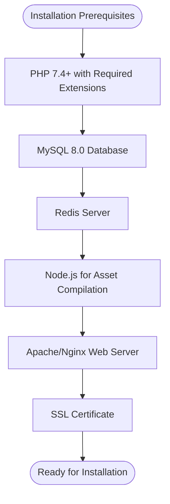
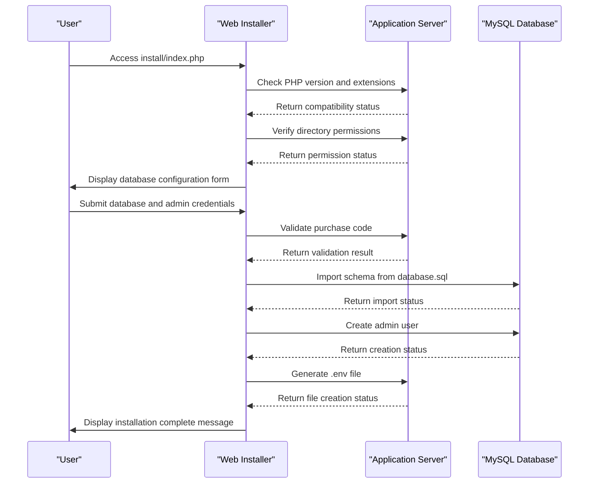
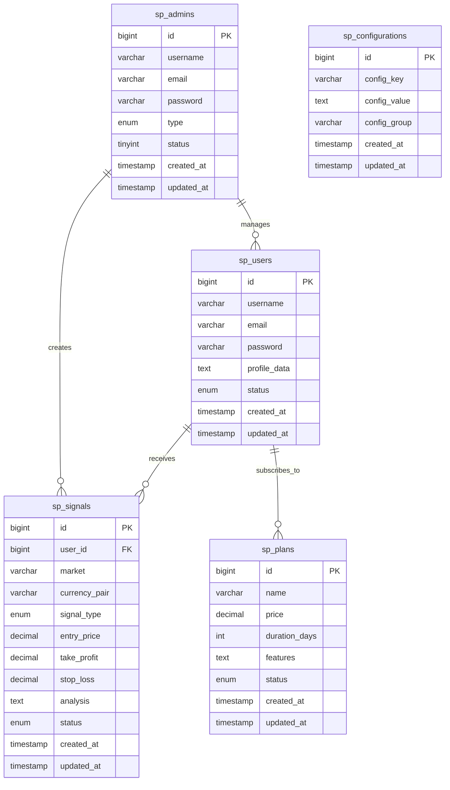

# Installation & Setup

<cite>
**Referenced Files in This Document**   
- [index.php](file://install/index.php)
- [extension.php](file://install/extension.php)
- [permission.php](file://install/permission.php)
- [database.php](file://install/database.php)
- [config.php](file://install/lib/config.php)
- [functions.php](file://install/lib/functions.php)
- [database.sql](file://install/lib/database.sql)
- [.env.example](file://main/.env.example)
- [app.php](file://main/config/app.php)
- [database.php](file://main/config/database.php)
- [artisan](file://main/artisan)
</cite>

## Table of Contents
1. [Introduction](#introduction)
2. [Prerequisites](#prerequisites)
3. [Installation Methods](#installation-methods)
4. [Configuration Requirements](#configuration-requirements)
5. [Database Setup](#database-setup)
6. [Server Configuration](#server-configuration)
7. [Post-Installation Verification](#post-installation-verification)
8. [Troubleshooting Guide](#troubleshooting-guide)

## Introduction
This document provides comprehensive instructions for installing and setting up the AI Trade Pulse application in both development and production environments. The system is built on Laravel and requires specific server configurations to operate correctly. This guide covers all aspects of the installation process, from prerequisites to post-installation verification, ensuring a smooth deployment experience.

The application features a web-based installer that guides users through the setup process, validating server requirements, checking file permissions, configuring database settings, and initializing the application. Additionally, command-line installation methods are available for advanced users and automated deployment scenarios.

**Section sources**
- [index.php](file://install/index.php)
- [extension.php](file://install/extension.php)

## Prerequisites
Before installing the AI Trade Pulse application, ensure your server meets the following requirements:

### PHP Requirements
The application requires PHP 7.4 or higher (though the documentation objective specifies PHP 8.1+). The following PHP extensions must be enabled:
- BCMath
- Ctype
- Fileinfo
- JSON
- Mbstring
- OpenSSL
- PDO
- pdo_mysql
- Tokenizer
- XML
- cURL
- GD

These extensions are essential for various framework functionalities including encryption, database operations, image processing, and data handling.

### Database Requirements
MySQL 8.0 is required for optimal performance and compatibility. The database server must support UTF-8 character encoding (utf8mb4) to handle multilingual content and special characters properly.

### Caching Requirements
Redis is required for caching, session management, and queue processing. The application uses Redis for three distinct purposes:
- Default cache storage
- Queue management
- Session storage

### Node.js Requirements
Node.js is required for front-end asset compilation and processing. This is necessary for building CSS and JavaScript assets during development and deployment.

### Server Environment
The application is designed to run in both Apache and Nginx environments. For production deployments, Nginx with OpenResty is recommended for optimal performance.



**Diagram sources**
- [config.php](file://install/lib/config.php)
- [functions.php](file://install/lib/functions.php)

**Section sources**
- [config.php](file://install/lib/config.php)
- [functions.php](file://install/lib/functions.php)

## Installation Methods
The AI Trade Pulse application can be installed using either the web-based installer or command-line methods.

### Web Installer
The web installer provides a step-by-step graphical interface for installation:

1. **License Agreement**: The installation process begins with a license agreement screen that requires acceptance before proceeding.

2. **Server Requirements Check**: The installer verifies that all required PHP extensions are enabled and that the PHP version meets the minimum requirements (7.4+).

3. **File Permission Check**: The installer checks write permissions for critical directories:
   - `../main/bootstrap/cache/`
   - `../main/storage/`
   - `../main/storage/app/`
   - `../main/storage/framework/`
   - `../main/storage/logs/`

4. **Database Configuration**: Users input database credentials and application settings:
   - Purchase code validation
   - Application URL
   - Database connection details (host, port, name, username, password)
   - Admin account credentials (username, password, email)

5. **Installation Completion**: Upon successful configuration, the installer imports the database schema, creates the admin user, generates the .env file, and marks the installation as complete.

### Command-Line Installation
For advanced users and automated deployments, the application can be installed using Laravel Artisan commands:

```bash
# Install Composer dependencies
composer install --optimize-autoloader --no-dev

# Install Node.js dependencies
npm install

# Build front-end assets
npm run build

# Copy environment configuration
cp .env.example .env

# Generate application key
php artisan key:generate

# Run database migrations
php artisan migrate --seed

# Clear configuration cache
php artisan config:clear
php artisan cache:clear
```

The command-line method provides greater control over the installation process and is recommended for production deployments and CI/CD pipelines.



**Diagram sources**
- [index.php](file://install/index.php)
- [database.php](file://install/database.php)
- [functions.php](file://install/lib/functions.php)

**Section sources**
- [index.php](file://install/index.php)
- [extension.php](file://install/extension.php)
- [permission.php](file://install/permission.php)
- [database.php](file://install/database.php)
- [functions.php](file://install/lib/functions.php)

## Configuration Requirements
Proper configuration is essential for the application to function correctly. The primary configuration file is the `.env` file located in the `main/` directory.

### Environment Variables
The following environment variables must be configured:

| Variable | Description | Example |
|---------|-------------|---------|
| APP_NAME | Application name | Laravel |
| APP_ENV | Application environment (local, production) | production |
| APP_KEY | Encryption key for the application | base64:81FFaI7pMMYTvelC1gRqyKl5CzyT1mKAs6t8cXECukA= |
| APP_DEBUG | Debug mode (true/false) | false |
| APP_URL | Base URL of the application | https://aitradepulse.com |
| DB_DATABASE | Database name | algotrad_signals |
| DB_USERNAME | Database username | root |
| DB_PASSWORD | Database password | password123 |
| DB_HOST | Database host | 127.0.0.1 |
| DB_PORT | Database port | 3306 |
| DEMO | Demo mode flag | false |
| QUEUE_CONNECTION | Queue driver (database, redis) | database |
| REDIS_HOST | Redis server host | 127.0.0.1 |
| REDIS_PORT | Redis server port | 6379 |
| REDIS_PASSWORD | Redis password (if protected) | null |
| REDIS_DB | Redis database index for default | 0 |
| REDIS_CACHE_DB | Redis database index for cache | 1 |
| REDIS_QUEUE_DB | Redis database index for queues | 2 |

### Configuration Process
During web installation, the `envUpdateAfterInstalltion()` function in `functions.php` automatically generates the `.env` file with the provided configuration values. For manual configuration, copy the `.env.example` file to `.env` and modify the values accordingly.

The application uses a table prefix (`sp_`) for all database tables, which is configured in the database connection settings. This allows multiple instances to share the same database with minimal risk of table name conflicts.

**Section sources**
- [functions.php](file://install/lib/functions.php)
- [.env.example](file://main/.env.example)
- [database.php](file://main/config/database.php)

## Database Setup
The application requires a properly configured database with the necessary schema and initial data.

### Database Schema
The database schema is defined in the `install/lib/database.sql` file, which contains the complete structure for all application tables. Key tables include:
- `sp_admins`: Stores administrator accounts
- `sp_users`: Stores user accounts
- `sp_signals`: Stores trading signals
- `sp_plans`: Stores subscription plans
- `sp_configurations`: Stores application settings
- `sp_channel_sources`: Stores signal source configurations

### Migration and Seeding
The application uses Laravel's migration system to manage database schema changes. During installation, the following steps occur:

1. The database schema is imported from `database.sql`
2. Initial data is seeded, including:
   - Default admin user
   - System configurations
   - Default trading signals
   - Currency pairs and markets
   - Time frames for trading

For command-line installations, use the following commands to run migrations and seeders:

```bash
# Run all migrations
php artisan migrate

# Run migrations and seeders
php artisan migrate --seed

# Run specific seeder
php artisan db:seed --class=AdminSeeder
```

The database configuration supports query optimization settings, including slow query threshold monitoring and query monitoring capabilities that can be enabled in the configuration.



**Diagram sources**
- [database.sql](file://install/lib/database.sql)
- [database.php](file://main/config/database.php)

**Section sources**
- [database.sql](file://install/lib/database.sql)
- [database.php](file://main/config/database.php)
- [artisan](file://main/artisan)

## Server Configuration
Proper server configuration is critical for the application's performance, security, and reliability.

### Web Server Configuration
The application can run on both Apache and Nginx servers.

#### Apache Configuration
Ensure the following modules are enabled:
- mod_rewrite for URL rewriting
- mod_ssl for SSL/TLS support
- mod_headers for HTTP header management

The `.htaccess` file in the root directory contains the necessary rewrite rules to route all requests through the `index.php` front controller.

#### Nginx Configuration
For Nginx, use the following server block configuration:

```nginx
server {
    listen 80;
    server_name aitradepulse.com;
    root main/public;
    
    index index.php;
    
    location / {
        try_files $uri $uri/ /index.php?$query_string;
    }
    
    location ~ \.php$ {
        fastcgi_pass unix:/var/run/php/php8.1-fpm.sock;
        fastcgi_index index.php;
        fastcgi_param SCRIPT_FILENAME $document_root$fastcgi_script_name;
        include fastcgi_params;
    }
    
    location ~ /\.(?!well-known).* {
        deny all;
    }
}
```

### PHP Configuration
The following PHP settings are recommended:

```ini
# PHP Configuration
memory_limit = 512M
upload_max_filesize = 100M
post_max_size = 100M
max_execution_time = 300
max_input_time = 300
```

### SSL Setup
SSL encryption is required for production environments. Obtain an SSL certificate from a trusted certificate authority and configure your web server accordingly. Let's Encrypt provides free SSL certificates that can be automatically renewed.

### Redis Configuration
Redis should be configured with persistence enabled and appropriate memory limits. The application uses three separate Redis databases:
- Database 0: Default storage
- Database 1: Cache storage
- Database 2: Queue storage

**Section sources**
- [.htaccess](file://.htaccess)
- [database.php](file://main/config/database.php)

## Post-Installation Verification
After installation, verify that the application is functioning correctly by performing the following checks:

1. **Access the Application**: Navigate to the application URL and ensure the homepage loads correctly.

2. **Login as Administrator**: Use the admin credentials created during installation to log in to the admin panel.

3. **Check System Status**: Verify that all system components are operational:
   - Database connection
   - Cache system
   - Queue workers
   - Email delivery

4. **Test Signal Processing**: Create a test trading signal to ensure the signal processing pipeline is working.

5. **Verify Background Jobs**: Ensure that Laravel Horizon or queue workers are running to process background jobs.

6. **Check Log Files**: Review the application logs in `main/storage/logs/` for any errors or warnings.

Run the following Artisan commands to verify system health:

```bash
# Check application health
php artisan horizon:status

# List queued jobs
php artisan queue:monitor

# Test email configuration
php artisan tinker
>>> Mail::raw('Test message', function ($message) { $message->to('test@example.com'); });
```

**Section sources**
- [artisan](file://main/artisan)
- [horizon.php](file://main/config/horizon.php)

## Troubleshooting Guide
This section addresses common installation issues and their solutions.

### Permission Errors
If you encounter permission errors during installation:

1. Ensure the following directories are writable:
   ```bash
   chmod -R 775 main/storage/
   chmod -R 775 main/bootstrap/cache/
   chown -R www-data:www-data main/storage/
   chown -R www-data:www-data main/bootstrap/cache/
   ```

2. Verify that the web server user has ownership of the application directories.

### Dependency Conflicts
For Composer dependency conflicts:

1. Clear Composer cache:
   ```bash
   composer clear-cache
   ```

2. Remove vendor directory and reinstall:
   ```bash
   rm -rf vendor/
   composer install
   ```

3. Update dependencies:
   ```bash
   composer update
   ```

### Database Connection Issues
If the application cannot connect to the database:

1. Verify database credentials in the `.env` file.
2. Ensure the database server is running.
3. Check that the database user has the necessary privileges.
4. Verify that the database host and port are accessible from the application server.

### Web Installer Stuck
If the web installer does not progress past a certain step:

1. Check PHP error logs for any fatal errors.
2. Verify that all required PHP extensions are enabled.
3. Ensure sufficient memory is allocated to PHP.
4. Check file permissions on the installation directory.

### Missing Environment Variables
If environment variables are not being loaded:

1. Regenerate the configuration cache:
   ```bash
   php artisan config:clear
   php artisan config:cache
   ```

2. Verify that the `.env` file exists and is readable.

3. Check that the `APP_ENV` variable is set correctly.

**Section sources**
- [functions.php](file://install/lib/functions.php)
- [permission.php](file://install/permission.php)
- [database.php](file://install/database.php)