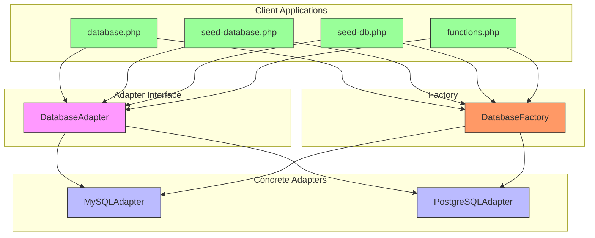
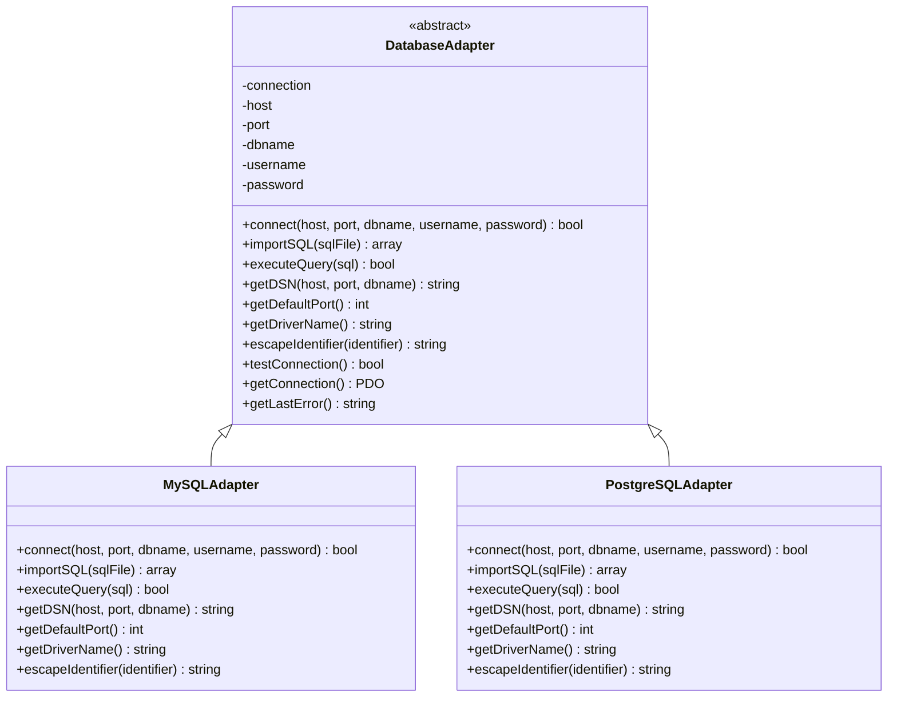
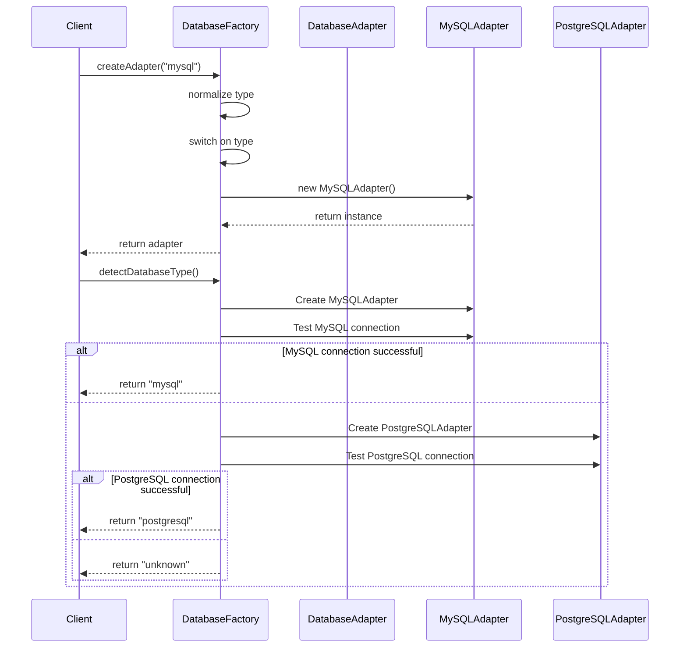
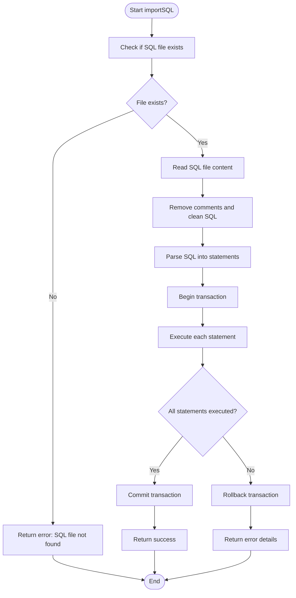

# Database Adapter Pattern

<cite>
**Referenced Files in This Document**   
- [DatabaseAdapter.php](file://install/lib/DatabaseAdapter.php)
- [DatabaseFactory.php](file://install/lib/DatabaseFactory.php)
- [MySQLAdapter.php](file://install/lib/adapters/MySQLAdapter.php)
- [PostgreSQLAdapter.php](file://install/lib/adapters/PostgreSQLAdapter.php)
- [database.php](file://install/database.php)
- [seed-database.php](file://install/seed-database.php)
- [seed-db.php](file://install/seed-db.php)
- [config.php](file://install/lib/config.php)
- [functions.php](file://install/lib/functions.php)
- [database.postgresql.sql](file://install/lib/database.postgresql.sql)
- [database.mysql.sql](file://install/lib/database.mysql.sql)
- [database.php](file://main/config/database.php)
</cite>

## Table of Contents
1. [Introduction](#introduction)
2. [Architecture Overview](#architecture-overview)
3. [Core Components](#core-components)
4. [Implementation Details](#implementation-details)
5. [Database Factory Pattern](#database-factory-pattern)
6. [Adapter Implementation](#adapter-implementation)
7. [Usage Examples](#usage-examples)
8. [Configuration and Integration](#configuration-and-integration)
9. [Error Handling and Validation](#error-handling-and-validation)
10. [Conclusion](#conclusion)

## Introduction

The Database Adapter Pattern implementation in this system provides a flexible and extensible approach to database connectivity and management. This pattern enables the application to support multiple database types through a unified interface, allowing for seamless switching between different database systems without requiring changes to the core application logic.

The implementation is primarily focused on the installation and setup process, providing robust mechanisms for database connection, schema import, and configuration. The pattern follows the Adapter and Factory design patterns, creating an abstraction layer between the application and the underlying database systems.

This documentation provides a comprehensive analysis of the Database Adapter Pattern implementation, covering its architecture, components, and integration points within the system.

## Architecture Overview

The Database Adapter Pattern implementation follows a clean architectural design that separates concerns and promotes maintainability. The system consists of several key components that work together to provide database connectivity and management capabilities.

**Diagram sources**
- [DatabaseAdapter.php](file://install/lib/DatabaseAdapter.php)
- [DatabaseFactory.php](file://install/lib/DatabaseFactory.php)
- [MySQLAdapter.php](file://install/lib/adapters/MySQLAdapter.php)
- [PostgreSQLAdapter.php](file://install/lib/adapters/PostgreSQLAdapter.php)

**Section sources**
- [DatabaseAdapter.php](file://install/lib/DatabaseAdapter.php#L1-L84)
- [DatabaseFactory.php](file://install/lib/DatabaseFactory.php#L1-L92)

## Core Components

The Database Adapter Pattern implementation consists of several core components that work together to provide database connectivity and management capabilities. These components include the abstract adapter class, concrete adapter implementations, the factory class, and various client applications that utilize the pattern.

The pattern is designed to provide a consistent interface for database operations regardless of the underlying database system. This allows the application to support multiple database types while maintaining a clean separation between the application logic and the database-specific implementation details.

The core components are organized in a hierarchical structure, with the abstract `DatabaseAdapter` class defining the common interface, concrete adapter classes implementing database-specific functionality, and the `DatabaseFactory` class providing a centralized mechanism for creating adapter instances.

**Section sources**
- [DatabaseAdapter.php](file://install/lib/DatabaseAdapter.php#L1-L84)
- [DatabaseFactory.php](file://install/lib/DatabaseFactory.php#L1-L92)
- [MySQLAdapter.php](file://install/lib/adapters/MySQLAdapter.php#L1-L122)
- [PostgreSQLAdapter.php](file://install/lib/adapters/PostgreSQLAdapter.php#L1-L121)

## Implementation Details

The implementation of the Database Adapter Pattern follows a well-defined structure that promotes code reuse and maintainability. The pattern is centered around an abstract base class that defines the common interface for all database adapters, with concrete implementations providing database-specific functionality.

The abstract `DatabaseAdapter` class defines several abstract methods that must be implemented by concrete adapter classes, including `connect()`, `importSQL()`, `executeQuery()`, `getDSN()`, `getDefaultPort()`, `getDriverName()`, and `escapeIdentifier()`. These methods provide the fundamental operations needed for database connectivity and management.

Concrete adapter classes extend the abstract base class and implement the database-specific functionality. The implementation includes specialized handling for different database systems, such as MySQL/MariaDB and PostgreSQL, while maintaining a consistent interface for client applications.

**Diagram sources**
- [DatabaseAdapter.php](file://install/lib/DatabaseAdapter.php#L3-L84)
- [MySQLAdapter.php](file://install/lib/adapters/MySQLAdapter.php#L5-L120)
- [PostgreSQLAdapter.php](file://install/lib/adapters/PostgreSQLAdapter.php#L5-L119)

**Section sources**
- [DatabaseAdapter.php](file://install/lib/DatabaseAdapter.php#L3-L84)
- [MySQLAdapter.php](file://install/lib/adapters/MySQLAdapter.php#L5-L120)
- [PostgreSQLAdapter.php](file://install/lib/adapters/PostgreSQLAdapter.php#L5-L119)

## Database Factory Pattern

The Database Factory Pattern is a key component of the implementation, providing a centralized mechanism for creating database adapter instances. The `DatabaseFactory` class serves as a factory that creates instances of concrete adapter classes based on the requested database type.

The factory pattern implementation includes several important methods:
- `createAdapter($type)`: Creates and returns a database adapter instance based on the specified type
- `detectDatabaseType($host, $port, $username, $password, $dbname)`: Attempts to automatically detect the database type by testing connections to MySQL and PostgreSQL
- `testConnection($type, $host, $port, $dbname, $username, $password)`: Tests the connection to a database using the specified parameters

The factory pattern enables the application to support multiple database types without requiring client code to know the specific adapter class to instantiate. This promotes loose coupling and makes it easy to add support for additional database types in the future.

**Diagram sources**
- [DatabaseFactory.php](file://install/lib/DatabaseFactory.php#L7-L73)
- [MySQLAdapter.php](file://install/lib/adapters/MySQLAdapter.php#L5-L120)
- [PostgreSQLAdapter.php](file://install/lib/adapters/PostgreSQLAdapter.php#L5-L119)

**Section sources**
- [DatabaseFactory.php](file://install/lib/DatabaseFactory.php#L7-L73)

## Adapter Implementation

The adapter implementation provides concrete classes for specific database systems, implementing the database-specific functionality required by the application. The system currently supports MySQL/MariaDB and PostgreSQL through dedicated adapter classes.

The `MySQLAdapter` class implements the `DatabaseAdapter` interface with MySQL-specific functionality, including:
- Connection string format using the "mysql:" prefix
- Default port of 3306
- Driver name "mysql" for Laravel integration
- Identifier escaping using backticks (`)

The `PostgreSQLAdapter` class implements the `DatabaseAdapter` interface with PostgreSQL-specific functionality, including:
- Connection string format using the "pgsql:" prefix
- Default port of 5432
- Driver name "pgsql" for Laravel integration
- Identifier escaping using double quotes (") 

Both adapter classes implement robust SQL import functionality that can parse and execute SQL files containing multiple statements. The implementation includes features such as:
- Transaction-based execution to ensure data consistency
- Statement parsing that preserves content within quotes
- Error handling with rollback capabilities
- Progress tracking and reporting

**Diagram sources**
- [MySQLAdapter.php](file://install/lib/adapters/MySQLAdapter.php#L26-L88)
- [PostgreSQLAdapter.php](file://install/lib/adapters/PostgreSQLAdapter.php#L26-L87)

**Section sources**
- [MySQLAdapter.php](file://install/lib/adapters/MySQLAdapter.php#L7-L120)
- [PostgreSQLAdapter.php](file://install/lib/adapters/PostgreSQLAdapter.php#L7-L119)

## Usage Examples

The Database Adapter Pattern is utilized in several key components of the system, demonstrating its practical application in real-world scenarios. The pattern is used in the installation process, database seeding, and configuration management.

In the `database.php` installation script, the pattern is used to:
- Test database connections
- Import the database schema
- Update admin credentials
- Configure the application environment

The `seed-database.php` and `seed-db.php` scripts use the pattern to:
- Connect to the database using credentials from the .env file
- Check for existing tables
- Import the SQL schema file
- Provide options to run Laravel seeders

The `functions.php` utility file uses the pattern to:
- Detect database types automatically
- Test database connections
- Import database schemas
- Update admin credentials

These usage examples demonstrate the flexibility and reusability of the Database Adapter Pattern, allowing different components of the system to interact with databases in a consistent and reliable manner.

**Section sources**
- [database.php](file://install/database.php#L23-L213)
- [seed-database.php](file://install/seed-database.php#L60-L145)
- [seed-db.php](file://install/seed-db.php#L78-L145)
- [functions.php](file://install/lib/functions.php#L46-L252)

## Configuration and Integration

The Database Adapter Pattern is integrated with the application's configuration system to provide seamless database connectivity and management. The implementation works in conjunction with Laravel's database configuration system, ensuring compatibility with the framework's conventions and practices.

The `config.php` file defines the supported database types and their display names, which are used in the installation interface. This configuration allows the system to support multiple database types while providing a consistent user experience.

The `database.php` configuration in the main application defines the database connections for different database systems, including MySQL, MariaDB, PostgreSQL, and SQL Server. The configuration uses environment variables to specify connection parameters, promoting security and flexibility.

The integration between the Database Adapter Pattern and Laravel's configuration system is achieved through the `envUpdateAfterInstalltion()` function, which updates the .env file with the appropriate database connection settings based on the selected database type.

**Section sources**
- [config.php](file://install/lib/config.php#L29-L34)
- [database.php](file://main/config/database.php#L18-L113)
- [functions.php](file://install/lib/functions.php#L96-L127)

## Error Handling and Validation

The Database Adapter Pattern implementation includes comprehensive error handling and validation mechanisms to ensure reliable database operations. The system provides multiple layers of error detection and reporting, from connection failures to SQL execution errors.

Key error handling features include:
- Connection testing with the `testConnection()` method
- Detailed error reporting through the `getLastError()` method
- Transaction rollback on SQL import failures
- Input validation in client applications
- Exception handling in factory methods

The implementation uses a consistent error reporting format, returning associative arrays with 'success' and 'error' keys. This allows client applications to easily determine the outcome of database operations and handle errors appropriately.

Validation is performed at multiple levels, including:
- Input validation in the installation interface
- Database type validation in the factory
- Connection parameter validation
- SQL file existence and content validation

These error handling and validation mechanisms ensure that database operations are performed reliably and that any issues are reported clearly to the user or calling application.

**Section sources**
- [DatabaseAdapter.php](file://install/lib/DatabaseAdapter.php#L45-L55)
- [DatabaseAdapter.php](file://install/lib/DatabaseAdapter.php#L74-L81)
- [MySQLAdapter.php](file://install/lib/adapters/MySQLAdapter.php#L83-L87)
- [PostgreSQLAdapter.php](file://install/lib/adapters/PostgreSQLAdapter.php#L82-L86)
- [database.php](file://install/database.php#L25-L70)
- [functions.php](file://install/lib/functions.php#L176-L177)

## Conclusion

The Database Adapter Pattern implementation in this system provides a robust and flexible solution for database connectivity and management. By following established design patterns and best practices, the implementation enables the application to support multiple database types while maintaining a clean separation between the application logic and database-specific implementation details.

The pattern's key strengths include:
- Support for multiple database systems through a unified interface
- Easy extensibility for adding new database types
- Robust error handling and validation
- Seamless integration with Laravel's configuration system
- Reusable components for database operations

The implementation demonstrates how design patterns can be effectively applied to solve real-world problems in software development. By abstracting the complexities of database connectivity, the pattern allows developers to focus on application logic while ensuring reliable and consistent database operations.

This comprehensive implementation serves as a solid foundation for the application's data persistence layer, providing the flexibility and reliability needed for a production-grade system.