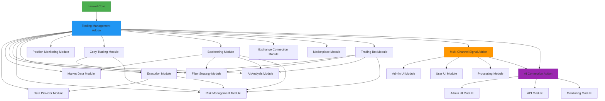
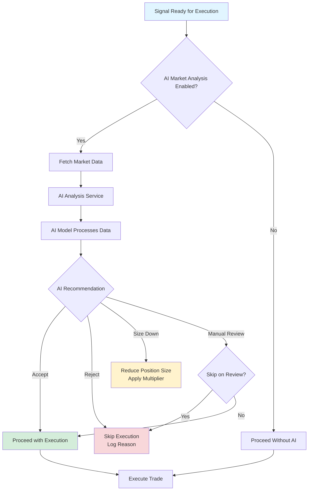
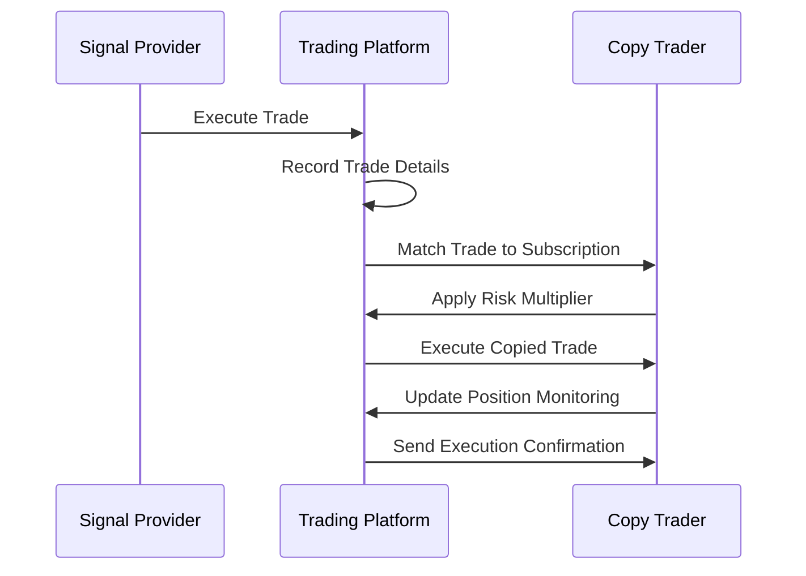

# Project Overview

<cite>
**Referenced Files in This Document**   
- [main/README.md](file://main/README.md)
- [main/composer.json](file://main/composer.json)
- [main/.env.example](file://main/.env.example)
- [docs/USER_GUIDE.md](file://docs/USER_GUIDE.md)
- [docs/ai-trading-integration.md](file://docs/ai-trading-integration.md)
- [main/addons/trading-management-addon/addon.json](file://main/addons/trading-management-addon/addon.json)
- [main/addons/multi-channel-signal-addon/addon.json](file://main/addons/multi-channel-signal-addon/addon.json)
- [main/addons/ai-connection-addon/addon.json](file://main/addons/ai-connection-addon/addon.json)
- [main/addons/_deprecated/ai-trading-addon/app/Services/AiDecisionEngine.php](file://main/addons/_deprecated/ai-trading-addon/app/Services/AiDecisionEngine.php)
- [main/addons/trading-execution-engine-addon/app/Services/SignalExecutionService.php](file://main/addons/trading-execution-engine-addon/app/Services/SignalExecutionService.php)
- [main/app/Services/AutoSignalService.php](file://main/app/Services/AutoSignalService.php)
- [main/app/Models/Signal.php](file://main/app/Models/Signal.php)
- [main/app/Models/Trade.php](file://main/app/Models/Trade.php)
- [main/app/Models/ChannelSource.php](file://main/app/Models/ChannelSource.php)
- [main/app/Models/ChannelMessage.php](file://main/app/Models/ChannelMessage.php)
- [main/app/Parsers/ParsingPipeline.php](file://main/app/Parsers/ParsingPipeline.php)
- [main/app/Adapters/TelegramAdapter.php](file://main/app/Adapters/TelegramAdapter.php)
- [main/app/Adapters/RssAdapter.php](file://main/app/Adapters/RssAdapter.php)
- [main/app/Adapters/WebScrapeAdapter.php](file://main/app/Adapters/WebScrapeAdapter.php)
- [main/database/migrations/2025_01_27_100000_create_channel_sources_table.php](file://main/database/migrations/2025_01_27_100000_create_channel_sources_table.php)
- [main/database/migrations/2025_01_27_100001_create_channel_messages_table.php](file://main/database/migrations/2025_01_27_100001_create_channel_messages_table.php)
- [main/database/migrations/2025_12_06_115618_create_trades_table.php](file://main/database/migrations/2025_12_06_115618_create_trades_table.php)
- [main/addons/ai-connection-addon/app/Services/AiConnectionService.php](file://main/addons/ai-connection-addon/app/Services/AiConnectionService.php)
- [main/addons/multi-channel-signal-addon/app/Services/ChannelMessageService.php](file://main/addons/multi-channel-signal-addon/app/Services/ChannelMessageService.php)
- [main/addons/trading-management-addon/Modules/Execution/ExecutionServiceProvider.php](file://main/addons/trading-management-addon/Modules/Execution/ExecutionServiceProvider.php)
- [main/addons/trading-management-addon/Modules/CopyTrading/CopyTradingServiceProvider.php](file://main/addons/trading-management-addon/Modules/CopyTrading/CopyTradingServiceProvider.php)
- [main/addons/trading-management-addon/Modules/Backtesting/BacktestingServiceProvider.php](file://main/addons/trading-management-addon/Modules/Backtesting/BacktestingServiceProvider.php)
- [main/addons/trading-management-addon/Modules/RiskManagement/RiskManagementServiceProvider.php](file://main/addons/trading-management-addon/Modules/RiskManagement/RiskManagementServiceProvider.php)
</cite>

## Table of Contents
1. [Introduction](#introduction)
2. [Architecture Overview](#architecture-overview)
3. [Core Components](#core-components)
4. [AI Integration](#ai-integration)
5. [Configuration and Environment](#configuration-and-environment)
6. [Key Features](#key-features)
7. [System Context Diagram](#system-context-diagram)
8. [Use Cases](#use-cases)
9. [Conclusion](#conclusion)

## Introduction

The AI-powered trading platform is a full-stack Laravel application designed to automate trading signal ingestion, perform AI-driven market analysis, and execute trades across multiple channels. The platform enables users to connect to various signal sources, apply AI-powered analysis to validate trading signals, and automatically execute trades on supported exchanges and brokers. Built with a modular architecture, the system supports extensibility through addons and provides comprehensive tools for risk management, copy trading, and strategy backtesting.

The platform serves both novice and experienced traders by offering intuitive interfaces for configuration while providing deep technical capabilities for advanced users. It integrates with multiple AI providers including OpenAI, Google Gemini, and OpenRouter, allowing for sophisticated market analysis and decision-making. The system supports both cryptocurrency exchanges via CCXT and Forex brokers through mtapi.io, enabling cross-market trading capabilities.

**Section sources**
- [docs/USER_GUIDE.md](file://docs/USER_GUIDE.md#L1-L252)
- [main/README.md](file://main/README.md#L1-L65)

## Architecture Overview

The platform follows a service-oriented architecture built on the Laravel MVC pattern, with a modular addon-based extensibility system. The core application provides foundational services while specialized functionality is implemented through addons that can be independently developed, tested, and deployed. This architecture enables the platform to maintain a clean separation of concerns while allowing for flexible feature expansion.

The system is organized into several key architectural layers:
- **Presentation Layer**: Blade templates and frontend assets for user interfaces
- **Application Layer**: Laravel controllers, requests, and middleware handling HTTP requests
- **Service Layer**: Business logic encapsulated in service classes
- **Data Layer**: Eloquent models, database migrations, and repositories
- **Integration Layer**: Adapters for external services (Telegram, RSS, Web scraping)
- **Addon System**: Modular components extending platform functionality

The addon system is central to the platform's extensibility, with each addon containing its own models, services, routes, and views. Addons can declare dependencies on other addons, creating a directed acyclic graph of functionality that ensures proper initialization order. The trading management addon serves as the central hub, integrating various specialized modules for data provision, filtering, AI analysis, risk management, execution, and backtesting.



**Diagram sources**
- [main/addons/trading-management-addon/addon.json](file://main/addons/trading-management-addon/addon.json#L1-L203)
- [main/addons/multi-channel-signal-addon/addon.json](file://main/addons/multi-channel-signal-addon/addon.json#L1-L42)
- [main/addons/ai-connection-addon/addon.json](file://main/addons/ai-connection-addon/addon.json#L1-L39)

**Section sources**
- [main/addons/trading-management-addon/addon.json](file://main/addons/trading-management-addon/addon.json#L1-L203)
- [main/composer.json](file://main/composer.json#L1-L125)

## Core Components

The platform's functionality is built around several core components that work together to enable automated trading. The **Trading Management Addon** serves as the central component, integrating various specialized modules for different aspects of trading operations. This addon provides a unified interface for managing trading activities and coordinates the interaction between different subsystems.

The **Multi-Channel Signal Addon** handles the ingestion of trading signals from various external sources including Telegram, RSS feeds, and websites through web scraping. This component processes incoming messages, extracts trading signals using both rule-based parsing and AI-powered analysis, and creates structured signal data that can be used for trading decisions.

The **AI Connection Addon** provides centralized management of AI provider connections, handling authentication, rate limiting, usage tracking, and connection rotation for AI services like OpenAI, Google Gemini, and OpenRouter. This addon exposes a unified API that other components can use to make AI calls without needing to manage connection details directly.

The platform uses a message-driven architecture for signal processing, where incoming channel messages are stored and processed asynchronously through Laravel's queue system. This ensures that signal ingestion does not block the main application and allows for retry mechanisms when processing fails. The system supports both real-time processing through webhooks and scheduled processing through Laravel's task scheduler.

**Section sources**
- [main/addons/trading-management-addon/addon.json](file://main/addons/trading-management-addon/addon.json#L1-L203)
- [main/addons/multi-channel-signal-addon/addon.json](file://main/addons/multi-channel-signal-addon/addon.json#L1-L42)
- [main/addons/ai-connection-addon/addon.json](file://main/addons/ai-connection-addon/addon.json#L1-L39)
- [main/app/Models/ChannelSource.php](file://main/app/Models/ChannelSource.php)
- [main/app/Models/ChannelMessage.php](file://main/app/Models/ChannelMessage.php)
- [main/app/Models/Signal.php](file://main/app/Models/Signal.php)
- [main/app/Models/Trade.php](file://main/app/Models/Trade.php)

## AI Integration

AI integration is a core capability of the platform, implemented through multiple interconnected components that enable both signal parsing and market analysis. The system leverages AI models from various providers including OpenAI, Google Gemini, and OpenRouter (which provides access to over 400 AI models) to enhance trading decisions and automate complex tasks.

For **signal parsing**, the platform uses AI to extract trading signals from unstructured messages when traditional regex-based parsing fails. When a message from a channel source cannot be parsed using configured patterns, the system routes it to an AI model that analyzes the message content and extracts relevant trading information such as currency pair, direction, entry price, stop loss, and take profit levels. The AI parser returns structured data along with a confidence score, allowing the system to determine whether the parsed signal is reliable enough to use.

For **market analysis**, the platform employs AI to validate trading signals before execution. When a signal is ready for execution, the system fetches current market data and technical indicators, then submits this information to an AI model for analysis. The AI evaluates whether the market conditions align with the proposed trade, assessing factors like trend direction, volatility, support and resistance levels, and overall risk. Based on this analysis, the AI returns a recommendation to accept, reject, or size down the trade, along with an explanation of its reasoning.

The AI decision flow follows a structured process:
1. Signal is identified and parsed
2. Market data is fetched for the relevant trading pair
3. AI analysis is performed on the signal and market conditions
4. Decision is made based on AI recommendation
5. Trade is executed, rejected, or modified accordingly



**Diagram sources**
- [docs/ai-trading-integration.md](file://docs/ai-trading-integration.md#L67-L92)
- [main/addons/_deprecated/ai-trading-addon/app/Services/AiDecisionEngine.php](file://main/addons/_deprecated/ai-trading-addon/app/Services/AiDecisionEngine.php)
- [main/addons/trading-execution-engine-addon/app/Services/SignalExecutionService.php](file://main/addons/trading-execution-engine-addon/app/Services/SignalExecutionService.php)

**Section sources**
- [docs/ai-trading-integration.md](file://docs/ai-trading-integration.md#L1-L301)
- [main/addons/ai-connection-addon/addon.json](file://main/addons/ai-connection-addon/addon.json#L1-L39)
- [main/addons/multi-channel-signal-addon/app/Parsers/AiMessageParser.php](file://main/addons/multi-channel-signal-addon/app/Parsers/AiMessageParser.php)

## Configuration and Environment

The platform's behavior is controlled through a combination of environment variables and admin-configurable settings. The `.env` file contains fundamental configuration parameters that define the application's operational environment, while the admin interface provides dynamic configuration options that can be modified without redeploying the application.

Key environment variables include:
- **Database configuration**: Connection details for the MySQL database
- **Queue configuration**: Redis is used as the queue driver for background processing
- **Cache configuration**: File-based caching for development, with Redis support for production
- **Mail configuration**: SMTP settings for sending transactional emails
- **AI provider credentials**: API keys for OpenAI, Google Gemini, and other AI services
- **Exchange API credentials**: Keys for connecting to cryptocurrency exchanges and Forex brokers
- **Horizon configuration**: Settings for the Laravel Horizon queue monitoring dashboard

In addition to environment variables, the platform provides extensive configuration options through the admin interface. These include:
- **AI configurations**: Multiple AI provider configurations with priority settings
- **Trading presets**: Pre-configured risk and position sizing rules
- **Filter strategies**: Technical indicator-based filters for trade signals
- **Risk management rules**: Stop loss, take profit, and position sizing parameters
- **Channel source settings**: Configuration for Telegram, RSS, and web scraping sources
- **Execution connection settings**: Exchange and broker connection details

The configuration system supports both global settings that apply to all users and user-specific settings that allow individual traders to customize their trading parameters. This flexibility enables the platform to serve both novice users who benefit from pre-configured settings and experienced traders who want fine-grained control over their trading strategies.

**Section sources**
- [main/.env.example](file://main/.env.example#L1-L66)
- [docs/USER_GUIDE.md](file://docs/USER_GUIDE.md#L1-L252)
- [main/app/Models/Configuration.php](file://main/app/Models/Configuration.php)
- [main/app/Services/ConfigurationService.php](file://main/app/Services/ConfigurationService.php)

## Key Features

### Copy Trading

The platform includes a comprehensive copy trading system that allows users to follow successful traders and automatically replicate their trades. Users can browse a marketplace of traders, view their performance metrics, and subscribe to their trading strategies. When a subscribed trader executes a trade, the system automatically replicates it for all followers, applying configurable risk parameters such as position size multipliers and trading presets.

The copy trading system includes several key components:
- **Trader profiles**: Public profiles showcasing performance history, risk metrics, and trading strategies
- **Subscription management**: Tools for users to manage their copy trading subscriptions
- **Risk adjustment**: Options to scale position sizes up or down relative to the original trade
- **Performance analytics**: Detailed metrics on copy trading performance compared to the original trader



**Diagram sources**
- [docs/USER_GUIDE.md](file://docs/USER_GUIDE.md#L139-L158)
- [main/addons/trading-management-addon/Modules/CopyTrading/CopyTradingServiceProvider.php](file://main/addons/trading-management-addon/Modules/CopyTrading/CopyTradingServiceProvider.php)

### Backtesting

The platform provides robust backtesting capabilities that allow users to test their trading strategies against historical market data. Users can create backtests for various strategy components including filter strategies, AI model profiles, and complete trading bots. The backtesting system simulates trades based on historical price data and calculates performance metrics such as win rate, profit factor, Sharpe ratio, and maximum drawdown.

Key features of the backtesting system include:
- **Historical data access**: OHLCV (Open, High, Low, Close, Volume) data for various timeframes
- **Strategy simulation**: Execution of trading rules on historical data
- **Performance metrics**: Comprehensive analysis of backtest results
- **Visualization**: Charts showing equity curves and trade distributions
- **Comparison tools**: Side-by-side comparison of different strategy variations

**Section sources**
- [docs/USER_GUIDE.md](file://docs/USER_GUIDE.md#L76-L79)
- [main/addons/trading-management-addon/Modules/Backtesting/BacktestingServiceProvider.php](file://main/addons/trading-management-addon/Modules/Backtesting/BacktestingServiceProvider.php)
- [main/app/Services/AutoSignalService.php](file://main/app/Services/AutoSignalService.php)

### AI Integration

As previously detailed, AI integration is a core feature of the platform, enabling both signal parsing and market analysis. The system uses AI models to extract trading signals from unstructured messages and to validate trading decisions based on current market conditions. This AI-powered approach enhances the reliability of automated trading by reducing false signals and adapting to changing market environments.

The AI integration supports multiple providers and models, allowing users to select the most appropriate AI for their needs. The platform includes features for managing AI costs, such as caching results, selecting cost-effective models, and implementing rate limiting. It also provides tools for monitoring AI performance and making adjustments based on accuracy and reliability.

**Section sources**
- [docs/ai-trading-integration.md](file://docs/ai-trading-integration.md#L1-L301)
- [main/addons/ai-connection-addon/app/Services/AiConnectionService.php](file://main/addons/ai-connection-addon/app/Services/AiConnectionService.php)
- [main/addons/multi-channel-signal-addon/app/Services/ChannelMessageService.php](file://main/addons/multi-channel-signal-addon/app/Services/ChannelMessageService.php)

## System Context Diagram

The following diagram illustrates the high-level system context, showing the platform's interaction with external systems and users:

```mermaid
graph TD
A[Users] --> B[AI Trading Platform]
C[Signal Sources] --> B
D[AI Providers] --> B
E[Exchanges & Brokers] --> B
F[Payment Processors] --> B
B --> G[Database]
B --> H[Cache]
B --> I[Queue]
subgraph "Signal Sources"
C1[Telegram Channels]
C2[RSS Feeds]
C3[Websites]
end
subgraph "AI Providers"
D1[OpenAI]
D2[Google Gemini]
D3[OpenRouter]
end
subgraph "Exchanges & Brokers"
E1[Cryptocurrency Exchanges<br/>(via CCXT)]
E2[Forex Brokers<br/>(via mtapi.io)]
end
subgraph "Platform Components"
B1[Web Interface]
B2[API]
B3[Background Jobs]
B4[Addons]
end
C1 --> B
C2 --> B
C3 --> B
D1 --> B
D2 --> B
D3 --> B
E1 --> B
E2 --> B
F --> B
B --> G
B --> H
B --> I
style A fill:#2196F3,stroke:#1976D2
style B fill:#4CAF50,stroke:#388E3C
style C fill:#FF9800,stroke:#F57C00
style D fill:#9C27B0,stroke:#7B1FA2
style E fill:#FF5722,stroke:#D84315
style F fill:#795548,stroke:#5D4037
style G fill:#607D8B,stroke:#455A64
style H fill:#607D8B,stroke:#455A64
style I fill:#607D8B,stroke:#455A64
```

**Diagram sources**
- [main/addons/trading-management-addon/addon.json](file://main/addons/trading-management-addon/addon.json#L1-L203)
- [main/addons/multi-channel-signal-addon/addon.json](file://main/addons/multi-channel-signal-addon/addon.json#L1-L42)
- [main/addons/ai-connection-addon/addon.json](file://main/addons/ai-connection-addon/addon.json#L1-L39)
- [main/app/Adapters/TelegramAdapter.php](file://main/app/Adapters/TelegramAdapter.php)
- [main/app/Adapters/RssAdapter.php](file://main/app/Adapters/RssAdapter.php)
- [main/app/Adapters/WebScrapeAdapter.php](file://main/app/Adapters/WebScrapeAdapter.php)

## Use Cases

### Setting Up Trading Bots

Users can create automated trading bots by combining various components such as trading presets, filter strategies, and AI model profiles. The process involves:
1. Selecting an exchange connection
2. Choosing a trading preset that defines risk parameters
3. Adding filter strategies based on technical indicators
4. Configuring AI analysis for market confirmation
5. Activating the bot to start automated trading

Trading bots can be created from pre-built templates available in the marketplace or customized from scratch. The platform provides tools for monitoring bot performance and making adjustments as market conditions change.

**Section sources**
- [docs/USER_GUIDE.md](file://docs/USER_GUIDE.md#L113-L136)
- [main/addons/trading-management-addon/Modules/TradingBot/TradingBotServiceProvider.php](file://main/addons/trading-management-addon/Modules/TradingBot/TradingBotServiceProvider.php)

### Managing Signal Sources

Users can connect to various signal sources to automatically ingest trading signals. For Telegram channels, users provide the channel username or invite link. For RSS feeds, they enter the feed URL. For websites, they configure web scraping rules to extract signal information.

Once connected, the platform monitors the source for new messages and processes them through the signal parsing pipeline. Users can configure parsing rules, including regex patterns and AI-based parsing, to extract trading information from messages. They can also set up filters to only process signals that meet certain criteria.

**Section sources**
- [docs/USER_GUIDE.md](file://docs/USER_GUIDE.md#L82-L109)
- [main/app/Adapters/TelegramAdapter.php](file://main/app/Adapters/TelegramAdapter.php)
- [main/app/Adapters/RssAdapter.php](file://main/app/Adapters/RssAdapter.php)
- [main/app/Adapters/WebScrapeAdapter.php](file://main/app/Adapters/WebScrapeAdapter.php)
- [main/app/Services/AutoSignalService.php](file://main/app/Services/AutoSignalService.php)

## Conclusion

The AI-powered trading platform represents a comprehensive solution for automated trading, combining signal ingestion, AI-driven analysis, and multi-channel execution in a modular Laravel application. Its architecture supports both ease of use for beginners and deep customization for experienced traders, making it suitable for a wide range of trading strategies and risk profiles.

The platform's addon-based design enables continuous evolution and feature expansion without compromising system stability. By integrating multiple AI providers and supporting various signal sources and execution channels, it offers flexibility that allows users to adapt to changing market conditions and trading opportunities.

Key strengths of the platform include its robust AI integration for signal validation, comprehensive risk management tools, and support for both automated trading bots and social copy trading. The system's use of Laravel's ecosystem provides reliability and scalability, while its modular design ensures maintainability and extensibility.

As algorithmic trading continues to evolve, this platform provides a solid foundation for developing sophisticated trading strategies that leverage artificial intelligence to enhance decision-making and improve trading performance.

**Section sources**
- [docs/USER_GUIDE.md](file://docs/USER_GUIDE.md#L1-L252)
- [docs/ai-trading-integration.md](file://docs/ai-trading-integration.md#L1-L301)
- [main/addons/trading-management-addon/addon.json](file://main/addons/trading-management-addon/addon.json#L1-L203)