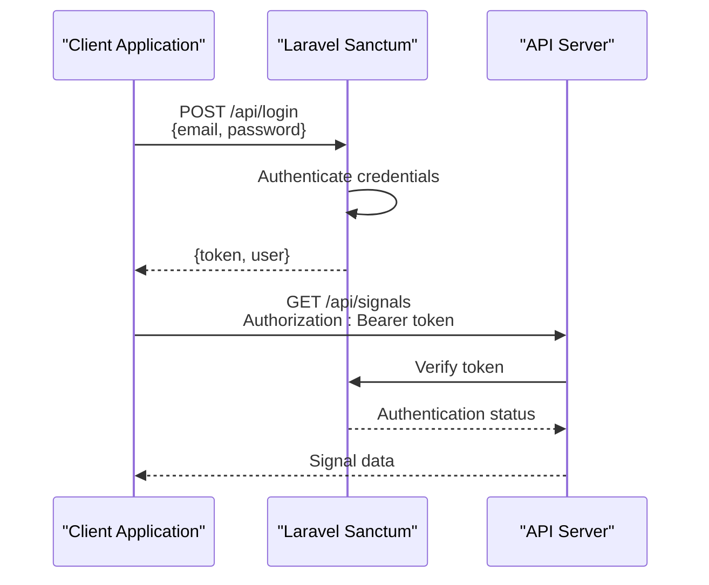
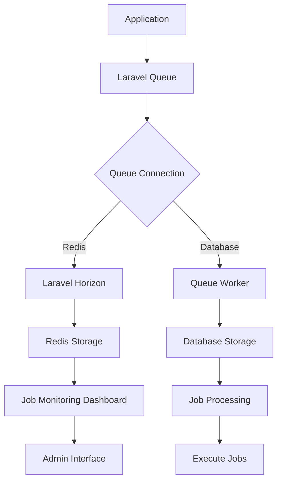
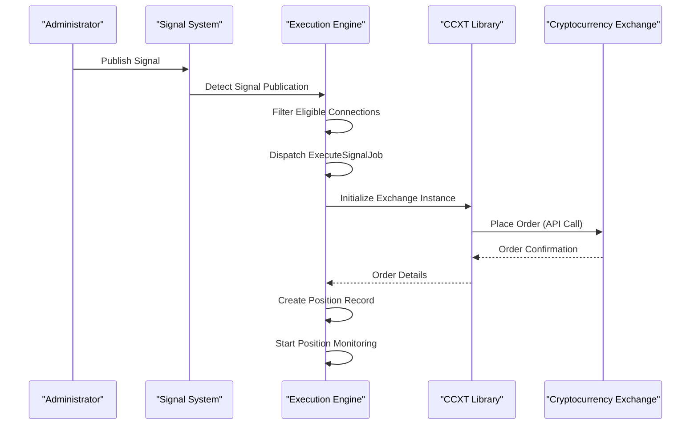
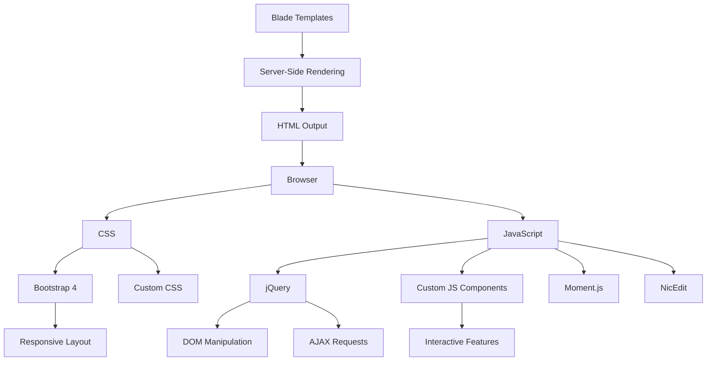
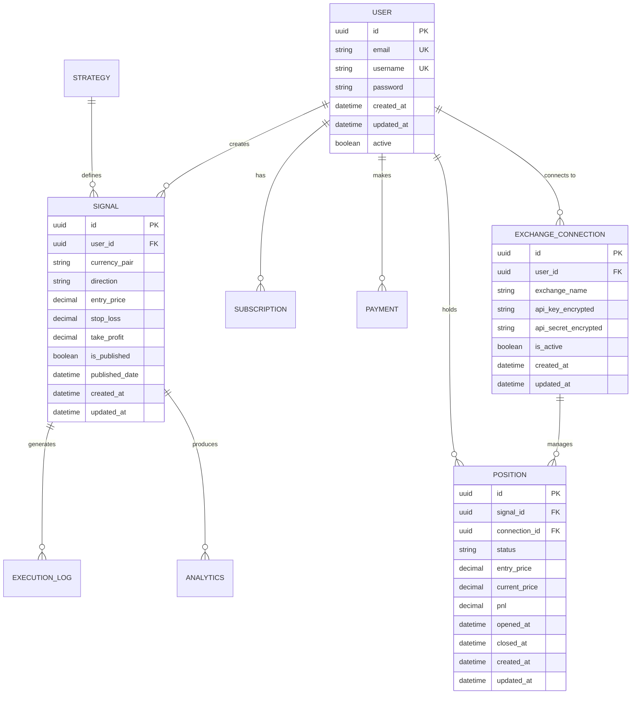
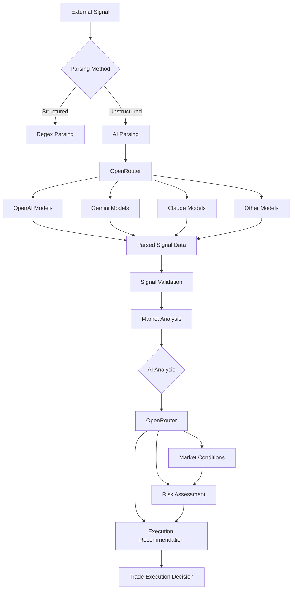

# Technology Stack & Dependencies

<cite>
**Referenced Files in This Document**   
- [app.php](file://main/config/app.php)
- [sanctum.php](file://main/config/sanctum.php)
- [horizon.php](file://main/config/horizon.php)
- [octane.php](file://main/config/octane.php)
- [cache.php](file://main/config/cache.php)
- [database.php](file://main/config/database.php)
- [services.php](file://main/config/services.php)
- [.env.example](file://main/.env.example)
- [package.json](file://main/package.json)
- [composer.json](file://main/composer.json)
- [README.md](file://README.md)
- [ai-trading-integration.md](file://docs/ai-trading-integration.md)
- [openrouter-integration.md](file://docs/openrouter-integration.md)
- [performance-optimization-implementation.md](file://docs/performance-optimization-implementation.md)
- [deployment-guide.md](file://docs/deployment-guide.md)
</cite>

## Table of Contents
1. [Laravel Framework & Core Components](#laravel-framework--core-components)
2. [API Authentication with Laravel Sanctum](#api-authentication-with-laravel-sanctum)
3. [Queue Management with Laravel Horizon](#queue-management-with-laravel-horizon)
4. [Performance Optimization with Laravel Octane](#performance-optimization-with-laravel-octane)
5. [Cryptocurrency Exchange Integration with CCXT](#cryptocurrency-exchange-integration-with-ccxt)
6. [Real-time Synchronization with Firebase](#real-time-synchronization-with-firebase)
7. [Frontend Technologies](#frontend-technologies)
8. [Database Dependencies](#database-dependencies)
9. [AI Integration Services](#ai-integration-services)
10. [Dependency Management](#dependency-management)
11. [Version Compatibility Requirements](#version-compatibility-requirements)
12. [Infrastructure Considerations](#infrastructure-considerations)

## Laravel Framework & Core Components

The application is built on Laravel 9.x, a robust PHP framework that provides a solid foundation for the trading signal platform. The core configuration is managed through Laravel's configuration system, with key settings defined in the `config/app.php` file. The application follows Laravel's service provider pattern, with essential services registered in the providers array including database, cache, queue, and authentication services.

Laravel's modular architecture is extended through a custom addon system that allows for feature modularity. The application includes several key addons that extend functionality:
- Multi-Channel Signal Addon for automatic signal ingestion
- Trading Execution Engine for automated trade execution
- Trading Preset Addon for risk management
- AI Trading Addon for AI-powered market analysis
- Filter Strategy Addon for technical indicator filtering
- Copy Trading Addon for social trading capabilities
- Trading Bot Signal Addon for external bot integration
- OpenRouter Integration Addon for unified AI gateway access

The application structure follows Laravel conventions with the main application code located in the `main/` directory, containing the standard Laravel directories for app, config, database, resources, routes, and storage. The service layer pattern is enforced, with business logic encapsulated in service classes within the `app/Services/` directory.

**Section sources**
- [app.php](file://main/config/app.php#L1-L250)
- [README.md](file://README.md#L66-L104)

## API Authentication with Laravel Sanctum

The application implements API authentication using Laravel Sanctum, which provides a simple and secure token-based authentication system for SPAs, mobile applications, and simple token-based APIs. Sanctum is configured through the `config/sanctum.php` file, which defines the stateful domains that can receive authentication cookies.

The configuration specifies that requests from localhost, 127.0.0.1, and the application's configured URL will receive stateful API authentication cookies. This allows for seamless authentication between the frontend and backend when accessed from these domains. The authentication guard is set to 'web', and custom middleware for CSRF token verification and cookie encryption are specified.

API authentication follows the standard Sanctum workflow:
1. Users authenticate through the login endpoint
2. Sanctum issues a token that can be used for subsequent requests
3. The token is included in the Authorization header as a Bearer token
4. Sanctum verifies the token on each request to authenticate the user

This approach provides a secure authentication mechanism while maintaining simplicity for API consumers. The token expiration is set to null, meaning personal access tokens do not expire, which is suitable for the application's use case where long-lived API access is required for trading operations.



**Diagram sources **
- [sanctum.php](file://main/config/sanctum.php#L1-L66)
- [README.md](file://README.md#L613-L645)

## Queue Management with Laravel Horizon

The application uses Laravel Horizon for advanced queue management and monitoring. Horizon provides a beautiful dashboard and API for managing Redis queues, offering insights into job throughput, runtime, and failure rates. The configuration is defined in `config/horizon.php`, which sets up the Horizon environment with specific settings for production and local environments.

Key Horizon configuration settings include:
- **Supervisors**: Configured with different settings for production (maxProcesses: 10) and local (maxProcesses: 3) environments
- **Queue Wait Time Thresholds**: Set to 60 seconds for the default Redis connection
- **Job Trimming Times**: Recent jobs kept for 60 minutes, failed jobs stored for 10080 minutes (7 days)
- **Memory Limit**: Set to 64MB for the Horizon master supervisor
- **Redis Connection**: Uses the 'default' Redis connection with a dynamically generated prefix based on the application name

Horizon is configured to use Redis as the queue connection, which is specified in the `.env` file with `QUEUE_CONNECTION=redis`. This provides better performance and reliability compared to the database queue driver, especially for high-volume trading operations that require fast job processing.

The Horizon dashboard is accessible at the `/horizon` path and is protected with web, admin, and a custom iframe middleware to ensure only authorized users can access the monitoring interface. This allows administrators to monitor queue performance, retry failed jobs, and manage workers effectively.



**Diagram sources **
- [horizon.php](file://main/config/horizon.php#L1-L231)
- [database.php](file://main/config/database.php#L131-L204)

## Performance Optimization with Laravel Octane

The application leverages Laravel Octane for significant performance improvements by serving the application using high-performance servers like Swoole or RoadRunner. Octane dramatically increases request throughput by eliminating the overhead of booting the Laravel application for each request.

The Octane configuration in `config/octane.php` specifies:
- **Server**: Configured to use Swoole (default) or RoadRunner based on the OCTANE_SERVER environment variable
- **HTTPS**: Configurable via the OCTANE_HTTPS environment variable
- **Listeners**: Event listeners for worker lifecycle events including WorkerStarting, RequestReceived, RequestHandled, and WorkerStopping
- **Warm Services**: Default services to warm during worker boot
- **File Watching**: List of directories and files to watch for changes when using the --watch option
- **Garbage Collection**: Threshold set to 50MB to trigger garbage collection when memory consumption reaches this level
- **Maximum Execution Time**: Set to 30 seconds for request processing

Octane's performance benefits are particularly valuable for the trading platform, where low-latency processing of trading signals and market data is critical. By maintaining a persistent application state in memory, Octane eliminates the bootstrap overhead of traditional PHP-FPM setups, resulting in much faster response times.

The configuration also includes Swoole-specific settings such as the Octane cache table with configurable rows and bytes, and the ability to define custom Swoole tables for storing data that needs to be quickly accessed by workers on the Swoole server.

```mermaid
graph LR
A[Traditional PHP] --> B[Request]
B --> C[Boot Laravel]
C --> D[Process Request]
D --> E[Send Response]
E --> F[Shutdown]
G[Octane with Swoole] --> H[Request]
H --> I[Process Request<br/>(No Boot Required)]
I --> J[Send Response]
J --> K[Wait for Next Request]
style F stroke:#ff0000,stroke-width:2px
style K stroke:#00ff00,stroke-width:2px
```

**Diagram sources **
- [octane.php](file://main/config/octane.php#L1-L222)
- [performance-optimization-implementation.md](file://docs/performance-optimization-implementation.md#L22-L40)

## Cryptocurrency Exchange Integration with CCXT

The application integrates with cryptocurrency exchanges through the CCXT library, which provides unified API access to over 100 cryptocurrency exchanges. This integration is primarily used by the Trading Execution Engine addon to automatically execute trades on connected exchanges.

The CCXT integration allows the platform to:
- Connect to major cryptocurrency exchanges including Binance, Coinbase, Kraken, and others
- Retrieve real-time market data (OHLCV candles, order books, ticker information)
- Place market and limit orders with stop-loss and take-profit levels
- Manage positions and monitor open trades
- Retrieve account balance and transaction history

The integration is configured through execution connections in the admin panel, where users can add their exchange API keys and secrets. These credentials are securely stored in the database and used to create CCXT exchange instances for trading operations.

The trading execution flow with CCXT follows this pattern:
1. A trading signal is published by an administrator
2. The system identifies all active execution connections with appropriate permissions
3. For each eligible connection, an ExecuteSignalJob is dispatched to the queue
4. The job uses CCXT to place the order on the connected exchange
5. The position is created in the system with status tracking
6. A monitoring job runs every minute to update position status and check for stop-loss/take-profit triggers

This architecture ensures reliable and asynchronous trade execution while maintaining separation between the signal generation system and the execution layer.



**Section sources**
- [README.md](file://README.md#L219-L233)
- [deployment-guide.md](file://docs/deployment-guide.md#L213-L218)

## Real-time Synchronization with Firebase

The application uses Firebase for real-time synchronization, particularly in the Trading Bot Signal addon which integrates with external trading bots. Firebase provides a real-time database and messaging capabilities that enable instant updates between the platform and connected trading bots.

The Firebase integration allows for:
- Real-time notification of trading signals to connected bots
- Instant synchronization of trade execution status
- Live updates of position monitoring data
- Two-way communication between the platform and external bots

While specific Firebase configuration details are not visible in the provided files, the integration is mentioned in the README.md as a key component of the Trading Bot Signal addon. The integration likely uses Firebase's Realtime Database or Firestore to maintain synchronized state between the Laravel application and external bot instances.

This real-time capability is essential for trading operations where timing is critical, ensuring that signals are delivered and executed with minimal latency. The integration complements the queue-based architecture by providing immediate feedback and status updates, creating a responsive trading environment.

**Section sources**
- [README.md](file://README.md#L101-L102)

## Frontend Technologies

The frontend of the application is built using a combination of jQuery, Bootstrap, and custom JavaScript components. The UI framework is based on Bootstrap 4, providing a responsive and mobile-friendly interface across all devices.

Key frontend technologies include:
- **jQuery**: Used for DOM manipulation, event handling, and AJAX requests
- **Bootstrap 4**: Provides the CSS framework for layout, components, and responsive design
- **Custom JavaScript**: Various custom components for interactive features
- **Blade Templates**: Laravel's templating engine for server-side rendering
- **Feather Icons and Font Awesome**: Icon libraries for UI elements

The asset structure shows a well-organized frontend with separate directories for CSS and JavaScript files, organized by theme (blue, dark, default, light, materialize, premium). Each theme contains its own CSS and JavaScript files, allowing for easy theme switching and customization.

The JavaScript components include:
- `app.js`: Main application JavaScript
- `custom.js`: Custom functionality
- `dialog-wrapper.js`: Dialog/popup management
- `iconpicker.js`: Icon selection interface
- `moment.js`: Date and time manipulation
- `nic_edit.js`: Rich text editor
- `quixnav-init.js`: Navigation initialization
- `repeater.js`: Form field repetition
- `styleSwitcher.js`: Theme/style switching
- `ui.js`: General UI functionality

The frontend is compiled and optimized using Laravel Mix, as evidenced by the package.json file which includes Laravel Mix as a devDependency. This allows for asset compilation, minification, and versioning to optimize frontend performance.



**Section sources**
- [README.md](file://README.md#L76-L82)
- [package.json](file://main/package.json#L1-L22)

## Database Dependencies

The application relies on MySQL as its primary database for persistent data storage and Redis for caching, session management, and queue operations. This dual-database approach provides optimal performance and reliability for the trading platform.

### MySQL Configuration

The primary database is MySQL 5.7+, configured in `config/database.php` with the following key settings:
- **Connection**: Named 'mysql' with configurable host, port, database, username, and password via environment variables
- **Charset**: utf8mb4 with utf8mb4_unicode_ci collation to support full Unicode, including emojis
- **Prefix**: 'sp_' table prefix to avoid naming conflicts
- **Options**: Configurable SSL settings for secure database connections

The database schema is managed through Laravel migrations, with numerous migration files in the `database/migrations/` directory that create tables for users, signals, subscriptions, payments, and other core entities. The schema includes proper indexing for performance optimization, with indexes on frequently queried columns.

### Redis Configuration

Redis is used for multiple purposes:
- **Cache**: Configured with a dedicated database (index 1) for application caching
- **Queue**: Configured with a dedicated database (index 2) for queue operations
- **Session**: Can be configured to store sessions in Redis for better performance
- **Horizon**: Used by Laravel Horizon to store monitoring data and job metrics

The Redis configuration in `config/database.php` supports both TCP and Unix socket connections, with the ability to configure different databases for different purposes. The configuration uses environment variables for host, port, password, and database indices, allowing for flexible deployment configurations.

The cache configuration in `config/cache.php` supports multiple drivers with Redis as one of the options. When Redis is used for caching, it provides significantly faster read and write operations compared to file-based caching, which is crucial for the high-frequency data access patterns in a trading application.



**Diagram sources **
- [database.php](file://main/config/database.php#L36-L93)
- [cache.php](file://main/config/cache.php#L76-L81)
- [README.md](file://README.md#L72-L73)

## AI Integration Services

The application integrates with multiple AI services including OpenAI, Google Gemini, and OpenRouter to provide advanced trading capabilities such as signal parsing, market analysis, and trading decision support.

### OpenAI Integration

OpenAI is integrated through the services configuration in `config/services.php`, which includes settings for the API key and default model. The configuration allows for using different OpenAI models such as gpt-3.5-turbo or GPT-4 for various AI-powered features.

The AI capabilities are used for:
- Parsing unstructured trading signals from various sources
- Performing market analysis before trade execution
- Generating trading recommendations based on market conditions
- Validating trading signals against current market data

### Google Gemini Integration

Google Gemini is also supported as an AI provider, offering an alternative to OpenAI with potentially different performance characteristics and cost structures. The integration allows users to choose between different AI models based on their specific needs and preferences.

### OpenRouter Integration

The OpenRouter Integration Addon provides a unified gateway to access over 400 AI models from various providers including OpenAI, Anthropic, Google, and Meta. This addon offers several advantages:
- Single API key for multiple AI providers
- Ability to compare and switch between different models
- Cost optimization by choosing models based on price/performance ratio
- Automatic fallback if one model fails
- Usage analytics to track AI API consumption

The OpenRouter configuration allows administrators to:
- Create multiple configurations with different models and settings
- Set priorities for configuration selection
- Enable configurations for specific use cases (signal parsing or market analysis)
- Monitor API usage and costs
- Test connections and parsing capabilities

The AI integration is used throughout the trading workflow, from parsing incoming signals to analyzing market conditions before executing trades. This AI-powered approach enhances the platform's capabilities by providing intelligent decision support and automated analysis.



**Diagram sources **
- [services.php](file://main/config/services.php#L49-L54)
- [openrouter-integration.md](file://docs/openrouter-integration.md#L22-L44)
- [ai-trading-integration.md](file://docs/ai-trading-integration.md#L8-L54)

## Dependency Management

The application uses both Composer for PHP dependencies and NPM for JavaScript dependencies, following standard Laravel conventions for dependency management.

### Composer Dependencies

The `composer.json` file defines the PHP dependencies for the application. While the full content is not visible, the structure indicates that the application follows Laravel's standard dependency management approach. Key packages mentioned in the documentation include:
- Laravel Framework
- Spatie Laravel Permission for role-based permissions
- Google2FA Laravel for two-factor authentication
- Intervention Image for image processing
- Laravel Sanctum for API authentication
- Laravel Horizon for queue monitoring
- Laravel Octane for performance optimization

The application also includes devDependencies for testing and development tools, ensuring that production deployments only include necessary packages.

### NPM Dependencies

The `package.json` file in the main directory defines the JavaScript dependencies and build scripts:
- **DevDependencies**: Includes Laravel Mix for asset compilation, PostCSS for CSS processing, Autoprefixer for CSS vendor prefixes, CSSNano for CSS minification, Axios for HTTP requests, and Lodash for utility functions
- **Scripts**: Defines development, production, and watch scripts for compiling assets using Laravel Mix

The build process uses Laravel Mix to compile and optimize frontend assets, with different scripts for development (non-minified) and production (minified) environments. This ensures optimal frontend performance in production while maintaining developer-friendly workflows during development.

The dependency management approach follows best practices by:
- Using version constraints to ensure compatibility
- Separating production and development dependencies
- Providing clear scripts for common tasks
- Leveraging Laravel's ecosystem tools for streamlined development

**Section sources**
- [package.json](file://main/package.json#L1-L22)
- [composer.json](file://main/composer.json#L1-L6)

## Version Compatibility Requirements

The application has specific version requirements for its core components and dependencies to ensure stability and compatibility:

### PHP Requirements
- **Minimum**: PHP 8.0.2
- **Recommended**: PHP 8.0.x or higher
- Required extensions: pdo_mysql, mbstring, xml, curl, zip, gd/imagick, openssl, json, bcmath, fileinfo, tokenizer

### Laravel Requirements
- **Framework**: Laravel 9.x
- This version provides the necessary features and performance characteristics required by the application

### Database Requirements
- **MySQL**: 5.7+ or MariaDB 10.2+
- **Redis**: Required for queue, cache, and Horizon functionality

### Frontend Requirements
- **Node.js**: Required for asset compilation (version not specified but compatible with Laravel Mix 6.x)
- **NPM/Yarn**: For managing JavaScript dependencies

### Server Requirements
- **Minimum**: 2 cores, 4GB RAM, 20GB SSD storage
- **Recommended**: 4+ cores, 8GB+ RAM, 50GB+ SSD storage
- **Web Server**: Apache 2.4+ or Nginx 1.18+

The application is designed to be deployed in production environments with these specifications to ensure optimal performance, especially for the real-time trading features that require low latency and high reliability.

**Section sources**
- [README.md](file://README.md#L302-L306)
- [deployment-guide.md](file://docs/deployment-guide.md#L39-L52)

## Infrastructure Considerations

Deploying the application in production requires careful consideration of infrastructure components to ensure reliability, performance, and security.

### Queue Workers

The application relies heavily on queue workers for asynchronous processing of trading operations, email notifications, and other background tasks. Production deployment should use Supervisor to manage queue worker processes:

```ini
[program:laravel-worker]
process_name=%(program_name)s_%(process_num)02d
command=php /path/to/main/artisan queue:work --sleep=3 --tries=3 --max-time=3600
autostart=true
autorestart=true
user=www-data
numprocs=4
redirect_stderr=true
stdout_logfile=/path/to/worker.log
```

This configuration ensures that four queue worker processes are always running, automatically restarting if they fail. The max-time setting prevents memory leaks by restarting workers after one hour.

### Cron Jobs

Laravel's task scheduler requires a single cron entry to run scheduled tasks:

```bash
* * * * * cd /path/to/main && php artisan schedule:run >> /dev/null 2>&1
```

This executes Laravel's scheduler every minute, which then determines if any scheduled tasks need to run. Key scheduled tasks include:
- Position monitoring (every minute)
- Analytics updates (daily)
- Subscription expiration checks (hourly)
- Job cleanup (daily)

### Caching Strategy

For optimal performance, Redis should be used for caching, sessions, and queue storage. The configuration in `.env` should include:

```env
CACHE_DRIVER=redis
SESSION_DRIVER=redis
QUEUE_CONNECTION=redis
REDIS_HOST=127.0.0.1
REDIS_PORT=6379
REDIS_PASSWORD=null
```

This setup provides significantly better performance than file-based caching, especially for high-traffic scenarios.

### Performance Optimization

Additional performance optimizations include:
- **OpCache**: Enable and configure PHP OpCache with sufficient memory
- **Asset Optimization**: Use Laravel Mix to compile and minify CSS and JavaScript
- **Database Indexing**: Ensure proper indexes on frequently queried columns
- **CDN**: Use a CDN for static assets to reduce latency
- **SSL/TLS**: Implement HTTPS with modern cipher suites

### Monitoring and Logging

Production infrastructure should include:
- **Log Rotation**: Configure logrotate to manage log file sizes
- **Health Checks**: Implement health check endpoints to monitor application status
- **Error Tracking**: Use tools to monitor and alert on application errors
- **Performance Monitoring**: Track response times, queue sizes, and system resources

These infrastructure considerations ensure that the application runs reliably in production, handling the demands of real-time trading operations with high availability and performance.

**Section sources**
- [deployment-guide.md](file://docs/deployment-guide.md#L286-L316)
- [performance-optimization-implementation.md](file://docs/performance-optimization-implementation.md#L133-L136)
- [.env.example](file://main/.env.example#L21-L23)