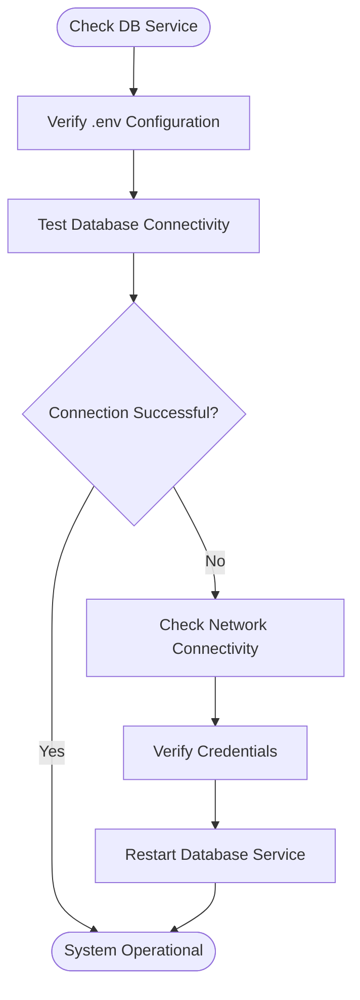
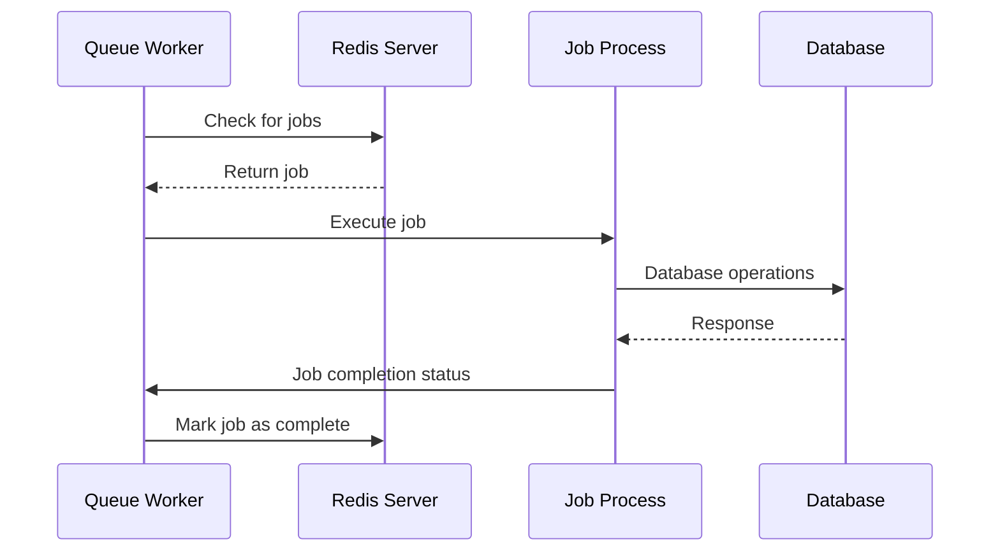
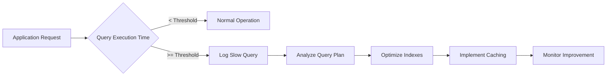

# Troubleshooting Guide

<cite>
**Referenced Files in This Document**   
- [database.php](file://main/config/database.php)
- [queue.php](file://main/config/queue.php)
- [logging.php](file://main/config/logging.php)
- [app.php](file://main/config/app.php)
- [performance.php](file://main/config/performance.php)
- [cache.php](file://main/config/cache.php)
- [horizon.php](file://main/config/horizon.php)
- [performance-optimization-implementation.md](file://docs/performance-optimization-implementation.md)
</cite>

## Table of Contents
1. [Introduction](#introduction)
2. [Installation Issues](#installation-issues)
3. [Configuration Errors](#configuration-errors)
4. [Database Connection Failures](#database-connection-failures)
5. [Queue Processing Errors](#queue-processing-errors)
6. [API Authentication Problems](#api-authentication-problems)
7. [Performance Bottlenecks](#performance-bottlenecks)
8. [Monitoring Metrics](#monitoring-metrics)
9. [Recovery Procedures](#recovery-procedures)
10. [Preventive Measures and Best Practices](#preventive-measures-and-best-practices)

## Introduction
This troubleshooting guide provides comprehensive solutions for common issues encountered in the AITradePulse platform. The document covers installation problems, configuration errors, database connectivity issues, queue processing failures, API authentication challenges, and performance optimization strategies. Each section includes diagnostic procedures, resolution steps, and preventive measures to ensure system stability and optimal performance.

## Installation Issues
Common installation issues typically stem from missing dependencies, incorrect file permissions, or incomplete setup procedures. The installation process is managed through the `/install` directory, which contains essential setup scripts.

**Section sources**
- [database.php](file://main/config/database.php#L18-L53)
- [app.php](file://main/config/app.php#L22-L35)

## Configuration Errors
Configuration errors often occur due to incorrect environment variables or misconfigured service settings. Key configuration files include `app.php`, `database.php`, `queue.php`, and `logging.php`, which control application behavior, database connections, queue processing, and logging mechanisms.

### Environment Configuration
Ensure the `.env` file contains all required variables with correct values. Common configuration issues include:
- Incorrect database credentials
- Misconfigured cache or queue drivers
- Invalid application URL settings

**Section sources**
- [app.php](file://main/config/app.php#L22-L63)
- [database.php](file://main/config/database.php#L18-L53)
- [queue.php](file://main/config/queue.php#L16-L31)

## Database Connection Failures
Database connection failures are among the most common runtime issues. These typically occur due to incorrect connection parameters, network issues, or database server unavailability.

### Diagnostic Procedures
1. Check database service status
2. Verify connection parameters in `.env` file
3. Test database connectivity using command-line tools
4. Examine database logs for connection attempts

### Resolution Steps
- Confirm `DB_HOST`, `DB_PORT`, `DB_DATABASE`, `DB_USERNAME`, and `DB_PASSWORD` are correctly set
- Ensure the database server is running and accessible
- Verify network connectivity between application and database servers
- Check firewall rules for blocked ports



**Diagram sources**
- [database.php](file://main/config/database.php#L18-L53)
- [app.php](file://main/config/app.php#L128-L131)

**Section sources**
- [database.php](file://main/config/database.php#L18-L53)
- [app.php](file://main/config/app.php#L128-L131)

## Queue Processing Errors
Queue processing errors can disrupt background job execution, affecting signal distribution, email notifications, and data processing workflows.

### Common Issues
- Redis connection failures
- Horizon supervisor crashes
- Job processing timeouts
- Memory exhaustion

### Diagnostic Commands
```bash
php artisan horizon
php artisan queue:work
php artisan horizon:supervisors
redis-cli ping
```

### Log Locations
- `storage/logs/laravel.log`
- Horizon dashboard at `/horizon`



**Diagram sources**
- [queue.php](file://main/config/queue.php#L31-L92)
- [horizon.php](file://main/config/horizon.php#L199-L212)

**Section sources**
- [queue.php](file://main/config/queue.php#L31-L92)
- [horizon.php](file://main/config/horizon.php#L199-L212)

## API Authentication Problems
API authentication issues typically involve token validation failures, incorrect headers, or permission denials.

### Troubleshooting Steps
1. Verify API token validity and expiration
2. Check request headers for proper authentication format
3. Validate user permissions and roles
4. Examine sanctum configuration settings

**Section sources**
- [app.php](file://main/config/app.php#L143-L188)
- [auth.php](file://main/config/auth.php)

## Performance Bottlenecks
Performance issues can manifest as slow response times, high memory usage, or database query delays.

### Slow Signal Processing
Signal processing performance can be affected by:
- Inefficient parsing algorithms
- High message volume
- Resource contention

### High Memory Usage
Monitor memory consumption through:
- Horizon memory metrics
- PHP memory limit settings
- Garbage collection efficiency

### Database Query Optimization
The system includes built-in query monitoring features:



**Diagram sources**
- [database.php](file://main/config/database.php#L118-L119)
- [performance.php](file://main/config/performance.php)

**Section sources**
- [database.php](file://main/config/database.php#L118-L119)
- [performance.php](file://main/config/performance.php)
- [performance-optimization-implementation.md](file://docs/performance-optimization-implementation.md)

## Monitoring Metrics
Key metrics to monitor for system health:

### Queue Performance
- Job wait times
- Failed job count
- Worker memory usage
- Queue throughput

### Database Performance
- Query execution time
- Connection pool usage
- Slow query frequency
- Cache hit ratio

### System Resources
- CPU utilization
- Memory consumption
- Disk I/O operations
- Network throughput

**Section sources**
- [horizon.php](file://main/config/horizon.php#L98-L101)
- [performance.php](file://main/config/performance.php)
- [logging.php](file://main/config/logging.php)

## Recovery Procedures
### Critical Failure Recovery
For critical system failures:

1. **Immediate Actions**
   - Isolate affected components
   - Preserve log files
   - Activate backup systems

2. **System Restart**
   ```bash
   php artisan horizon:terminate
   php artisan cache:clear
   php artisan config:clear
   php artisan queue:restart
   ```

3. **Data Integrity Check**
   - Verify database consistency
   - Check queue job status
   - Validate cache coherence

**Section sources**
- [horizon.php](file://main/config/horizon.php#L173-L174)
- [cache.php](file://main/config/cache.php)
- [app.php](file://main/config/app.php)

## Preventive Measures and Best Practices
### Configuration Management
- Maintain validated `.env` templates
- Implement configuration validation scripts
- Use configuration management tools

### Performance Optimization
- Regularly monitor slow queries
- Optimize database indexes
- Implement appropriate caching strategies
- Scale queue workers based on load

### System Maintenance
- Schedule regular database optimization
- Monitor disk space and log rotation
- Update dependencies regularly
- Conduct periodic performance testing

**Section sources**
- [performance.php](file://main/config/performance.php)
- [cache.php](file://main/config/cache.php#L34-L54)
- [database.php](file://main/config/database.php#L118-L119)
- [performance-optimization-implementation.md](file://docs/performance-optimization-implementation.md)