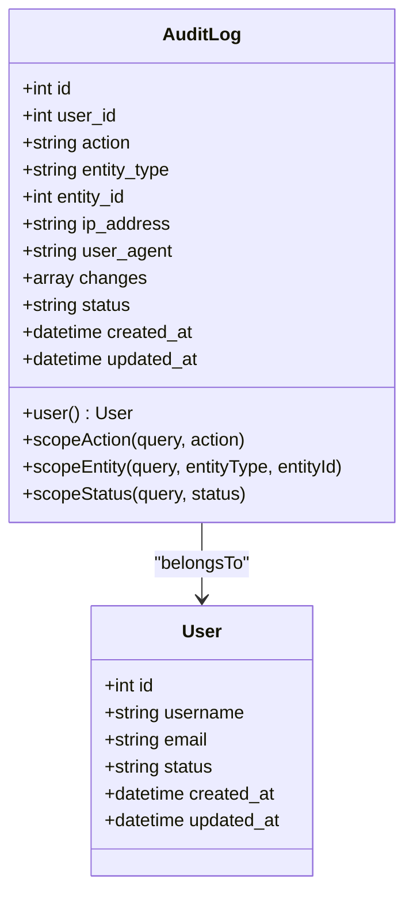
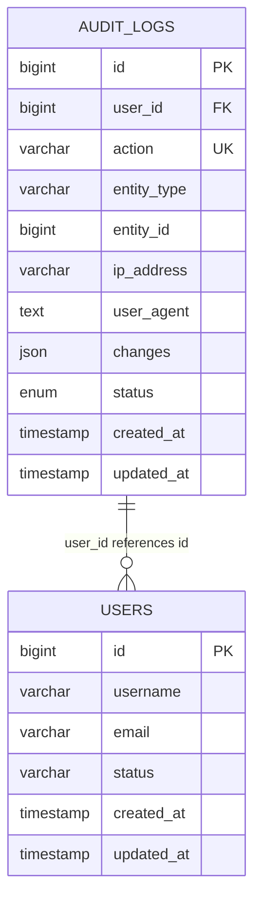
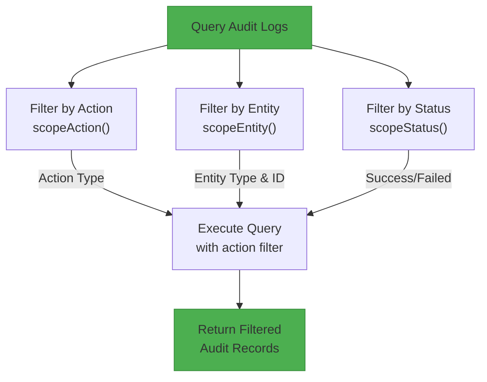

# Audit Log System

<cite>
**Referenced Files in This Document**   
- [AuditLog.php](file://main/app/Models/AuditLog.php)
- [create_audit_logs_table.php](file://main/database/migrations/2025_12_12_143000_create_audit_logs_table.php)
- [User.php](file://main/app/Models/User.php)
- [database-schema-reference.md](file://docs/database-schema-reference.md)
</cite>

## Table of Contents
1. [Introduction](#introduction)
2. [Audit Log Data Model](#audit-log-data-model)
3. [Database Schema](#database-schema)
4. [Core Features and Capabilities](#core-features-and-capabilities)
5. [Querying and Filtering](#querying-and-filtering)
6. [Relationships and Associations](#relationships-and-associations)

## Introduction
The Audit Log System provides comprehensive tracking of user actions and system events within the trading platform. It captures critical information about who performed actions, what changes were made, when they occurred, and from where, enabling security monitoring, compliance auditing, and operational troubleshooting. The system was implemented on December 12, 2025 as part of the platform's enhanced security and monitoring capabilities.

## Audit Log Data Model

The AuditLog model serves as the central component of the audit logging system, capturing detailed records of user activities and system events. The model is designed with security, performance, and query efficiency in mind, featuring appropriate indexing and data typing.

**Diagram sources**
- [AuditLog.php](file://main/app/Models/AuditLog.php#L8-L62)
- [User.php](file://main/app/Models/User.php#L10-L195)

**Section sources**
- [AuditLog.php](file://main/app/Models/AuditLog.php#L8-L62)

## Database Schema

The audit logs table is designed with performance and query optimization as primary considerations. Strategic indexing enables efficient filtering by user, action type, entity, and timestamp ranges. The schema supports both real-time monitoring and historical analysis of system activities.

**Diagram sources**
- [create_audit_logs_table.php](file://main/database/migrations/2025_12_12_143000_create_audit_logs_table.php#L1-L43)
- [database-schema-reference.md](file://docs/database-schema-reference.md#L1-L730)

**Section sources**
- [create_audit_logs_table.php](file://main/database/migrations/2025_12_12_143000_create_audit_logs_table.php#L1-L43)

## Core Features and Capabilities

The Audit Log System provides comprehensive tracking capabilities for monitoring user activities and system events. Key features include:

### Action Tracking
The system captures a wide range of user actions across the platform, with the `action` field indexed for fast querying. Common actions include:
- User authentication events (login, logout, password changes)
- Configuration modifications
- Subscription and payment operations
- Signal management activities
- Administrative operations

### Entity-Level Monitoring
Each audit log entry tracks changes to specific entities within the system through the `entity_type` and `entity_id` fields. This enables precise tracking of modifications to critical platform components such as user accounts, trading signals, subscription plans, and system configurations.

### Change Data Capture
The `changes` field, stored as JSON with array casting, captures the specific modifications made during an operation. This provides detailed insight into what data was altered, supporting both security investigations and operational debugging.

### Status Monitoring
The `status` field with enum values 'success' and 'failed' enables monitoring of operation outcomes. This is particularly valuable for identifying potential security threats, such as repeated failed authentication attempts or unauthorized access attempts.

## Querying and Filtering

The AuditLog model provides built-in query scopes to facilitate efficient filtering and analysis of audit records:

**Diagram sources**
- [AuditLog.php](file://main/app/Models/AuditLog.php#L36-L61)

**Section sources**
- [AuditLog.php](file://main/app/Models/AuditLog.php#L36-L61)

## Relationships and Associations

The Audit Log System maintains critical relationships with other platform components, particularly the User model. The foreign key relationship to the users table enables attribution of actions to specific accounts, while the onDelete('set null') constraint ensures audit trail integrity even if user accounts are deleted.

The indexing strategy supports multiple query patterns:
- User activity timelines (index on user_id + created_at)
- Entity change history (index on entity_type + entity_id)
- Action type analysis (index on action)
- Security incident investigation (combined filters on user, action, and status)

These relationships and indexes enable comprehensive analysis of user behavior, system changes, and security events across the platform.