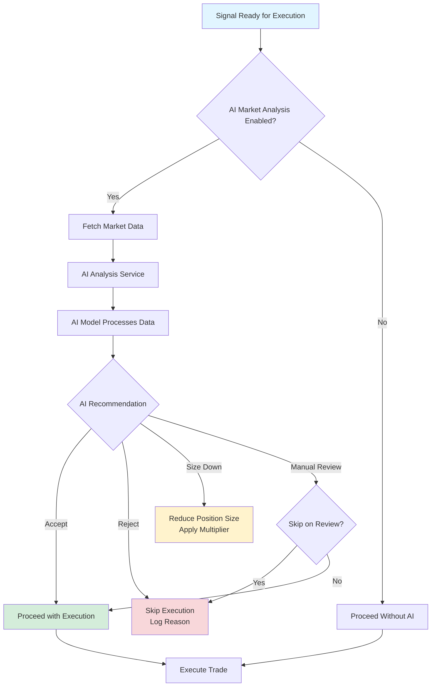
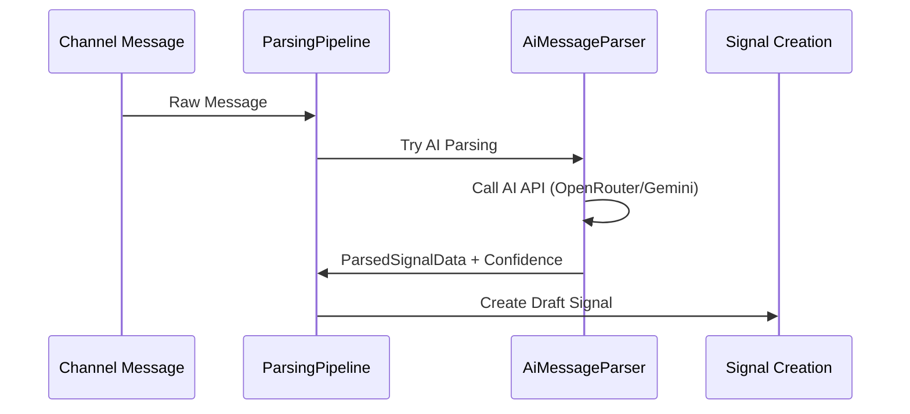
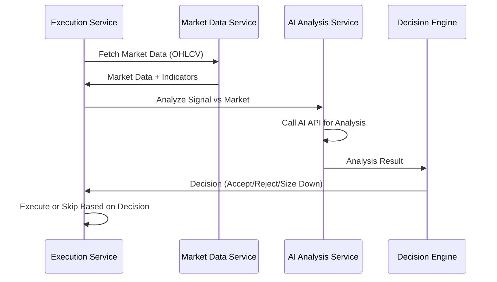

# AI Trading Integration - Workflow Documentation

> [!TIP]
> **📚 Detailed Documentation Available**
> 
> For comprehensive auto-generated documentation on the AI Integration System, see:
> 
> **[AI Integration System](../.qoder/repowiki/en/content/Core%20Modules/AI%20Integration%20System/AI%20Integration%20System.md)** - Complete AI integration documentation
>
> Related sections:
> - [AI Connection Management](../.qoder/repowiki/en/content/Core%20Modules/AI%20Integration%20System/AI%20Connection%20Management.md) - Centralized AI connection management
> - [AI Provider Integration](../.qoder/repowiki/en/content/Core%20Modules/AI%20Integration%20System/AI%20Provider%20Integration.md) - OpenAI, Gemini, OpenRouter integration
> - [Usage Analytics and Monitoring](../.qoder/repowiki/en/content/Core%20Modules/AI%20Integration%20System/Usage%20Analytics%20and%20Monitoring.md) - AI usage tracking

---

## Overview
The platform integrates AI models (OpenAI, Google Gemini, OpenRouter) for signal parsing, market analysis, and trading decision support. This document explains how AI is used throughout the trading flow.

---

## AI Integration Points

### 1. Signal Parsing (Multi-Channel Addon)

**Purpose**: Parse trading signals from unstructured messages using AI

**Flow**:
```
Channel Message → ParsingPipeline → AiMessageParser → ParsedSignalData
```

**AI Providers Used**:
- OpenAI (GPT models)
- Google Gemini
- OpenRouter (400+ models)

**Configuration**: `AiConfiguration` model
- Provider selection
- Model selection
- API credentials
- Temperature, max tokens, timeout settings

---

### 2. AI Market Analysis (Execution Engine)

**Purpose**: Analyze market conditions before executing trades

**Flow**:
```
Signal Ready → Market Data Fetch → AI Analysis → Decision (Accept/Reject/Size Down)
```

**Analysis Input**:
- Current market data (OHLCV candles)
- Technical indicators
- Signal details (pair, direction, entry, SL, TP)

**Analysis Output**:
- `alignment` - Market alignment with signal
- `risk_score` - Risk assessment (0-100)
- `recommendation` - Accept/Reject/Size Down/Manual Review
- `reasoning` - AI explanation

**Integration**: Executed in `SignalExecutionService::performMarketAnalysis()`

---

### 3. AI Decision Engine (AI Trading Addon)

**Purpose**: Centralized AI decision-making for trade execution

**Components**:
- **AiDecisionEngine**: Processes AI recommendations
- **MarketAnalysisAiService**: Performs market analysis
- **AiModelProfile**: User-configurable AI profiles

**Decision Flow**:



---

## AI Configuration

### AI Configuration Management

**Route**: `/admin/ai-configuration`

**Features**:
- Create multiple AI configurations
- Configure provider, model, API credentials
- Set priority (higher = tried first)
- Enable/disable configurations
- Test connections and parsing

**Configuration Fields**:
- Provider (OpenAI, Gemini, OpenRouter)
- API Key (encrypted storage)
- Model name
- Priority (0-100)
- Temperature (0-2)
- Max Tokens (50-4000)
- Timeout (seconds)

---

## AI Workflow Integration

### Workflow 1: Signal Parsing with AI



**When Used**:
- Regex patterns fail
- Pattern templates don't match
- Message format is complex/unstructured

---

### Workflow 2: Market Confirmation Before Execution



**Decision Options**:
- **Accept**: Proceed with full position size
- **Reject**: Skip execution, log reason
- **Size Down**: Reduce position size (e.g., 50%)
- **Manual Review**: Flag for admin review (optional skip)

---

### Workflow 3: AI Risk Adjustment

When AI recommends size reduction:

```php
// AI returns adjusted_risk_factor = 0.5
$options['size_multiplier'] = 0.5;
$quantity = $baseQuantity * 0.5; // Reduce by 50%
```

**Use Cases**:
- Market conditions uncertain
- High volatility detected
- Trend alignment weak

---

## AI Model Profiles

### Profile Configuration

**Model**: `AiModelProfile` (AI Trading Addon)

**Purpose**: User-configurable AI settings for different trading strategies

**Modes**:
- **CONFIRM** - Confirm signals before execution
- **SCAN** - Scan markets for opportunities
- **POSITION_MGMT** - Manage open positions

**Integration**:
- Linked to Trading Presets
- Applied per execution connection
- User-specific or shared profiles

---

## OpenRouter Integration

### Unified AI Gateway

**Addon**: OpenRouter Integration Addon

**Benefits**:
- Access to 400+ AI models through single API
- Model selection and routing
- Cost optimization (use cheaper models when possible)

**Configuration**:
- Admin configures OpenRouter credentials
- Models synced from OpenRouter API
- User selects model per configuration

---

## AI Decision Examples

### Example 1: Signal Accepted

```
Market Analysis Result:
- Alignment: aligned
- Risk Score: 85/100
- Recommendation: accept
- Reasoning: "Strong bullish trend with good entry point. 
              Stop loss at support level. Favorable R:R ratio."

Action: Execute trade with full position size
```

### Example 2: Signal Rejected

```
Market Analysis Result:
- Alignment: against_trend
- Risk Score: 25/100
- Recommendation: reject
- Reasoning: "Signal contradicts current market trend. 
              High volatility detected. Entry point suboptimal."

Action: Skip execution, log rejection reason
```

### Example 3: Size Down

```
Market Analysis Result:
- Alignment: weakly_aligned
- Risk Score: 60/100
- Recommendation: size_down
- Reasoning: "Market shows mixed signals. Trend not fully established. 
              Reduce position size by 50% to manage risk."

Action: Execute with 50% of normal position size
```

---

## Files Reference

- **AI Config**: `main/addons/multi-channel-signal-addon/app/Models/AiConfiguration.php`
- **AI Parser**: `main/addons/multi-channel-signal-addon/app/Parsers/AiMessageParser.php`
- **Market Analysis**: `main/addons/trading-execution-engine-addon/app/Services/SignalExecutionService.php` (performMarketAnalysis)
- **OpenRouter**: `main/addons/openrouter-integration-addon/app/Services/OpenRouterMarketAnalyzer.php`
- **AI Decision**: `main/addons/ai-trading-addon/app/Services/AiDecisionEngine.php`

---

## Best Practices

### API Cost Management

1. **Cache Results**: Cache AI analysis results when possible
2. **Model Selection**: Use cheaper models for simple tasks
3. **Rate Limiting**: Respect API rate limits
4. **Error Handling**: Graceful fallback when AI unavailable

### Performance

1. **Async Processing**: Queue AI API calls
2. **Timeout Management**: Set appropriate timeouts
3. **Retry Logic**: Retry transient failures
4. **Batch Processing**: Batch requests when possible

### Accuracy

1. **Confidence Thresholds**: Set minimum confidence scores
2. **Manual Review**: Flag low-confidence results
3. **Logging**: Log all AI decisions for analysis
4. **A/B Testing**: Compare different AI models
