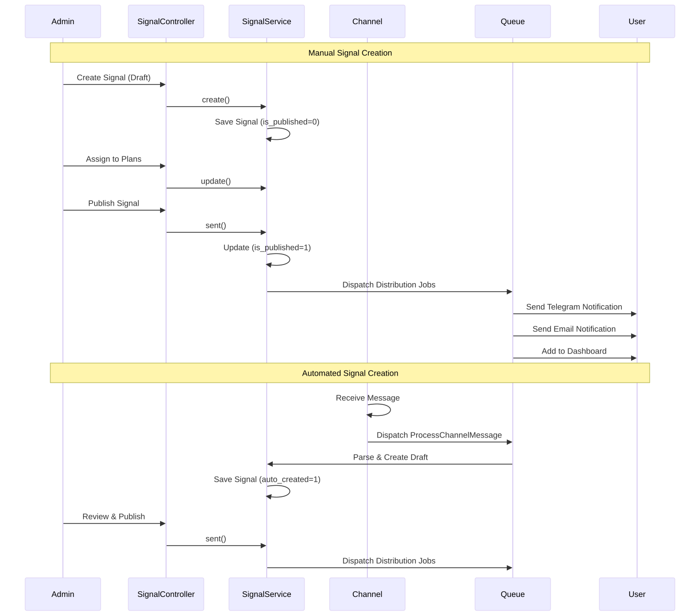
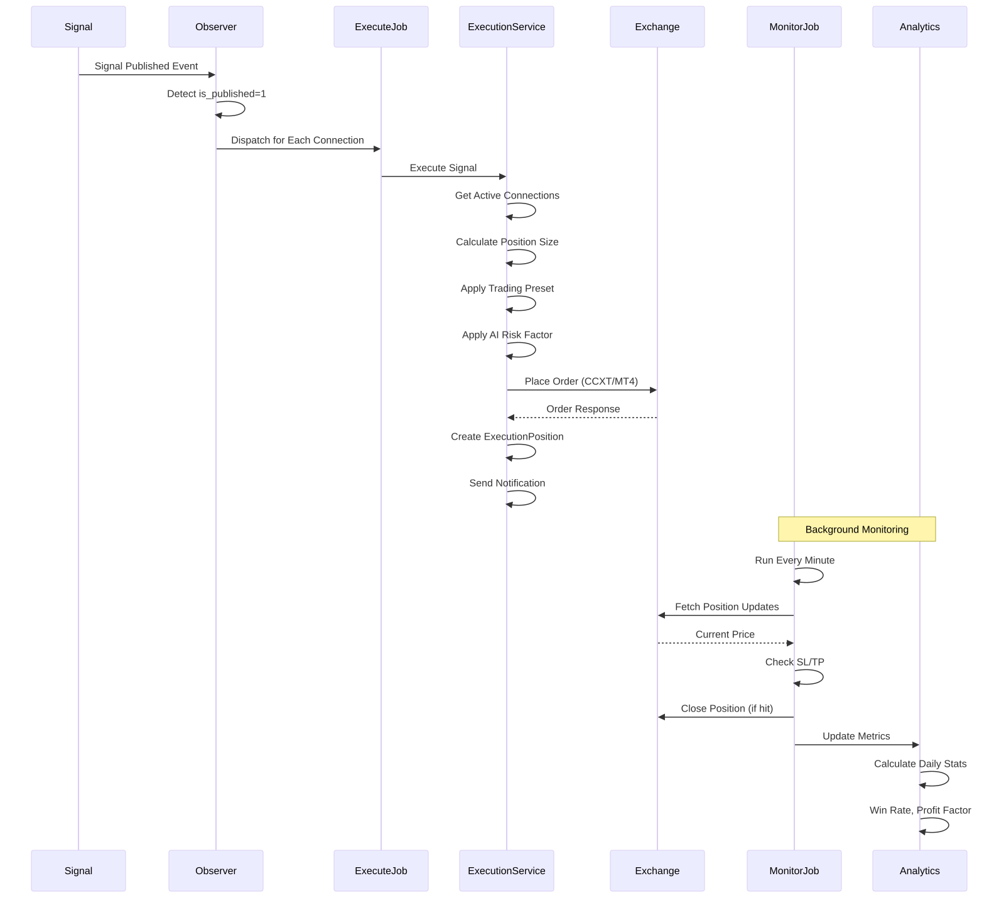

# Architecture Overview

## System Architecture

AlgoExpertHub is a Laravel 10-based trading signal platform with a modular addon architecture. This document provides a high-level overview of the system design.



## Core Architecture

### Layered Architecture



```
┌─────────────────────────────────────────────────────────┐
│                    Presentation Layer                    │
│  (Blade Templates, Bootstrap, jQuery, TradingView)      │
└─────────────────────────────────────────────────────────┘
                           ↓
┌─────────────────────────────────────────────────────────┐
│                   Application Layer                      │
│         (Controllers, Middleware, Form Requests)         │
└─────────────────────────────────────────────────────────┘
                           ↓
┌─────────────────────────────────────────────────────────┐
│                    Business Layer                        │
│              (Services, Jobs, Observers)                 │
└─────────────────────────────────────────────────────────┘
                           ↓
┌─────────────────────────────────────────────────────────┐
│                      Data Layer                          │
│        (Models, Repositories, Database, Cache)           │
└─────────────────────────────────────────────────────────┘
                           ↓
┌─────────────────────────────────────────────────────────┐
│                  Infrastructure Layer                    │
│    (Queue, Storage, External APIs, WebSockets)          │
└─────────────────────────────────────────────────────────┘
```

### Service Layer Pattern

**Core Principle**: Controllers are thin HTTP handlers; all business logic resides in Services.

```php
// Controller (Thin)
public function store(Request $request, SignalService $service)
{
    $result = $service->create($request);
    return redirect()->back()->with($result['type'], $result['message']);
}

// Service (Business Logic)
public function create($request): array
{
    // Validation, processing, database operations
    return ['type' => 'success', 'message' => 'Created'];
}
```

---

## Addon System

### Modular Architecture



Addons are self-contained packages that extend core functionality without modifying the main application.

```
main/addons/
├── trading-management-addon/      # Unified trading system
├── multi-channel-signal-addon/    # Signal ingestion
├── ai-connection-addon/            # AI provider management
├── page-builder-addon/             # Visual page builder
├── openrouter-integration-addon/  # 400+ AI models
├── trading-bot-signal-addon/      # Firebase integration
└── algoexpert-plus-addon/         # Premium features
```

### Addon Structure

```
addon-name/
├── addon.json                 # Manifest
├── AddonServiceProvider.php   # Service provider
├── app/
│   ├── Http/Controllers/      # Controllers
│   ├── Services/              # Business logic
│   ├── Models/                # Eloquent models
│   └── Jobs/                  # Background jobs
├── routes/                    # Route definitions
├── resources/views/           # Blade templates
└── database/migrations/       # Database migrations
```

### Addon Registration



```php
// app/Providers/AppServiceProvider.php
protected function registerAddonServiceProviders(): void
{
    $addonProviders = [
        'trading-management-addon' => \Addons\TradingManagement\AddonServiceProvider::class,
        // ...
    ];

    foreach ($addonProviders as $slug => $provider) {
        if (class_exists($provider) && AddonRegistry::active($slug)) {
            $this->app->register($provider);
        }
    }
}
```

---

## Trading Management Addon Architecture

### Event-Driven Pipeline

```
Signal Published
    ↓
Data Provider (fetch market data)
    ↓
Market Data Storage (cache data)
    ↓
Filter Strategy (technical indicators) → Skip if fails
    ↓
AI Analysis (market confirmation) → Skip if rejected
    ↓
Risk Management (calculate position size)
    ↓
Execution (place order on exchange)
    ↓
Position Monitoring (track SL/TP)
    ↓
Analytics (calculate performance)
```

### Module Communication

Modules communicate via **Laravel Events**, not direct calls:

```php
// Signal published (core)
event(new SignalPublished($signal));

// Execution module listens
Event::listen(SignalPublished::class, function ($event) {
    dispatch(new ExecuteSignalJob($event->signal));
});
```

---

## Data Flow

### Signal Creation and Distribution



```
Admin Creates Signal
    ↓
SignalService::create()
    ↓
Signal saved to database (draft)
    ↓
Admin publishes signal
    ↓
SignalService::sent()
    ↓
┌─────────────────┬─────────────────┬─────────────────┐
│                 │                 │                 │
Telegram         Email            Dashboard
Notifications    Notifications    Signals
```

### Automated Trade Execution



```
Signal Published
    ↓
SignalObserver detects
    ↓
Get active ExecutionConnections
    ↓
For each connection:
    ↓
    Filter Strategy check → Pass/Fail
    ↓
    AI Analysis → Approve/Reject
    ↓
    Risk Management → Calculate size
    ↓
    Execute on exchange → Success/Fail
    ↓
    Create ExecutionPosition
    ↓
    Monitor position (every minute)
```

---

## Database Architecture

### Core Tables



```
users (platform users)
    ↓
plan_subscriptions (user subscriptions)
    ↓
signals (trading signals)
    ↓
plan_signals (many-to-many)
```

### Addon Tables



```
Trading Management:
- tm_execution_connections
- tm_execution_positions
- tm_risk_presets
- tm_filter_strategies
- tm_ai_configs
- tm_backtest_runs
- tm_copy_traders
- tm_trading_bots
- ... (14 tables total)

Multi-Channel Signal:
- channel_sources
- channel_messages
- message_parsing_patterns

AI Connection:
- ai_connections
- ai_usage_logs

Page Builder:
- pb_pages
- pb_blocks
- pb_templates
```

---

## Authentication & Authorization

### Multi-Guard System

```
┌─────────────┐         ┌─────────────┐
│   Web Guard │         │ Admin Guard │
│   (users)   │         │   (admins)  │
└─────────────┘         └─────────────┘
      ↓                       ↓
  User Routes            Admin Routes
  /user/*                /admin/*
```

### Permission System (Spatie)

```
Super Admin
    ↓
Bypasses all checks (Gate::before)

Staff Admin
    ↓
Role-based permissions
    ↓
manage-plan, signal, manage-user, etc.
```

### Security Middleware Stack

```
User Routes:
auth → inactive → is_email_verified → 2fa → kyc

Admin Routes:
admin → demo → permission:xxx,admin
```

---

## Queue System

### Queue Architecture

```
HTTP Request
    ↓
Dispatch Job
    ↓
Queue (database/Redis)
    ↓
Queue Worker
    ↓
Job Execution
    ↓
Success/Failure
```

### Key Jobs

- **ProcessChannelMessage**: Parse incoming messages
- **ExecuteSignalJob**: Execute trades
- **MonitorPositionsJob**: Check SL/TP (every minute)
- **UpdateAnalyticsJob**: Calculate metrics (daily)
- **SendEmailJob**: Send emails
- **FetchMarketDataJob**: Fetch market data (every minute)

### Scheduled Tasks

```php
// app/Console/Kernel.php
protected function schedule(Schedule $schedule)
{
    $schedule->job(new MonitorPositionsJob)->everyMinute();
    $schedule->job(new UpdateAnalyticsJob)->daily();
    $schedule->job(new FetchMarketDataJob)->everyMinute();
}
```

---

## External Integrations

### Payment Gateways

```
User selects gateway
    ↓
PaymentService::payNow()
    ↓
Gateway API (PayPal, Stripe, etc.)
    ↓
Callback webhook
    ↓
Update payment status
    ↓
Create subscription (if approved)
```

### Exchange/Broker Integration

```
CCXT (Crypto Exchanges)
    ↓
Binance, Coinbase, Kraken, etc.

mtapi.io / metaapi.cloud (MT4/MT5)
    ↓
Forex/CFD brokers
```

### AI Providers

```
AI Connection Addon
    ↓
┌─────────┬─────────┬─────────────┐
│         │         │             │
OpenAI   Gemini   OpenRouter
GPT-4    Gemini   400+ models
         Pro
```

---

## Caching Strategy

### Cache Layers

```
1. Application Cache (config, routes)
2. Database Query Cache (expensive queries)
3. Market Data Cache (Redis, 1 minute TTL)
4. AI Response Cache (5 minutes TTL)
5. View Cache (compiled Blade templates)
```

### Cache Usage

```php
// Cache expensive query
$signals = Cache::remember('signals.latest', 60, function () {
    return Signal::with('pair', 'market')->latest()->take(10)->get();
});

// Cache market data
Cache::put("market_data.{$symbol}", $data, now()->addMinute());
```

---

## Real-Time Features

### WebSocket Architecture

```
Soketi (WebSocket Server)
    ↓
Laravel Broadcasting
    ↓
Pusher Protocol
    ↓
Client (JavaScript)
```

### Real-Time Updates

- Position updates (price, P&L)
- Signal notifications
- Trade executions
- Market data updates

---

## Security Architecture

### Data Protection

```
Sensitive Data
    ↓
encrypt() function
    ↓
Stored encrypted in database
    ↓
decrypt() when needed
```

**Encrypted Data**:
- API keys (exchange, AI)
- Broker credentials
- Payment gateway credentials

### Input Validation

```
User Input
    ↓
Form Request Validation
    ↓
Service Layer Processing
    ↓
Blade Auto-Escaping (XSS prevention)
    ↓
Output to User
```

### CSRF Protection

All POST/PUT/DELETE requests require CSRF token (automatic in Laravel).

---

## Performance Optimizations

### Database Optimization

- **Eager Loading**: Prevent N+1 queries
- **Indexing**: Foreign keys and queried columns
- **Pagination**: Large datasets
- **Query Caching**: Expensive queries

### Application Optimization

- **Queue Long Operations**: External APIs, emails
- **Asset Compilation**: Laravel Mix (production)
- **OPcache**: PHP opcode caching
- **Redis**: Session and cache storage

---

## Deployment Architecture

### Production Stack

```
┌─────────────────────────────────────────┐
│           Load Balancer (Nginx)         │
└─────────────────────────────────────────┘
                    ↓
┌─────────────────────────────────────────┐
│      Laravel Octane (Swoole/RoadRunner)│
└─────────────────────────────────────────┘
                    ↓
┌─────────────────────────────────────────┐
│         MySQL 8.0 (Primary DB)          │
└─────────────────────────────────────────┘
                    ↓
┌─────────────────────────────────────────┐
│      Redis (Cache, Queue, Sessions)     │
└─────────────────────────────────────────┘
                    ↓
┌─────────────────────────────────────────┐
│   Soketi (WebSocket Server)             │
└─────────────────────────────────────────┘
```

### Docker Services

- **app**: Laravel application (Octane)
- **horizon**: Queue management dashboard
- **worker**: Queue workers (4 parallel)
- **scheduler**: Cron jobs
- **mysql**: Database
- **redis**: Cache and queue
- **soketi**: WebSocket server

---

## Monitoring & Logging

### Logging Strategy

```
Application Logs
    ↓
storage/logs/laravel.log
    ↓
Categorized by level:
- DEBUG: Development info
- INFO: Important events
- WARNING: Warnings
- ERROR: Errors
- CRITICAL: Critical failures
```

### Monitored Metrics

- **Application**: Response time, error rate
- **Queue**: Job success/failure rate, queue size
- **Database**: Query performance, connection pool
- **External APIs**: Response time, error rate
- **Trading**: Execution success rate, P&L

---

## Scalability Considerations

### Horizontal Scaling

- **Application Servers**: Add more Laravel instances
- **Queue Workers**: Add more worker processes
- **Database**: Read replicas for queries

### Vertical Scaling

- **Database**: Larger instance for more connections
- **Redis**: More memory for caching
- **Application**: More CPU/RAM for Octane

---

## Development Workflow

### Local Development

```
1. Clone repository
2. composer install
3. npm install
4. Configure .env
5. php artisan migrate
6. php artisan serve
7. npm run dev
```

### Testing

```
1. Write tests (Feature, Unit)
2. Run: php artisan test
3. Coverage: phpunit --coverage-html coverage
```

### Deployment

```
1. Push to Git
2. CI/CD pipeline (GitHub Actions)
3. Build Docker images
4. Deploy to production
5. Run migrations
6. Clear caches
```

---

## Key Design Patterns

1. **Service Layer**: Business logic separation
2. **Repository**: Data access abstraction (via Eloquent)
3. **Observer**: React to model events
4. **Strategy**: Interchangeable algorithms (filters, AI)
5. **Factory**: Object creation (models, DTOs)
6. **Adapter**: External service integration (CCXT, mtapi.io)
7. **Event-Driven**: Loose coupling between modules

---

**Last Updated**: 2025-12-22
**Architecture Version**: 2.0
