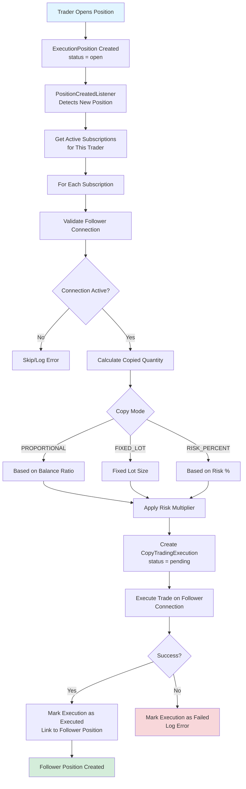

# Copy Trading System - Social Trading Flow

## Overview
The Copy Trading System allows users (followers) to automatically copy trades from other users (traders) who have enabled copy trading. When a trader opens a position, all active followers receive a copy of that trade on their own execution connections.

---

## Copy Trading Architecture

### Complete Copy Trading Flow



---

## Core Components

### 1. Copy Trading Subscription

**Model**: `CopyTradingSubscription`

**Purpose**: Links a follower to a trader for copy trading

**Key Fields**:
- `trader_id` - User who's being copied
- `follower_id` - User who copies trades
- `connection_id` - Follower's execution connection
- `copy_mode` - PROPORTIONAL, FIXED_LOT, RISK_PERCENT
- `risk_multiplier` - Position size multiplier (0.5 = 50%)
- `status` - active, paused, cancelled

---

### 2. Copy Trading Execution

**Model**: `CopyTradingExecution`

**Purpose**: Tracks each copied trade execution

**Key Fields**:
- `trader_position_id` - Original trader's position
- `follower_id` - User receiving the copy
- `subscription_id` - Subscription used
- `follower_connection_id` - Connection used for execution
- `original_quantity` - Trader's position size
- `copied_quantity` - Follower's position size
- `status` - pending, executed, failed
- `follower_position_id` - Created follower position (if successful)

---

### 3. Copy Trading Settings

**Model**: `CopyTradingSetting`

**Purpose**: Trader's copy trading configuration

**Key Fields**:
- `user_id` - Trader
- `enabled` - Is copy trading enabled?
- `max_followers` - Maximum number of followers allowed
- `min_followers_balance` - Minimum balance required for followers
- `commission_rate` - Commission percentage (future)

---

## Copy Trading Flow

### Step 1: Trader Opens Position

When a trader's position is created (via Execution Engine):

```php
ExecutionPosition::create([
    'connection_id' => $traderConnection->id,
    'signal_id' => $signal->id,
    'symbol' => $symbol,
    'quantity' => 0.1,
    'status' => 'open',
    // ...
]);
```

---

### Step 2: Event Listener Detects Position

**Listener**: `PositionCreatedListener`

**Trigger**: `ExecutionPosition` created with `status = 'open'`

**Action**:
```php
// Dispatch copy trading job
CopyTradeJob::dispatch($position);
```

---

### Step 3: Get Active Subscriptions

**Service**: `TradeCopyService::copyToSubscribers()`

Retrieves all active subscriptions for this trader:

```php
$subscriptions = CopyTradingSubscription::where('trader_id', $traderId)
    ->where('status', 'active')
    ->get();
```

---

### Step 4: Calculate Copied Quantity

**Service**: `TradeCopyService::calculateCopiedQuantity()`

#### Copy Mode: PROPORTIONAL

Calculates quantity based on balance ratio:

```php
$traderBalance = $traderConnection->getBalance();
$followerBalance = $followerConnection->getBalance();
$balanceRatio = $followerBalance / $traderBalance;

$copiedQuantity = $traderQuantity * $balanceRatio;
```

**Example**:
- Trader Balance: $10,000
- Follower Balance: $5,000
- Balance Ratio: 0.5
- Trader Quantity: 0.1 lot
- Copied Quantity: 0.05 lot

#### Copy Mode: FIXED_LOT

Uses fixed lot size:

```php
$copiedQuantity = $subscription->fixed_lot; // e.g., 0.01 lot
```

#### Copy Mode: RISK_PERCENT

Calculates based on risk percentage:

```php
$riskAmount = ($followerBalance * $riskPercent) / 100;
$copiedQuantity = calculateQuantityFromRisk($riskAmount, $entryPrice, $slPrice);
```

---

### Step 5: Apply Risk Multiplier

After calculating base quantity, apply risk multiplier:

```php
$finalQuantity = $copiedQuantity * ($subscription->risk_multiplier ?? 1.0);
```

**Example**:
- Base Quantity: 0.1 lot
- Risk Multiplier: 0.5 (50%)
- Final Quantity: 0.05 lot

---

### Step 6: Execute Trade on Follower Connection

**Service**: `TradeCopyService::executeCopiedTrade()`

Creates position on follower's connection:

```php
// Execute using SignalExecutionService
$result = $signalExecutionService->executeSignal(
    $signal,
    $followerConnection->id,
    ['quantity' => $copiedQuantity]
);
```

---

### Step 7: Track Execution

**Record**: `CopyTradingExecution`

Tracks the execution:
- Success → Links to follower position
- Failure → Logs error reason

---

## Position Synchronization

### Closing Positions

When trader closes a position, followers' positions are also closed:

**Service**: `TradeCopyService::closeCopiedPositions()`

**Flow**:
```
Trader Closes Position
  → Get All Copied Executions
  → For Each Execution:
    → Get Follower Position
    → Close Position (Market Order)
    → Update Execution Status
```

---

## Subscription Management

### Creating Subscription

**Route**: `POST /user/copy-trading/subscribe`

**Process**:
1. Validate trader has copy trading enabled
2. Check trader hasn't reached max followers
3. Validate follower has active connection
4. Check minimum balance requirement (if set)
5. Create `CopyTradingSubscription` record
6. Set status to 'active'

---

### Subscription Status

**Statuses**:
- `active` - Subscribed, copying trades
- `paused` - Temporarily paused, not copying
- `cancelled` - Unsubscribed, no longer copying

---

## Copy Trading Settings

### Trader Settings

**Route**: `/user/copy-trading/settings`

**Configuration**:
- Enable/disable copy trading
- Set maximum followers
- Set minimum follower balance
- Commission rate (future)

---

### Follower Settings

Per subscription:
- Copy mode selection
- Risk multiplier
- Connection selection
- Pause/resume subscription

---

## Integration with Trading Presets

### Preset Application

When copying trades, follower's preset settings are applied:

**Service**: `CopyTradingEnhancer`

**Process**:
1. Get follower's trading preset
2. Apply preset position sizing rules
3. Apply preset SL/TP rules
4. Apply preset advanced features (BE, TS, etc.)

---

## Copy Trading Modes

### 1. Proportional Mode

**Use Case**: Follower wants to mirror trader proportionally

**Calculation**:
- Based on account balance ratio
- Maintains same risk proportion as trader

**Example**:
```
Trader: $10,000 balance, 0.1 lot position
Follower: $5,000 balance
→ Copied: 0.05 lot (maintains 1% risk)
```

---

### 2. Fixed Lot Mode

**Use Case**: Follower wants consistent position sizes

**Calculation**:
- Uses fixed lot size regardless of balance

**Example**:
```
Follower sets: 0.01 lot
→ Always copies with 0.01 lot
```

---

### 3. Risk Percent Mode

**Use Case**: Follower wants to risk specific percentage

**Calculation**:
- Calculates quantity based on risk percentage
- Adjusts for entry price and stop loss distance

**Example**:
```
Follower sets: 1% risk per trade
→ Calculates quantity to risk exactly 1% of balance
```

---

## Copy Trading Limitations

### Current Limitations

1. **Signal-Based Only**: Only signal-based trades are copied
   - Manual trades cannot be copied
   - Only positions from signals

2. **Same Symbol Required**: 
   - Both trader and follower must have symbol available
   - Symbol resolution must succeed

3. **Connection Status**:
   - Follower connection must be active
   - Connection must support the symbol

---

## Error Handling

### Common Errors

**Error**: "Follower connection is not active"
- **Solution**: Follower must activate their connection

**Error**: "Calculated quantity is zero or invalid"
- **Solution**: Check balance, risk multiplier, copy mode settings

**Error**: "Cannot copy manual trades without signal"
- **Solution**: Only signal-based trades can be copied currently

**Error**: "Symbol not available on follower connection"
- **Solution**: Follower needs connection that supports the symbol

---

## Files Reference

- **Service**: `main/addons/copy-trading-addon/app/Services/TradeCopyService.php`
- **Model**: `main/addons/copy-trading-addon/app/Models/CopyTradingSubscription.php`
- **Listener**: `main/addons/copy-trading-addon/app/Listeners/PositionCreatedListener.php`
- **Job**: `main/addons/copy-trading-addon/app/Jobs/CopyTradeJob.php`

---

## Best Practices

### For Traders

1. **Manage Followers**: Monitor follower count and quality
2. **Set Limits**: Use max followers to maintain quality
3. **Clear Communication**: Set expectations for followers
4. **Risk Management**: Use presets to manage risk

### For Followers

1. **Choose Carefully**: Research trader's performance
2. **Risk Multiplier**: Start with lower multiplier (0.5)
3. **Diversify**: Don't copy from only one trader
4. **Monitor**: Keep track of copied positions
5. **Connection Ready**: Ensure connection is active
