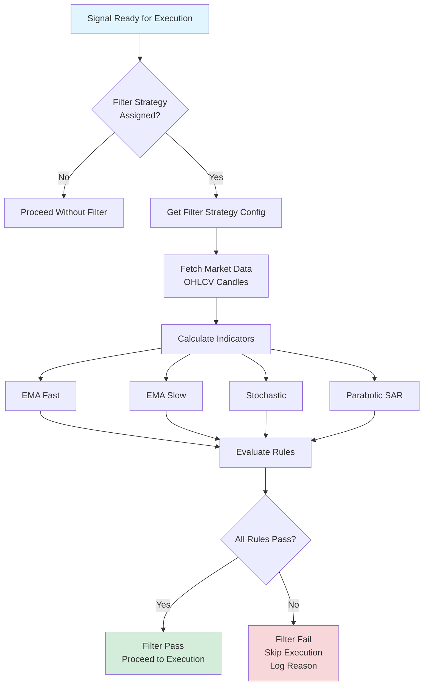

# Filter Strategy Guide - Technical Indicator Filtering

## Overview
Filter Strategies use technical indicators to filter trading signals before execution. Only signals that pass all configured indicator rules are executed, reducing false signals and improving trade quality.

---

## Filter Strategy Architecture

### Complete Filter Flow



---

## Supported Indicators

### 1. EMA (Exponential Moving Average)

**Types**:
- `ema_fast` / `ema10` - Fast EMA (default: 10 period)
- `ema_slow` / `ema100` - Slow EMA (default: 100 period)

**Configuration**:
```json
{
    "indicators": {
        "ema_fast": {
            "period": 10
        },
        "ema_slow": {
            "period": 100
        }
    }
}
```

**Common Rules**:
- `ema_fast > ema_slow` - Uptrend (buy signals)
- `ema_fast < ema_slow` - Downtrend (sell signals)
- `ema_fast crosses ema_slow` - Trend reversal

---

### 2. Stochastic Oscillator

**Type**: `stoch` / `stochastic`

**Components**:
- %K - Main line
- %D - Signal line (smoothed %K)

**Configuration**:
```json
{
    "indicators": {
        "stochastic": {
            "k": 14,
            "d": 3,
            "smooth": 3
        }
    }
}
```

**Common Rules**:
- `stochastic > 80` - Overbought (potential sell)
- `stochastic < 20` - Oversold (potential buy)
- `stochastic_d > stochastic` - Bearish crossover
- `stochastic_d < stochastic` - Bullish crossover

**Values Range**: 0-100

---

### 3. Parabolic SAR

**Type**: `psar` / `parabolic_sar`

**Configuration**:
```json
{
    "indicators": {
        "psar": {
            "step": 0.02,
            "max": 0.2
        }
    }
}
```

**Common Rules**:
- `psar below_price` - Bullish (PSAR below price)
- `psar above_price` - Bearish (PSAR above price)

**Interpretation**:
- PSAR below price = Uptrend (buy signals)
- PSAR above price = Downtrend (sell signals)

---

## Rule Configuration

### Rule Structure

Rules are defined in `FilterStrategy.config.rules`:

```json
{
    "rules": [
        {
            "operator": "AND",
            "conditions": [
                {
                    "left": "ema_fast",
                    "operator": ">",
                    "right": "ema_slow"
                },
                {
                    "left": "stochastic",
                    "operator": "<",
                    "right": 80
                }
            ]
        }
    ]
}
```

---

### Operators

#### Logical Operators

- `AND` - All conditions must pass
- `OR` - Any condition must pass

#### Comparison Operators

- `>` - Greater than
- `<` - Less than
- `>=` - Greater than or equal
- `<=` - Less than or equal
- `==` / `=` - Equal (with float tolerance)

#### Special Operators

- `below_price` - Indicator value below current price
- `above_price` - Indicator value above current price
- `crosses` - Indicator crosses another (future)

---

### Rule Examples

#### Example 1: Uptrend Filter

**Purpose**: Only buy signals in uptrend

```json
{
    "rules": [
        {
            "operator": "AND",
            "conditions": [
                {
                    "left": "ema_fast",
                    "operator": ">",
                    "right": "ema_slow"
                },
                {
                    "left": "psar",
                    "operator": "below_price",
                    "right": null
                }
            ]
        }
    ]
}
```

**Result**: Signal passes only if:
- Fast EMA is above slow EMA (uptrend)
- PSAR is below price (bullish)

---

#### Example 2: Stochastic Oversold Filter

**Purpose**: Only buy when oversold

```json
{
    "rules": [
        {
            "operator": "AND",
            "conditions": [
                {
                    "left": "stochastic",
                    "operator": "<",
                    "right": 20
                }
            ]
        }
    ]
}
```

**Result**: Signal passes only if Stochastic is below 20 (oversold)

---

#### Example 3: Combined Trend + Momentum

**Purpose**: Uptrend with not overbought

```json
{
    "rules": [
        {
            "operator": "AND",
            "conditions": [
                {
                    "left": "ema_fast",
                    "operator": ">",
                    "right": "ema_slow"
                },
                {
                    "left": "stochastic",
                    "operator": "<",
                    "right": 80
                },
                {
                    "left": "psar",
                    "operator": "below_price",
                    "right": null
                }
            ]
        }
    ]
}
```

**Result**: Signal passes only if:
- Uptrend (EMA fast > slow)
- Not overbought (Stochastic < 80)
- Bullish (PSAR below price)

---

## Filter Strategy Assignment

### Assignment Hierarchy

Filter strategies can be assigned at multiple levels:

1. **Trading Preset** (highest priority)
   - Applied to all signals using this preset
   - Stored in `trading_presets.filter_strategy_id`

2. **Execution Connection**
   - Applied to all signals executed on this connection
   - Stored in `execution_connections.filter_strategy_id`

3. **Channel Source** (future)
   - Applied to signals from specific channel

### Resolution Priority

When signal is ready for execution:

```php
1. Check Trading Preset → filter_strategy_id
2. If not set, check Execution Connection → filter_strategy_id
3. If not set, no filter applied
```

---

## Evaluation Process

### Step-by-Step Evaluation

**Service**: `FilterStrategyEvaluator::evaluate()`

#### Step 1: Fetch Market Data

```php
$candles = $marketDataService->getOhlcv(
    $symbol,
    $timeframe,
    200, // Last 200 candles
    $connection
);
```

**Data Required**:
- OHLCV (Open, High, Low, Close, Volume)
- Minimum: Number of candles for longest indicator period
- Recommended: 200 candles for accuracy

---

#### Step 2: Calculate Indicators

```php
$indicators = $indicatorService->calculateIndicators(
    $config['indicators'],
    $candles
);
```

**Process**:
- Calculate each configured indicator
- Store latest values for rule evaluation
- Handle insufficient data gracefully

---

#### Step 3: Evaluate Rules

```php
foreach ($rules as $rule) {
    $result = $this->evaluateRule($rule, $indicators, $currentPrice);
    if (!$result['pass']) {
        return ['pass' => false, 'reason' => $result['reason']];
    }
}
```

**Evaluation**:
- Check each condition in rule
- Apply logical operators (AND/OR)
- Return first failure reason

---

#### Step 4: Return Result

**Success**:
```php
[
    'pass' => true,
    'reason' => 'All filter rules passed',
    'indicators' => $indicatorsSnapshot
]
```

**Failure**:
```php
[
    'pass' => false,
    'reason' => 'ema_fast (1.0850) is not > ema_slow (1.0870)',
    'indicators' => []
]
```

---

## Integration with Execution Flow

### Filter Hook Location

Filter evaluation occurs **after** signal parsing but **before** execution:

```
Channel Message
  → Parse Message
  → Create Draft Signal
  → [FILTER STRATEGY EVALUATION] ← Here
  → AI Market Analysis (optional)
  → Execution
```

### Filter Result Action

**If Filter Passes**:
- Signal proceeds to AI analysis (if enabled)
- Signal proceeds to execution

**If Filter Fails**:
- Execution stops
- Signal marked as rejected
- Reason logged for debugging
- No position created

---

## Creating Filter Strategies

### Admin/User Interface

**Route**: `/user/filter-strategies/create`

**Steps**:
1. Enter name and description
2. Select indicators to use
3. Configure indicator parameters
4. Define rules (conditions)
5. Set visibility (PRIVATE / PUBLIC_MARKETPLACE)
6. Enable/disable strategy

---

### Strategy Visibility

**PRIVATE**:
- Only visible to creator
- Cannot be cloned by others

**PUBLIC_MARKETPLACE**:
- Visible to all users
- Can be cloned if `clonable = true`
- Appears in marketplace

---

## Filter Strategy Configuration

### Complete Example

```json
{
    "name": "Uptrend + Not Overbought",
    "description": "Only buy signals in uptrend, not overbought",
    "enabled": true,
    "config": {
        "indicators": {
            "ema_fast": {
                "period": 10
            },
            "ema_slow": {
                "period": 100
            },
            "stochastic": {
                "k": 14,
                "d": 3,
                "smooth": 3
            },
            "psar": {
                "step": 0.02,
                "max": 0.2
            }
        },
        "rules": [
            {
                "operator": "AND",
                "conditions": [
                    {
                        "left": "ema_fast",
                        "operator": ">",
                        "right": "ema_slow"
                    },
                    {
                        "left": "stochastic",
                        "operator": "<",
                        "right": 80
                    },
                    {
                        "left": "psar",
                        "operator": "below_price",
                        "right": null
                    }
                ]
            }
        ]
    }
}
```

---

## Common Filter Patterns

### Pattern 1: Trend Following

**Use Case**: Only trade with trend

```json
{
    "conditions": [
        {"left": "ema_fast", "operator": ">", "right": "ema_slow"},
        {"left": "psar", "operator": "below_price", "right": null}
    ]
}
```

---

### Pattern 2: Mean Reversion

**Use Case**: Buy oversold, sell overbought

```json
{
    "conditions": [
        {"left": "stochastic", "operator": "<", "right": 20}
    ]
}
```

---

### Pattern 3: Trend + Momentum

**Use Case**: Strong trend with momentum confirmation

```json
{
    "conditions": [
        {"left": "ema_fast", "operator": ">", "right": "ema_slow"},
        {"left": "stochastic", "operator": ">", "right": 50}
    ]
}
```

---

## Files Reference

- **Model**: `main/addons/filter-strategy-addon/app/Models/FilterStrategy.php`
- **Evaluator**: `main/addons/filter-strategy-addon/app/Services/FilterStrategyEvaluator.php`
- **Indicators**: `main/addons/filter-strategy-addon/app/Services/IndicatorService.php`
- **Controller**: `main/addons/filter-strategy-addon/app/Http/Controllers/User/FilterStrategyController.php`

---

## Best Practices

### Indicator Selection

1. **Use Multiple Indicators**: Combine trend + momentum + volatility
2. **Avoid Over-Filtering**: Too many rules may block valid signals
3. **Test Thoroughly**: Backtest filter strategies before using

### Rule Design

1. **Start Simple**: Begin with 1-2 indicators
2. **Add Gradually**: Add indicators as needed
3. **Logical Combinations**: Use AND for strict, OR for flexible

### Performance

1. **Limit Indicators**: More indicators = slower evaluation
2. **Cache Results**: Indicator calculations are cached when possible
3. **Efficient Rules**: Evaluate fastest conditions first
