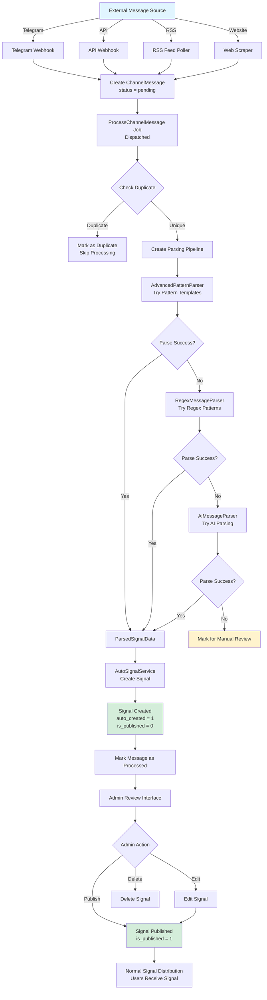

# Multi-Channel Signal Ingestion Flow

## Overview
The Multi-Channel Signal Addon automatically ingests trading signals from external sources (Telegram channels, APIs, RSS feeds, web scraping) and converts them into signals in the system. This enables automatic signal collection without manual entry.

---

## Signal Ingestion Flow

### 1. Message Receival

Messages can arrive from multiple sources:

**Telegram Bot API**:
- Webhook receives message → `TelegramWebhookController`
- Stores message in `channel_messages` table
- Dispatches `ProcessChannelMessage` job

**Telegram MTProto** (User Account):
- Long polling fetches messages → `FetchTelegramUpdates` job
- Processes new messages from configured channels
- Creates `ChannelMessage` records

**REST API Webhook**:
- External service POSTs message → `ApiWebhookController`
- Validates API key/secret
- Creates `ChannelMessage` record

**RSS/Atom Feed**:
- Scheduled job polls feed → `FetchRssFeed` job
- Parses feed entries
- Creates `ChannelMessage` records

**Web Scraping**:
- Scheduled job scrapes website → `ScrapeWebSource` job
- Extracts content from configured selectors
- Creates `ChannelMessage` records

---

## 2. Message Storage

### ChannelMessage Creation
Every incoming message is stored:

```php
ChannelMessage::create([
    'channel_source_id' => $source->id,
    'message_id' => $externalMessageId,
    'raw_message' => $messageContent,
    'message_hash' => hash('sha256', $messageContent),
    'status' => 'pending',
]);
```

**Purpose of `message_hash`**: Prevents duplicate signal creation from same message

---

## 3. Message Processing

### ProcessChannelMessage Job
**File**: `ProcessChannelMessage.php`

**Triggered**: When new `ChannelMessage` is created (status = 'pending')

### Processing Steps:

#### Step 3.1: Duplicate Check
```php
if ($this->isDuplicate()) {
    $this->channelMessage->markAsDuplicate();
    return; // Skip processing
}
```

**Duplicate Detection**:
- Checks if signal with same `message_hash` already exists
- Prevents processing same message twice

#### Step 3.2: Create Parsing Pipeline
```php
$pipeline = new ParsingPipeline($channelSource);
```

**Parsers Registered** (in priority order):
1. **AdvancedPatternParser** - Pattern templates (highest priority)
2. **RegexMessageParser** - Basic regex patterns
3. **AiMessageParser** - AI-powered parsing (OpenRouter/Gemini)

#### Step 3.3: Parse Message
```php
$parsedData = $pipeline->parse($this->channelMessage->raw_message);
```

**Parsing Process**:
- Each parser tries to extract signal data
- Returns `ParsedSignalData` DTO with:
  - `currency_pair` (e.g., "EUR/USD")
  - `direction` ("buy", "sell", "long", "short")
  - `open_price` (entry price)
  - `sl_price` (stop loss)
  - `tp_price` (take profit or array)
  - `timeframe` (e.g., "1H", "4H")
  - `confidence_score` (0-100)

#### Step 3.4: Create Signal
If parsing successful:
```php
$signal = AutoSignalService::createFromParsedData(
    $parsedData,
    $channelSource,
    $channelMessage
);
```

**Signal Creation**:
- Creates `Signal` record with `auto_created = 1`
- Sets `is_published = 0` (DRAFT - requires admin review)
- Links to `channel_source_id`
- Stores `message_hash`
- Sets `channel_source_id` for tracking

#### Step 3.5: Update Message Status
```php
$channelMessage->markAsProcessed($signal->id);
// OR
$channelMessage->markForManualReview('Could not parse message');
```

**Status Values**:
- `pending` → Initial state
- `processed` → Successfully created signal
- `failed` → Processing error
- `duplicate` → Already processed
- `manual_review` → Parsing failed, needs admin review

---

## 4. Signal Review & Publishing

### Admin Review Interface
**Route**: `/admin/signal-sources/channel-messages`

Admin can:
- View all auto-created signals (drafts)
- Edit signal details before publishing
- Review parsing confidence scores
- Publish or delete signals

### Publishing Flow
Once admin publishes:
- Signal's `is_published` changes from `0` to `1`
- Triggers normal signal distribution flow
- Users receive signal via Telegram/email/dashboard
- Trading Execution Engine executes on connected exchanges

---

## Complete Ingestion Flow Diagram



---

## Parser Priority & Selection

### Parser Registration
Parsers are registered in priority order:

1. **AdvancedPatternParser** (Priority: 90-100)
   - Pattern templates from database
   - Channel-specific patterns
   - Highest confidence when matched

2. **RegexMessageParser** (Priority: 50)
   - Basic regex patterns
   - Fallback for simple formats

3. **AiMessageParser** (Priority: 30-50)
   - AI-powered parsing
   - One parser per active AI configuration
   - Lower priority (more expensive)

### Parsing Pipeline Logic
```php
// Try each parser in priority order
foreach ($parsers as $parser) {
    if ($parser->canParse($message)) {
        $result = $parser->parse($message);
        if ($result && $result->confidence_score > $bestConfidence) {
            $bestParse = $result;
            $bestConfidence = $result->confidence_score;
        }
    }
}
```

**Selection Criteria**:
- Highest confidence score wins
- Minimum confidence threshold (configurable)
- First valid parse above threshold

---

## Channel Source Types

### 1. Telegram Bot API
**Configuration**:
```json
{
    "bot_token": "123456:ABC-DEF",
    "chat_id": "@trading_signals",
    "update_mode": "webhook" or "polling"
}
```

**Flow**:
- Bot receives message in channel/group
- Webhook → `TelegramWebhookController`
- Creates `ChannelMessage`

### 2. Telegram MTProto (User Account)
**Configuration**:
```json
{
    "phone": "+1234567890",
    "api_id": "12345",
    "api_hash": "abcdef123456",
    "session_file": "session_name"
}
```

**Flow**:
- Long polling connects as user account
- Fetches messages from channels/groups
- Creates `ChannelMessage` records

### 3. REST API Webhook
**Configuration**:
```json
{
    "webhook_url": "/api/webhook/channel/{id}",
    "api_key": "secret_key",
    "api_secret": "secret_value"
}
```

**Flow**:
- External service POSTs to webhook URL
- Validates API credentials
- Creates `ChannelMessage`

### 4. RSS/Atom Feed
**Configuration**:
```json
{
    "feed_url": "https://example.com/rss",
    "poll_interval": 300,
    "item_selector": "item"
}
```

**Flow**:
- Scheduled job polls feed every N minutes
- Parses new entries
- Creates `ChannelMessage` for each item

### 5. Web Scraping
**Configuration**:
```json
{
    "url": "https://example.com/signals",
    "selector": ".signal-item",
    "content_selector": ".signal-text",
    "poll_interval": 600
}
```

**Flow**:
- Scheduled job scrapes website
- Extracts content from CSS selectors
- Creates `ChannelMessage` for new content

---

## Pattern Templates

### Message Parsing Patterns
**Model**: `MessageParsingPattern`

**Purpose**: Define regex patterns to extract signal data from messages

**Pattern Structure**:
```php
{
    "name": "Standard Signal Format",
    "pattern": "BUY\\s+([A-Z]+/[A-Z]+)\\s+Entry:\\s*([\\d.]+)\\s+SL:\\s*([\\d.]+)\\s+TP:\\s*([\\d.]+)",
    "capture_groups": {
        "currency_pair": 1,
        "open_price": 2,
        "sl_price": 3,
        "tp_price": 4
    },
    "direction_map": {
        "BUY": "buy",
        "SELL": "sell"
    }
}
```

**Priority System**:
- Higher priority patterns tried first
- Channel-specific patterns override global patterns
- Pattern matching stops at first successful match

---

## AI Parsing

### AI Message Parser
**File**: `AiMessageParser.php`

**Configuration**: Uses active `AiConfiguration` records

**AI Providers**:
- OpenAI (GPT models)
- Google Gemini
- OpenRouter (400+ models)

**Prompt Template**:
```
Extract trading signal information from the following message and return ONLY a JSON object:
{
  "currency_pair": "string",
  "direction": "buy|sell|long|short",
  "open_price": number,
  "stop_loss": number,
  "take_profit": number or array,
  "timeframe": "string",
  "confidence": number 0-100
}

Message: {message}

Return ONLY the JSON object, no additional text.
```

**Confidence Scoring**:
- AI returns confidence score (0-100)
- Lower scores may trigger manual review
- Configurable threshold for auto-acceptance

---

## Channel Assignment

### Channel Source Scopes

**Admin-Owned Channels** (`is_admin_owned = 1`):
- Can be assigned to:
  - Plans (via `channel_source_plans` pivot)
  - Users (via `channel_source_users` pivot)
  - Global (all users)

**User-Owned Channels** (`is_admin_owned = 0`):
- Private to user
- Cannot be shared

### Signal Distribution
When auto-created signal is published:
- If admin-owned → Distributed to assigned users/plans
- If user-owned → Only to that user

---

## Error Handling

### Processing Failures
If parsing fails:
- Message marked as `manual_review`
- Admin can manually create signal
- Error logged for debugging

### Duplicate Prevention
- `message_hash` prevents duplicate signals
- Checks before processing
- Skips if hash exists

### Retry Logic
- Job retries up to 3 times
- Exponential backoff
- Failed after retries → manual review

---

## Key Components

### Services

1. **AutoSignalService**
   - Creates signals from parsed data
   - Links to channel source
   - Sets auto-created flags

2. **ChannelForwardingService**
   - Manages channel assignments
   - Handles user/plan scopes

3. **SignalAnalyticsService**
   - Tracks parsing success rates
   - Channel performance metrics

### Models

1. **ChannelSource**
   - Channel configuration
   - Connection credentials
   - Parser preferences

2. **ChannelMessage**
   - Raw messages
   - Processing status
   - Links to created signals

3. **MessageParsingPattern**
   - Regex patterns
   - Extraction rules
   - Priority settings

---

## Files Reference

- **Job**: `main/addons/multi-channel-signal-addon/app/Jobs/ProcessChannelMessage.php`
- **Service**: `main/addons/multi-channel-signal-addon/app/Services/AutoSignalService.php`
- **Pipeline**: `main/addons/multi-channel-signal-addon/app/Parsers/ParsingPipeline.php`
- **Controllers**: `main/addons/multi-channel-signal-addon/app/Http/Controllers/Api/`
