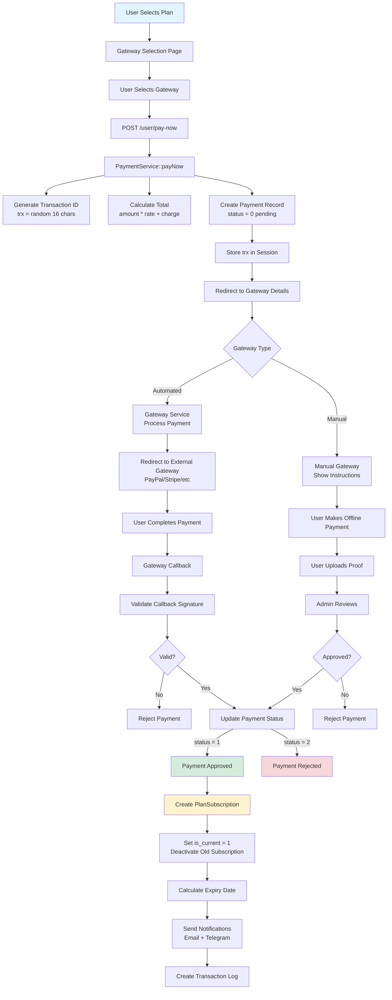
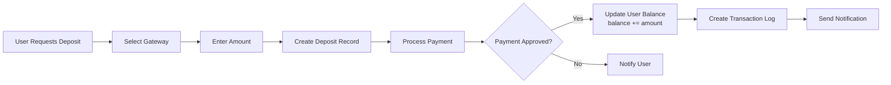
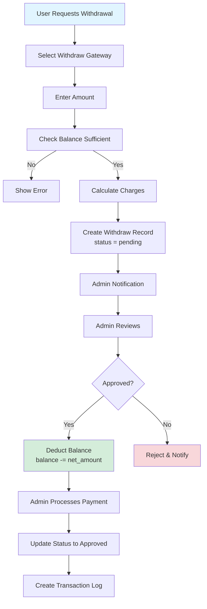

# Payment Gateway Integration Flow

## Overview
The platform supports 15+ payment gateways for processing plan subscriptions and wallet deposits. All gateways follow a consistent service pattern with automated or manual processing, ensuring secure and reliable payment handling.

---

## Payment Flow Architecture

### Complete Payment & Subscription Flow



---

## Step-by-Step Payment Flow

### Step 1: Gateway Selection

**Route**: `/user/payment-method/{plan_id}`
**Controller**: `PaymentController::gateways($planId)`

**Process**:
- User selects a subscription plan
- Redirected to gateway selection page
- Page displays all active gateways (`status = 1`)
- Shows gateway information (name, fees, processing time)

---

### Step 2: Payment Initiation

**Route**: `POST /user/pay-now`
**Controller**: `PaymentController::paynow(PaymentRequest $request)`
**Service**: `PaymentService::payNow($request)`

**Request Data**:
- `plan_id` or `amount` (for deposits)
- `gateway_id`
- `type` ('deposit' or 'payment')

**Service Logic**:
```php
1. Validate gateway exists and is active
2. Generate unique transaction ID: Str::upper(Str::random(16))
3. Calculate total: ($amount * $gateway->rate) + $gateway->charge
4. Create Payment or Deposit record (status = 0 = pending)
5. Store trx in session for callback retrieval
6. Return redirect to gateway details page
```

---

### Step 3: Transaction Creation

#### Payment Record (for Plan Subscriptions)
```php
Payment::create([
    'trx' => $trx, // Unique 16-char uppercase ID
    'plan_id' => $plan->id,
    'user_id' => auth()->id(),
    'gateway_id' => $gateway->id,
    'amount' => $plan->price,
    'rate' => $gateway->rate,
    'charge' => $gateway->charge,
    'total' => $final_amount,
    'status' => 0, // 0=pending, 1=approved, 2=rejected
    'plan_expired_at' => calculated_expiry_date,
]);
```

#### Deposit Record (for Wallet Deposits)
```php
Deposit::create([
    'trx' => $trx,
    'user_id' => auth()->id(),
    'gateway_id' => $gateway->id,
    'amount' => $request->amount,
    'rate' => $gateway->rate,
    'charge' => $gateway->charge,
    'total' => $final_amount,
    'status' => 0,
    'type' => 1, // 1=deposit, 2=withdraw
]);
```

---

### Step 4: Gateway Processing

**Route**: `/user/gateway-details/{gateway_id}`
**Controller**: `PaymentController::gatewayRedirect($gatewayId)`

**Flow**:
1. Retrieve gateway from database
2. Retrieve payment/deposit by trx (from session)
3. Route to appropriate gateway service:
   - Manual: `App\Services\Gateway\Manual::process()`
   - Automated: `App\Services\Gateway\{GatewayName}Service::process()`
4. Gateway service returns redirect URL or view
5. User redirected to external payment page OR shown manual instructions

---

### Step 5: Gateway Callback

**Routes**: Varies per gateway
- PayPal: `/user/payment/success/paypal`
- Stripe: `/user/payment/success/stripe` (webhook)
- Paystack: `/user/payment/success/paystack`

**Callback Process**:
1. Gateway sends callback with payment result
2. Service validates signature/authenticity
3. Retrieve payment/deposit by transaction ID
4. Update status:
   - `status = 1` → Approved
   - `status = 2` → Rejected
5. Store gateway response in `detail` field

---

### Step 6: Subscription Activation (For Plan Payments)

**On Payment Approval** (`status = 1`):

```php
1. Create PlanSubscription:
   - user_id, plan_id
   - start_date = now()
   - end_date = calculated:
     * Limited: now()->addDays($plan->duration)
     * Lifetime: now()->addYear(50)
   - is_current = 1 (deactivate old subscription's is_current)
   - status = 'active'

2. Deactivate Previous Subscription:
   - Set old subscription's is_current = 0

3. Send Notifications:
   - Email notification to user
   - Telegram notification (if enabled)
   - Admin notification

4. Update User Balance (if deposit):
   - users.balance += $amount

5. Create Transaction Record:
   - Log in transactions table
   - Type: 'subscription' or 'deposit'
```

---

## Supported Payment Gateways

### Manual Gateway
**Type**: 0 (manual)

**Flow**:
1. Admin provides bank details/instructions in gateway config
2. User views instructions on gateway details page
3. User makes payment offline (bank transfer)
4. User uploads proof of payment (if enabled)
5. Admin reviews in admin panel
6. Admin approves/rejects manually

**Configuration** (`gateways.parameter` JSON):
```json
{
    "instructions": "Bank: XYZ Bank\nAccount: 123456\n...",
    "upload_proof": true,
    "proof_required": true
}
```

---

### Automated Gateways

#### PayPal
**Service**: `App\Services\Gateway\PaypalService`
**API**: PayPal REST API
**Flow**:
1. Create PayPal order with order details
2. Redirect user to PayPal approval link
3. User approves payment on PayPal
4. Callback to `/user/payment/success/paypal`
5. Capture payment
6. Update payment status

**Credentials** (`gateways.parameter`):
```json
{
    "client_id": "your_client_id",
    "client_secret": "your_client_secret",
    "mode": "sandbox" or "live"
}
```

---

#### Stripe
**Service**: `App\Services\Gateway\StripeService`
**API**: Stripe Checkout / Payment Intents
**Flow**:
1. Create Stripe checkout session or payment intent
2. Redirect to Stripe hosted payment page
3. User completes payment
4. Webhook callback to `/user/payment/success/stripe`
5. Verify webhook signature
6. Update payment status

**Credentials**:
```json
{
    "publishable_key": "pk_...",
    "secret_key": "sk_...",
    "webhook_secret": "whsec_..."
}
```

---

#### Paystack (Nigeria, Ghana, South Africa)
**Service**: `App\Services\Gateway\PaystackService`
**Flow**:
1. Initialize transaction via Paystack API
2. Redirect user to Paystack payment page
3. User completes payment
4. Callback verifies transaction
5. Update payment status

---

#### Crypto Gateways

**Coinpayments**:
- Multiple cryptocurrencies (BTC, ETH, LTC, etc.)
- IPN (Instant Payment Notification) callbacks

**Nowpayments**:
- 100+ cryptocurrencies
- Invoice-based payments

**Gourl**:
- Bitcoin and altcoins
- Payment box integration

---

## Deposit Flow

### Wallet Deposit Process



**Key Difference from Payment**:
- Creates `Deposit` record instead of `Payment`
- Updates `users.balance` directly
- No subscription created

---

## Withdrawal Flow

### Wallet Withdrawal Process



---

## Gateway Service Pattern

### Interface Structure

All gateway services follow consistent pattern:

```php
class {Gateway}Service
{
    /**
     * Process payment and return redirect/view data
     */
    public static function process($request, $gateway, $totalAmount, $deposit): array
    {
        // 1. Extract credentials from $gateway->parameter
        // 2. Call gateway API to create transaction
        // 3. Return redirect URL or view data
        // 4. Return ['type' => 'success', 'data' => $redirectUrl]
        //    OR ['type' => 'error', 'message' => '...']
    }
    
    /**
     * Handle gateway callback
     */
    public function success(Request $request): Response
    {
        // 1. Retrieve payment by trx
        // 2. Validate gateway signature/response
        // 3. Update payment status
        // 4. If approved, create subscription (for payments)
        // 5. Redirect user with success/error message
    }
}
```

---

## Payment Status Lifecycle

```
pending (0) → approved (1) → [Subscription Created]
         ↓
      rejected (2)
```

**Status Values**:
- `0` = Pending (awaiting payment/callback)
- `1` = Approved (payment successful, subscription created)
- `2` = Rejected (payment failed/rejected)

---

## Security Features

### Callback Validation

**PayPal**:
```php
$webhook = new PayPalWebhookVerification($request->all());
if (!$webhook->verify()) {
    abort(403, 'Invalid signature');
}
```

**Stripe**:
```php
$signature = $request->header('Stripe-Signature');
$event = \Stripe\Webhook::constructEvent(
    $request->getContent(),
    $signature,
    $webhookSecret
);
```

### Idempotency

- Check payment status before processing callback
- Prevent duplicate subscription creation
- Use unique `trx` ID for tracking

### Encrypted Credentials

Gateway credentials stored encrypted:
```php
$gateway->parameter = encrypt(json_encode($credentials));
// Decrypt when using
$credentials = json_decode(decrypt($gateway->parameter));
```

---

## Transaction Logging

### Transaction Model

All financial activities logged in `transactions` table:

```php
Transaction::create([
    'user_id' => $user->id,
    'type' => 'subscription', // or 'deposit', 'withdraw', etc.
    'amount' => $amount,
    'charge' => $charge,
    'description' => 'Subscription to Premium Plan',
    'trx' => $payment->trx,
    'status' => 1,
]);
```

**Transaction Types**:
- `subscription` - Plan subscription payments
- `deposit` - Wallet deposits
- `withdraw` - Withdrawal requests
- `referral_commission` - Referral earnings

---

## Error Handling

### Gateway API Failures

- Catch exceptions from gateway API calls
- Log detailed errors with context
- Return user-friendly error messages
- Retry mechanism (if supported by gateway)

### Callback Failures

- Log all callback data for debugging
- Retry failed callbacks (gateway-dependent)
- Manual admin intervention for persistent failures
- Email notifications to admins on critical failures

---

## Files Reference

- **Service**: `main/app/Services/PaymentService.php`
- **Controller**: `main/app/Http/Controllers/PaymentController.php`
- **Gateway Services**: `main/app/Services/Gateway/{GatewayName}Service.php`
- **Models**: `main/app/Models/Payment.php`, `Deposit.php`, `Transaction.php`
