# Trading Execution Flow - Complete Documentation

> [!TIP]
> **📚 Detailed Documentation Available**
> 
> For comprehensive auto-generated documentation on the Trading Management System including execution modules, position monitoring, and analytics, see:
> 
> **[Trading Management System](../.qoder/repowiki/en/content/Core%20Modules/Trading%20Management%20System/Trading%20Management%20System.md)** - Complete trading operations documentation
>
> Related sections:
> - [Execution Module](../.qoder/repowiki/en/content/Core%20Modules/Trading%20Management%20System/Execution%20Module/Execution%20Module.md) - Trade execution details
> - [Position Monitoring](../.qoder/repowiki/en/content/Core%20Modules/Trading%20Management%20System/Position%20Monitoring/Position%20Monitoring.md) - Position tracking and management
> - [Risk Management](../.qoder/repowiki/en/content/Core%20Modules/Trading%20Management%20System/Risk%20Management/Risk%20Management.md) - Risk calculation and presets

---

## Overview
The Trading Execution Engine automatically executes trading signals on connected exchanges/brokers when signals are published. This document explains the complete flow from signal publication to position monitoring.

---

## 1. Signal Publication Trigger

### Entry Point
When a signal is published (admin sets `is_published = 1`), the flow begins:

**File**: `SignalObserver.php` or `SignalPublishedListener.php`

**Trigger**: Laravel Model Observer/Event detects when `Signal::is_published` changes from `0` to `1`

```php
// SignalObserver detects signal publication
if ($signal->is_published && $signal->wasChanged('is_published')) {
    $this->handleSignalPublished($signal);
}
```

---

## 2. Connection Discovery

### Get Active Connections
The system retrieves all active execution connections:

```php
$connections = ExecutionConnection::active()->get();
```

### Connection Filtering
For each connection, it checks if it should execute this signal:

**Admin Connections**: Execute ALL published signals automatically

**User Connections**: Only execute signals if:
- User has an active subscription (`is_current = 1`)
- Signal is assigned to user's plan (via `plan_signals` pivot table)

---

## 3. Job Dispatching

### ExecuteSignalJob
For each eligible connection, a job is dispatched to the queue:

```php
ExecuteSignalJob::dispatch($signal, $connection->id);
```

**Why Async?**
- Non-blocking: Doesn't slow down signal publication
- Retry-able: Failed executions can be retried
- Scalable: Multiple connections execute in parallel

---

## 4. Signal Execution Process

### Job Handler
**File**: `ExecuteSignalJob.php`

The job calls `SignalExecutionService::executeSignal()`

### Execution Steps (in order):

#### Step 4.1: AI Decision Check (Optional)
- Checks AI decision from channel message (if signal is auto-created)
- If AI rejects → Execution stops
- If AI reduces risk → Applies size multiplier

#### Step 4.2: AI Market Analysis (Optional)
If enabled in connection settings:
- Performs OpenRouter AI market analysis
- Can skip execution if market conditions are unfavorable
- Can reduce position size if risk is elevated

#### Step 4.3: Validation
Checks:
- ✅ Connection is active
- ✅ Signal has required data (currency_pair, open_price, direction)
- ✅ Basic balance check (via adapter)

#### Step 4.4: Get Exchange Adapter
Retrieves the appropriate adapter:
- **Crypto**: CCXT adapter (Binance, Coinbase, etc.)
- **FX**: MT4/MT5 adapter (via mtapi.io)

#### Step 4.5: Symbol Resolution
Converts signal currency pair to exchange symbol:
- Example: `EUR/USD` → `EURUSD` or `EUR_USD`

#### Step 4.6: Position Size Calculation
Calculates trade quantity based on strategy:

**Fixed**: Uses preset fixed quantity
```php
$quantity = 0.01; // Fixed amount
```

**Percentage**: Percentage of account balance
```php
$balance = $adapter->getBalance();
$quantity = ($balance * $percentage / 100) / $price;
```

**Fixed Amount**: Fixed dollar amount
```php
$quantity = $amount / $price;
```

**With Multipliers**: Applies AI risk adjustments
```php
$quantity *= $size_multiplier; // e.g., 0.5 for 50% reduction
```

#### Step 4.7: Order Placement
Places order on exchange/broker:

**Market Order** (default):
```php
$adapter->placeMarketOrder($symbol, $direction, $quantity, $orderOptions);
```

**Limit Order** (if specified):
```php
$adapter->placeLimitOrder($symbol, $direction, $quantity, $limitPrice, $orderOptions);
```

**Order Options**:
- `sl_price`: Stop Loss price
- `tp_price`: Take Profit price

---

## 5. Execution Logging

### ExecutionLog Creation
Every execution attempt is logged:

```php
ExecutionLog::create([
    'signal_id' => $signal->id,
    'connection_id' => $connectionId,
    'execution_type' => 'market' or 'limit',
    'order_id' => $result['order_id'],
    'symbol' => $symbol,
    'direction' => 'buy' or 'sell',
    'quantity' => $quantity,
    'entry_price' => $result['price'],
    'sl_price' => $signal->sl,
    'tp_price' => $signal->tp,
    'status' => 'executed' or 'failed',
]);
```

---

## 6. Position Creation

### ExecutionPosition Creation
If order is successful, a position is created:

```php
ExecutionPosition::create([
    'signal_id' => $signal->id,
    'connection_id' => $connectionId,
    'execution_log_id' => $executionLog->id,
    'order_id' => $result['order_id'],
    'symbol' => $symbol,
    'direction' => $signal->direction,
    'quantity' => $quantity,
    'entry_price' => $executionLog->entry_price,
    'current_price' => $executionLog->entry_price, // Initially same
    'sl_price' => $signal->sl,
    'tp_price' => $signal->tp,
    'status' => 'open',
]);
```

**Status**: `open` → Position is active and being monitored

---

## 7. Notification

### Success Notification
```php
NotificationService::notifyExecution($connection, $signal, $position, 'execution', 'Order executed successfully');
```

### Error Notification
```php
NotificationService::notifyError($connection, $signal, 'execution', $errorMessage);
```

---

## 8. Position Monitoring (Continuous)

### Scheduled Job
**File**: `MonitorPositionsJob.php`

**Schedule**: Runs every minute via Laravel scheduler

```php
$schedule->job(new MonitorPositionsJob())->everyMinute();
```

### Monitoring Process

#### Step 8.1: Get Open Positions
```php
$openPositions = ExecutionPosition::open()->get();
```

#### Step 8.2: Update Each Position
For each open position:

**a) Update Current Price**
```php
$currentPrice = $adapter->getCurrentPrice($position->symbol);
$position->updatePnL($currentPrice); // Calculate profit/loss
```

**b) Sync with Exchange**
```php
$exchangePosition = $adapter->getPosition($position->order_id);
if (!$exchangePosition) {
    // Position closed externally → sync status
    $this->syncPositionFromExchange($position);
}
```

#### Step 8.3: Check Stop Loss & Take Profit

**Stop Loss Check**:
```php
if ($position->direction === 'buy') {
    $slHit = $currentPrice <= $position->sl_price;
} else {
    $slHit = $currentPrice >= $position->sl_price;
}
```

**Take Profit Check**:
```php
if ($position->direction === 'buy') {
    $tpHit = $currentPrice >= $position->tp_price;
} else {
    $tpHit = $currentPrice <= $position->tp_price;
}
```

#### Step 8.4: Close Position if SL/TP Hit
```php
if ($slHit || $tpHit) {
    $this->closePosition($position, 'sl' or 'tp', $closePrice);
    $this->notificationService->notifySlTpHit($position, 'sl' or 'tp');
}
```

---

## 9. Position Closing

### Close Process

**Step 9.1**: Close on Exchange
```php
$result = $adapter->closePosition($position->order_id);
```

**Step 9.2**: Update Position Status
```php
$position->close($reason, $closePrice);
// Status changes: 'open' → 'closed'
// Sets: closed_at, close_price, pnl
```

**Step 9.3**: Send Notification
```php
NotificationService::notifyPositionClosed($position, $reason);
```

**Closing Reasons**:
- `sl`: Stop Loss hit
- `tp`: Take Profit hit
- `manual`: Manually closed by user/admin
- `external_close`: Closed on exchange (outside system)

---

## 10. Analytics Update (Daily)

### UpdateAnalyticsJob
**Schedule**: Runs daily at midnight

```php
$schedule->job(new UpdateAnalyticsJob())->dailyAt('00:00');
```

**Calculates**:
- Win rate (winning trades / total trades)
- Profit factor (gross profit / gross loss)
- Maximum drawdown
- Total profit/loss
- Average trade duration

**Stores**: `ExecutionAnalytic` table (daily records per connection)

---

## Complete Flow Diagram

```mermaid
graph TD
    A[Signal Published<br/>is_published = 1] --> B[SignalObserver Detects]
    B --> C[Get Active Connections]
    C --> D{Filter Connections}
    D -->|Admin| E[All Signals]
    D -->|User| F[Plan-Based Signals]
    E --> G[Connection 1]
    F --> H[Connection 2]
    G --> I[Dispatch ExecuteSignalJob]
    H --> I
    
    I --> J[Job Handler]
    J --> K{AI Decision Check<br/>Optional}
    K -->|Rejected| L[Stop Execution]
    K -->|Approved| M{AI Market Analysis<br/>Optional}
    M -->|Skip| L
    M -->|Proceed| N[Validation]
    N --> O{Valid?}
    O -->|No| P[Log Error + Notify]
    O -->|Yes| Q[Get Exchange Adapter]
    
    Q --> R[Resolve Symbol]
    R --> S[Calculate Position Size]
    S --> T[Place Order<br/>Market/Limit]
    T --> U{Success?}
    U -->|No| P
    U -->|Yes| V[Create ExecutionLog]
    V --> W[Create Position<br/>status = open]
    W --> X[Send Notification]
    
    X --> Y[MonitorPositionsJob<br/>Runs Every Minute]
    Y --> Z[Update Price & PnL]
    Z --> AA[Check Stop Loss]
    AA --> BB{SL Hit?}
    BB -->|Yes| CC[Close Position]
    BB -->|No| DD[Check Take Profit]
    DD --> EE{TP Hit?}
    EE -->|Yes| CC
    EE -->|No| Y
    
    CC --> FF[Update Status<br/>status = closed]
    FF --> GG[Send Notification]
    GG --> HH[UpdateAnalyticsJob<br/>Daily at Midnight]
    HH --> II[Calculate Metrics<br/>Win Rate, Profit Factor, etc.]
    
    style A fill:#e1f5ff
    style W fill:#d4edda
    style CC fill:#f8d7da
    style HH fill:#fff3cd
```



**Diagram Legend**:
- 🔵 Blue: Trigger events
- 🟢 Green: Success states
- 🔴 Red: Failure/stop states
- 🟡 Yellow: Scheduled jobs

---

## Key Components

### Services

1. **SignalExecutionService**
   - Main execution logic
   - Handles AI integration
   - Calculates position sizes
   - Places orders

2. **PositionService**
   - Monitors positions
   - Updates prices
   - Checks SL/TP
   - Closes positions

3. **ConnectionService**
   - Manages adapters
   - Handles exchange connections

4. **NotificationService**
   - Sends execution notifications
   - Error alerts
   - Position updates

### Jobs

1. **ExecuteSignalJob**
   - Async signal execution
   - One job per connection

2. **MonitorPositionsJob**
   - Runs every minute
   - Updates all open positions

3. **UpdateAnalyticsJob**
   - Runs daily
   - Calculates metrics

### Observers/Listeners

1. **SignalObserver**
   - Watches Signal model
   - Triggers on publication

2. **SignalPublishedListener**
   - Event-based alternative
   - Handles signal published event

---

## Important Notes

### Queue Requirement
- Queue workers MUST be running for execution to work
- Jobs are async - execution happens in background

### Scheduled Task Requirement
- Laravel scheduler must be running (cron job)
- Required for position monitoring

### Connection Types
- **Admin Connections**: Execute all signals
- **User Connections**: Only execute signals from subscribed plans

### Error Handling
- Failed executions are logged
- Errors don't block other connections
- Notifications sent for all events

### Position Sizing
- Multiple strategies supported
- AI can adjust sizes dynamically
- Respects trading preset settings

---

## Example Timeline

```
00:00:00 - Signal published (is_published = 1)
00:00:01 - SignalObserver detects change
00:00:02 - ExecuteSignalJob dispatched for Connection A
00:00:02 - ExecuteSignalJob dispatched for Connection B
00:00:03 - Connection A: AI analysis → Approved
00:00:04 - Connection A: Order placed → Success
00:00:05 - Position A created (status = open)
00:00:03 - Connection B: Validation failed → Skipped
00:01:00 - MonitorPositionsJob runs
00:01:01 - Position A: Price updated, SL/TP checked (not hit)
00:02:00 - MonitorPositionsJob runs
00:02:01 - Position A: TP hit → Position closed
00:02:02 - Notification sent: Position closed at TP
```

---

## Files Reference

- **Observer**: `main/addons/trading-execution-engine-addon/app/Observers/SignalObserver.php`
- **Job**: `main/addons/trading-execution-engine-addon/app/Jobs/ExecuteSignalJob.php`
- **Service**: `main/addons/trading-execution-engine-addon/app/Services/SignalExecutionService.php`
- **Position Service**: `main/addons/trading-execution-engine-addon/app/Services/PositionService.php`
- **Monitor Job**: `main/addons/trading-execution-engine-addon/app/Jobs/MonitorPositionsJob.php`
