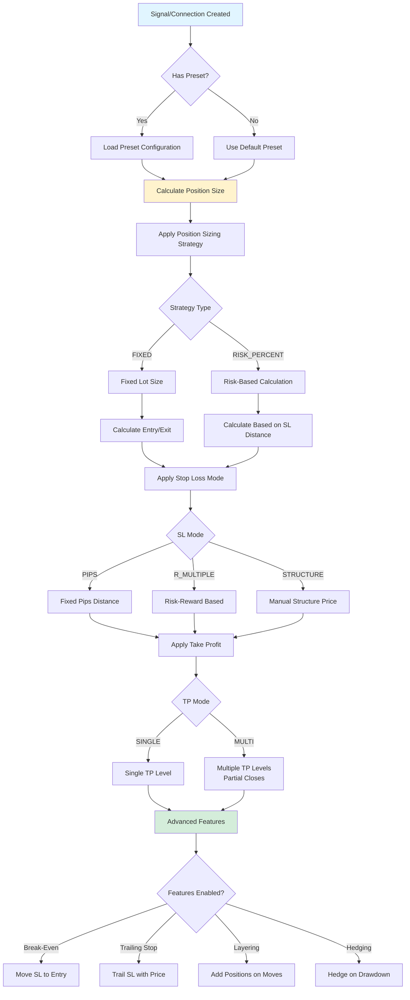

# Trading Presets - Risk Management Guide

## Overview
Trading Presets provide comprehensive risk management and position sizing configurations that can be applied to trading signals, execution connections, and copy trading subscriptions. Presets control how trades are executed, managed, and closed.

---

## Preset Architecture

### Preset Application Flow



---

## Position Sizing Strategies

### 1. Fixed Lot Size

**Mode**: `FIXED`

Uses a consistent position size regardless of account equity:

```php
$quantity = $preset->fixed_lot; // e.g., 0.1 lot
```

**Use Case**: 
- Consistent position sizes
- Simple risk management
- Predictable position sizing

**Configuration**:
- Position Size Mode: `FIXED`
- Fixed Lot: `0.1` (or desired lot size)

---

### 2. Risk Percentage (Recommended)

**Mode**: `RISK_PERCENT`

Risks a percentage of account equity per trade:

```php
$riskAmount = ($equity * $riskPct) / 100;
$riskPerUnit = abs($entryPrice - $slPrice);
$quantity = $riskAmount / $riskPerUnit;
```

**Use Case**:
- Scalable risk management
- Adapts to account size
- Professional risk control

**Configuration**:
- Position Size Mode: `RISK_PERCENT`
- Risk Per Trade: `1.0` (percentage, e.g., 1% = 1.0)

**Example Calculation**:
- Account Equity: $10,000
- Risk Per Trade: 1%
- Risk Amount: $100
- Entry Price: 1.0850
- Stop Loss: 1.0800
- Risk Distance: 50 pips = 0.0050
- Position Size: $100 / 0.0050 = 20,000 units

---

## Stop Loss Configuration

### 1. PIPS Mode

**Mode**: `PIPS`

Fixed distance in pips from entry price:

```php
if ($direction === 'buy') {
    $slPrice = $entryPrice - ($slPips * $pipValue);
} else {
    $slPrice = $entryPrice + ($slPips * $pipValue);
}
```

**Configuration**:
- SL Mode: `PIPS`
- SL Pips: `50` (distance in pips)

---

### 2. R-Multiple Mode

**Mode**: `R_MULTIPLE`

Based on risk-reward ratio. If you risk 1R, SL is placed at R-multiple distance:

```php
$riskAmount = ($equity * $riskPct) / 100;
$slDistance = $riskAmount * $rMultiple;
```

**Configuration**:
- SL Mode: `R_MULTIPLE`
- SL R Multiple: `1.5` (1.5R distance)

---

### 3. Structure Mode

**Mode**: `STRUCTURE`

Uses manually defined structure-based price (e.g., support/resistance levels).

**Configuration**:
- SL Mode: `STRUCTURE`
- SL price set manually based on market structure

---

## Take Profit Configuration

### Single TP Mode

**Mode**: `SINGLE`

One take profit level:

```php
$tpPrice = calculateTP($entryPrice, $slPrice, $tpRR, $direction);
```

---

### Multi-TP Mode

**Mode**: `MULTI`

Up to 3 take profit levels with partial position closes:

```php
TP1: Close 30% at 2R
TP2: Close 30% at 3R  
TP3: Close remaining 40% at 5R
```

**Configuration**:
- TP Mode: `MULTI`
- TP1 Enabled: `true`, RR: `2.0`, Close %: `30`
- TP2 Enabled: `true`, RR: `3.0`, Close %: `30`
- TP3 Enabled: `true`, RR: `5.0`, Close %: `40`

---

## Advanced Features

### Break-Even

Automatically moves stop loss to entry price when TP1 is reached:

**Configuration**:
- Break-Even Enabled: `true`
- Trigger RR: `1.5` (when price reaches 1.5R, move SL to entry)
- Offset Pips: `0` (optional offset from entry)

**Flow**:
```
Entry: 1.0850
SL: 1.0800 (50 pips)
TP1: 1.0925 (75 pips = 1.5R)

When price reaches TP1:
→ Move SL to 1.0850 (break-even)
→ If price reverses, position closes at entry (no loss)
```

---

### Trailing Stop

Trails stop loss as price moves favorably:

**Modes**:
- `STEP_PIPS`: Fixed pip distance trailing
- `ATR_MULTIPLE`: ATR-based trailing (adaptive)

**Configuration**:
- Trailing Stop Enabled: `true`
- TS Mode: `STEP_PIPS` or `ATR_MULTIPLE`
- Trigger RR: `1.0` (start trailing after 1R profit)
- Step Pips: `20` (trail by 20 pips)

**Flow**:
```
Entry: 1.0850
SL: 1.0800
Current Price: 1.0870 (20 pips profit)

Trailing Stop Activated:
→ Move SL to 1.0850 (20 pips trailing)
→ If price continues to 1.0890:
  → Move SL to 1.0870 (always 20 pips behind)
```

---

### Layering (Grid/Martingale)

Add additional positions as price moves in favor:

**Configuration**:
- Layering Enabled: `true`
- Max Layers Per Symbol: `3`
- Layer Distance Pips: `30`
- Martingale Mode: `NONE`, `FIXED`, `FIBONACCI`
- Martingale Factor: `1.5` (if enabled)

**Flow**:
```
Entry Position 1: 1.0850, 0.1 lot
Price moves to 1.0880 (+30 pips):
→ Add Layer 2: 1.0880, 0.15 lot (1.5x if martingale)

Total Position: 0.25 lot
Average Entry: 1.0866
```

---

### Hedging

Automatically open opposite position on drawdown:

**Configuration**:
- Hedging Enabled: `true`
- Trigger Drawdown: `-10%` (hedge when down 10%)
- Hedge Distance Pips: `50`
- Hedge Lot Factor: `1.0` (same size as original)

**Flow**:
```
Original Position: BUY 1.0850
Account Drawdown: -10%
→ Open HEDGE: SELL 1.0800
→ If price continues down, hedge profits
→ If price reverses, original position recovers
```

---

## Default Presets

### 1. Conservative Scalper
- Risk: 0.5% per trade
- SL: 30 pips
- TP: Single (60 pips = 2R)
- Max Positions: 1
- **Perfect for**: Beginners, low-risk traders

### 2. Swing Trader
- Risk: 1% per trade
- SL: 50 pips
- TP: Multi-TP (2R, 3R, 5R)
- Break-Even: Enabled at 1.5R
- Trailing Stop: Enabled at 2R
- **Perfect for**: Medium-term traders

### 3. Aggressive Day Trader
- Risk: 2% per trade
- SL: 40 pips
- TP: Multi-TP
- Layering: Enabled (3 layers)
- ATR Trailing Stop: Enabled
- **Perfect for**: Experienced traders, high-risk tolerance

---

## Preset Assignment

### User Onboarding

When new user registers:
- System assigns "Conservative Scalper" as default
- Sets `users.default_preset_id`

### Connection Auto-Assignment

When execution connection created:
- Automatically assigns user's default preset
- Sets `execution_connections.preset_id`

### Manual Assignment

Admins/users can:
- Assign preset to execution connections
- Assign preset to copy trading subscriptions
- Clone and customize presets

---

## Preset Configuration Structure

### Complete Configuration Example

```php
{
    // Identity
    "name": "EURUSD Scalper",
    "symbol": "EUR/USD",
    "timeframe": "M15",
    
    // Position Sizing
    "position_size_mode": "RISK_PERCENT",
    "risk_per_trade_pct": 1.0,
    "max_positions": 1,
    
    // Stop Loss
    "sl_mode": "PIPS",
    "sl_pips": 30,
    
    // Take Profit
    "tp_mode": "MULTI",
    "tp1_rr": 2.0,
    "tp1_close_pct": 30,
    "tp2_rr": 3.0,
    "tp2_close_pct": 30,
    "tp3_rr": 5.0,
    "tp3_close_pct": 40,
    
    // Break-Even
    "be_enabled": true,
    "be_trigger_rr": 1.5,
    
    // Trailing Stop
    "ts_enabled": true,
    "ts_mode": "STEP_PIPS",
    "ts_trigger_rr": 2.0,
    "ts_step_pips": 20
}
```

---

## Files Reference

- **Model**: `main/addons/trading-preset-addon/app/Models/TradingPreset.php`
- **Service**: `main/addons/trading-preset-addon/app/Services/PresetApplicatorService.php`
- **DTO**: `main/addons/trading-preset-addon/app/DTOs/PresetConfigurationDTO.php`
- **Seeder**: `main/addons/trading-preset-addon/database/seeders/TradingPresetSeeder.php`

---

## Usage Examples

### Example 1: Conservative Trading

```
Preset: Conservative Scalper
- Risk: 0.5% per trade
- SL: 30 pips
- TP: 60 pips (2R)
- Max Positions: 1

Result:
- Low risk per trade
- Consistent position sizes
- Easy to manage
```

### Example 2: Aggressive Trading

```
Preset: Aggressive Day Trader
- Risk: 2% per trade
- SL: 40 pips
- Multi-TP: 2R, 3R, 5R
- Layering: 3 layers
- Trailing Stop: ATR-based

Result:
- Higher risk/reward
- Multiple positions
- Advanced features active
```
