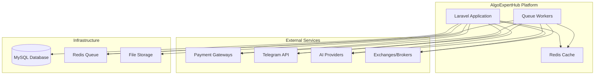
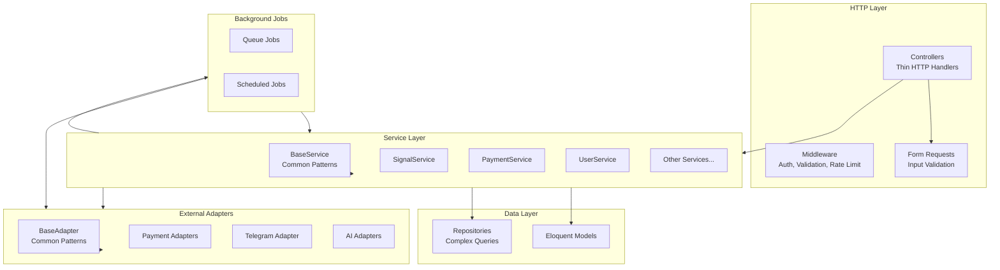
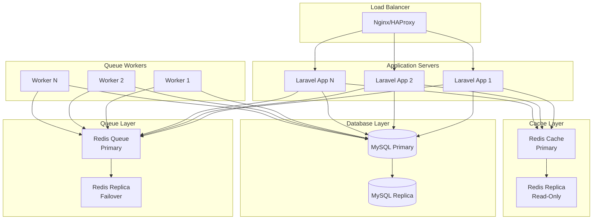
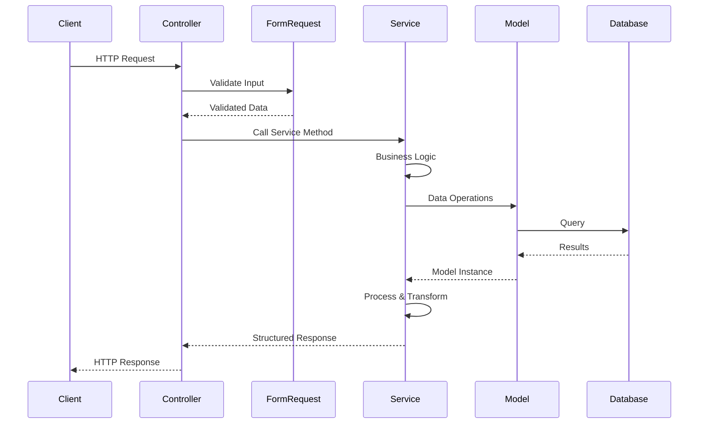
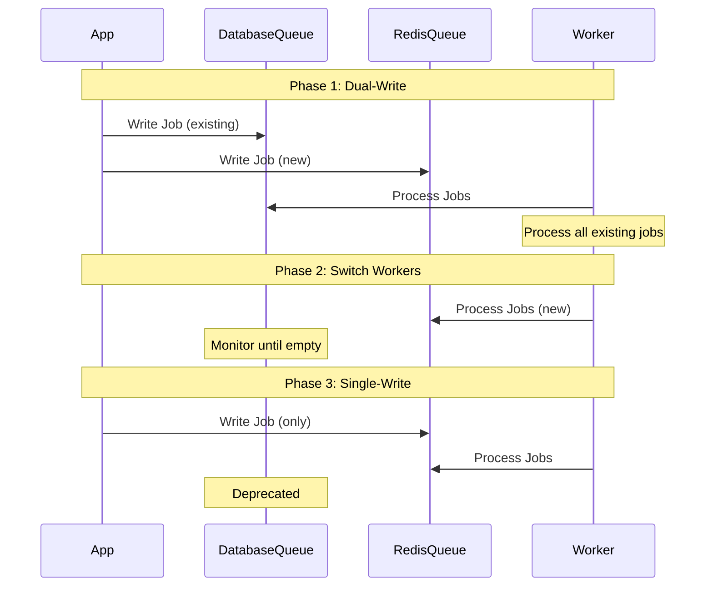
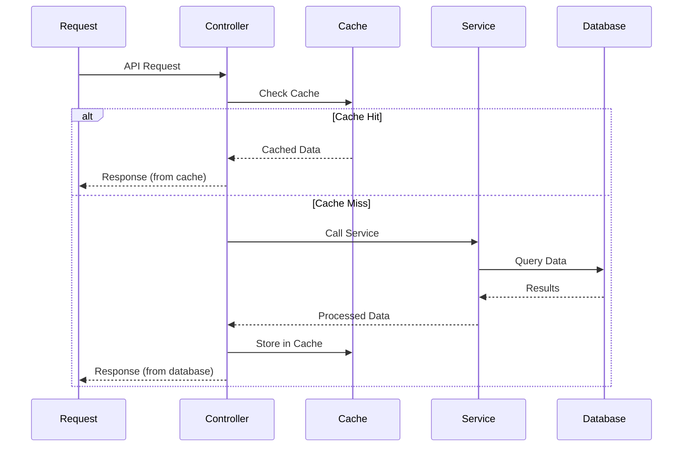
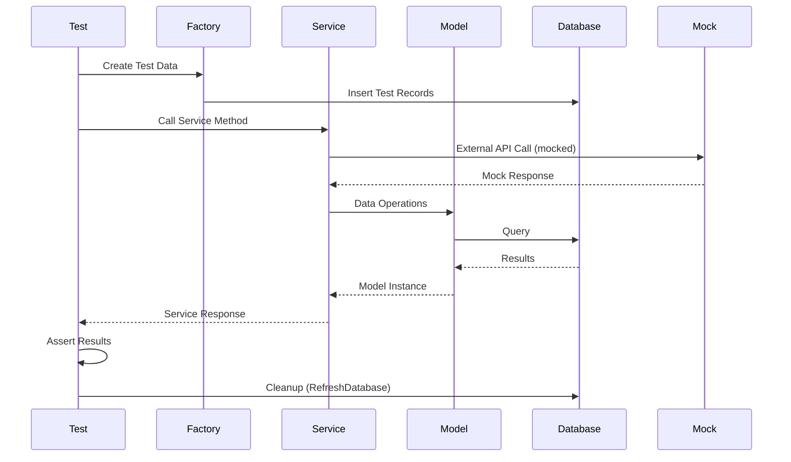

# Design: Codebase Quality Improvements

## Context

The AlgoExpertHub platform is a Laravel 10-based trading signal platform with multiple addons. The codebase has grown organically, leading to technical debt in code quality, performance, testing, and security. This design addresses systematic improvements to establish a solid foundation.

## Goals

- **Code Quality**: Enforce service layer pattern, strict typing, comprehensive documentation
- **Performance**: Migrate to Redis, implement caching, optimize queries
- **Testing**: Achieve 80%+ coverage with comprehensive test suite
- **Security**: Encrypt sensitive data, enhance validation, implement rate limiting
- **Maintainability**: Extract common patterns, standardize architecture

## Non-Goals

- Major feature additions (focus on foundation)
- UI/UX redesigns (separate initiative)
- Breaking API changes (backward compatible improvements)
- Complete rewrite (incremental improvements)

## Decisions

### Decision 1: Service Layer Enforcement
**What**: All business logic MUST be in service classes, controllers are thin HTTP handlers only.

**Why**: 
- Separation of concerns
- Testability
- Reusability
- Consistency with Laravel best practices

**Alternatives considered**:
- Repository pattern (adds complexity, not needed for current scale)
- Domain-driven design (overkill for current needs)

**Implementation**:
- Create `BaseService` class with common patterns
- Audit controllers, move logic to services
- Add code quality checks to prevent violations

### Decision 2: Redis Migration
**What**: Migrate queue driver from database to Redis, implement Redis caching.

**Why**:
- Better performance for queues
- Scalability (horizontal scaling)
- Caching capabilities
- Industry standard

**Alternatives considered**:
- Keep database queue (performance bottleneck)
- Use Beanstalkd (less common, fewer features)

**Implementation**:
- Zero-downtime migration strategy
- Dual-write during transition
- Monitor queue health

### Decision 3: Testing Strategy
**What**: Comprehensive test suite with 80%+ coverage, property-based tests for financial logic.

**Why**:
- Catch bugs early
- Enable refactoring confidence
- Document expected behavior
- Financial calculations need high confidence

**Alternatives considered**:
- 100% coverage (diminishing returns)
- Manual testing only (not scalable)

**Implementation**:
- Unit tests for services
- Feature tests for workflows
- Property-based tests for calculations
- Integration tests for external APIs

### Decision 4: Security Enhancements
**What**: Encrypt all sensitive data, enhance validation, implement rate limiting.

**Why**:
- Financial platform requires high security
- Regulatory compliance (PCI DSS, GDPR)
- Protect user data and credentials

**Alternatives considered**:
- External key management (adds complexity, consider for future)
- Basic encryption (insufficient for financial data)

**Implementation**:
- Use Laravel's `encrypt()` for sensitive data
- Form Requests for all input validation
- Rate limiting middleware
- Security headers

## Risks / Trade-offs

### Risk 1: Queue Migration Downtime
**Risk**: Queue migration could cause service interruption.

**Mitigation**: 
- Zero-downtime migration strategy
- Dual-write during transition
- Rollback plan
- Monitor queue health

### Risk 2: Test Coverage Takes Time
**Risk**: Writing comprehensive tests slows feature development.

**Trade-off**: 
- Short-term: Slower feature development
- Long-term: Faster development (fewer bugs, refactoring confidence)

**Mitigation**: 
- Prioritize critical paths first
- Incremental coverage increase
- Automate test generation where possible

### Risk 3: Breaking Changes
**Risk**: Improvements might break existing functionality.

**Mitigation**:
- Backward compatible changes only
- Comprehensive testing
- Staged rollout
- Feature flags for risky changes

## Migration Plan

### Phase 1: Foundation (Weeks 1-2)
1. Add strict types and type hints
2. Create base service class
3. Establish test structure
4. Install Redis

### Phase 2: Service Layer (Weeks 3-4)
1. Audit controllers
2. Extract business logic to services
3. Refactor controllers
4. Add code quality checks

### Phase 3: Performance (Weeks 5-6)
1. Migrate queue to Redis
2. Implement Redis caching
3. Optimize database queries
4. Add monitoring

### Phase 4: Testing (Weeks 7-8)
1. Write unit tests
2. Write feature tests
3. Add property-based tests
4. Achieve 80% coverage

### Phase 5: Security (Weeks 9-10)
1. Encrypt sensitive data
2. Enhance validation
3. Implement rate limiting
4. Security audit

### Phase 6: Documentation (Week 11)
1. Add PHPDoc
2. Create API docs
3. Write ADRs
4. Update guides

## Open Questions

### Answered Questions

**Q: Should we implement API versioning now or wait for breaking changes?**
**A**: Implement versioning infrastructure now (add versioning support in routes and controllers) but don't require versioning for existing APIs until breaking changes are needed. This prepares the codebase for future API evolution without immediate overhead.

**Q: What's the target response time for critical operations?**
**A**: 
- API endpoints: < 200ms p95 response time
- Queue jobs: < 100ms p95 processing time
- Database queries: < 100ms p95 (alerts for queries > 1s)
- Cache operations: < 10ms p95

**Q: Should we implement feature flags system now or later?**
**A**: Implement basic feature flags system now using Laravel's built-in feature flag capabilities (config-based or simple database table). This enables gradual rollout of improvements and A/B testing capabilities.

**Q: What's the priority order for addon refactoring?**
**A**: Start with Trading Management Addon (most complex, highest impact), then Multi-Channel Signal Addon, then AI Connection Addon. Prioritize addons with most business logic and highest usage.

## Architecture Overview

### System Context Diagram



### Component Architecture Diagram



### Deployment Architecture



## Component Specifications

### BaseService Class Design

**Location**: `app/Services/BaseService.php`

**Purpose**: Provide common patterns and utilities for all service classes.

**Methods**:

```php
abstract class BaseService
{
    /**
     * Return success response
     * 
     * @param string $message Success message
     * @param mixed $data Optional data to include
     * @return array Standardized success response
     */
    protected function success(string $message, $data = null): array
    {
        return [
            'type' => 'success',
            'message' => $message,
            'data' => $data,
        ];
    }
    
    /**
     * Return error response
     * 
     * @param string $message Error message
     * @param mixed $data Optional error data
     * @return array Standardized error response
     */
    protected function error(string $message, $data = null): array
    {
        return [
            'type' => 'error',
            'message' => $message,
            'data' => $data,
        ];
    }
    
    /**
     * Log error with context
     * 
     * @param \Throwable $exception Exception to log
     * @param array $context Additional context
     * @return void
     */
    protected function logError(\Throwable $exception, array $context = []): void
    {
        Log::error($exception->getMessage(), array_merge([
            'exception' => get_class($exception),
            'file' => $exception->getFile(),
            'line' => $exception->getLine(),
            'trace' => $exception->getTraceAsString(),
        ], $context));
    }
    
    /**
     * Validate input data against rules
     * 
     * @param array $rules Validation rules
     * @param array $data Data to validate
     * @throws \Illuminate\Validation\ValidationException
     * @return void
     */
    protected function validateInput(array $rules, array $data): void
    {
        $validator = Validator::make($data, $rules);
        
        if ($validator->fails()) {
            throw new ValidationException($validator);
        }
    }
    
    /**
     * Execute operation in database transaction
     * 
     * @param callable $callback Operation to execute
     * @return mixed Result of callback
     * @throws \Throwable
     */
    protected function transaction(callable $callback)
    {
        return DB::transaction($callback);
    }
}
```

**Usage Pattern**:
```php
class SignalService extends BaseService
{
    public function create(array $data): array
    {
        try {
            $this->validateInput([
                'title' => 'required|string|max:255',
                'currency_pair_id' => 'required|exists:currency_pairs,id',
                // ... more rules
            ], $data);
            
            $signal = $this->transaction(function () use ($data) {
                return Signal::create($data);
            });
            
            return $this->success('Signal created successfully', $signal);
        } catch (ValidationException $e) {
            return $this->error('Validation failed', $e->errors());
        } catch (\Throwable $e) {
            $this->logError($e, ['data' => $data]);
            return $this->error('Failed to create signal');
        }
    }
}
```

### BaseAdapter Class Design

**Location**: `app/Adapters/BaseAdapter.php`

**Purpose**: Provide common patterns for external service adapters.

**Methods**:

```php
abstract class BaseAdapter
{
    /**
     * Make HTTP request with retry logic
     * 
     * @param string $method HTTP method
     * @param string $url Request URL
     * @param array $options Request options
     * @param int $maxRetries Maximum retry attempts
     * @return \Illuminate\Http\Client\Response
     * @throws \Exception
     */
    protected function requestWithRetry(
        string $method,
        string $url,
        array $options = [],
        int $maxRetries = 3
    ): Response {
        $attempt = 0;
        $lastException = null;
        
        while ($attempt < $maxRetries) {
            try {
                return Http::timeout(30)->send($method, $url, $options);
            } catch (\Exception $e) {
                $lastException = $e;
                $attempt++;
                
                if ($attempt < $maxRetries) {
                    sleep(pow(2, $attempt)); // Exponential backoff
                }
            }
        }
        
        throw $lastException;
    }
    
    /**
     * Handle API error response
     * 
     * @param \Illuminate\Http\Client\Response $response
     * @throws \Exception
     * @return void
     */
    protected function handleError(Response $response): void
    {
        if (!$response->successful()) {
            throw new \Exception(
                "API request failed: {$response->status()} - {$response->body()}"
            );
        }
    }
    
    /**
     * Log API request/response
     * 
     * @param string $action Action description
     * @param array $request Request data
     * @param mixed $response Response data
     * @return void
     */
    protected function logApiCall(string $action, array $request, $response): void
    {
        Log::info("API Call: {$action}", [
            'request' => $request,
            'response' => $response,
        ]);
    }
}
```

### Redis Integration Architecture

**Queue Configuration** (`config/queue.php`):
```php
'connections' => [
    'redis' => [
        'driver' => 'redis',
        'connection' => 'default',
        'queue' => env('REDIS_QUEUE', 'default'),
        'retry_after' => 90,
        'block_for' => null,
    ],
],
```

**Cache Configuration** (`config/cache.php`):
```php
'stores' => [
    'redis' => [
        'driver' => 'redis',
        'connection' => 'cache',
        'lock_connection' => 'default',
    ],
],
```

**Usage Pattern**:
```php
// Queue job dispatch
ProcessChannelMessage::dispatch($message)->onQueue('high');

// Cache with tags
Cache::tags(['signals', 'user-' . $userId])->put($key, $data, 3600);

// Cache invalidation
Cache::tags(['signals'])->flush();
```

### Testing Framework Architecture

**Test Structure**:
```
tests/
├── Unit/
│   ├── Services/
│   │   ├── SignalServiceTest.php
│   │   └── PaymentServiceTest.php
│   ├── Models/
│   └── Adapters/
├── Feature/
│   ├── SignalWorkflowTest.php
│   ├── PaymentWorkflowTest.php
│   └── Api/
├── Integration/
│   ├── PaymentGatewayTest.php
│   └── TelegramIntegrationTest.php
└── PropertyBased/
    └── FinancialCalculationsTest.php
```

**Test Base Classes**:
```php
// tests/TestCase.php
abstract class TestCase extends BaseTestCase
{
    use RefreshDatabase;
    
    protected function setUp(): void
    {
        parent::setUp();
        // Common test setup
    }
}

// tests/Unit/ServiceTestCase.php
abstract class ServiceTestCase extends TestCase
{
    protected function assertServiceSuccess(array $result, $expectedData = null): void
    {
        $this->assertEquals('success', $result['type']);
        if ($expectedData !== null) {
            $this->assertEquals($expectedData, $result['data']);
        }
    }
    
    protected function assertServiceError(array $result, string $expectedMessage = null): void
    {
        $this->assertEquals('error', $result['type']);
        if ($expectedMessage !== null) {
            $this->assertStringContainsString($expectedMessage, $result['message']);
        }
    }
}
```

## Data Flow Diagrams

### Service Layer Request Flow



### Queue Migration Flow



### Caching Flow



### Test Execution Flow



## API Contracts

### BaseService Interface

**Methods** (see Component Specifications above):
- `success(string $message, $data = null): array`
- `error(string $message, $data = null): array`
- `logError(\Throwable $e, array $context = []): void`
- `validateInput(array $rules, array $data): void`
- `transaction(callable $callback)`

**Response Format**:
```php
// Success
[
    'type' => 'success',
    'message' => 'Operation completed successfully',
    'data' => [...], // Optional
]

// Error
[
    'type' => 'error',
    'message' => 'Error description',
    'data' => [...], // Optional error details
]
```

### Cache Service Interface

**Methods**:
```php
// Cache with tags
Cache::tags(['tag1', 'tag2'])->put($key, $value, $ttl);

// Cache retrieval
Cache::tags(['tag1'])->get($key);

// Cache invalidation
Cache::tags(['tag1'])->flush();

// Cache warming
Cache::remember($key, $ttl, function () {
    return expensiveOperation();
});
```

### Test Helper Methods

**ServiceTestCase**:
- `assertServiceSuccess(array $result, $expectedData = null): void`
- `assertServiceError(array $result, string $expectedMessage = null): void`

**Factory Helpers**:
```php
// Create user with factory
$user = User::factory()->create();

// Create signal with relationships
$signal = Signal::factory()
    ->hasAttached($plan)
    ->create(['is_published' => true]);
```

## Migration Strategy Details

### Phase 1: Foundation (Weeks 1-2)

**Week 1: Code Quality Foundation**
1. Add `declare(strict_types=1);` to all PHP files (automated script)
2. Add type hints to all method parameters and return types
3. Create `BaseService` class with common patterns
4. Create `BaseAdapter` class with common patterns
5. Add PHPDoc to `BaseService` and `BaseAdapter`

**Week 2: Testing Foundation**
1. Establish test structure (`tests/Unit/`, `tests/Feature/`)
2. Create test base classes (`ServiceTestCase`, `FeatureTestCase`)
3. Create model factories for all models
4. Install Redis and configure connections
5. Set up test coverage reporting (PHPUnit + Xdebug)

**Rollback Plan**: Revert commits if issues detected. No database changes yet.

### Phase 2: Service Layer (Weeks 3-4)

**Week 3: Controller Audit**
1. Audit all controllers for business logic violations
2. Document violations in tracking spreadsheet
3. Prioritize controllers by complexity and usage
4. Create service layer enforcement guidelines document

**Week 4: Service Extraction**
1. Extract business logic from controllers to services (start with high-priority)
2. Refactor controllers to be thin HTTP handlers
3. Update tests to test services instead of controllers
4. Add code quality checks to CI/CD (PHPStan level 5)

**Rollback Plan**: Each controller refactoring is independent. Revert individual commits if issues.

### Phase 3: Performance (Weeks 5-6)

**Week 5: Redis Queue Migration**

**Migration Steps**:
1. **Pre-migration**:
   - Install Redis server
   - Configure Redis connections in `config/queue.php` and `config/cache.php`
   - Test Redis connectivity
   - Document current queue metrics (depth, processing time)

2. **Dual-write phase** (24-48 hours):
   - Deploy code that writes to both database and Redis queues
   - Monitor both queues
   - Process database queue until empty
   - Verify Redis queue processing works correctly

3. **Switch workers**:
   - Update queue workers to read from Redis only
   - Monitor Redis queue depth
   - Keep database queue as backup for 24 hours

4. **Single-write phase**:
   - Update application to write to Redis only
   - Monitor Redis queue metrics
   - Deprecate database queue (keep config for rollback)

**Rollback Plan**:
- If Redis fails: Switch `QUEUE_CONNECTION` back to `database` in `.env`
- Process any remaining Redis jobs manually if needed
- Monitor error rates and rollback if issues detected

**Week 6: Redis Caching**
1. Implement Redis caching layer with tagging
2. Add cache warming for frequently accessed data
3. Optimize database queries (add indexes, eager loading)
4. Implement query monitoring and slow query logging
5. Add response caching middleware for API endpoints

**Rollback Plan**: Disable caching by switching `CACHE_DRIVER` to `file` in `.env`.

### Phase 4: Testing (Weeks 7-8)

**Week 7: Unit and Feature Tests**
1. Write unit tests for all service classes
2. Write feature tests for critical workflows
3. Add property-based tests for financial calculations
4. Achieve 60% coverage

**Week 8: Integration Tests and Coverage**
1. Create integration tests for payment gateways (mocked)
2. Create integration tests for external APIs (mocked)
3. Add API endpoint tests
4. Achieve 80%+ coverage
5. Set up coverage reporting in CI/CD

**Rollback Plan**: Tests don't affect production. Fix failing tests before deployment.

### Phase 5: Security (Weeks 9-10)

**Week 9: Encryption and Validation**
1. Audit all sensitive data storage
2. Encrypt all API keys and credentials
3. Enhance input validation (Form Requests for all endpoints)
4. Implement API rate limiting

**Week 10: Security Headers and Audit**
1. Add security headers middleware
2. Implement CSRF token validation for all forms
3. Conduct security audit (OWASP Top 10)
4. Fix identified vulnerabilities
5. Create security documentation

**Rollback Plan**: Security changes are additive. Revert individual changes if issues.

### Phase 6: Documentation (Week 11)

1. Add PHPDoc to all public methods
2. Create API documentation (Scribe)
3. Write Architecture Decision Records (ADRs)
4. Update developer guides
5. Document security practices

**Rollback Plan**: Documentation doesn't affect code. Update as needed.

## Monitoring and Observability

### Metrics to Track

**Queue Metrics**:
- Queue depth (per queue: default, high, low)
- Job processing time (p50, p95, p99)
- Failed jobs count
- Retry attempts
- Worker utilization

**Cache Metrics**:
- Cache hit rate (overall and per tag)
- Cache miss rate
- Cache eviction rate
- Memory usage
- Response time improvement

**Database Metrics**:
- Query execution time (p50, p95, p99)
- Slow query count (> 100ms)
- Connection pool usage
- N+1 query detection
- Index usage

**Application Metrics**:
- API response time (p50, p95, p99)
- Error rate (4xx, 5xx)
- Request rate
- Test coverage percentage
- Code quality score

**Security Metrics**:
- Failed authentication attempts
- Rate limit hits
- Validation failures
- Security audit findings
- Encryption coverage

### Logging Strategy

**Structured Logging**:
```php
Log::info('Signal created', [
    'signal_id' => $signal->id,
    'user_id' => auth()->id(),
    'channel' => 'api',
    'timestamp' => now()->toIso8601String(),
]);

Log::error('Payment processing failed', [
    'payment_id' => $payment->id,
    'gateway' => $gateway->name,
    'error' => $e->getMessage(),
    'context' => $context,
]);
```

**Log Levels**:
- `DEBUG`: Detailed debugging information
- `INFO`: General informational messages
- `WARNING`: Warning messages (non-critical issues)
- `ERROR`: Error messages (requires attention)
- `CRITICAL`: Critical errors (immediate action required)

**Log Channels**:
- `daily`: Application logs (rotated daily)
- `queue`: Queue job logs
- `security`: Security-related logs
- `performance`: Performance-related logs (slow queries, cache misses)

### Alerting Thresholds

**Queue Alerts**:
- Queue depth > 1000 jobs: Warning
- Queue depth > 5000 jobs: Critical
- Job processing time p95 > 500ms: Warning
- Job processing time p95 > 1s: Critical
- Failed jobs > 10%: Warning
- Failed jobs > 25%: Critical

**Cache Alerts**:
- Cache hit rate < 50%: Warning
- Cache hit rate < 30%: Critical
- Memory usage > 80%: Warning
- Memory usage > 95%: Critical

**Database Alerts**:
- Slow queries (> 100ms) > 10 per minute: Warning
- Slow queries (> 1s) > 1 per minute: Critical
- Connection pool usage > 80%: Warning
- Connection pool usage > 95%: Critical

**Application Alerts**:
- API response time p95 > 500ms: Warning
- API response time p95 > 1s: Critical
- Error rate > 1%: Warning
- Error rate > 5%: Critical
- Test coverage < 80%: Warning

**Security Alerts**:
- Failed authentication attempts > 10 per minute: Warning
- Rate limit hits > 100 per minute: Warning
- Security audit failures: Critical

### Monitoring Tools

**Application Performance Monitoring (APM)**:
- Laravel Telescope (development)
- Laravel Horizon (queue monitoring)
- Custom dashboards (Grafana + Prometheus)

**Log Aggregation**:
- Laravel Log (file-based)
- ELK Stack (Elasticsearch, Logstash, Kibana) - optional
- Cloud logging (AWS CloudWatch, Google Cloud Logging) - optional

**Error Tracking**:
- Laravel exception handler
- Sentry (optional, for production)

## CI/CD Integration

### Code Quality Checks

**PHPStan**:
```yaml
# .github/workflows/phpstan.yml
- name: Run PHPStan
  run: vendor/bin/phpstan analyse --level=5
```

**PHP CS Fixer**:
```yaml
- name: Check Code Style
  run: vendor/bin/php-cs-fixer fix --dry-run --diff
```

### Test Execution

**PHPUnit with Coverage**:
```yaml
- name: Run Tests
  run: |
    php artisan test --coverage --min=80
    # Or: vendor/bin/phpunit --coverage-text --coverage-clover=coverage.xml
```

**Coverage Threshold Enforcement**:
- Overall coverage: 80% minimum
- Critical trading logic: 100% coverage required
- CI fails if coverage drops below threshold

### Security Scanning

**Composer Audit**:
```yaml
- name: Security Audit
  run: composer audit
```

**OWASP Checks**:
- Use Laravel security best practices
- Manual security audit checklist
- Automated vulnerability scanning (optional: Snyk, Dependabot)

### Performance Benchmarks

**API Response Time**:
```yaml
- name: Performance Test
  run: |
    # Run API performance tests
    # Verify p95 < 200ms
```

## Rollout Strategy

### Feature Flags

**Basic Feature Flag System**:
```php
// config/features.php
return [
    'redis_queue' => env('FEATURE_REDIS_QUEUE', false),
    'redis_cache' => env('FEATURE_REDIS_CACHE', false),
    'service_layer_enforcement' => env('FEATURE_SERVICE_LAYER', false),
];

// Usage
if (config('features.redis_queue')) {
    // Use Redis queue
} else {
    // Use database queue
}
```

### Canary Deployment

**Queue Migration Canary**:
1. Deploy to 10% of queue workers
2. Monitor metrics for 24 hours
3. If successful, deploy to 50% of workers
4. Monitor for 24 hours
5. Deploy to 100% of workers

**Rollback Trigger**:
- Error rate > 1%
- Queue depth growing unbounded
- Job processing time > 500ms p95

### Monitoring During Rollout

**Key Metrics**:
- Error rates (should remain stable)
- Queue depth (should not grow)
- Response times (should improve or remain stable)
- Cache hit rates (should increase)

**Rollback Procedures**:
- Feature flag: Disable feature immediately
- Code rollback: Revert deployment if needed
- Database rollback: Revert migrations if needed
- Configuration rollback: Update `.env` files


