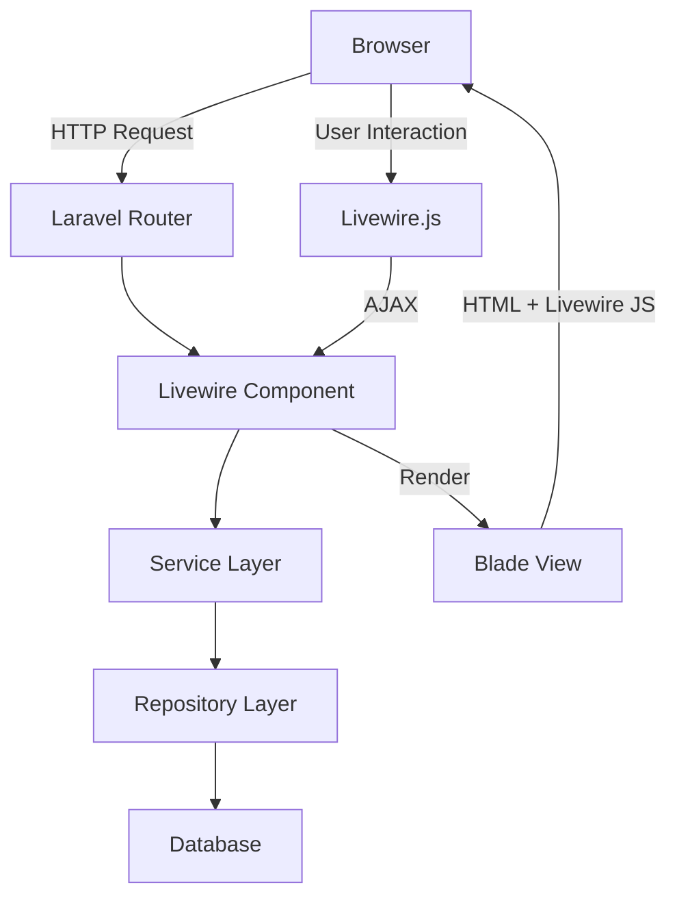

# Design: Integrate Livewire Components

## Architecture Overview



## Component Architecture

### 1. Component Structure

```
app/Http/Livewire/
├── Shared/              # Reusable components
│   ├── DataTable.php
│   ├── Modal.php
│   ├── FormWizard.php
│   ├── Notifications.php
│   └── ToggleSwitch.php
├── Admin/               # Admin-specific components
│   ├── Users/
│   │   └── UsersTable.php
│   └── Gateways/
│       └── GatewayManager.php
└── User/                # User-facing components
    └── Trading/
        └── ExchangeConnectionWizard.php

resources/views/livewire/
├── shared/
│   ├── data-table.blade.php
│   ├── modal.blade.php
│   ├── form-wizard.blade.php
│   ├── notifications.blade.php
│   └── toggle-switch.blade.php
├── admin/
│   ├── users/
│   │   └── users-table.blade.php
│   └── gateways/
│       └── gateway-manager.blade.php
└── user/
    └── trading/
        └── exchange-connection-wizard.blade.php
```

### 2. Service Integration Pattern

Livewire components will **not** contain business logic. They act as controllers that:
1. Accept user input
2. Validate input
3. Call service layer methods
4. Update component state
5. Render updated view

```php
// Example: UsersTable component
class UsersTable extends Component
{
    public function __construct(
        private UserService $userService
    ) {}

    public function deleteUser($userId)
    {
        // Validate
        $this->authorize('delete', User::class);
        
        // Call service
        $this->userService->deleteUser($userId);
        
        // Update state
        $this->dispatch('user-deleted');
        $this->dispatch('notify', message: 'User deleted successfully');
    }
}
```

### 3. Data Flow

```
User Action (Browser)
    ↓
Livewire.js (AJAX Request)
    ↓
Livewire Component (Controller)
    ↓
Service Layer (Business Logic)
    ↓
Repository Layer (Data Access)
    ↓
Database
    ↓
Repository → Service → Component
    ↓
Blade View (Rendered HTML)
    ↓
Livewire.js (DOM Update)
    ↓
Browser (Updated UI)
```

## Component Specifications

### 1. DataTable Component

**Purpose**: Replace jQuery DataTables with server-side Livewire component

**Features**:
- Server-side pagination
- Sortable columns
- Searchable/filterable
- Bulk actions
- Export functionality

**Props**:
- `$model`: Eloquent model class
- `$columns`: Array of column definitions
- `$actions`: Array of row actions
- `$bulkActions`: Array of bulk actions
- `$perPage`: Items per page (default: 15)

**Events**:
- `row-clicked`: Emitted when row is clicked
- `action-executed`: Emitted after action completes
- `bulk-action-executed`: Emitted after bulk action completes

### 2. Modal Component

**Purpose**: Reusable modal dialog for forms, confirmations, and content display

**Features**:
- Dynamic content loading
- Form submission handling
- Confirmation dialogs
- Size variants (sm, md, lg, xl)
- Close on backdrop click (optional)

**Props**:
- `$title`: Modal title
- `$size`: Modal size (default: 'md')
- `$closeOnBackdrop`: Close on backdrop click (default: true)
- `$showFooter`: Show footer with action buttons (default: true)

**Slots**:
- `content`: Modal body content
- `footer`: Custom footer buttons

**Events**:
- `modal-opened`: Emitted when modal opens
- `modal-closed`: Emitted when modal closes
- `confirmed`: Emitted when confirmation button clicked

### 3. FormWizard Component

**Purpose**: Multi-step form with validation and progress tracking

**Features**:
- Step-by-step navigation
- Per-step validation
- Progress indicator
- Data persistence between steps
- Back/Next navigation

**Props**:
- `$steps`: Array of step definitions
- `$currentStep`: Current step index
- `$data`: Form data array

**Methods**:
- `nextStep()`: Validate and move to next step
- `previousStep()`: Move to previous step
- `goToStep($index)`: Jump to specific step
- `submit()`: Final form submission

**Events**:
- `step-changed`: Emitted when step changes
- `wizard-completed`: Emitted when all steps completed

### 4. Notifications Component

**Purpose**: Toast/alert system for user feedback

**Features**:
- Multiple notification types (success, error, warning, info)
- Auto-dismiss with configurable timeout
- Stack multiple notifications
- Position variants (top-right, top-left, bottom-right, bottom-left)

**Props**:
- `$position`: Notification position (default: 'top-right')
- `$timeout`: Auto-dismiss timeout in ms (default: 3000)

**Methods**:
- `notify($message, $type, $timeout)`: Show notification
- `dismiss($id)`: Dismiss specific notification

**Events**:
- `notification-shown`: Emitted when notification appears
- `notification-dismissed`: Emitted when notification dismissed

### 5. ToggleSwitch Component

**Purpose**: Status toggle with confirmation and API call

**Features**:
- Optimistic UI updates
- Confirmation dialog (optional)
- Error handling with rollback
- Loading state

**Props**:
- `$model`: Model instance
- `$field`: Field to toggle
- `$confirmMessage`: Confirmation message (optional)

**Methods**:
- `toggle()`: Toggle the field value

**Events**:
- `toggled`: Emitted after successful toggle
- `toggle-failed`: Emitted if toggle fails

## Performance Considerations

### 1. Lazy Loading
```php
// Load component only when visible
<livewire:admin.users.users-table lazy />
```

### 2. Polling Optimization
```php
// Poll only when tab is active
<div wire:poll.visible.5s>
    <!-- Content -->
</div>
```

### 3. Debouncing
```php
// Debounce search input
<input wire:model.debounce.500ms="search" />
```

### 4. Caching
```php
// Cache expensive queries
public function getUsersProperty()
{
    return Cache::remember(
        "users-table-{$this->page}-{$this->search}",
        60,
        fn() => $this->userService->getUsers($this->page, $this->search)
    );
}
```

## Testing Strategy

### 1. Unit Tests
```php
// Test component methods
public function test_delete_user_calls_service()
{
    $component = Livewire::test(UsersTable::class);
    $component->call('deleteUser', 1);
    
    // Assert service was called
    // Assert event was dispatched
}
```

### 2. Browser Tests
```php
// Test full user interaction
public function test_user_can_delete_user_from_table()
{
    $this->browse(function (Browser $browser) {
        $browser->visit('/admin/users')
                ->click('@delete-user-1')
                ->waitForText('User deleted successfully');
    });
}
```

## Migration Strategy

### Phase 1: High-Impact Views
1. Admin users table (`resources/views/backend/users/index.blade.php`)
2. Gateway management (`resources/views/backend/gateway/index.blade.php`)
3. Exchange connection wizard (new feature)

### Phase 2: Forms
1. Admin create/edit forms
2. User profile forms
3. Gateway configuration forms

### Phase 3: Complex Interactions
1. Trading terminal components
2. Real-time notifications
3. Dashboard widgets

## Security Considerations

1. **Authorization**: Use Laravel policies in component methods
2. **CSRF Protection**: Livewire handles CSRF automatically
3. **XSS Prevention**: Blade escaping + Livewire sanitization
4. **Rate Limiting**: Apply throttle middleware to Livewire routes
5. **Input Validation**: Validate all user input in component methods

## Backward Compatibility

- Existing jQuery code will continue to work
- Gradual migration, no breaking changes
- Components can coexist with traditional Blade views
- Shared CSS/JS assets remain unchanged
